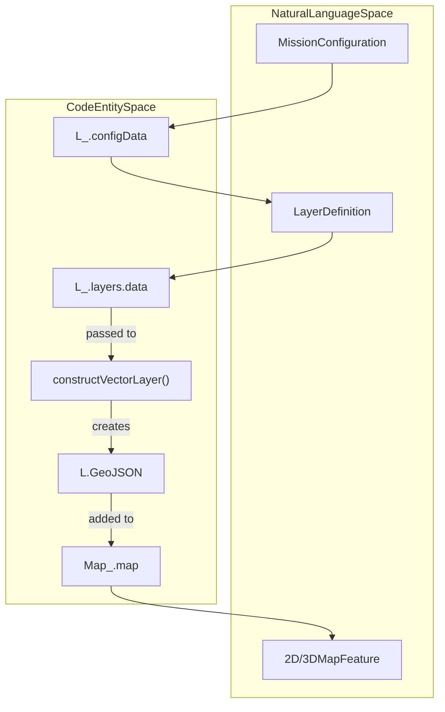
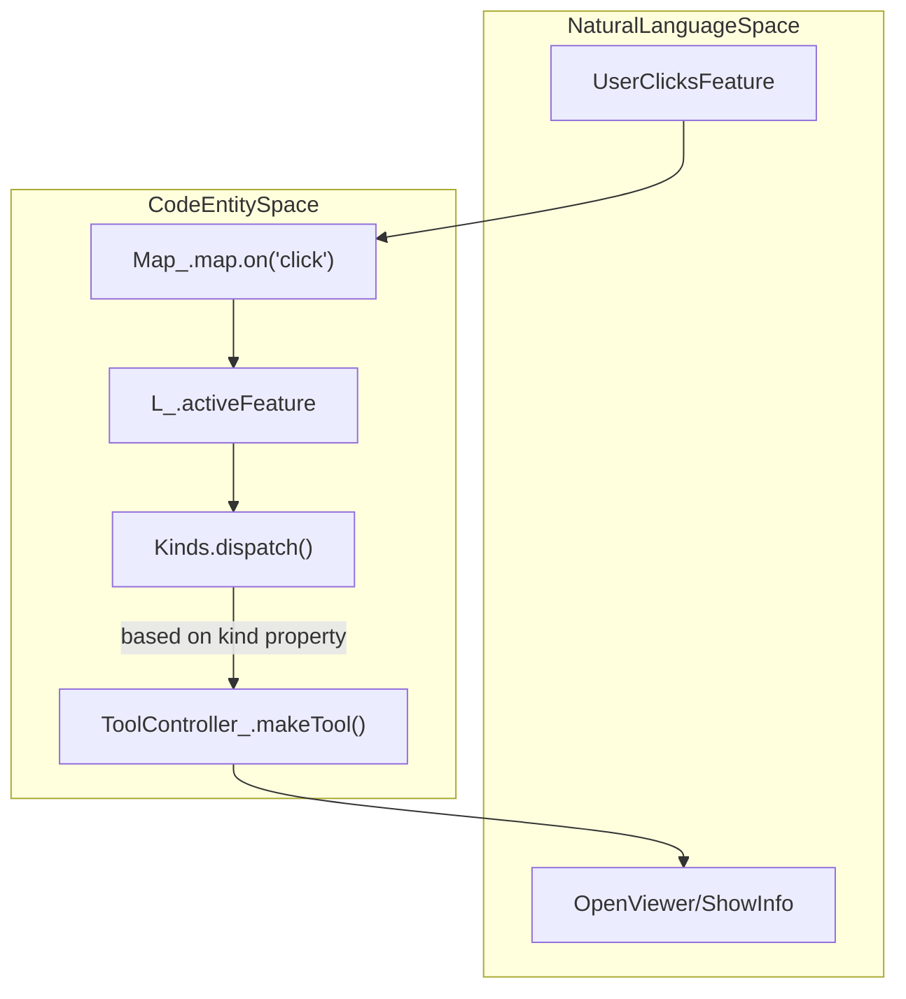

# Page: Glossary

# Glossary

Relevant source files

The following files were used as context for generating this wiki page:

- [.nvmrc](.nvmrc)
- [AGENTS.md](AGENTS.md)
- [AI-GETTING-STARTED.md](AI-GETTING-STARTED.md)
- [API/Backend/Draw/routes/aggregations.js](API/Backend/Draw/routes/aggregations.js)
- [API/database.js](API/database.js)
- [API/websocket.js](API/websocket.js)
- [CHANGELOG.md](CHANGELOG.md)
- [CITATION.cff](CITATION.cff)
- [README.md](README.md)
- [adjacent-servers/adjacent-servers-proxy.js](adjacent-servers/adjacent-servers-proxy.js)
- [adjacent-servers/validateTitilerUrl.js](adjacent-servers/validateTitilerUrl.js)
- [blueprints/Missions/Reference-Mission/Layers/Vectors/hotline-gradient-3d.geojson](blueprints/Missions/Reference-Mission/Layers/Vectors/hotline-gradient-3d.geojson)
- [blueprints/Missions/Reference-Mission/config.reference-mission.json](blueprints/Missions/Reference-Mission/config.reference-mission.json)
- [configuration/env.js](configuration/env.js)
- [configure/package.json](configure/package.json)
- [configure/src/metaconfigs/layer-data-config.json](configure/src/metaconfigs/layer-data-config.json)
- [configure/src/metaconfigs/layer-header-config.json](configure/src/metaconfigs/layer-header-config.json)
- [configure/src/metaconfigs/layer-image-config.json](configure/src/metaconfigs/layer-image-config.json)
- [configure/src/metaconfigs/layer-model-config.json](configure/src/metaconfigs/layer-model-config.json)
- [configure/src/metaconfigs/layer-query-config.json](configure/src/metaconfigs/layer-query-config.json)
- [configure/src/metaconfigs/layer-tile-config.json](configure/src/metaconfigs/layer-tile-config.json)
- [configure/src/metaconfigs/layer-vector-config.json](configure/src/metaconfigs/layer-vector-config.json)
- [configure/src/metaconfigs/layer-vectortile-config.json](configure/src/metaconfigs/layer-vectortile-config.json)
- [configure/src/metaconfigs/layer-velocity-config.json](configure/src/metaconfigs/layer-velocity-config.json)
- [docs/assets/images/NASA-AMMOS-MMGIS-frame0.png](docs/assets/images/NASA-AMMOS-MMGIS-frame0.png)
- [docs/assets/images/divider.png](docs/assets/images/divider.png)
- [docs/pages/Overview/Overview.md](docs/pages/Overview/Overview.md)
- [docs/pages/Setup/Adjacent-Servers/adjacent-servers.md](docs/pages/Setup/Adjacent-Servers/adjacent-servers.md)
- [docs/pages/Setup/ENVs/ENVs.md](docs/pages/Setup/ENVs/ENVs.md)
- [docs/pages/Setup/Installation/Installation.md](docs/pages/Setup/Installation/Installation.md)
- [docs/pages/Tools/Draw/Draw.md](docs/pages/Tools/Draw/Draw.md)
- [package-lock.json](package-lock.json)
- [package.json](package.json)
- [sample.env](sample.env)
- [scripts/server.js](scripts/server.js)
- [specs/001-authentication-and-user-management/plan.md](specs/001-authentication-and-user-management/plan.md)
- [src/essence/Ancillary/Description.css](src/essence/Ancillary/Description.css)
- [src/essence/Basics/Globe_/GlobeRenderer.js](src/essence/Basics/Globe_/GlobeRenderer.js)
- [src/essence/Basics/Globe_/Globe_.js](src/essence/Basics/Globe_/Globe_.js)
- [src/essence/Basics/Layers_/LayerConstructors.js](src/essence/Basics/Layers_/LayerConstructors.js)
- [src/essence/Basics/Layers_/Layers_.js](src/essence/Basics/Layers_/Layers_.js)
- [src/essence/Basics/Layers_/gradientUtils.js](src/essence/Basics/Layers_/gradientUtils.js)
- [src/essence/Basics/Map_/Map_.js](src/essence/Basics/Map_/Map_.js)
- [src/essence/Tools/Draw/DrawTool.css](src/essence/Tools/Draw/DrawTool.css)
- [src/essence/Tools/Draw/DrawTool.js](src/essence/Tools/Draw/DrawTool.js)
- [src/essence/Tools/Draw/DrawTool_Drawing.js](src/essence/Tools/Draw/DrawTool_Drawing.js)
- [src/essence/Tools/Draw/DrawTool_Editing.js](src/essence/Tools/Draw/DrawTool_Editing.js)
- [src/essence/Tools/Draw/DrawTool_Files.js](src/essence/Tools/Draw/DrawTool_Files.js)
- [src/essence/Tools/Draw/DrawTool_Shapes.js](src/essence/Tools/Draw/DrawTool_Shapes.js)
- [src/essence/Tools/Draw/config.json](src/essence/Tools/Draw/config.json)
- [src/essence/Tools/Layers/LayersTool.css](src/essence/Tools/Layers/LayersTool.css)
- [src/essence/Tools/Layers/LayersTool.js](src/essence/Tools/Layers/LayersTool.js)
- [src/essence/Tools/Viewshed/config.json](src/essence/Tools/Viewshed/config.json)
- [src/pre/calls.js](src/pre/calls.js)
- [tests/unit/gradientPolyline.spec.js](tests/unit/gradientPolyline.spec.js)

This page provides definitions for MMGIS-specific terminology, architectural concepts, and domain-specific abbreviations used throughout the codebase.

## Core System Concepts

### L_ (Layers Singleton)
The global state manager for the MMGIS frontend. It maintains the source of truth for all loaded layers, mission configurations, and references to other major singletons like `Map_` and `Globe_`.
*   **Implementation:** [src/essence/Basics/Layers_/Layers_.js:12-42]()
*   **Key Data Structure:** `L_.layers` stores layer objects indexed by UUID (`data`), visibility states (`on`), and opacity settings (`opacity`). [src/essence/Basics/Layers_/Layers_.js:31-42]()
*   **Lifecycle:** Initialized via `L_.init` [src/essence/Basics/Layers_/Layers_.js:84-87]() and cleared during mission switches via `L_.clear` [src/essence/Basics/Layers_/Layers_.js:99-146]().

### F_ (Formulae Library)
A utility library containing reusable mathematical functions, coordinate conversions, and string formatting tools tailored for planetary science.
*   **Implementation:** [src/essence/Basics/Formulae_/Formulae_.js:22-195]()
*   **Key Functions:** `linearScale` [src/essence/Basics/Formulae_/Formulae_.js:57-63](), `setRadius` (for planetary bodies) [src/essence/Basics/Formulae_/Formulae_.js:48-53](), and `getTimeStartsBetweenTimestamps` for temporal bucketing [src/essence/Basics/Formulae_/Formulae_.js:116-195]().

### Mission
A top-level configuration entity representing a specific deployment context (e.g., "Mars2020", "LunarVIPER"). Each mission has its own configuration defining its layers, projections, and tools.
*   **Data Flow:** Loaded during `L_.init` [src/essence/Basics/Layers_/Layers_.js:84-87]().
*   **Management:** Handled via the `/configure` CMS interface [configure/package.json:1-5]().

---

## Mapping & Rendering

### Map_ (Leaflet Wrapper)
The 2D rendering engine interface. It wraps the Leaflet library and handles custom planetary projections and layer lifecycle management.
*   **Implementation:** [src/essence/Basics/Map_/Map_.js:39-173]()
*   **Custom CRS:** Supports non-Web Mercator projections via `L.Proj.CRS` [src/essence/Basics/Map_/Map_.js:142-161]().
*   **Zoom Logic:** Handles `zoomDelta` and `zoomSnap` for smooth planetary mapping [src/essence/Basics/Map_/Map_.js:167-168]().

### Globe_ (Lithosphere/Cesium Wrapper)
The 3D rendering engine interface. It manages the Lithosphere/Cesium globe, synchronized with the 2D `Map_` view.
*   **Reference:** [src/essence/Basics/Globe_/Globe_.js]()
*   **GlobeRenderer:** An abstraction wrapper that provides a unified interface for both `LithoSphere` and `CesiumJS` engines. [src/essence/Basics/Globe_/GlobeRenderer.js:20-35]()
*   **Center Sync:** Synchronizes view center with the 2D map via `L_.Globe_.litho.setCenter` [src/essence/Basics/Layers_/Layers_.js:196]().

### Layer Types
MMGIS categorizes data into specific types defined in the mission configuration:
| Type | Description | Code Reference |
| :--- | :--- | :--- |
| **Vector** | GeoJSON/Shapefile data rendered as interactive features. | [configure/src/metaconfigs/layer-vector-config.json:22]() |
| **Tile** | Standard XYZ/TMS raster tiles. | [src/essence/Basics/Map_/Map_.js:60]() |
| **COG** | Cloud Optimized GeoTIFFs served via TiTiler. | [README.md:63]() |
| **Query** | Dynamic layers that fetch data based on spatial/attribute filters. | [src/essence/Tools/Layers/LayersTool.js:116]() |
| **Model** | 3D assets (glTF/OBJ) placed on the map. | [src/essence/Tools/Layers/LayersTool.js:66-69]() |
| **Velocity** | Directional flow data (e.g., wind, currents). | [src/essence/Tools/Layers/LayersTool.js:127]() |

### System Data Flow: Configuration to Map
This diagram illustrates how the "Natural Language" concept of a "Layer" maps to specific code entities and data structures.

**Sources:** [src/essence/Basics/Layers_/Layers_.js:29-31](), [src/essence/Basics/Map_/Map_.js:41-48](), [src/essence/Basics/Map_/Map_.js:6-8](), [src/essence/Basics/Layers_/LayerConstructors.js:43-48]()

---

## Tooling & UI

### ToolController_
The manager for the tool lifecycle. It handles the "making" and "destroying" of tools as users interact with the UI.
*   **Reference:** [src/essence/Basics/ToolController_/ToolController_.js]()
*   **Lifecycle:** Tools are initialized via `make()` [src/essence/Tools/Layers/LayersTool.js:180-182]() and cleaned up via `destroy()` [src/essence/Tools/Layers/LayersTool.js:183-185]().

### Kinds
A dispatch system that determines what happens when a feature is clicked. Instead of hardcoding behavior, layers define "kinds" (e.g., `viewer_open`, `chemistry_tool`, `draw_tool`) in their configuration.
*   **Code Pointer:** [src/essence/Basics/Map_/Map_.js:18](), [configure/src/metaconfigs/layer-vector-config.json:37-51]()

### Draw Tool
A multi-user collaborative vector drawing system. It allows users to create polygons, circles, rectangles, lines, and points with real-time synchronization.
*   **Implementation:** [src/essence/Tools/Draw/DrawTool.js:41-76]()
*   **Sub-modules:** Logic is split into `DrawTool_Files` [src/essence/Tools/Draw/DrawTool_Files.js:20-36](), `DrawTool_Editing` [src/essence/Tools/Draw/DrawTool_Editing.js:16-26](), and `DrawTool_Drawing` [src/essence/Tools/Draw/DrawTool_Drawing.js]().
*   **Clipping:** Supports `Over`, `Under`, and `Off` draw clipping modes [src/essence/Tools/Draw/DrawTool.js:82-86]().

### Interaction Flow: Feature Selection
This diagram bridges the user action of clicking a feature to the internal dispatch logic.

**Sources:** [src/essence/Basics/Layers_/Layers_.js:68-76](), [src/essence/Basics/Map_/Map_.js:18](), [src/essence/Basics/Map_/Map_.js:66-67](), [src/essence/Basics/ToolController_/ToolController_.js]()

---

## Infrastructure & API

### Adjacent Servers
A pattern where MMGIS proxies requests to specialized microservices to handle heavy geospatial processing.
*   **Services:** TiTiler (COGs), STAC (Discovery), Veloserver (MVT), Tipg (Features) [README.md:63-65](), [scripts/server.js:38-39]().
*   **SSRF Protection:** Managed via `adjacent-servers-proxy.js` [scripts/server.js:38]().

### mmgisAPI
A client-side facade provided to the `window` object, allowing external scripts or iframe-embedded tools to interact with the map state.
*   **Reference:** [README.md:112]()

### Geodatasets
PostGIS-backed spatial datasets managed via the Configure UI, accessible via the `geodatasets:` URL prefix in layer configurations.
*   **Source URL Example:** `geodatasets:{geodataset_name}` [configure/src/metaconfigs/layer-vector-config.json:84]()
*   **Management:** Handled by the backend via `Pool` connections [scripts/server.js:91-114]().

---
**Sources:**
*   `L_` Singleton: [src/essence/Basics/Layers_/Layers_.js:12-97]()
*   `Map_` Engine: [src/essence/Basics/Map_/Map_.js:39-173]()
*   `Globe_` Engine: [src/essence/Basics/Globe_/GlobeRenderer.js:20-190]()
*   `Formulae_`: [src/essence/Basics/Formulae_/Formulae_.js:22-195]()
*   Layers Tool: [src/essence/Tools/Layers/LayersTool.js:129-183]()
*   Draw Tool: [src/essence/Tools/Draw/DrawTool.js:41-111](), [src/essence/Tools/Draw/DrawTool_Files.js:20-36]()
*   Adjacent Servers: [README.md:63-65](), [scripts/server.js:38-39]()
*   Vector Configuration: [configure/src/metaconfigs/layer-vector-config.json:1-170]()
*   Backend Server: [scripts/server.js:1-176]()