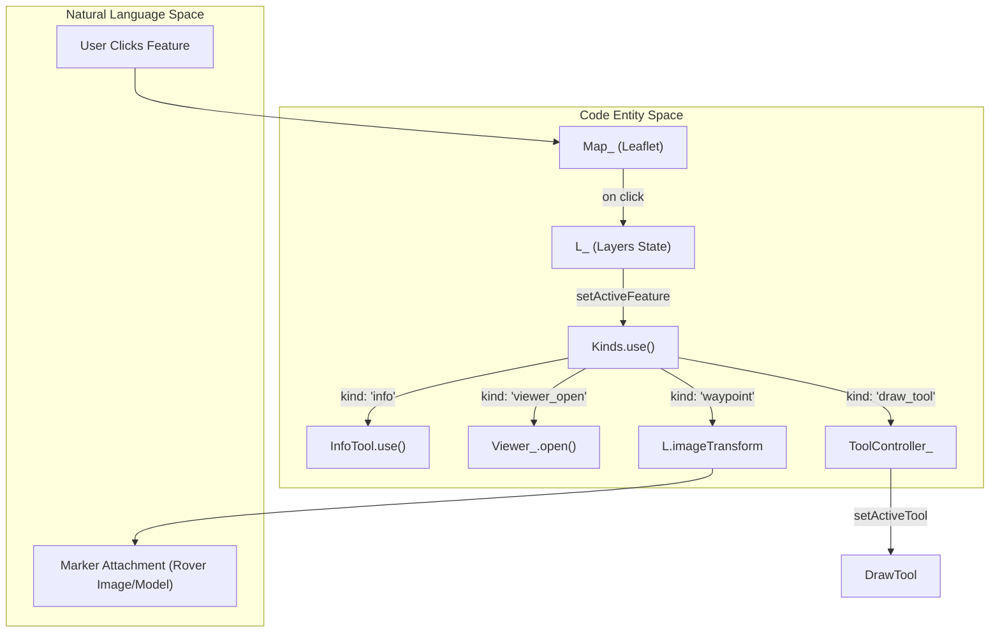
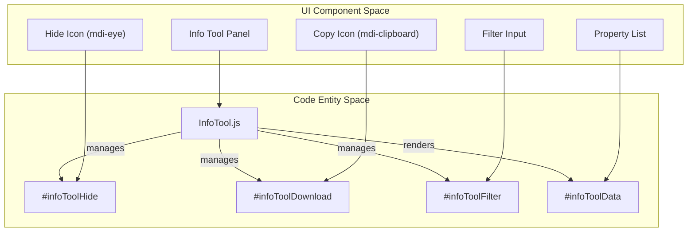

# Page: Info Tool & Feature Interaction (Kinds)

# Info Tool & Feature Interaction (Kinds)

Relevant source files

The following files were used as context for generating this wiki page:

- [src/essence/Ancillary/Description.js](src/essence/Ancillary/Description.js)
- [src/essence/Ancillary/Search.js](src/essence/Ancillary/Search.js)
- [src/essence/Tools/Info/InfoTool.css](src/essence/Tools/Info/InfoTool.css)
- [src/essence/Tools/Info/InfoTool.js](src/essence/Tools/Info/InfoTool.js)
- [src/essence/Tools/Info/config.json](src/essence/Tools/Info/config.json)
- [src/essence/Tools/Kinds/Kinds.js](src/essence/Tools/Kinds/Kinds.js)
- [src/essence/Tools/Layers/config.json](src/essence/Tools/Layers/config.json)
- [src/external/JQuery/jquery.autocomplete.js](src/external/JQuery/jquery.autocomplete.js)
- [src/external/Leaflet/leaflet-pip.js](src/external/Leaflet/leaflet-pip.js)

The **Kinds** system is MMGIS's primary dispatch mechanism for handling user interactions with map features. When a user clicks a feature in the 2D map or 3D globe, the system evaluates the layer's configured `kind` to determine which tool or UI action to trigger. The **InfoTool** serves as the default handler, providing a detailed attribute panel for inspecting feature properties, navigating associated datasets, and managing feature visibility.

## The Kinds Dispatch System

The `Kinds` module acts as a traffic controller for feature clicks. It is invoked whenever a vector feature is selected, typically through `L_.setActiveFeature` [src/essence/Tools/Kinds/Kinds.js:19]().

### Supported Kinds
The system supports several specific interaction types defined in the layer configuration:

| Kind | Action | Implementation |
| :--- | :--- | :--- |
| `info` | Opens the InfoTool attribute panel. | [src/essence/Tools/Kinds/Kinds.js:32-34]() |
| `waypoint` | Attaches image overlays or 3D models to the feature location. | [src/essence/Tools/Kinds/Kinds.js:35-231]() |
| `viewer_open` | Opens the feature's associated data in the Viewer panel. | [src/essence/Tools/Kinds/Kinds.js:232-234]() |
| `chemistry_tool` | Dispatches data to the Chemistry analysis tool. | [src/essence/Tools/Kinds/Kinds.js:235-237]() |
| `draw_tool` | Opens the feature in the Draw Tool for editing (read-only mode). | [src/essence/Tools/Kinds/Kinds.js:238-240]() |

### Marker Attachments
The `waypoint` kind allows for dynamic visual attachments to features, specifically useful for rover positions and orientations:
*   **Image Overlays**: Uses `L.imageTransform` to project a top-down image (e.g., `PerseveranceTopDown.png`) onto the map. It calculates the bounding box anchors by rotating a rectangle based on a `yaw_rad` or `deg` property [src/essence/Tools/Kinds/Kinds.js:103-161]().
*   **3D Models**: Loads `.glb`, `.gltf`, or `.obj` models into the Lithosphere 3D environment. It maps feature properties to model `yaw`, `pitch`, `roll`, `elevation`, and `scale` [src/essence/Tools/Kinds/Kinds.js:166-228]().

### Kind Dispatch Data Flow
This diagram shows how a click event travels from the Map engine to the specific Tool implementation.

Title: Kind Dispatch System Architecture

Sources: [src/essence/Tools/Kinds/Kinds.js:7-31](), [src/essence/Tools/Kinds/Kinds.js:31-241]()

## InfoTool Attribute Panel

The `InfoTool` is the central interface for viewing feature metadata. It renders an accordion-style list of properties and provides advanced navigation for complex data relationships.

### Implementation Details
*   **Initialization**: Configures mobile responsiveness by adjusting panel height/width based on the viewport [src/essence/Tools/Info/InfoTool.js:97-103]().
*   **Markup**: Uses a standard header with action buttons: `infoToolHide` (eye icon), `infoToolLocate` (crosshairs), and `infoToolDownload` (clipboard) [src/essence/Tools/Info/InfoTool.js:20-78]().
*   **Property Filtering**: Users can filter attributes in real-time via the `#infoToolFilter` input field [src/essence/Tools/Info/InfoTool.js:46-52]().

### Data Traversal & Pivoting
The InfoTool supports multi-level data exploration:
1.  **Overlapping Features**: If multiple features exist at the click point (detected via `leafletPip`), a dropdown allows switching between them [src/essence/Tools/Info/InfoTool.js:43-45](), [src/external/Leaflet/leaflet-pip.js:63-140]().
2.  **Dataset/Geodataset Pivoting**: If a feature is linked to external records, the tool provides `infoToolSelectedGeoDataset` and `infoToolSelectedDataset` navigation controls to "pivot" into those related records [src/essence/Tools/Info/InfoTool.js:53-72]().
3.  **Feature Hiding**: The `infoToolHide` button toggles the `featureHidden` state, effectively removing the feature from the map display for the session [src/essence/Tools/Info/InfoTool.js:160-163]().
4.  **Feature Navigation**: The `Description` module provides a navigation bar (`#mainDescNavBar`) to iterate through features in a layer based on a field or map extent [src/essence/Ancillary/Description.js:52-108]().

### UI Component Association
The following diagram maps UI elements in the Info Tool to their respective internal identifiers and functions.

Title: Info Tool UI Component Mapping

Sources: [src/essence/Tools/Info/InfoTool.js:20-78](), [src/essence/Tools/Info/InfoTool.css:9-226](), [src/essence/Tools/Info/config.json:1-33]()

## Key Functions and Classes

| Entity | Role | Location |
| :--- | :--- | :--- |
| `Kinds.use()` | Main entry point for dispatching feature click events and handling marker attachments. | [src/essence/Tools/Kinds/Kinds.js:7]() |
| `InfoTool.use()` | Populates the InfoTool UI with feature properties and manages dataset navigation. | [src/essence/Tools/Info/InfoTool.js:114]() |
| `L.leafletPip` | Point-in-polygon utility used to identify overlapping features for selection. | [src/external/Leaflet/leaflet-pip.js:63]() |
| `Description.init()` | Initializes the feature navigation bar and popover for traversing layer features. | [src/essence/Ancillary/Description.js:30]() |
| `Search.init()` | Configures the global search tool which can trigger feature selection and Info Tool updates. | [src/essence/Ancillary/Search.js:46]() |

Sources: [src/essence/Tools/Kinds/Kinds.js](), [src/essence/Tools/Info/InfoTool.js](), [src/external/Leaflet/leaflet-pip.js](), [src/essence/Ancillary/Description.js](), [src/essence/Ancillary/Search.js]()
