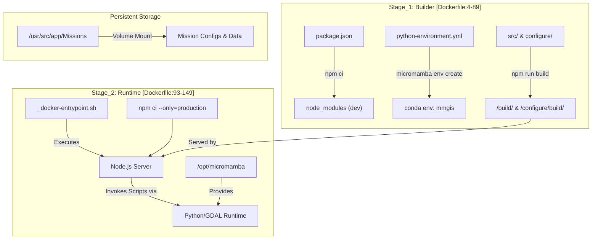
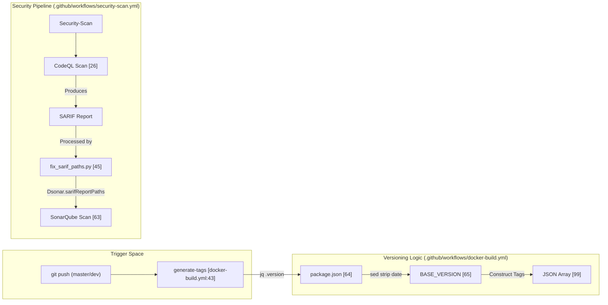

# Page: Infrastructure & CI/CD

# Infrastructure & CI/CD

Relevant source files

The following files were used as context for generating this wiki page:

- [.github/codeql/codeql-config.yml](.github/codeql/codeql-config.yml)
- [.github/scripts/fix_sarif_paths.py](.github/scripts/fix_sarif_paths.py)
- [.github/workflows/docker-build.yml](.github/workflows/docker-build.yml)
- [.github/workflows/security-scan.yml](.github/workflows/security-scan.yml)
- [Dockerfile](Dockerfile)
- [python-environment.yml](python-environment.yml)
- [python-requirements.txt](python-requirements.txt)
- [sonar-project.properties](sonar-project.properties)

The MMGIS infrastructure is designed for high availability and portability, utilizing a containerized architecture that supports both local development and large-scale cloud deployments (e.g., NASA Unity/SDS). The CI/CD pipeline automates the build process across multiple CPU architectures and integrates rigorous security scanning to maintain compliance with NASA software standards.

### Infrastructure Overview

MMGIS is primarily deployed as a multi-container system. The core application is packaged via a multi-stage `Dockerfile` that optimizes for small runtime images by separating the build environment (Node.js and Micromamba/Python) from the production artifacts [Dockerfile:4-149](). 

The build process utilizes `oraclelinux:8.9` as a base [Dockerfile:6-93]() and leverages a multi-stage approach to ensure that source code and development dependencies (like `npm ci` without the `--only=production` flag) do not bloat the final runtime image [Dockerfile:62-120]().

#### System Deployment Components
| Component | Technology | Role |
| --- | --- | --- |
| **Containerization** | Docker | Multi-arch (AMD64/ARM64) images [Dockerfile:15-16]() |
| **Orchestration** | Docker Compose | Manages `mmgis`, `db`, and adjacent services like `stac-fastapi` |
| **Package Management** | Micromamba | Manages the `mmgis` Python environment for GDAL/SPICE scripts [Dockerfile:39-56]() |
| **Base OS** | Oracle Linux 8.9 | Security-hardened enterprise base image [Dockerfile:6-93]() |
| **Python Env** | `python-environment.yml` | Defines GDAL, Rasterio, and STAC dependencies [python-environment.yml:1-35]() |

For detailed information on container configuration, volume mapping for the `Missions/` directory, and service orchestration, see **[Docker & Deployment](#9.1)**.

---

### CI/CD Pipelines

The project utilizes GitHub Actions to manage the software lifecycle, from code push to container registry distribution.

#### Docker Build & Multi-Arch Support
The `docker-build.yml` workflow manages concurrent builds for `master` and `development` branches [.github/workflows/docker-build.yml:1-14](). It generates semantically versioned tags by parsing `package.json` [.github/workflows/docker-build.yml:64-68](). The pipeline builds native images for both `linux/arm64` [.github/workflows/docker-build.yml:127-169]() and `linux/amd64` [.github/workflows/docker-build.yml:172-185]() and pushes them to the GitHub Container Registry (GHCR).

#### Security & Quality Gates
MMGIS employs a "Defense in Depth" strategy for code quality:
1.  **CodeQL**: Performs deep semantic analysis using the `security-extended` query suite [.github/codeql/codeql-config.yml:7-9]() to find vulnerabilities [.github/workflows/security-scan.yml:22-27](). It explicitly excludes `node_modules`, `Missions`, and `public` assets to focus on logic [.github/codeql/codeql-config.yml:11-35]().
2.  **SonarQube/SonarCloud**: Monitors technical debt and maintainability [.github/workflows/security-scan.yml:63-72](). Configuration in `sonar-project.properties` focuses analysis on `src`, `API`, `scripts`, `views`, and `configure` [sonar-project.properties:19]().
3.  **Path Fixing**: A custom Python script `fix_sarif_paths.py` converts absolute container paths in SARIF files to relative workspace paths [.github/scripts/fix_sarif_paths.py:11-39](). This is critical for SonarQube to correctly map security findings to the source code [.github/workflows/security-scan.yml:38-52]().

For details on test suites, Playwright integration, and scan configurations, see **[Testing & Security Scanning](#9.2)**.

---

### Infrastructure-to-Code Mapping

The following diagrams illustrate the relationship between high-level infrastructure concepts and the specific files or logic that define them.

#### Build & Deployment Entity Mapping
This diagram bridges the gap between the Docker build stages and the resulting code entities in the runtime image.

**Sources:** [Dockerfile:23-28](), [Dockerfile:81-88](), [Dockerfile:108-125](), [Dockerfile:149](), [python-environment.yml:1-35]()

#### CI/CD Pipeline Logic
This diagram maps the GitHub Actions workflow steps to the internal logic used for versioning and scanning.

**Sources:** [.github/workflows/docker-build.yml:43-118](), [.github/workflows/security-scan.yml:22-72](), [.github/scripts/fix_sarif_paths.py:11-39]()

---

### Reference Mission Demo

MMGIS includes a comprehensive "Reference Mission" located in `blueprints/Missions/Reference-Mission`. This serves as:
1.  **A Feature Showcase**: Demonstrating 44+ layers including 3D models and COGs.
2.  **A Developer Template**: Allowing developers to use the "Load from Template" feature in the Configure UI.
3.  **A Testing Target**: Serving as the primary environment for Playwright E2E integration tests.

For details on the Reference Mission configuration and its role in the development workflow, see **[Reference Mission Demo](#9.3)**.

**Sources:**
- Docker Configuration: [Dockerfile:1-150]()
- Security Scanning: [.github/workflows/security-scan.yml:1-72](), [.github/codeql/codeql-config.yml:1-35]()
- Docker Build Workflow: [.github/workflows/docker-build.yml:1-125]()
- Sonar Settings: [sonar-project.properties:1-119]()
- Python Dependencies: [python-environment.yml:1-35](), [python-requirements.txt:1-12]()
