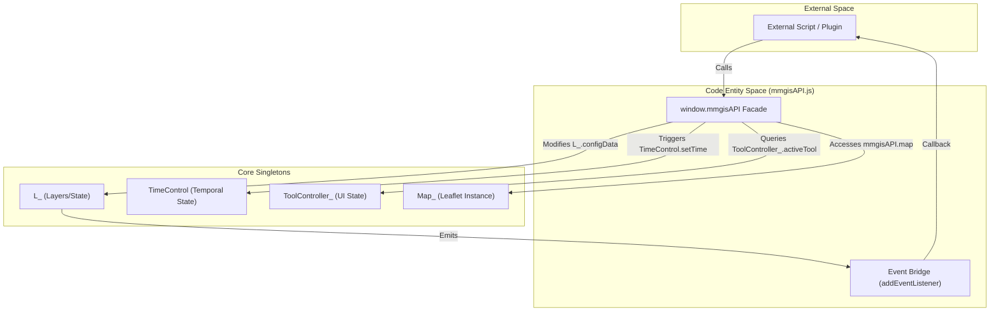
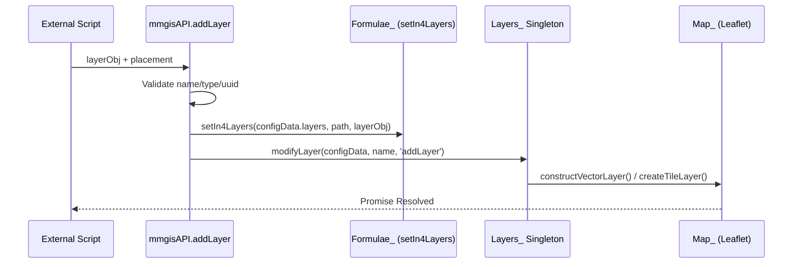

# Page: JavaScript (Client-Side) API

# JavaScript (Client-Side) API

<details>
<summary>Relevant source files</summary>

The following files were used as context for generating this wiki page:

- [API/Backend/Webhooks/processes/triggerwebhooks.js](API/Backend/Webhooks/processes/triggerwebhooks.js)
- [configuration/webpack.config.js](configuration/webpack.config.js)
- [docs/pages/APIs/JavaScript/Main/Main.md](docs/pages/APIs/JavaScript/Main/Main.md)
- [docs/pages/Configure/Layers/Tile/Tile.md](docs/pages/Configure/Layers/Tile/Tile.md)
- [docs/pages/Configure/Layers/Vector/Vector.md](docs/pages/Configure/Layers/Vector/Vector.md)
- [src/essence/Ancillary/QueryURL.js](src/essence/Ancillary/QueryURL.js)
- [src/essence/Basics/Layers_/leaflet-tilelayer-middleware.js](src/essence/Basics/Layers_/leaflet-tilelayer-middleware.js)
- [src/essence/Basics/ToolController_/ToolController_.js](src/essence/Basics/ToolController_/ToolController_.js)
- [src/essence/mmgisAPI/mmgisAPI.js](src/essence/mmgisAPI/mmgisAPI.js)

</details>


The JavaScript API provides a high-level facade via the `window.mmgisAPI` object, allowing external applications or custom plugins to interact with the MMGIS map state, layer data, time controls, and UI components without needing to navigate the complex internal singleton structures directly.

### Architecture Overview
The API acts as a bridge to the core `L_` (Layers), `Map_` (Leaflet), and `TimeControl` singletons. It is initialized during the application bootstrap process and exposes a subset of internal methods to the global scope. It is primarily defined in `mmgisAPI.js`.

**Bridge Architecture**

**Sources:** [src/essence/mmgisAPI/mmgisAPI.js:13-24](), [docs/pages/APIs/JavaScript/Main/Main.md:9-11]()

---

## Layer Management

The API provides methods to dynamically inject, remove, and update layers. Unlike the Configure REST API, these changes are **volatile** and exist only within the current client session unless explicitly saved via other means.

### Dynamic Layer Injection
The `addLayer` function injects a layer configuration into the active `L_.configData` and triggers the layer creation pipeline via `L_.modifyLayer`.

| Function | Description | Implementation |
| :--- | :--- | :--- |
| `addLayer(layerObj, placement)` | Injects a new layer into the UI and map. Supports nested paths via `F_.setIn4Layers`. | [src/essence/mmgisAPI/mmgisAPI.js:30-121]() |
| `removeLayer(layerUUID)` | Removes a layer by its UUID or name using `F_.traverseLayers`. | [src/essence/mmgisAPI/mmgisAPI.js:122-138]() |
| `updateVectorLayer(layerUUID, data)` | Replaces the GeoJSON data of a vector layer. | [src/essence/mmgisAPI/mmgisAPI.js:203-228]() |
| `reloadLayer(layerUUID)` | Forces a refresh of the layer's data source via `L_.modifyLayer`. | [src/essence/mmgisAPI/mmgisAPI.js:311-325]() |

**Data Flow: addLayer**

**Sources:** [src/essence/mmgisAPI/mmgisAPI.js:30-138](), [docs/pages/APIs/JavaScript/Main/Main.md:66-159]()

### Vector Trimming and Appending
The API includes specialized utilities for handling real-time data streams, such as telemetry paths where only a subset of points should be retained to maintain performance.

*   **Time-based Trimming:** `trimVectorLayerKeepBeforeTime` and `trimVectorLayerKeepAfterTime` use a `timePropPath` to prune features based on timestamps [src/essence/mmgisAPI/mmgisAPI.js:229-253]().
*   **Count-based Trimming:** `keepFirstN` and `keepLastN` restrict the number of features in a vector layer FeatureCollection [src/essence/mmgisAPI/mmgisAPI.js:254-266]().
*   **LineString Management:** `trimLineString` and `appendLineString` allow for extending or shortening specific paths within a FeatureCollection [src/essence/mmgisAPI/mmgisAPI.js:267-310]().

---

## Time Control API

The Time Control API interacts with the `TimeControl` module to synchronize temporal layers and the UI slider. It supports both global time ranges and layer-specific temporal offsets.

| Function | Description | Code Reference |
| :--- | :--- | :--- |
| `setTime(start, end, ...)` | Sets the global system time range in `TimeControl`. | [src/essence/mmgisAPI/mmgisAPI.js:410-432]() |
| `setLayerTime(layer, start, end)` | Sets a time range specific to one layer. | [src/essence/mmgisAPI/mmgisAPI.js:433-441]() |
| `reloadTimeLayers()` | Refreshes all layers that have `time: {enabled: true}`. | [src/essence/mmgisAPI/mmgisAPI.js:464-466]() |
| `updateLayersTime()` | Synchronizes layers with the current global time. | [src/essence/mmgisAPI/mmgisAPI.js:479-481]() |

**Sources:** [src/essence/mmgisAPI/mmgisAPI.js:410-481](), [docs/pages/APIs/JavaScript/Main/Main.md:28-40]()

---

## Spatial and Feature Queries

These methods allow developers to extract information about the current map state and user interaction.

### Feature Retrieval
*   **`featuresContained()`**: Iterates through all active Leaflet layers (`L_.layers.layer`) and returns features within the current map bounds (`map.getBounds()`). It includes special handling for `DrawTool` layers and arrow features [src/essence/mmgisAPI/mmgisAPI.js:140-192]().
*   **`getActiveFeature()`**: Returns the feature currently selected/highlighted in the system state [src/essence/mmgisAPI/mmgisAPI.js:193-202]().
*   **`selectFeature(layerUUID, options)`**: Programmatically selects a feature by its ID or property match, triggering the standard MMGIS "Kind" dispatch (e.g., opening the Info panel) [src/essence/mmgisAPI/mmgisAPI.js:338-361]().

### UI and Tool State
*   **`getActiveTools()`**: Returns an object containing all currently active tool instances from the `ToolController_` [src/essence/mmgisAPI/mmgisAPI.js:523-525]().
*   **`getVisibleLayers()`**: Returns a list of UUIDs for layers currently toggled "on" in the `LayersTool` [src/essence/mmgisAPI/mmgisAPI.js:362-373]().

---

## Event Bridge

The `addEventListener` system allows external scripts to subscribe to internal MMGIS state changes. This is implemented by wrapping internal singleton events and providing a standardized event object.

**Supported Events:**
*   **`onLayerAdd`**: Triggered when a new layer is successfully initialized.
*   **`onLayerRemove`**: Triggered when a layer is removed.
*   **`onLayerToggle`**: Triggered when a layer's visibility is changed.
*   **`onTimeChange`**: Triggered when the global `TimeControl` range or current time is updated.

**Implementation Example:**
```javascript
window.mmgisAPI.addEventListener('onLayerToggle', (event) => {
    console.log(`Layer ${event.layerUUID} is now ${event.on ? 'visible' : 'hidden'}`);
});
```
**Sources:** [src/essence/mmgisAPI/mmgisAPI.js:483-509](), [docs/pages/APIs/JavaScript/Main/Main.md:41-43]()

---

## Utility Functions

The API exposes several utility methods for coordinate transformation and system state management.

| Method | Purpose | Source |
| :--- | :--- | :--- |
| `project(lnglat)` | Converts longitude/latitude to pixel coordinates based on the current map CRS. | [src/essence/mmgisAPI/mmgisAPI.js:534-536]() |
| `unproject(xy)` | Converts pixel coordinates to longitude/latitude. | [src/essence/mmgisAPI/mmgisAPI.js:537-539]() |
| `writeCoordinateURL()` | Generates a deep-link URL for the current map view using `QueryURL.writeCoordinateURL`. | [src/essence/mmgisAPI/mmgisAPI.js:514-516]() |
| `setLoginToken(user, token)` | Programmatically sets the authentication state via `Login.setToken`. | [src/essence/mmgisAPI/mmgisAPI.js:527-533]() |

**Sources:** [src/essence/mmgisAPI/mmgisAPI.js:510-540](), [docs/pages/APIs/JavaScript/Main/Main.md:53-60]()
