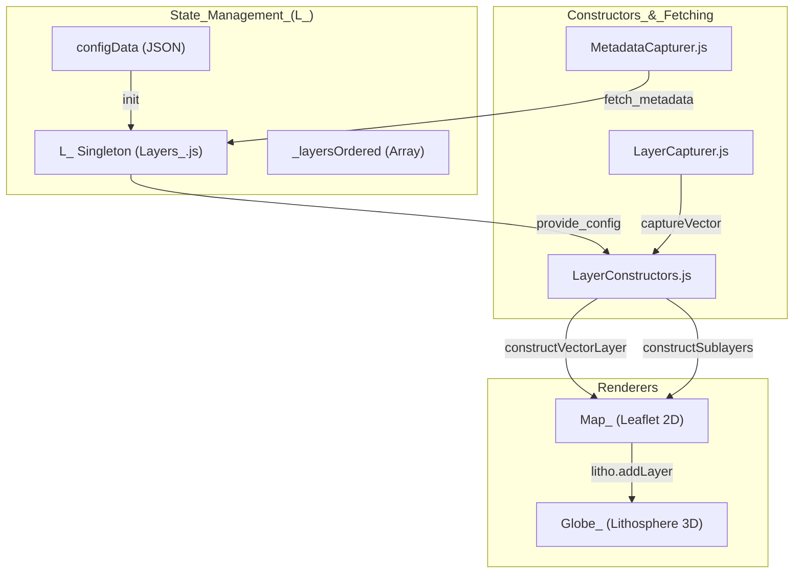
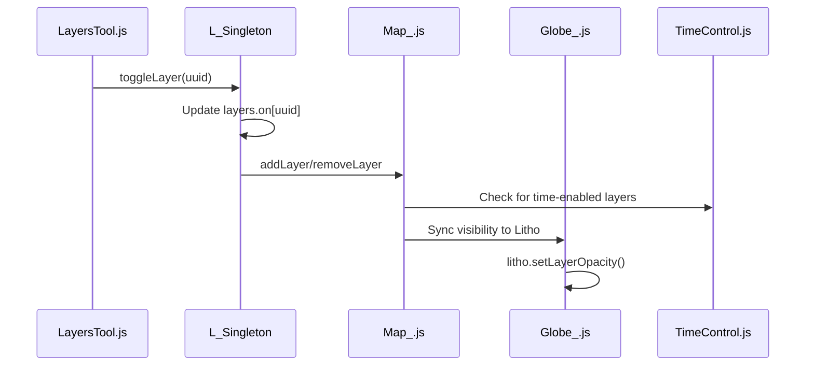

# Page: Layer System (Layers_, Map_, Globe_)

# Layer System (Layers_, Map_, Globe_)

Relevant source files

The following files were used as context for generating this wiki page:

- [API/Backend/Webhooks/processes/triggerwebhooks.js](API/Backend/Webhooks/processes/triggerwebhooks.js)
- [configuration/webpack.config.js](configuration/webpack.config.js)
- [configure/package.json](configure/package.json)
- [docs/pages/Configure/Layers/Tile/Tile.md](docs/pages/Configure/Layers/Tile/Tile.md)
- [docs/pages/Configure/Layers/Vector/Vector.md](docs/pages/Configure/Layers/Vector/Vector.md)
- [package-lock.json](package-lock.json)
- [package.json](package.json)
- [src/essence/Ancillary/QueryURL.js](src/essence/Ancillary/QueryURL.js)
- [src/essence/Basics/Globe_/Globe_.js](src/essence/Basics/Globe_/Globe_.js)
- [src/essence/Basics/Layers_/Layers_.js](src/essence/Basics/Layers_/Layers_.js)
- [src/essence/Basics/Layers_/leaflet-tilelayer-middleware.js](src/essence/Basics/Layers_/leaflet-tilelayer-middleware.js)
- [src/essence/Basics/Map_/Map_.js](src/essence/Basics/Map_/Map_.js)
- [src/essence/Tools/Layers/LayersTool.css](src/essence/Tools/Layers/LayersTool.css)
- [src/essence/Tools/Layers/LayersTool.js](src/essence/Tools/Layers/LayersTool.js)

The MMGIS layer system is a unified state management architecture that synchronizes geospatial data across a 2D Leaflet renderer (`Map_`) and a 3D renderer (`Globe_`), which utilizes the Lithosphere/Cesium engines. The system is centered around the `L_` singleton, which acts as the source of truth for layer configurations, visibility, and ordering.

### Layer State Management (L_)

The `L_` object is a global singleton that manages the lifecycle and state of all layers in the application [src/essence/Basics/Layers_/Layers_.js:12-42](). It stores the raw configuration data from the mission's `config.json` and maintains active state mappings for visibility, opacity, and filtering.

#### Key Data Structures
| Property | Description |
| --- | --- |
| `layers.data` | Map of layer objects indexed by their UUID [src/essence/Basics/Layers_/Layers_.js:32](). |
| `layers.on` | Boolean map tracking which layers are currently toggled visible [src/essence/Basics/Layers_/Layers_.js:36](). |
| `layers.opacity` | Map of layer opacity values (0.0 to 1.0) [src/essence/Basics/Layers_/Layers_.js:37](). |
| `_layersOrdered` | Array of layer names defining the Z-index and UI list order [src/essence/Basics/Layers_/Layers_.js:45](). |
| `_layersLoaded` | Index-matched boolean array tracking which ordered layers have completed loading [src/essence/Basics/Layers_/Layers_.js:47](). |

#### System Architecture: State to Renderers
The following diagram illustrates how the `L_` singleton orchestrates data flow between the configuration and the rendering engines.

**Layer System Data Flow**

Sources: [src/essence/Basics/Layers_/Layers_.js:12-161](), [src/essence/Basics/Map_/Map_.js:3-17](), [src/essence/Basics/Globe_/Globe_.js:8-123]()

---

### Layer Types

MMGIS supports several specialized layer types, each handled by specific logic in the map and globe renderers.

| Type | Description | Key Implementation |
| --- | --- | --- |
| **vector** | GeoJSON features with dynamic symbology and attachments. | `constructVectorLayer` [src/essence/Basics/Map_/Map_.js:6]() |
| **tile** | Standard XYZ, WMTS, or WMS raster tiles. | `L.TileLayer` with `colorFilter` [src/essence/Basics/Layers_/leaflet-tilelayer-middleware.js:16]() |
| **COG** | Cloud Optimized GeoTIFFs via TiTiler, supporting band math. | `splitColonType === 'COG'` [src/essence/Basics/Layers_/leaflet-tilelayer-middleware.js:25]() |
| **vectortile** | MVT/PBF tiles for high-performance large vector datasets. | `LayersTool.js` filter icon [src/essence/Tools/Layers/LayersTool.js:46]() |
| **velocity** | Visualizations for wind/current vector fields. | `VELOCITY_DEFAULT_COLOR_RAMP` [src/essence/Tools/Layers/LayersTool.js:127]() |
| **query** | Layers dynamically generated from database queries. | `quasiLayers` [src/essence/Tools/Layers/LayersTool.js:116]() |
| **model** | 3D assets (GLTF/OBJ) placed at spatial coordinates. | `quasiLayers` [src/essence/Tools/Layers/LayersTool.js:116]() |
| **data** | Non-spatial tabular data (CSV/JSON). | `LayersTool.js` [src/essence/Tools/Layers/LayersTool.js:61]() |
| **header** | UI grouping elements with no map data. | `toggleHeader` [src/essence/Tools/Layers/LayersTool.js:193]() |

Sources: [src/essence/Basics/Layers_/leaflet-tilelayer-middleware.js:20-80](), [src/essence/Tools/Layers/LayersTool.js:36-70](), [src/essence/Basics/Map_/Map_.js:1-21](), [docs/pages/Configure/Layers/Vector/Vector.md:9-12]()

---

### Rendering Engines

#### Map_ (Leaflet 2D)
The `Map_` object initializes the Leaflet map instance. It handles custom Coordinate Reference Systems (CRS) through `L.Proj.CRS` for planetary bodies, calculating resolutions based on `resunitsperpixel` and `origin` [src/essence/Basics/Map_/Map_.js:123-161](). It also manages the "Player" markers (arrow and lookat) for 2D/3D synchronization [src/essence/Basics/Map_/Map_.js:46]().

#### Globe_ (Lithosphere 3D)
The `Globe_` object manages the 3D visualization using a `GlobeRenderer` abstraction [src/essence/Basics/Globe_/Globe_.js:118](). It supports different backends (Lithosphere or Cesium) defined in `panelSettings.globeRenderer` [src/essence/Basics/Globe_/Globe_.js:27-31](). It coordinates camera position and target through `initialCamera` and `initialView` [src/essence/Basics/Globe_/Globe_.js:33-52]().

**Renderer Coordination Sequence**

Sources: [src/essence/Basics/Map_/Map_.js:162-187](), [src/essence/Basics/Globe_/Globe_.js:118-123](), [src/essence/Tools/Layers/LayersTool.js:178-183]()

---

### Z-Index and Ordering System

MMGIS uses a specific `orderedBringToFront` system to maintain visual consistency. Unlike standard Leaflet layers which stack in order of addition, MMGIS forces the stack based on the `_layersOrdered` array [src/essence/Basics/Layers_/Layers_.js:45]().

1.  **Ordering Array**: The `LayersTool` allows users to drag-and-drop layers using `SortableJS`, which updates the `_layersOrdered` array in `L_` [src/essence/Tools/Layers/LayersTool.js:2]().
2.  **Persistence**: The order is preserved in the URL via the `tools` query parameter (e.g., `LayersTool$0-1-2`), allowing deep-linking of specific layer stacks [src/essence/Tools/Layers/LayersTool.js:186-191](). This is parsed by `QueryURL.js` to restore mission state [src/essence/Ancillary/QueryURL.js:92-94]().
3.  **UI Logic**: `LayersTool.js` handles nested hierarchies (headers) by tracking `depth` and `elmIndex` to toggle entire groups [src/essence/Tools/Layers/LayersTool.js:193-206]().

### Tile Middleware & Dynamic Parameters
Tile layers utilize a middleware to inject dynamic parameters such as time tokens and band math expressions into the tile URL [src/essence/Basics/Layers_/leaflet-tilelayer-middleware.js:1-15]().

**URL Transformation Logic**
*   **Time Tokens**: Replaces `{time}`, `{starttime}`, and `{endtime}` with current `TimeControl` values [src/essence/Basics/Layers_/leaflet-tilelayer-middleware.js:99-102]().
*   **COG Rescaling**: Appends `rescale=[min,max]` and `colormap_name` for Cloud Optimized GeoTIFFs [src/essence/Basics/Layers_/leaflet-tilelayer-middleware.js:51-64]().
*   **Band Expressions**: Processes band math (e.g., `(b1-b2)/(b1+b2)`) by prefixing bands with `asset_` for TiTiler compatibility [src/essence/Basics/Layers_/leaflet-tilelayer-middleware.js:69-79]().
*   **STAC Collection**: Appends mosaic limits such as `items_limit`, `scan_limit`, and `time_limit` when using `stac-collection` layer types [src/essence/Basics/Layers_/leaflet-tilelayer-middleware.js:82-96]().
*   **CSS Filters**: Applies client-side CSS filters (brightness, contrast, hue-rotate, grayscale, sepia) directly to Leaflet tile elements [src/essence/Basics/Layers_/leaflet-tilelayer-middleware.js:139-165]().

Sources: [src/essence/Basics/Layers_/leaflet-tilelayer-middleware.js:20-138](), [src/essence/Tools/Layers/LayersTool.js:152-170](), [src/essence/Basics/Layers_/Layers_.js:202-218](), [src/essence/Ancillary/QueryURL.js:15-43]()
