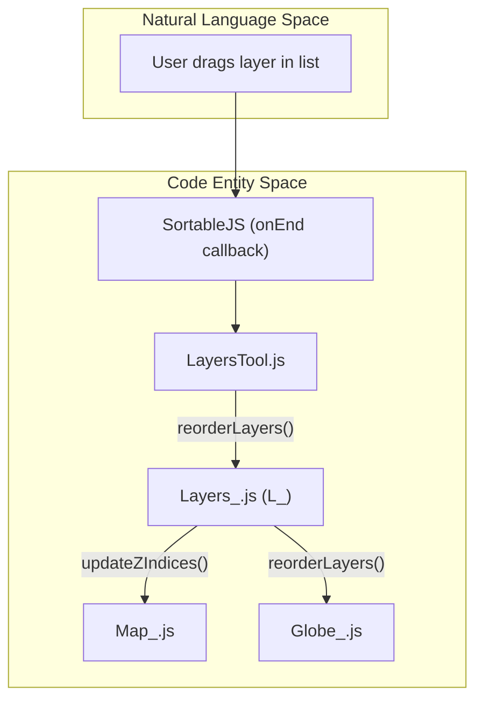
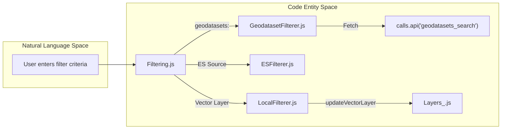

# Page: Layers Tool & Filtering

# Layers Tool & Filtering

Relevant source files

The following files were used as context for generating this wiki page:

- [public/helps/LayersTool-Filtering.md](public/helps/LayersTool-Filtering.md)
- [src/essence/Ancillary/LocalFilterer.js](src/essence/Ancillary/LocalFilterer.js)
- [src/essence/Basics/Layers_/Filtering/ESFilterer.js](src/essence/Basics/Layers_/Filtering/ESFilterer.js)
- [src/essence/Basics/Layers_/Filtering/Filtering.css](src/essence/Basics/Layers_/Filtering/Filtering.css)
- [src/essence/Basics/Layers_/Filtering/Filtering.js](src/essence/Basics/Layers_/Filtering/Filtering.js)
- [src/essence/Basics/Layers_/Filtering/GeodatasetFilterer.js](src/essence/Basics/Layers_/Filtering/GeodatasetFilterer.js)
- [src/essence/Basics/Layers_/Layers_.js](src/essence/Basics/Layers_/Layers_.js)
- [src/essence/Basics/Map_/Map_.js](src/essence/Basics/Map_/Map_.js)
- [src/essence/Tools/Draw/DrawTool_Shapes.css](src/essence/Tools/Draw/DrawTool_Shapes.css)
- [src/essence/Tools/Layers/LayerInfoModal/LayerInfoModal.css](src/essence/Tools/Layers/LayerInfoModal/LayerInfoModal.css)
- [src/essence/Tools/Layers/LayerInfoModal/LayerInfoModal.js](src/essence/Tools/Layers/LayerInfoModal/LayerInfoModal.js)
- [src/essence/Tools/Layers/LayersTool.css](src/essence/Tools/Layers/LayersTool.css)
- [src/essence/Tools/Layers/LayersTool.js](src/essence/Tools/Layers/LayersTool.js)

The Layers Tool is the primary interface for managing layer visibility, ordering, and configuration within MMGIS. It provides users with a drag-and-drop list to control the map's Z-index, tools for adjusting layer-specific settings (opacity, filters, band math), and data export capabilities. Supporting this UI is a robust filtering subsystem that handles both client-side and server-side (ElasticSearch/PostGIS) data queries.

## Layers Tool UI

The `LayersTool` is a core tool registered in the `ToolController_`. It dynamically generates its interface based on the mission configuration and available layer types [src/essence/Tools/Layers/LayersTool.js:35-112]().

### Layer List and Ordering
MMGIS uses **SortableJS** to enable drag-and-drop reordering of layers within the tool panel [src/essence/Tools/Layers/LayersTool.js:2](). When a user reorders a layer, the tool updates the internal `_layersOrdered` array in the `L_` singleton [src/essence/Basics/Layers_/Layers_.js:45](). This change triggers an update to the Leaflet and Lithosphere renderers to ensure the visual Z-index matches the UI list. The tool also maintains an `orderingHistory` to encode the current state into the URL for deep-linking [src/essence/Tools/Layers/LayersTool.js:153-174]().

### Key UI Components
| Component | Implementation |
| :--- | :--- |
| **Filter Icons** | Toggles visibility of specific layer types (vector, tile, query, etc.) [src/essence/Tools/Layers/LayersTool.js:39-71](). |
| **Search Bar** | Filters the visible list of layers by name or tag (using `#`) and supports expanding/collapsing the tree [src/essence/Tools/Layers/LayersTool.js:97-104](). |
| **Layer Settings** | Expandable panel per layer for opacity sliders, time controls, and band math [src/essence/Tools/Layers/LayersTool.js:202-246](). |
| **Export Menu** | Allows downloading vector data as GeoJSON, KML, or Shapefile [src/essence/Tools/Layers/LayersTool.js:248-259](). |
| **Layer Info** | A modal triggered by the info icon that displays metadata, description (via `showdown` Markdown), and UUID [src/essence/Tools/Layers/LayerInfoModal/LayerInfoModal.js:10-78](). |

### Data Flow: Layer Ordering
The following diagram illustrates how reordering a layer in the UI propagates to the map renderers.

**UI to Renderer Reordering Flow**

Sources: [src/essence/Tools/Layers/LayersTool.js:2](), [src/essence/Basics/Layers_/Layers_.js:45](), [src/essence/Basics/Map_/Map_.js:3](), [src/essence/Basics/Globe_/Globe_.js:1]().

## Filtering Subsystem

Filtering in MMGIS is handled by the `Filtering` module, which dispatches requests to specialized filterer classes based on the layer's data source [src/essence/Basics/Layers_/Filtering/Filtering.js:8-10]().

### Filterer Implementations

1.  **LocalFilterer**: Handles client-side filtering for vector layers already loaded into memory. It uses property-based logic (equals, contains, matches) and `turf` for spatial intersections (radius/point) [src/essence/Ancillary/LocalFilterer.js:71-122]().
2.  **ESFilterer**: Interfaces with **ElasticSearch** for high-performance server-side filtering on large datasets [src/essence/Basics/Layers_/Filtering/ESFilterer.js]().
3.  **GeodatasetFilterer**: Used for layers served via the `geodatasets:` protocol. It generates spatial and attribute queries for the PostGIS backend using the `geodatasets_aggregations` and `geodatasets_search` API calls [src/essence/Basics/Layers_/Filtering/GeodatasetFilterer.js:44-63]().

### Filtering Logic and Aggregations
The system calculates "aggregations" (unique values and counts for each property) to populate filter dropdowns. For local layers, this is done by iterating through GeoJSON features [src/essence/Ancillary/LocalFilterer.js:23-69](). For geodatasets, the backend provides these counts based on the current map bounds [src/essence/Basics/Layers_/Filtering/GeodatasetFilterer.js:28-36]().

**Filtering Execution Logic**

Sources: [src/essence/Basics/Layers_/Filtering/Filtering.js:89-118](), [src/essence/Ancillary/LocalFilterer.js:120](), [src/essence/Basics/Layers_/Filtering/GeodatasetFilterer.js:44]().

## Specialized Controls

### COG Band Math
For Cloud Optimized GeoTIFF (COG) layers, the Layers Tool provides a UI for dynamic band math expressions. These expressions are typically passed to the **TiTiler** proxy via URL parameters, allowing for real-time calculation of indices like NDVI or custom band combinations [src/essence/Tools/Layers/LayersTool.js:121-128]().

### Exporting Data
The tool integrates with several libraries to facilitate client-side data conversion:
*   **tokml**: Converts GeoJSON to KML for use in external tools like Google Earth [src/essence/Tools/Layers/LayersTool.js:19]().
*   **shp-write**: Generates ESRI Shapefiles from GeoJSON [src/essence/Tools/Layers/LayersTool.js:20]().

### Layer Information Modal
The `LayerInfoModal` provides a detailed view of a layer's metadata. It uses `showdown` to render Markdown descriptions [src/essence/Tools/Layers/LayerInfoModal/LayerInfoModal.js:11](). It displays:
*   Display Name and Type [src/essence/Tools/Layers/LayerInfoModal/LayerInfoModal.js:37-38]().
*   Feature Count (for vector layers) [src/essence/Tools/Layers/LayerInfoModal/LayerInfoModal.js:20-22]().
*   Tags (Categorized using `category:tag` syntax) [src/essence/Tools/Layers/LayerInfoModal/LayerInfoModal.js:40-61]().
*   Layer UUID for administrative reference [src/essence/Tools/Layers/LayerInfoModal/LayerInfoModal.js:68]().

Sources: [src/essence/Tools/Layers/LayersTool.js:152-189](), [src/essence/Basics/Layers_/Layers_.js:31-42](), [src/essence/Tools/Layers/LayerInfoModal/LayerInfoModal.js:10-78](), [src/essence/Ancillary/LocalFilterer.js:23-69](), [src/essence/Basics/Layers_/Filtering/Filtering.js:8-10]().
