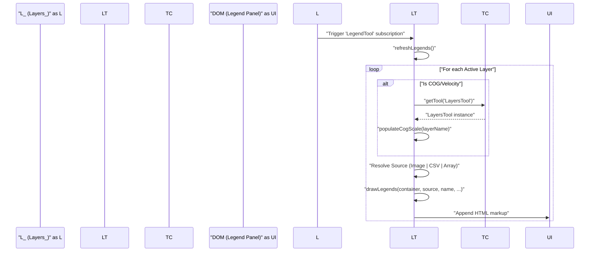
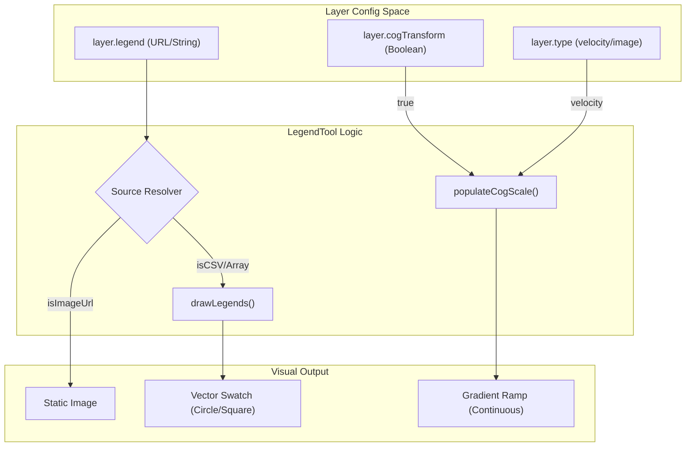

# Page: Legend Tool

# Legend Tool

Relevant source files

The following files were used as context for generating this wiki page:

- [configure/src/external/js-colormaps.js](configure/src/external/js-colormaps.js)
- [configure/src/themes/light.js](configure/src/themes/light.js)
- [docs/pages/Configure/Tabs/Time/Time_Tab.md](docs/pages/Configure/Tabs/Time/Time_Tab.md)
- [docs/pages/Tools/Identifier/Identifier.md](docs/pages/Tools/Identifier/Identifier.md)
- [docs/pages/Tools/Legend/Legend.md](docs/pages/Tools/Legend/Legend.md)
- [src/essence/Tools/Identifier/IdentifierTool.js](src/essence/Tools/Identifier/IdentifierTool.js)
- [src/essence/Tools/Identifier/config.json](src/essence/Tools/Identifier/config.json)
- [src/essence/Tools/Legend/LegendTool.js](src/essence/Tools/Legend/LegendTool.js)
- [src/essence/Tools/Legend/config.json](src/essence/Tools/Legend/config.json)
- [src/external/Leaflet/L.Rain.js](src/external/Leaflet/L.Rain.js)
- [src/external/Leaflet/leaflet-velocity.js](src/external/Leaflet/leaflet-velocity.js)

The Legend Tool is a core MMGIS utility responsible for rendering visual keys that map colors, shapes, and symbols to their respective data meanings. It dynamically updates based on the current state of active layers and supports a wide range of legend sources, including static images, CSV files, and programmatic object arrays.

## 1. Lifecycle and Pipeline

The `LegendTool` is a "separated tool," meaning it can exist independently of the main tool panel, often docked to the left or right of the map interface [src/essence/Tools/Legend/config.json:14-14](). Its initialization is handled by `ToolController_`, which sets properties like `justification` and `displayOnStart` from the mission configuration [src/essence/Tools/Legend/LegendTool.js:25-29]().

### The refreshLegends Pipeline
The tool maintains a reactive relationship with the map state. It subscribes to layer toggle events to ensure the legend always reflects visible data.

1.  **Subscription**: Upon being "made," the tool calls `L_.subscribeOnLayerToggle` [src/essence/Tools/Legend/LegendTool.js:39-41]().
2.  **Trigger**: Whenever a layer is turned on or off, `refreshLegends` is invoked [src/essence/Tools/Legend/LegendTool.js:76-76]().
3.  **Iteration**: The function iterates through the layer tree. If a layer is active (`L_.layers.on[l] == true`), it attempts to resolve a legend source [src/essence/Tools/Legend/LegendTool.js:100-102]().
4.  **Dynamic Scales**: For specialized layers like COG (Cloud Optimized GeoTIFF) or Velocity, if no legend is predefined, it triggers `populateCogScale` via the `LayersTool` to generate a dynamic gradient based on current band math or velocity scales [src/essence/Tools/Legend/LegendTool.js:104-109]().

### Code Entity Flow: Legend Refresh
The following diagram illustrates how the system moves from a user interaction (toggling a layer) to a rendered legend entry.

**Legend Update Sequence**

Sources: [src/essence/Tools/Legend/LegendTool.js:39-41](), [src/essence/Tools/Legend/LegendTool.js:95-109](), [src/essence/Tools/Legend/LegendTool.js:150-171]()

---

## 2. Legend Source Types

The tool handles three primary data formats for legends, defined in the layer configuration's `legend` field.

| Source Type | Implementation Detail | Configuration Example |
| :--- | :--- | :--- |
| **Image** | Supports standard web formats (PNG, JPG, SVG) and WMS `GetLegendGraphic` requests with MIME type detection. | `legend: "images/my_legend.png"` |
| **CSV** | Fetches a CSV file where rows define labels, colors, and shapes. | `legend: "data/symbology.csv"` |
| **Object Array** | Programmatic JSON array defined in the layer's `variables` or `_legend` property. | `_legend: [{ "name": "Feature A", "color": "#FF0000" }]` |

### Image Detection Logic
The tool uses a multi-step check to determine if a URL is an image:
1.  **Extension Check**: Checks for `png`, `jpg`, `jpeg`, `gif`, `svg`, `webp`, `tiff`, `tif`, `bmp`, `ico`, `avif` [src/essence/Tools/Legend/LegendTool.js:117-121]().
2.  **MIME Check**: If no extension is found (common in WMS), it parses the URL parameters for a `FORMAT` key matching image MIME types (e.g., `image/png`) [src/essence/Tools/Legend/LegendTool.js:126-141]().

Sources: [src/essence/Tools/Legend/LegendTool.js:112-148](), [src/essence/Tools/Legend/config.json:5-5]()

---

## 3. Symbology and Shapes

When using CSV or Object Array sources, the Legend Tool renders geometric symbols to match the map's vector styling.

### Supported Shapes
The tool maps string identifiers to specific SVG or CSS-based renderings [docs/pages/Tools/Legend/Legend.md:154-156]():
*   **Circle**: Standard point representation [docs/pages/Tools/Legend/Legend.md:156-156]().
*   **Square**: Often used for raster-cell-equivalent data [docs/pages/Tools/Legend/Legend.md:156-156]().
*   **Rect**: Rectangular swatch [docs/pages/Tools/Legend/Legend.md:156-156]().
*   **MDI Icons**: Material Design Icons can be used as symbols.
*   **Discreet**: Describes a step-wise color scale [docs/pages/Tools/Legend/Legend.md:156-156]().
*   **Continuous**: Describes a gradient color scale [docs/pages/Tools/Legend/Legend.md:156-156]().

### Color Scales
The tool distinguishes between two types of color representations:
1.  **Discrete**: Individual items with specific colors and labels (e.g., Geologic Units) [docs/pages/Tools/Legend/Legend.md:156-156]().
2.  **Continuous/Dynamic**:
    *   **COG Scales**: Generated on-the-fly for rasters using band math or color maps [src/essence/Tools/Legend/LegendTool.js:104-109]().
    *   **Velocity Scales**: Represent magnitude and direction using specialized color scales like those found in `js-colormaps` [configure/src/external/js-colormaps.js:6-6]().

**Data to Entity Mapping**

Sources: [src/essence/Tools/Legend/LegendTool.js:112-171](), [docs/pages/Tools/Legend/Legend.md:154-160](), [src/essence/Tools/Legend/LegendTool.js:104-109]()

---

## 4. API and Extensibility

### overwriteLegends API
The `LegendTool` exposes an `overwriteLegends` function [src/essence/Tools/Legend/LegendTool.js:59-59](). This allows external modules or the MMGIS JavaScript API to bypass the standard mission-config-driven legends and inject custom legend content programmatically.

### Header Integration
By default, the Legend Tool only shows data layers. However, if `showHeadersInLegend` is enabled in the tool variables [src/essence/Tools/Legend/LegendTool.js:28-28](), the tool will render the names of `header` type layers to provide organizational context within the legend panel [src/essence/Tools/Legend/LegendTool.js:98-99]().

### Configuration Parameters
The tool's behavior is controlled via the `legend` section in `config.json`:
*   `separatedTool`: Toggles independent windowing [src/essence/Tools/Legend/config.json:23-29]().
*   `displayOnStart`: Controls initial visibility [src/essence/Tools/Legend/config.json:31-37]().
*   `justification`: Sets screen alignment (`left` or `right`) [src/essence/Tools/Legend/config.json:39-45]().
*   `showHeadersInLegend`: Enables organizational headers in the legend list [src/essence/Tools/Legend/config.json:47-53]().

Sources: [src/essence/Tools/Legend/LegendTool.js:58-60](), [src/essence/Tools/Legend/LegendTool.js:98-99](), [src/essence/Tools/Legend/config.json:18-57]()
