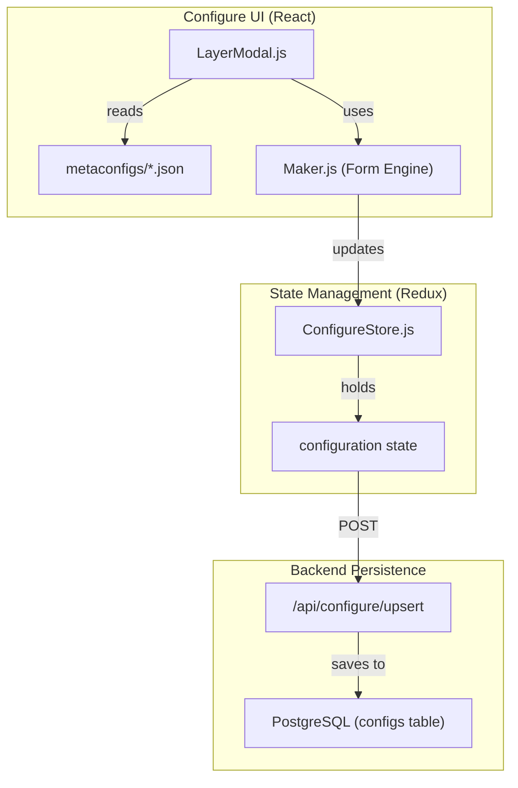
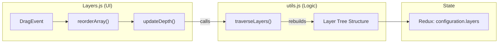

# Page: Mission & Layer Configuration

# Mission & Layer Configuration

Relevant source files

The following files were used as context for generating this wiki page:

- [API/Backend/Config/validate.js](API/Backend/Config/validate.js)
- [API/templates/config_template.js](API/templates/config_template.js)
- [configure/src/components/Main/Main.js](configure/src/components/Main/Main.js)
- [configure/src/components/Panel/Modals/NewMissionModal/NewMissionModal.js](configure/src/components/Panel/Modals/NewMissionModal/NewMissionModal.js)
- [configure/src/components/Tabs/Layers/Layers.js](configure/src/components/Tabs/Layers/Layers.js)
- [configure/src/components/Tabs/Layers/Modals/LayerModal/LayerModal.js](configure/src/components/Tabs/Layers/Modals/LayerModal/LayerModal.js)
- [configure/src/core/utils.js](configure/src/core/utils.js)
- [configure/src/metaconfigs/layer-data-config.json](configure/src/metaconfigs/layer-data-config.json)
- [configure/src/metaconfigs/layer-header-config.json](configure/src/metaconfigs/layer-header-config.json)
- [configure/src/metaconfigs/layer-image-config.json](configure/src/metaconfigs/layer-image-config.json)
- [configure/src/metaconfigs/layer-model-config.json](configure/src/metaconfigs/layer-model-config.json)
- [configure/src/metaconfigs/layer-query-config.json](configure/src/metaconfigs/layer-query-config.json)
- [configure/src/metaconfigs/layer-tile-config.json](configure/src/metaconfigs/layer-tile-config.json)
- [configure/src/metaconfigs/layer-vector-config.json](configure/src/metaconfigs/layer-vector-config.json)
- [configure/src/metaconfigs/layer-vectortile-config.json](configure/src/metaconfigs/layer-vectortile-config.json)
- [configure/src/metaconfigs/layer-velocity-config.json](configure/src/metaconfigs/layer-velocity-config.json)
- [configure/src/metaconfigs/tab-time-config.json](configure/src/metaconfigs/tab-time-config.json)

The MMGIS configuration system defines the structural and behavioral properties of a mission. It utilizes a schema-driven approach where "metaconfigs" (JSON templates) define the UI fields in the `/configure` administration panel, which in turn generate the final mission configuration used by the client-side engine.

## Configuration Architecture

MMGIS missions are defined by a root configuration object containing global settings (e.g., coordinates, time, tools) and an ordered tree of layers.

### Metaconfig System
The configuration UI is dynamically generated using the **Maker** engine. This engine reads metaconfig files to render form components and validate inputs.
*   **Layer-specific metaconfigs**: Located in `configure/src/metaconfigs/`, these define fields for each layer type (e.g., `layer-vector-config.json` [configure/src/metaconfigs/layer-vector-config.json:1-10]()).
*   **Implementation**: The `LayerModal.js` component selects the appropriate metaconfig based on the `layer.type` [configure/src/components/Tabs/Layers/Modals/LayerModal/LayerModal.js:168-211]().
*   **Injection**: Metaconfigs can include dynamic options (like colormaps) via the `inject` utility [configure/src/components/Tabs/Layers/Modals/LayerModal/LayerModal.js:213]().

### Data Flow: Config to UI
"Natural Language Space" (Admin UI) maps to "Code Entity Space" (Config Objects) through the following flow:

**Mission Configuration Mapping**

**Sources:** [configure/src/components/Tabs/Layers/Modals/LayerModal/LayerModal.js:153-214](), [configure/src/core/ConfigureStore.js:1-30]()

---

## Layer Types & Configuration

MMGIS supports a variety of layer types, each with unique rendering requirements and configuration schemas.

### 1. Vector Layers
Used for GeoJSON data. Supports complex symbology and interaction "Kinds".
*   **Source URLs**: Supports `geodatasets:{name}`, `api:publishedall`, and standard HTTPS URLs [configure/src/metaconfigs/layer-vector-config.json:84]().
*   **Symbology**: Configured via `style` objects (color, opacity, weight) which can be mapped to feature properties (e.g., `style.colorProp`) [configure/src/metaconfigs/layer-vector-config.json:156-160]().

### 2. Tile Layers
Hierarchical raster imagery supporting TMS, WMTS, and WMS formats.
*   **COG Integration**: If `sourceType` is `COG` and TiTiler is enabled, MMGIS proxies requests through a dynamic tile server [configure/src/metaconfigs/layer-tile-config.json:65]().
*   **DEM Tiles**: Optional `demtileurl` provides terrain data for 3D visualization in the Globe [configure/src/metaconfigs/layer-tile-config.json:138-142]().
*   **Time Replacement**: URLs can contain `{time}`, `{starttime}`, or `{endtime}` tokens which are replaced at runtime by the `leaflet-tilelayer-middleware` [src/essence/Basics/Layers_/leaflet-tilelayer-middleware.js:99-102]().

### 3. Data Layers
Used for non-visual or analytical raster data, such as Digital Elevation Models (DEMs).
*   **Parsers**: Supports `rgba`, `terrainrgb`, `terrarium`, and `npy` formats for decoding float32 elevation values [configure/src/metaconfigs/layer-data-config.json:68-71]().
*   **Shaders**: Allows client-side colorization of data values via `colorize` or `image` shaders [configure/src/metaconfigs/layer-data-config.json:170-175]().

### 4. Specialized Types
| Type | Description | Key Config Fields |
| :--- | :--- | :--- |
| **Vectortile** | MVT/PBF tiles for high-performance vector rendering | `maxNativeZoom`, `style` [configure/src/metaconfigs/layer-vectortile-config.json:86-160]() |
| **Velocity** | Animated flow maps (streamlines, particles) | `minVelocity`, `velocityScale`, `colorScale` [configure/src/metaconfigs/layer-velocity-config.json:126-202]() |
| **Query** | Dynamic results from ElasticSearch | `query.endpoint`, `variables.query.must` [configure/src/metaconfigs/layer-query-config.json:64-153]() |
| **Model** | 3D assets (.dae, .obj) placed at specific coordinates | `position.longitude`, `position.latitude`, `scale` [configure/src/metaconfigs/layer-model-config.json:61-127]() |
| **Header** | Organizational folder in the layer list | `expanded` (default state) [configure/src/metaconfigs/layer-header-config.json:37-43]() |

**Sources:** [configure/src/metaconfigs/layer-vector-config.json:1-100](), [configure/src/metaconfigs/layer-tile-config.json:1-140](), [configure/src/metaconfigs/layer-velocity-config.json:1-50](), [configure/src/metaconfigs/layer-data-config.json:1-175](), [configure/src/metaconfigs/layer-header-config.json:1-45]()

---

## URL Schemes & Protocols

MMGIS uses specialized URL prefixes to route data fetching through specific internal subsystems.

*   **`geodatasets:{name}`**: Fetches data from the internal PostGIS-backed Geodatasets manager [configure/src/metaconfigs/layer-vector-config.json:84]().
*   **`api:published:{intent}`**: Fetches features from the Draw Tool that have been "published" with a specific intent (e.g., `roi`, `trail`) [configure/src/metaconfigs/layer-vector-config.json:84]().
*   **`stac-collection:{name}`**: For Tile/Data layers, this triggers a mosaic request to `titiler-pgstac` for the specified collection [configure/src/metaconfigs/layer-tile-config.json:65]().
*   **`api:drawn:{file_id}`**: Grabs a user-drawn file from the DrawTool [configure/src/metaconfigs/layer-vector-config.json:84]().

---

## Layer Interaction (Kinds)

The `kind` field determines how the system reacts when a feature in a layer is clicked. This is primarily handled by the `InfoTool`.

*   **`info`**: Displays the standard attribute table [configure/src/metaconfigs/layer-vector-config.json:44]().
*   **`waypoint`**: Specifically for mission traverse points [configure/src/metaconfigs/layer-vector-config.json:45]().
*   **`viewer_open`**: Automatically opens the `Viewer` tool if the feature has associated imagery or 3D models [configure/src/metaconfigs/layer-vector-config.json:49]().
*   **`draw_tool`**: Links the layer to the drawing subsystem for editing [configure/src/metaconfigs/layer-vector-config.json:47]().
*   **`chemistry_tool`**: Triggers specialized analytical tools for chemistry data [configure/src/metaconfigs/layer-vector-config.json:46]().

**Sources:** [configure/src/metaconfigs/layer-vector-config.json:37-51](), [configure/src/metaconfigs/layer-query-config.json:37-51]()

---

## Validation and Templates

The backend enforces configuration integrity through a validation suite before saving.

*   **Validation Logic**: The `validate.js` module checks for required fields like `msv`, `layers`, and `tools` [API/Backend/Config/validate.js:22-35]().
*   **Layer Validation**: Each layer type has specific validation rules (e.g., `isValidZooms`, `isValidModelParams`) [API/Backend/Config/validate.js:53-108]().
*   **Templates**: New missions are initialized from a standard template `config_template.js` which provides default tool configurations like `LayersTool`, `LegendTool`, and `InfoTool` [API/templates/config_template.js:50-67]().

---

## Layer Ordering & Management

The order of layers in the configuration determines their Z-index in the map and their vertical position in the UI.

### Hierarchy Management
Layers are managed in a tree structure. The `Layers.js` component flattens this tree for the drag-and-drop UI while maintaining parent-child relationships via `depth` [configure/src/components/Tabs/Layers/Layers.js:185-197]().

### Implementation Logic
*   **`traverseLayers`**: A utility function used to walk the layer tree and perform operations like finding a layer by UUID or building a flat list [configure/src/components/Tabs/Layers/Layers.js:224-226]().
*   **Drag and Drop**: Uses `react-beautiful-dnd`. When a layer is moved, the `updateDepth` function recalculates the tree structure based on the new visual order and indentation [configure/src/components/Tabs/Layers/Layers.js:231-237]().
*   **Ordering Flow**:
    1.  User drags layer in `Layers.js`.
    2.  `reorderArray` updates the local flat state [configure/src/components/Tabs/Layers/Layers.js:8]().
    3.  `setConfiguration` dispatches the new tree to the Redux store [configure/src/components/Tabs/Layers/Layers.js:10]().

**Layer Management Logic**

**Sources:** [configure/src/components/Tabs/Layers/Layers.js:172-237](), [configure/src/core/utils.js:1-10](), [API/Backend/Config/validate.js:1-120]()
