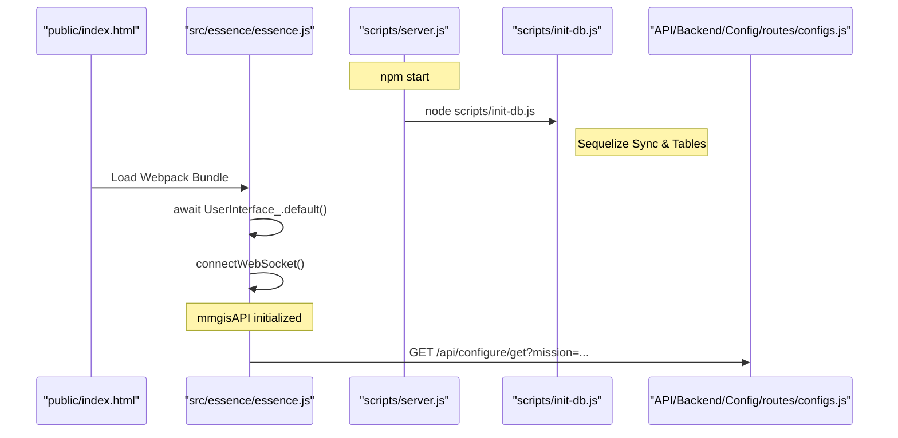

# Page: MMGIS Overview

# MMGIS Overview

<details>
<summary>Relevant source files</summary>

The following files were used as context for generating this wiki page:

- [.nvmrc](.nvmrc)
- [API/Backend/Config/routes/configs.js](API/Backend/Config/routes/configs.js)
- [API/Backend/Config/uuids.js](API/Backend/Config/uuids.js)
- [CITATION.cff](CITATION.cff)
- [README.md](README.md)
- [configure/package.json](configure/package.json)
- [docs/assets/images/NASA-AMMOS-MMGIS-frame0.png](docs/assets/images/NASA-AMMOS-MMGIS-frame0.png)
- [docs/assets/images/divider.png](docs/assets/images/divider.png)
- [docs/pages/APIs/Configure/Configure_REST_API.md](docs/pages/APIs/Configure/Configure_REST_API.md)
- [docs/pages/Overview/Overview.md](docs/pages/Overview/Overview.md)
- [docs/pages/Setup/Installation/Installation.md](docs/pages/Setup/Installation/Installation.md)
- [package-lock.json](package-lock.json)
- [package.json](package.json)
- [specs/001-authentication-and-user-management/plan.md](specs/001-authentication-and-user-management/plan.md)
- [src/essence/Basics/Globe_/Globe_.js](src/essence/Basics/Globe_/Globe_.js)
- [src/essence/Tools/Viewshed/config.json](src/essence/Tools/Viewshed/config.json)
- [src/essence/essence.js](src/essence/essence.js)

</details>


The Multi-Mission Geographic Information System (MMGIS) is a free, open-source, web-based mapping platform designed for Earth and planetary visualization, research, science planning, and mission operations [[README.md:4-9](), [package.json:4]()]. Developed at NASA/JPL, it provides a unified spatial data infrastructure for mission-critical geospatial visualization and collaboration, supporting both 2D and 3D mapping with real-time multi-user synchronization [[README.md:51-87](), [src/essence/essence.js:138-161]()].

MMGIS is designed to be highly configurable, allowing mission administrators to host multiple independent mapping projects through a built-in Configuration Management System (CMS) known as the "Configure" sub-app [[README.md:95-102](), [configure/package.json:2-4]()].

## Key Capabilities

MMGIS bridges the gap between traditional GIS and web-based visualization with several core features:

*   **Dual-Engine Rendering:** Synchronized 2D Leaflet-based maps and 3D globes powered by Lithosphere or CesiumJS [[README.md:53](), [src/essence/Basics/Globe_/Globe_.js:27-31](), [src/essence/Basics/Globe_/Globe_.js:118-122]()].
*   **Rich Layer Support:** Handles 10 distinct layer types including Vector, Tile, Cloud-Optimized GeoTIFFs (COG), Velocity, and MVT (Vector Tiles) [[README.md:60-64]()].
*   **Planetary Support:** Native support for custom planetary projections, coordinate systems, and NAIF SPICE-based solar/orbital illumination [[README.md:55, 83](), [src/essence/Basics/Globe_/Globe_.js:54-74]()].
*   **Collaborative Drawing:** Real-time, multi-user vector drawing and synchronization via WebSockets [[README.md:74, 90-91](), [src/essence/essence.js:162-180]()].
*   **Science Tools:** Integrated tools for elevation profiling, viewshed analysis, traversability (isochrones), and chemical composition visualization [[README.md:71-87]()].

### System Component Map
The following diagram maps the high-level functional areas to the core code entities and modules found in the repository.

**MMGIS Functional Architecture**
```mermaid
graph TD
    subgraph "Frontend (src/essence)"
        ["essence.js (Main Entry)"] --> ["L_ (Basics/Layers_/Layers_)"]
        ["essence.js (Main Entry)"] --> ["Map_ (Basics/Map_/Map_)"]
        ["essence.js (Main Entry)"] --> ["Globe_ (Basics/Globe_/Globe_)"]
        ["UserInterface_"] --> ["ToolController_"]
    end

    subgraph "Backend (scripts/server.js)"
        ["server.js"] --> ["API/connection.js (Sequelize)"]
        ["server.js"] --> ["API/websocket.js"]
        ["server.js"] --> ["API/Backend/Config/routes/configs.js"]
    end

    subgraph "External Services (Adjacent Servers)"
        ["API/Backend/Config/routes/configs.js"] -- "Proxy Pass" --> ["STAC FastAPI"]
        ["API/Backend/Config/routes/configs.js"] -- "Proxy Pass" --> ["TiTiler (COG)"]
        ["API/Backend/Config/routes/configs.js"] -- "Proxy Pass" --> ["Veloserver"]
    end

    ["API/connection.js (Sequelize)"] --> ["PostgreSQL/PostGIS"]
```
Sources: `[src/essence/essence.js:23-45]()`, `[package.json:39-41]()`, `[README.md:53-65]()`, `[API/Backend/Config/routes/configs.js:1-10]()`.

## Technology Stack

MMGIS utilizes a modern web stack optimized for geospatial performance:

| Layer | Technology |
| :--- | :--- |
| **Runtime** | Node.js v22.20.0+ [[.nvmrc:1](), [README.md:21]()] |
| **Frontend** | React, jQuery, Materialize CSS [[package.json:129, 132, 143]()] |
| **2D Mapping** | Leaflet [[package.json:33](), [README.md:53]()] |
| **3D Mapping** | Cesium.js / Lithosphere [[package.json:86, 130](), [src/essence/Basics/Globe_/Globe_.js:8-9]()] |
| **Backend** | Express [[package.json:107]()] |
| **Database** | PostgreSQL 16+ with PostGIS [[README.md:22](), [docs/pages/Setup/Installation/Installation.md:93-94]()] |
| **ORM** | Sequelize [[package.json:154](), [API/Backend/Config/routes/configs.js:9-10]()] |
| **Communication** | WebSockets (ws / isomorphic-ws) [[package.json:128, 166](), [src/essence/essence.js:21]() ] |
| **Data Services** | TiTiler (COG), STAC, GDAL [[README.md:63-65]()] |

## Core Entities & Entry Points

The system is initialized through `src/essence/essence.js` on the client and `scripts/server.js` on the server. The database schema and initial setup are handled by `scripts/init-db.js` [[package.json:39-41]()]. Configuration management is handled via the `/api/configure` REST API [[API/Backend/Config/routes/configs.js:12-16](), [docs/pages/APIs/Configure/Configure_REST_API.md:12]()].

**Initialization Flow**

Sources: `[package.json:39-41]()`, `[src/essence/essence.js:45, 50, 138]()`, `[API/Backend/Config/routes/configs.js:151-160]()`.

## Navigation

Detailed documentation is organized into the following sections:

*   **[Getting Started & Installation](#1.1)**: Step-by-step setup using Docker or source, including first-time admin creation and mission initialization [[docs/pages/Setup/Installation/Installation.md:1-87]()].
*   **[Environment Configuration (ENVs)](#1.2)**: Reference for all `.env` variables controlling authentication modes (`off`, `local`, `csso`), database settings, and adjacent service toggles [[docs/pages/Setup/Installation/Installation.md:32-52]()].
*   **[Architecture Overview](#1.3)**: In-depth look at the interaction between the Node.js backend, PostGIS database, and the dual-renderer frontend [[src/essence/essence.js:23-45](), [API/Backend/Config/routes/configs.js:1-150]()].

---
Sources: `[README.md:1-114]()`, `[package.json:1-169]()`, `[docs/pages/Setup/Installation/Installation.md:1-87]()`, `[src/essence/essence.js:1-161]()`.
