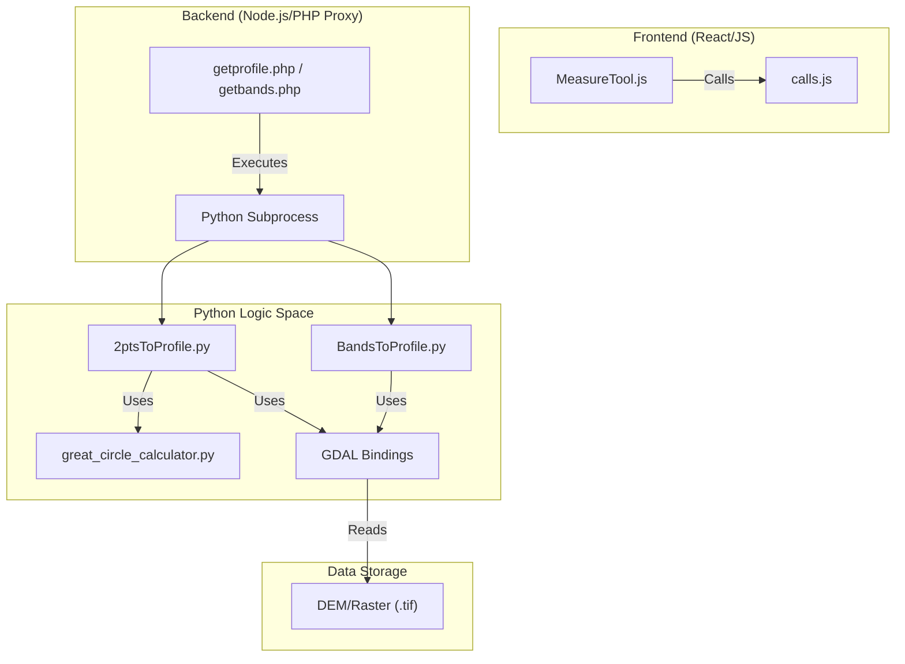
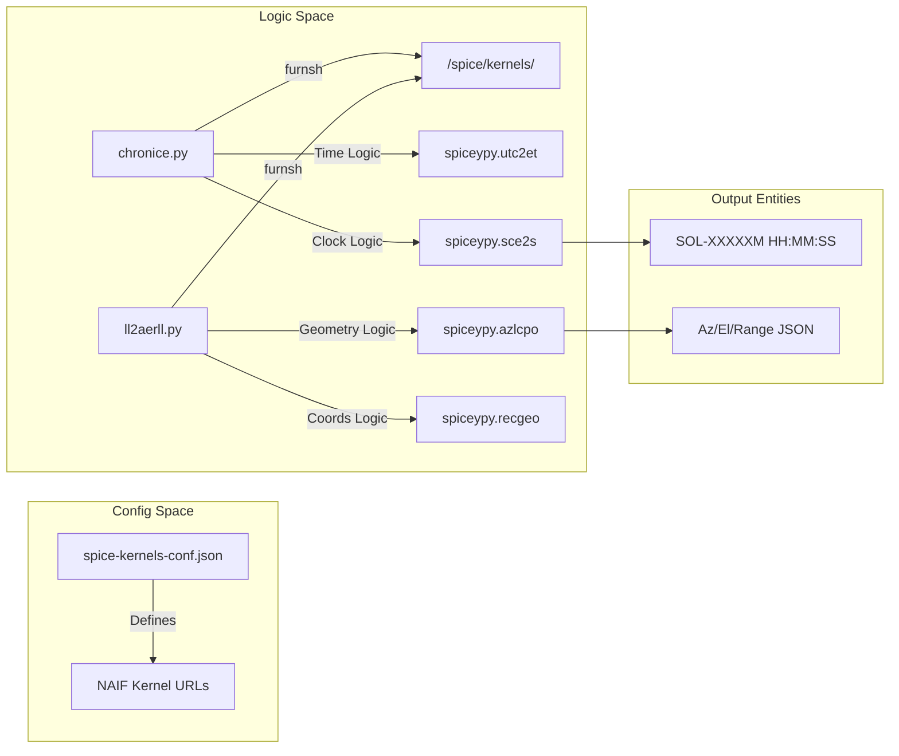

# Page: Private API & SPICE Integration

# Private API & SPICE Integration

Relevant source files

The following files were used as context for generating this wiki page:

- [Missions/spice-kernels-conf.example.json](Missions/spice-kernels-conf.example.json)
- [Missions/spice-kernels-conf.example.mars2020.json](Missions/spice-kernels-conf.example.mars2020.json)
- [Missions/spice-kernels-conf.example.msl.json](Missions/spice-kernels-conf.example.msl.json)
- [private/api/2ptsToProfile.py](private/api/2ptsToProfile.py)
- [private/api/BandsToProfile.py](private/api/BandsToProfile.py)
- [private/api/chronice.py](private/api/chronice.py)
- [private/api/create_mission.py](private/api/create_mission.py)
- [private/api/great_circle_calculator/__conversion.py](private/api/great_circle_calculator/__conversion.py)
- [private/api/great_circle_calculator/__conversion.pyc](private/api/great_circle_calculator/__conversion.pyc)
- [private/api/great_circle_calculator/__error_checking.py](private/api/great_circle_calculator/__error_checking.py)
- [private/api/great_circle_calculator/__error_checking.pyc](private/api/great_circle_calculator/__error_checking.pyc)
- [private/api/great_circle_calculator/__init__.py](private/api/great_circle_calculator/__init__.py)
- [private/api/great_circle_calculator/__init__.pyc](private/api/great_circle_calculator/__init__.pyc)
- [private/api/great_circle_calculator/_constants.py](private/api/great_circle_calculator/_constants.py)
- [private/api/great_circle_calculator/_constants.pyc](private/api/great_circle_calculator/_constants.pyc)
- [private/api/great_circle_calculator/compass.py](private/api/great_circle_calculator/compass.py)
- [private/api/great_circle_calculator/great_circle_calculator.py](private/api/great_circle_calculator/great_circle_calculator.py)
- [private/api/great_circle_calculator/great_circle_calculator.pyc](private/api/great_circle_calculator/great_circle_calculator.pyc)
- [private/api/ll2aerll.py](private/api/ll2aerll.py)
- [private/api/naif-about.txt](private/api/naif-about.txt)
- [src/essence/Basics/Formulae_/Formulae_.js](src/essence/Basics/Formulae_/Formulae_.js)
- [src/essence/Tools/Measure/MeasureTool.css](src/essence/Tools/Measure/MeasureTool.css)
- [src/essence/Tools/Measure/MeasureTool.js](src/essence/Tools/Measure/MeasureTool.js)
- [src/essence/Tools/Shade/ShadeTool.js](src/essence/Tools/Shade/ShadeTool.js)

This page documents the server-side Python scripts and SPICE (Space Prediction Information and Computing Engine) integration used by MMGIS for advanced geospatial computations, planetary geometry, and mission management. These scripts are located in the `private/api/` directory and are typically invoked by the backend to perform tasks that require GDAL, SPICE kernels, or complex mathematical calculations.

## Elevation & Band Profiling

MMGIS provides tools for extracting vertical profiles and raster band data across geographic extents using GDAL-based Python scripts. These are primarily utilized by the `MeasureTool` and `ShadeTool` in the frontend.

### 2ptsToProfile.py
This script calculates an elevation profile between two points. It interpolates points along a great circle path and samples values from a specified raster (usually a DEM).

*   **Logic**:
    1.  Opens the raster using `gdal.Open` in `GA_ReadOnly` mode [private/api/2ptsToProfile.py:175-178]().
    2.  Interpolates coordinates between start and end points using the `intermediate_point` function from the `great_circle_calculator` [private/api/2ptsToProfile.py:17-122]().
    3.  Converts interpolated Lat/Lon pairs to pixel coordinates based on the raster's `GetGeoTransform` and `SpatialReference` [private/api/2ptsToProfile.py:129-159]().
    4.  Samples the raster band at each pixel location using `band.ReadAsArray` [private/api/2ptsToProfile.py:32-51]().
    5.  Handles `NODATA_VALUE` by checking the band's `GetNoDataValue` property and performing a tolerance check for high-precision nodata values [private/api/2ptsToProfile.py:42-49]().

### BandsToProfile.py
Similar to the elevation profile, this script samples specific bands (or ranges of bands) at a single geographic point. This is used for spectral analysis or multi-band raster querying.

*   **Key Function**: `getValueAtBand(b)` retrieves the value and description for a specific band index. It attempts to parse numeric values from the band description if available [private/api/BandsToProfile.py:27-55]().
*   **Input**: Supports single band integers or inclusive ranges like `[[0,7], 9]` via `ast.literal_eval` [private/api/BandsToProfile.py:118]().
*   **Coordinate Support**: Can accept input as either pixel `xy` or geographic `ll` [private/api/BandsToProfile.py:130-136]().

### Great Circle Calculator
A local library used by the profiling scripts to handle spherical geometry.
*   **File**: `private/api/great_circle_calculator/great_circle_calculator.py`
*   **Key Functions**:
    *   `distance_between_points`: Calculates distance using `haversine`, `vincenty` (ellipsoidal), or Spherical Law of Cosines [private/api/great_circle_calculator/great_circle_calculator.py:14-95]().
    *   `intermediate_point`: Finds a point at a specific `fraction` along the path between two coordinates [private/api/great_circle_calculator/great_circle_calculator.py:144-162]().
    *   `bearing_at_p1`: Computes the initial bearing/course between two points [private/api/great_circle_calculator/great_circle_calculator.py:98-111]().

**Sources:** [private/api/2ptsToProfile.py:1-204](), [private/api/BandsToProfile.py:1-141](), [private/api/great_circle_calculator/great_circle_calculator.py:1-162]()

---

## SPICE Integration & Planetary Geometry

MMGIS utilizes NASA's NAIF SPICE toolkit (via `spiceypy`) to perform time conversions and calculate observer-target geometry (e.g., where a rover is relative to an orbiter at a specific UTC).

### chronice.py (Time Conversion)
Converts between UTC and Local Mean Solar Time (LMST) for Mars missions.
*   **Implementation**: It dynamically loads kernels from the `../../spice/kernels/` directory, crawling body and target subdirectories [private/api/chronice.py:24-58]().
*   **Conversions**: 
    *   **UTC to LMST**: Uses `spiceypy.utc2et` to get ephemeris time, `spiceypy.sce2s` to convert to Spacecraft Clock (SCLK), and `sclk2lmst` to format the string [private/api/chronice.py:70-73]().
    *   **LMST to UTC**: Uses `lmst2sclk` and `spiceypy.scs2e` to get ephemeris time, then `spiceypy.et2utc` for ISO format output [private/api/chronice.py:75-77]().
*   **Target IDs**: Hardcoded for specific missions (MSL: `-76900`, Mars2020: `-168900`) [private/api/chronice.py:63-68]().

### ll2aerll.py (Look Angles)
Calculates Azimuth, Elevation, and Range (AER) from a ground position to a target (like an orbiter) or the Sun/Earth.
*   **Functionality**:
    1.  Loads necessary kernels (LSK, PCK, SPK) using `spiceypy.furnsh` [private/api/ll2aerll.py:26-62]().
    2.  Calculates target latitude, longitude, and altitude using `spiceypy.recgeo` [private/api/ll2aerll.py:128-132]().
    3.  Can include Sun and Earth positions for lighting/communication analysis [private/api/ll2aerll.py:105-118]().

### Kernel Management
Kernels are managed via configuration files like `Missions/spice-kernels-conf.example.json`. If the environment variable `SPICE_SCHEDULED_KERNEL_DOWNLOAD` is enabled, MMGIS automatically fetches these files from NAIF servers.

*   **Configuration Structure**: Supports `body` (e.g., MARS), `kernels` (generic), and `targets` (e.g., MARS2020, MRO, MAVEN) [Missions/spice-kernels-conf.example.mars2020.json:4-55]().
*   **Meta-Kernels**: Supports dynamic meta-kernel (.tm) resolution using regex for SPK files [Missions/spice-kernels-conf.example.mars2020.json:45-51]().

**Sources:** [private/api/chronice.py:1-120](), [private/api/ll2aerll.py:1-157](), [Missions/spice-kernels-conf.example.mars2020.json:1-55]()

---

## Utility Scripts

### create_mission.py
A Python utility for initializing new mission directories within the MMGIS filesystem.
*   **Logic**:
    1.  Checks if the mission folder already exists in `Missions/` [private/api/create_mission.py:16-19]().
    2.  Creates the base mission directory and standard subdirectories: `Data/` and `Layers/` using `os.makedirs` [private/api/create_mission.py:40-48]().
    3.  Includes basic directory traversal protection by checking for dots and absolute paths [private/api/create_mission.py:38-41]().

**Sources:** [private/api/create_mission.py:1-58]()

---

## System Architecture Diagrams

### Code Entity Mapping: Profiling Pipeline
This diagram bridges the Natural Language concepts of "Profiling" to the specific code entities involved in the data flow.

**Sources:** [src/essence/Tools/Measure/MeasureTool.js:9-52](), [private/api/2ptsToProfile.py:10-17](), [private/api/BandsToProfile.py:9-17]()

### Code Entity Mapping: SPICE Integration
This diagram maps planetary geometry concepts to the `spiceypy` wrapper scripts and NAIF kernel configurations.

**Sources:** [private/api/chronice.py:23-78](), [private/api/ll2aerll.py:65-157](), [Missions/spice-kernels-conf.example.mars2020.json:1-55]()

## Summary of Private API Components

| Script | Purpose | Primary Dependencies |
| :--- | :--- | :--- |
| `2ptsToProfile.py` | Generates elevation profiles between two points. | `gdal`, `great_circle_calculator` |
| `BandsToProfile.py` | Queries specific raster band values at a point. | `gdal` |
| `chronice.py` | Mars-specific time conversion (UTC <-> LMST). | `spiceypy`, SPICE Kernels |
| `ll2aerll.py` | Calculates relative geometry between ground and orbit. | `spiceypy`, `great_circle_calculator` |
| `create_mission.py` | Filesystem utility for new mission setup. | `os`, `sys` |

**Sources:** [private/api/2ptsToProfile.py:1-10](), [private/api/BandsToProfile.py:1-6](), [private/api/chronice.py:1-11](), [private/api/ll2aerll.py:1-7](), [private/api/create_mission.py:11-32]()
