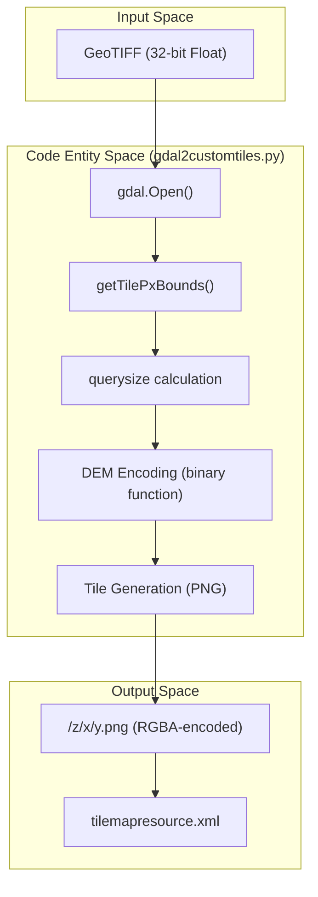
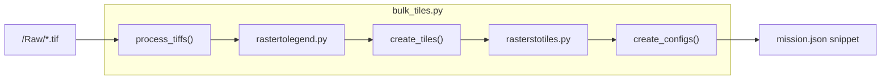

# Page: Raster Tiling Scripts

# Raster Tiling Scripts

Relevant source files

The following files were used as context for generating this wiki page:

- [auxiliary/bulk_tiles/README.md](auxiliary/bulk_tiles/README.md)
- [auxiliary/bulk_tiles/bulk_tiles.py](auxiliary/bulk_tiles/bulk_tiles.py)
- [auxiliary/demtiles/gdal2demtiles.py](auxiliary/demtiles/gdal2demtiles.py)
- [auxiliary/gdal2customtiles/gdal2customtiles.py](auxiliary/gdal2customtiles/gdal2customtiles.py)
- [auxiliary/gdal2customtiles/legacy/gdal2customtiles.py](auxiliary/gdal2customtiles/legacy/gdal2customtiles.py)
- [auxiliary/gdal2customtiles/legacy/gdal2customtiles_py27.py](auxiliary/gdal2customtiles/legacy/gdal2customtiles_py27.py)
- [auxiliary/gdal2customtiles/legacy/gdal2tiles_3.5.2.py](auxiliary/gdal2customtiles/legacy/gdal2tiles_3.5.2.py)
- [auxiliary/gdal2customtiles/legacy/rasters2customtiles_3.5.2.py](auxiliary/gdal2customtiles/legacy/rasters2customtiles_3.5.2.py)
- [auxiliary/gdal2customtiles/legacy/readme.md](auxiliary/gdal2customtiles/legacy/readme.md)
- [auxiliary/gdal2customtiles/rasters2customtiles.py](auxiliary/gdal2customtiles/rasters2customtiles.py)
- [auxiliary/gdal2customtiles/readme.md](auxiliary/gdal2customtiles/readme.md)
- [auxiliary/gdal2tiles4extent/gdal2tiles4extent.py](auxiliary/gdal2tiles4extent/gdal2tiles4extent.py)
- [auxiliary/gdal2tiles4extent/gdal2tiles4extentWithDEM.py](auxiliary/gdal2tiles4extent/gdal2tiles4extentWithDEM.py)
- [auxiliary/gdal2tiles4extent/readme.md](auxiliary/gdal2tiles4extent/readme.md)
- [auxiliary/quantize_colormap/README.md](auxiliary/quantize_colormap/README.md)
- [auxiliary/quantize_colormap/quantize_colormap.py](auxiliary/quantize_colormap/quantize_colormap.py)
- [auxiliary/rasterstotiles/rasterstotiles.py](auxiliary/rasterstotiles/rasterstotiles.py)
- [auxiliary/rastertolegend/rastertolegend.py](auxiliary/rastertolegend/rastertolegend.py)

This section documents the suite of auxiliary Python scripts used to prepare and process raw raster data (GeoTIFFs) into Tile Map Service (TMS) tiles compatible with MMGIS. These scripts extend standard GDAL functionality to support planetary coordinate systems, custom extents, and Digital Elevation Model (DEM) encoding.

## gdal2customtiles.py

`gdal2customtiles.py` is the primary tiling engine for MMGIS. It is a modified version of the standard `gdal2tiles.py` utility, updated to support Python 3.10+ and GDAL 3.5.2+ [auxiliary/gdal2customtiles/readme.md:1-5]().

### Key Features
*   **Custom Raster Extents**: Allows tiling of partial-world rasters in non-Mercator and non-geodetic projections [auxiliary/gdal2customtiles/readme.md:9-11](). This is activated using `-p raster` and the `--extentworld` parameter [auxiliary/gdal2customtiles/readme.md:15-18]().
*   **DEM Tile Encoding**: Encodes 32-bit float elevation data into the RGBA channels of PNG tiles [auxiliary/gdal2customtiles/readme.md:39-43]().
*   **Compositing**: Supports a `near-composite` resampling algorithm that overlays new tiles onto existing ones in the output directory, enabling incremental updates to a tileset [auxiliary/gdal2customtiles/readme.md:64-66]().

### DEM Encoding Implementation
To preserve high-precision 32-bit float data in 8-bit RGBA channels, the script uses a bit-packing approach.
1.  **Zero Handling**: To avoid clashes with transparent pixels (RGBA 0,0,0,0), the value `0` is encoded as $2^{31}$ (2147483648), which corresponds to RGBA (79, 0, 0, 0) [auxiliary/gdal2customtiles/gdal2customtiles.py:67-68](), [auxiliary/gdal2customtiles/readme.md:60-60]().
2.  **32-bit to RGBA**: The `binary` function handles the conversion of float numbers into bitstrings for packing into the 4-channel output [auxiliary/gdal2customtiles/gdal2customtiles.py:67-68]().

### Custom Extents Logic
The script introduces the `--extentworld` parameter, which defines the full bounding area of the projection in meters (`ulx,uly,lrx,lry,pixel_resolution`) [auxiliary/gdal2customtiles/readme.md:17-18]().

The `getTilePxBounds` function calculates the pixel range for a given tile coordinate (`tx`, `ty`, `tz`) based on whether the raster is bounded [auxiliary/gdal2customtiles/gdal2customtiles.py:70-132](). If `isRasterBounded` is true, it computes offsets relative to `fRasterXOriginWorld` and `fRasterYOriginWorld` [auxiliary/gdal2customtiles/gdal2customtiles.py:82-91]().

**Title: Raster Tiling Data Flow**

Sources: [auxiliary/gdal2customtiles/gdal2customtiles.py:67-132](), [auxiliary/gdal2customtiles/readme.md:39-43]()

---

## bulk_tiles.py

`bulk_tiles.py` automates the end-to-end processing of multiple GeoTIFFs. It orchestrates colorization, legend generation, and tiling into a structured directory format [auxiliary/bulk_tiles/bulk_tiles.py:3-5]().

### Workflow Pipeline
1.  **`process_tiffs`**: Matches input TIFFs with colormaps in a specified directory [auxiliary/bulk_tiles/bulk_tiles.py:44-57](). It calls `rastertolegend.py` to create colorized versions and CSV legends [auxiliary/bulk_tiles/bulk_tiles.py:59-66]().
2.  **`create_tiles`**: Invokes `rasterstotiles.py` to convert the colorized TIFFs into TMS tile directories [auxiliary/bulk_tiles/bulk_tiles.py:92-108]().
3.  **`create_configs`**: Parses the resulting `tilemapresource.xml` files using `lxml.etree` to generate JSON configuration snippets for MMGIS `mission.json` [auxiliary/bulk_tiles/bulk_tiles.py:117-158]().

**Title: Bulk Tiling Orchestration**

Sources: [auxiliary/bulk_tiles/bulk_tiles.py:59-61](), [auxiliary/bulk_tiles/bulk_tiles.py:99-101](), [auxiliary/bulk_tiles/bulk_tiles.py:117-158]()

---

## Specialized Tiling Wrappers

### rasterstotiles.py
A convenience wrapper that reprojects input rasters to `EPSG:4326` using `gdalwarp` if the projection is "unnamed" [auxiliary/rasterstotiles/rasterstotiles.py:86-92](). It uses `AutoGdalTranslate` to create a VRT with Ground Control Points (GCPs) derived from `GetExtent` and `ReprojectCoords` before calling the tiling engine [auxiliary/rasterstotiles/rasterstotiles.py:108-109]().

### rasters2customtiles.py
A wrapper for `gdal2customtiles.py` that translates input data into `EPSG:4326` and sets proper GCPs [auxiliary/gdal2customtiles/rasters2customtiles.py:108-112](). It includes a `ZoomForPixelSize` utility to calculate appropriate zoom levels based on a planet's radius (e.g., `PLANET_RADIUS = 3396190` for Mars) [auxiliary/gdal2customtiles/rasters2customtiles.py:7-8](), [auxiliary/gdal2customtiles/rasters2customtiles.py:144-151]().

---

## Utility Scripts

### rastertolegend.py
Converts a single-band raster into a 4-band RGBA image based on a provided colormap file using `gdaldem color-relief` [auxiliary/rastertolegend/rastertolegend.py:18-31](). It also generates a `.csv` legend file mapping colors to values (supporting discrete or continuous scales) used by the MMGIS Legend Tool [auxiliary/rastertolegend/rastertolegend.py:38-103]().

### quantize_colormap.py
Generates quantized Matplotlib colormaps from TIFF files. It calculates quantile thresholds using `np.percentile` across a range of values (100 down to 0 in steps of 10) and maps them to a specified Matplotlib color ramp [auxiliary/quantize_colormap/quantize_colormap.py:70-77]().

### 1bto4b bit-depth conversion
This tool (integrated within `gdal2customtiles.py` and legacy scripts) converts 1-band 32-bit float data into 4-band 8-bit RGBA. This allows the storage of high-precision scientific data within standard web-ready PNG tiles by packing the float bit-representation into RGBA channels [auxiliary/gdal2customtiles/gdal2customtiles.py:67-68](), [auxiliary/gdal2customtiles/legacy/gdal2customtiles.py:50-52]().

Sources:
- [auxiliary/gdal2customtiles/gdal2customtiles.py:67-132]()
- [auxiliary/gdal2customtiles/readme.md:1-87]()
- [auxiliary/bulk_tiles/bulk_tiles.py:18-158]()
- [auxiliary/rasterstotiles/rasterstotiles.py:11-115]()
- [auxiliary/quantize_colormap/quantize_colormap.py:51-101]()
- [auxiliary/gdal2customtiles/rasters2customtiles.py:108-151]()
- [auxiliary/gdal2customtiles/legacy/gdal2customtiles.py:50-118]()
- [auxiliary/rastertolegend/rastertolegend.py:18-103]()
