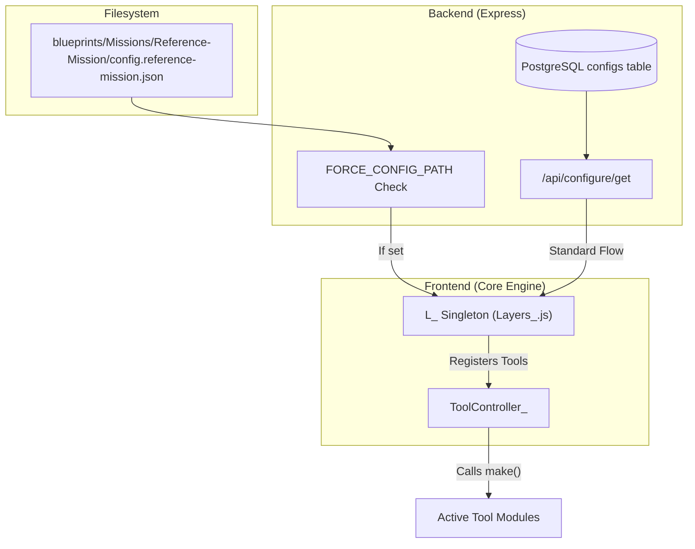
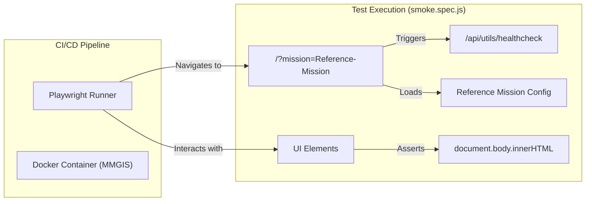

# Page: Reference Mission Demo

# Reference Mission Demo

Relevant source files

The following files were used as context for generating this wiki page:

- [.nvmrc](.nvmrc)
- [CITATION.cff](CITATION.cff)
- [README.md](README.md)
- [blueprints/Missions/Reference-Mission/Layers/Vectors/hotline-gradient-3d.geojson](blueprints/Missions/Reference-Mission/Layers/Vectors/hotline-gradient-3d.geojson)
- [blueprints/Missions/Reference-Mission/config.reference-mission.json](blueprints/Missions/Reference-Mission/config.reference-mission.json)
- [docs/assets/images/NASA-AMMOS-MMGIS-frame0.png](docs/assets/images/NASA-AMMOS-MMGIS-frame0.png)
- [docs/assets/images/divider.png](docs/assets/images/divider.png)
- [docs/pages/Overview/Overview.md](docs/pages/Overview/Overview.md)
- [docs/pages/Setup/Installation/Installation.md](docs/pages/Setup/Installation/Installation.md)
- [playwright.config.js](playwright.config.js)
- [specs/001-authentication-and-user-management/plan.md](specs/001-authentication-and-user-management/plan.md)
- [src/essence/Basics/Globe_/GlobeRenderer.js](src/essence/Basics/Globe_/GlobeRenderer.js)
- [src/essence/Basics/Layers_/LayerConstructors.js](src/essence/Basics/Layers_/LayerConstructors.js)
- [src/essence/Basics/Layers_/gradientUtils.js](src/essence/Basics/Layers_/gradientUtils.js)
- [src/essence/Tools/Viewshed/config.json](src/essence/Tools/Viewshed/config.json)
- [tests/e2e/api/users.spec.js](tests/e2e/api/users.spec.js)
- [tests/e2e/api/utils.spec.js](tests/e2e/api/utils.spec.js)
- [tests/e2e/reference-mission.spec.js](tests/e2e/reference-mission.spec.js)
- [tests/e2e/smoke.spec.js](tests/e2e/smoke.spec.js)
- [tests/e2e/tools/chemistry.spec.js](tests/e2e/tools/chemistry.spec.js)
- [tests/unit/gradientPolyline.spec.js](tests/unit/gradientPolyline.spec.js)

The Reference Mission Demo is a pre-configured, comprehensive blueprint located in `blueprints/Missions/Reference-Mission` that serves as the primary showcase for MMGIS capabilities and the target for automated end-to-end (E2E) testing. It provides a "gold standard" configuration including diverse layer types, tool setups, and complex coordinate systems.

### Purpose and Scope
*   **Feature Showcase**: Demonstrates all 10 supported layer types (Vector, Tile, Image, Model, Vectortile, Velocity, Video, Data, Header, and Query) [README.md:60-60]().
*   **E2E Test Target**: Acts as the primary environment for Playwright integration tests to ensure regression-free updates [playwright.config.js:65-70]().
*   **Developer Template**: Provides a reference for `config.json` structures, tool variables, and coordinate system setups.

---

### Data Catalog and Layer Types
The Reference Mission includes a catalog designed to test the limits of the `L_` state management and the dual-renderer (`Map_`/`Globe_`) synchronization [README.md:53-53](). It specifically utilizes `cesium` as the `globeRenderer` in its configuration [blueprints/Missions/Reference-Mission/config.reference-mission.json:97-97]().

| Layer Category | Implementation Detail | Code Entity |
| :--- | :--- | :--- |
| **Vector** | GeoJSON features with property-based styling and legends. | `constructVectorLayer` [src/essence/Basics/Layers_/LayerConstructors.js:43-43]() |
| **Tile/Raster** | Standard XYZ and custom projection tiles. | `L.tileLayer` |
| **3D Models** | GLTF/OBJ assets positioned via per-feature metadata. | `GlobeRenderer` [src/essence/Basics/Globe_/GlobeRenderer.js:20-20]() |
| **Cloud-Optimized GeoTIFF (COG)** | Served via TiTiler integration for dynamic band math. | `TiTiler-pgSTAC` [README.md:63-64]() |
| **Vectortile** | Mapbox Vector Tiles (MVT) generated from PostGIS. | `api:vectortile` [README.md:62-62]() |
| **Velocity** | Animated flow fields (e.g., wind/currents). | `VelocityLayer` [README.md:60-60]() |

#### Advanced Vector Symbology
The demo includes a `hotline-gradient-3d.geojson` file that showcases the `ExtendedGeoJSON` capabilities, including `coord_properties` like elevation, speed, and roll for complex 3D visualizations [blueprints/Missions/Reference-Mission/Layers/Vectors/hotline-gradient-3d.geojson:3-3]().

**Sources:** [README.md:51-67](), [docs/pages/Overview/Overview.md:16-31](), [src/essence/Basics/Layers_/LayerConstructors.js:1-100]()

---

### Configured Tools
The demo activates core tools, demonstrating the MMGIS plugin architecture where tools are initialized via `make()` and cleaned up via `destroy()`.

#### Key Tool Configurations in Demo:
1.  **Draw Tool**: Collaborative vector drawing with real-time WebSocket sync [README.md:74-74]().
2.  **Measure Tool**: 2D/3D distance and elevation profiling using the `Formulae_` library [README.md:81-81]().
3.  **Shade Tool**: SPICE-based solar illumination calculations [README.md:83-83]().
4.  **TimeControl**: Temporal data visualization with support for `startTime` and `endTime` properties [blueprints/Missions/Reference-Mission/config.reference-mission.json:174-180]().
5.  **Viewshed**: Line-of-sight analysis using terrain height data [README.md:86-86]().

**Sources:** [README.md:69-87](), [docs/pages/Overview/Overview.md:24-31](), [blueprints/Missions/Reference-Mission/config.reference-mission.json:70-82]()

---

### Deployment and Workflow
The Reference Mission can be launched using specific environment patterns to bypass standard database configuration during development or testing.

#### Launch Pattern: `FORCE_CONFIG_PATH`
Developers can force MMGIS to load the Reference Mission by setting the `FORCE_CONFIG_PATH` environment variable in the `.env` file, pointing directly to the blueprint's `config.json`. This bypasses the standard database lookup, ensuring a consistent state for testing.

#### Load/Save to Template
The Configure UI allows administrators to export existing mission configurations as templates.
1.  **Save**: Serializes the current `configs` table entry for a mission into a JSON file.
2.  **Load**: Imports a template (like the Reference Mission) into a new mission entry. Users are prompted to enter a mission name, such as "Test" (case-sensitive), to initialize the sample mission [docs/pages/Setup/Installation/Installation.md:79-82]().

#### Data Flow: Mission Initialization
The following diagram illustrates how the Reference Mission is loaded into the system state.

**Mission Configuration Flow**

**Sources:** [docs/pages/Setup/Installation/Installation.md:71-85](), [blueprints/Missions/Reference-Mission/config.reference-mission.json:1-101]()

---

### Automated Testing (Playwright)
The Reference Mission is the primary environment for the Playwright E2E suite. The `globalSetup` script handles the lifecycle: creating the database, starting the server, and ensuring the Reference Mission exists [playwright.config.js:65-70]().

**Testing Architecture**

**Sources:** [playwright.config.js:38-50](), [tests/e2e/smoke.spec.js:10-33]()

### Implementation Details
*   **Terrain Provider**: The demo uses `cesium` with a terrain provider, often utilizing Mapzen Terrarium tiles downscaled for performance [src/essence/Basics/Globe_/GlobeRenderer.js:193-205]().
*   **Coordinate Systems**: The demo configures custom projections, such as `EPSG:3857` (Web Mercator) for the demo site, and supports planetary coordinate systems [blueprints/Missions/Reference-Mission/config.reference-mission.json:18-22]().
*   **Gradient Utilities**: Vector layers in the demo use `gradientUtils.js` for interpolating colors along paths, which is tested in the `gradientPolyline.spec.js` unit tests [src/essence/Basics/Layers_/gradientUtils.js:27-32](), [tests/unit/gradientPolyline.spec.js:53-57]().

**Sources:** [src/essence/Basics/Globe_/GlobeRenderer.js:20-35](), [blueprints/Missions/Reference-Mission/config.reference-mission.json:37-63](), [tests/unit/gradientPolyline.spec.js:1-15]()
