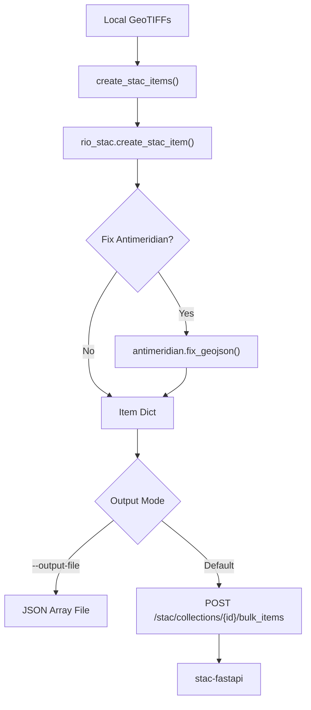
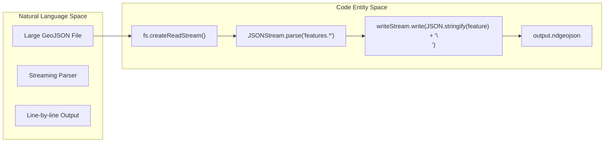
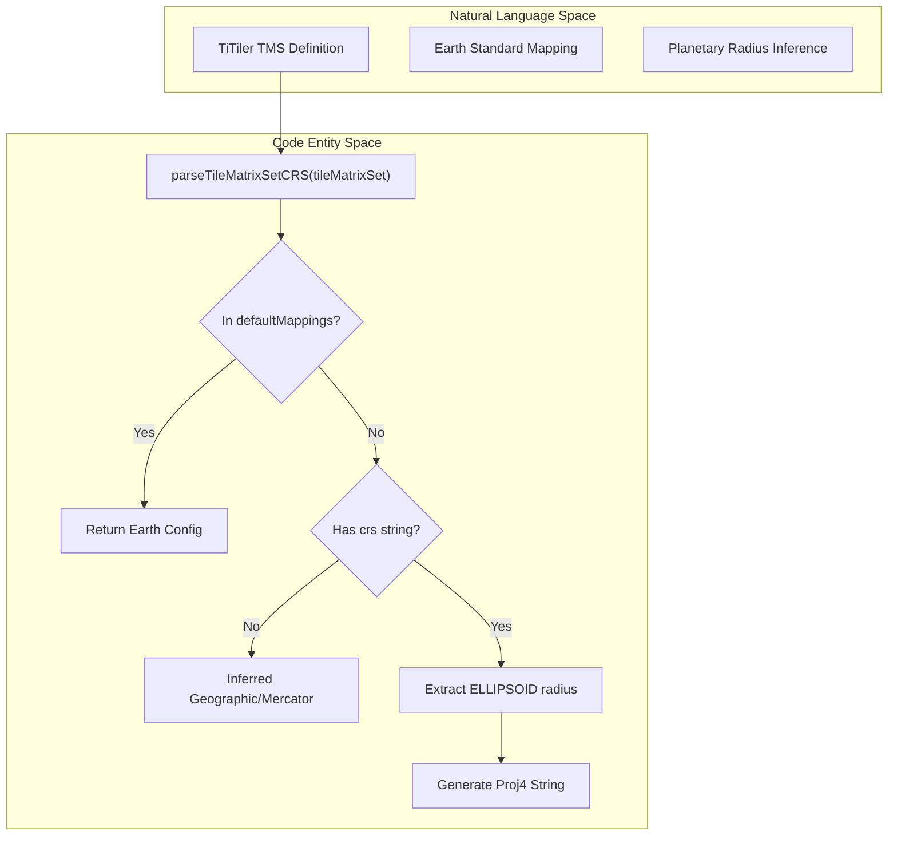

# Page: STAC & COG Data Preparation

# STAC & COG Data Preparation

Relevant source files

The following files were used as context for generating this wiki page:

- [adjacent-servers/resources/tilematrixsets/planetcantile_v4/EarthSeaIceNorthPolarGIBSOgraphic.json](adjacent-servers/resources/tilematrixsets/planetcantile_v4/EarthSeaIceNorthPolarGIBSOgraphic.json)
- [auxiliary/geojson2ndgeojson/README.md](auxiliary/geojson2ndgeojson/README.md)
- [auxiliary/geojson2ndgeojson/geojson2ndgeojson.js](auxiliary/geojson2ndgeojson/geojson2ndgeojson.js)
- [auxiliary/geojson2ndgeojson/test.geojson](auxiliary/geojson2ndgeojson/test.geojson)
- [auxiliary/stac/create-stac-items/create-stac-items.py](auxiliary/stac/create-stac-items/create-stac-items.py)
- [auxiliary/stac/create-stac-items/create-stac-items2.py](auxiliary/stac/create-stac-items/create-stac-items2.py)
- [configure/src/core/crsUtils.js](configure/src/core/crsUtils.js)

This page documents the auxiliary scripts and utilities used to prepare geospatial data for ingestion into MMGIS. These tools focus on converting standard GeoTIFFs into Cloud Optimized GeoTIFFs (COGs), bulk-creating SpatioTemporal Asset Catalog (STAC) items, and formatting large GeoJSON files for efficient streaming.

## STAC Item Creation

The `create-stac-items.py` script is a Python utility designed to automate the generation of STAC metadata from GeoTIFF files and ingest them into the MMGIS STAC service (`stac-fastapi`).

### Implementation Details
The script uses `rio-stac` to extract spatial and spectral metadata directly from raster headers [auxiliary/stac/create-stac-items/create-stac-items.py:11](). It supports two primary workflows:
1. **Direct API Ingestion**: POSTing items directly to the MMGIS STAC API using a bearer token [auxiliary/stac/create-stac-items/create-stac-items.py:141-156]().
2. **File Generation**: Saving items to a JSON array for manual import via the MMGIS Configure UI [auxiliary/stac/create-stac-items/create-stac-items.py:121-139]().

### Key Features
- **Path Mapping**: The `--path_remove` and `--path_replace_with` arguments allow developers to adjust the `asset_href` if the file's location on the processing machine differs from its final location accessible by the TiTiler server [auxiliary/stac/create-stac-items/create-stac-items.py:29-30]().
- **Antimeridian Handling**: Integration with the `antimeridian` package to fix geometries that cross the ±180° longitude line. It splits them into `MultiPolygon` objects and recalculates the bounding box using the `[western_lon, min_lat, eastern_lon, max_lat]` convention where `western_lon > eastern_lon` [auxiliary/stac/create-stac-items/create-stac-items2.py:15-20](), [auxiliary/stac/create-stac-items/create-stac-items2.py:129-142]().
- **Temporal Metadata**: Extracts timestamps from filenames using a user-provided format string via `--time_from_fn` [auxiliary/stac/create-stac-items/create-stac-items.py:74-75]().

### Data Flow: Raster to STAC
The following diagram illustrates how the script transforms local file system data into STAC entities.

**STAC Ingestion Pipeline**

Sources: [auxiliary/stac/create-stac-items/create-stac-items.py:40-156]()

## Newline Delimited GeoJSON (ndgeojson)

For very large vector datasets (500MB+), standard GeoJSON parsing can exceed memory limits during upload or ingestion. The `geojson2ndgeojson.js` utility converts standard GeoJSON `FeatureCollections` into Newline Delimited GeoJSON [auxiliary/geojson2ndgeojson/README.md:5-8]().

### Implementation
The utility uses `JSONStream` to pipe data, ensuring that the entire file is never loaded into memory at once [auxiliary/geojson2ndgeojson/geojson2ndgeojson.js:7-22]().

- **Parser**: Uses `JSONStream.parse("features.*")` to emit individual feature objects from the GeoJSON array [auxiliary/geojson2ndgeojson/geojson2ndgeojson.js:22]().
- **Output**: Each feature is stringified and appended with a newline character (`\n`) to the `.ndgeojson` output file [auxiliary/geojson2ndgeojson/geojson2ndgeojson.js:28-30]().

**Vector Transformation Logic**

Sources: [auxiliary/geojson2ndgeojson/geojson2ndgeojson.js:19-35](), [auxiliary/geojson2ndgeojson/README.md:42-43]()

## Coordinate Reference Systems (CRS)

When preparing data for planetary bodies or custom projections, MMGIS relies on `crsUtils.js` to map TiTiler `TileMatrixSet` (TMS) responses to internal projection configurations.

### Supported Projections
The system includes hardcoded mappings for common Earth-based systems and dynamic inference for planetary bodies:
- **Standard Earth**: `WebMercatorQuad` (EPSG:3857), `WGS1984Quad` (EPSG:4326), `UPSArcticWGS84Quad` (EPSG:5041), and `EarthSeaIceNorthPolarGIBSOgraphic` (EPSG:3413) [configure/src/core/crsUtils.js:16-64]().
- **Planetary Inference**: If a CRS is missing, the system attempts to parse the `ELLIPSOID` radius and projection type (e.g., "Stereographic", "Mercator", "Equidistant Cylindrical") from the TMS ID to generate a `proj4` string [configure/src/core/crsUtils.js:131-168]().

### CRS Utility Functions
| Function | Purpose |
| :--- | :--- |
| `parseTileMatrixSetCRS` | Extracts EPSG codes, Proj4 strings, bounds, and planet radius from a TiTiler TMS object [configure/src/core/crsUtils.js:9-128](). |

**CRS Resolution Pipeline**

Sources: [configure/src/core/crsUtils.js:9-172](), [adjacent-servers/resources/tilematrixsets/planetcantile_v4/EarthSeaIceNorthPolarGIBSOgraphic.json:1-4]()

## Summary of Preparation Scripts

| Script | Language | Primary Dependency | Use Case |
| :--- | :--- | :--- | :--- |
| `create-stac-items.py` | Python | `rio-stac`, `antimeridian` | Bulk registering COGs into STAC collections [auxiliary/stac/create-stac-items/create-stac-items.py:1-13](). |
| `geojson2ndgeojson.js` | Node.js | `JSONStream` | Preparing massive vector files for stream-uploading [auxiliary/geojson2ndgeojson/geojson2ndgeojson.js:1-7](). |
| `tifs2cogs.py` | Python | `GDAL` | Converting standard GeoTIFFs to Cloud Optimized format (tiling/overviews). |

Sources: [auxiliary/stac/create-stac-items/create-stac-items.py:1-13](), [auxiliary/geojson2ndgeojson/geojson2ndgeojson.js:1-7](), [auxiliary/geojson2ndgeojson/README.md:1-59]()
