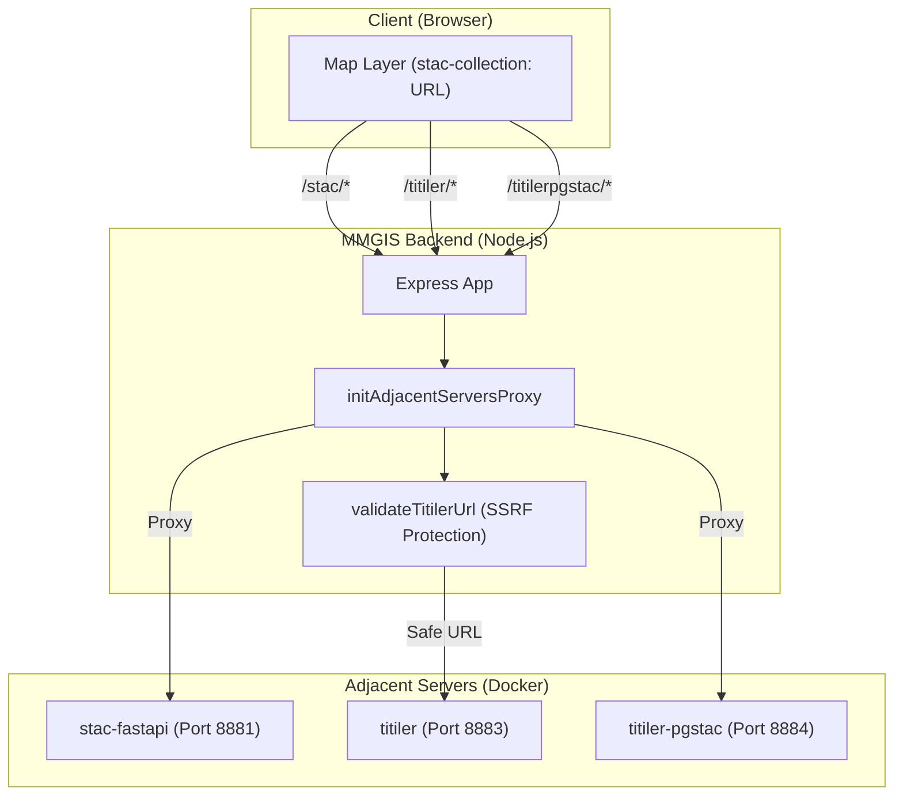
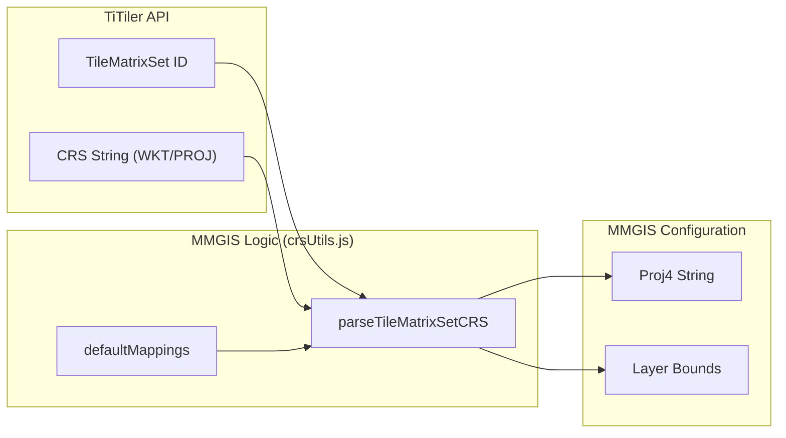
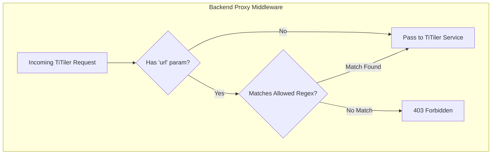

# Page: STAC & TiTiler Integration

# STAC & TiTiler Integration

Relevant source files

The following files were used as context for generating this wiki page:

- [API/Backend/Stac/routes/stac.js](API/Backend/Stac/routes/stac.js)
- [adjacent-servers/resources/tilematrixsets/planetcantile_v4/EarthSeaIceNorthPolarGIBSOgraphic.json](adjacent-servers/resources/tilematrixsets/planetcantile_v4/EarthSeaIceNorthPolarGIBSOgraphic.json)
- [auxiliary/stac/create-stac-items/create-stac-items.py](auxiliary/stac/create-stac-items/create-stac-items.py)
- [auxiliary/stac/create-stac-items/create-stac-items2.py](auxiliary/stac/create-stac-items/create-stac-items2.py)
- [configure/src/core/ConfigureStore.js](configure/src/core/ConfigureStore.js)
- [configure/src/core/calls.js](configure/src/core/calls.js)
- [configure/src/core/crsUtils.js](configure/src/core/crsUtils.js)
- [configure/src/pages/STAC/Modals/EditStacCollectionModal/EditStacCollectionModal.js](configure/src/pages/STAC/Modals/EditStacCollectionModal/EditStacCollectionModal.js)
- [configure/src/pages/STAC/Modals/EditStacCollectionModal/editStacCollectionConfig.js](configure/src/pages/STAC/Modals/EditStacCollectionModal/editStacCollectionConfig.js)
- [configure/src/pages/STAC/Modals/ImportStacItemsModal/ImportStacItemsModal.js](configure/src/pages/STAC/Modals/ImportStacItemsModal/ImportStacItemsModal.js)
- [configure/src/pages/STAC/Modals/NewStacCollectionModal/NewStacCollectionModal.js](configure/src/pages/STAC/Modals/NewStacCollectionModal/NewStacCollectionModal.js)
- [configure/src/pages/STAC/Modals/StacCollectionItemsModal/StacCollectionItemsModal.js](configure/src/pages/STAC/Modals/StacCollectionItemsModal/StacCollectionItemsModal.js)
- [configure/src/pages/STAC/Modals/StacCollectionItemsModal/components/BulkDeleteModal.js](configure/src/pages/STAC/Modals/StacCollectionItemsModal/components/BulkDeleteModal.js)
- [configure/src/pages/STAC/Modals/StacCollectionItemsModal/components/DeleteItemModal.js](configure/src/pages/STAC/Modals/StacCollectionItemsModal/components/DeleteItemModal.js)
- [configure/src/pages/STAC/Modals/StacCollectionItemsModal/components/ItemsTable.js](configure/src/pages/STAC/Modals/StacCollectionItemsModal/components/ItemsTable.js)
- [configure/src/pages/STAC/Modals/StacCollectionItemsModal/components/JsonViewModal.js](configure/src/pages/STAC/Modals/StacCollectionItemsModal/components/JsonViewModal.js)
- [configure/src/pages/STAC/Modals/StacCollectionItemsModal/components/SpatialFilterMap.js](configure/src/pages/STAC/Modals/StacCollectionItemsModal/components/SpatialFilterMap.js)
- [configure/src/pages/STAC/STAC.js](configure/src/pages/STAC/STAC.js)
- [tests/unit/stac-url-transformation.spec.js](tests/unit/stac-url-transformation.spec.js)

MMGIS leverages the **SpatioTemporal Asset Catalog (STAC)** specification and **TiTiler** to provide a dynamic, scalable raster data pipeline. This integration allows for on-the-fly tile rendering, band math, and mosaicking without the need for pre-rendering static tile pyramids for every dataset.

## System Architecture

The STAC and TiTiler ecosystem in MMGIS is implemented through a series of "adjacent servers" proxied by the main Node.js backend.

### Adjacent Servers
MMGIS utilizes several specialized microservices, typically deployed via Docker:
*   **stac-fastapi**: Provides the STAC API for searching and managing collections and items.
*   **TiTiler**: A dynamic tile server used for Cloud Optimized GeoTIFFs (COGs).
*   **TiTiler-pgSTAC**: Specialized TiTiler version for rendering mosaics directly from STAC search queries stored in PostgreSQL.
*   **Tipg**: Provides an OGC Features API for vector data stored in the STAC database.

### Data Flow: Code Entity Mapping
The following diagram illustrates how a client request for a STAC-based tile flows through the MMGIS proxy system to the specialized adjacent servers.

"Request Flow to Adjacent Servers"

Sources: `[API/Backend/Stac/routes/stac.js:15-28]()`, `[configure/src/core/calls.js:101-132]()`

---

## STAC Collection Management

The Configure UI provides a dedicated interface for managing STAC metadata. The state is managed via the `ConfigureStore` Redux slice [configure/src/core/ConfigureStore.js:19]().

### Configure UI Operations
In the `STAC` page of the Configure CMS [configure/src/pages/STAC/STAC.js:89](), administrators can perform the following:
1.  **Create Collections**: Define new STAC collections via `NewStacCollectionModal` [configure/src/pages/STAC/STAC.js:48]().
2.  **Edit Collections**: Modify metadata, extents, and providers using `EditStacCollectionModal` [configure/src/pages/STAC/Modals/EditStacCollectionModal/EditStacCollectionModal.js:115](). Configuration for this modal is defined in `editStacCollectionConfig.js` [configure/src/pages/STAC/Modals/EditStacCollectionModal/editStacCollectionConfig.js:1-66]().
3.  **Manage Items**: View, search, and delete individual items within a collection using `StacCollectionItemsModal` [configure/src/pages/STAC/STAC.js:51](). This modal includes a `SpatialFilterMap` to visualize item extents and filter by bounding box [configure/src/pages/STAC/Modals/StacCollectionItemsModal/components/SpatialFilterMap.js:112]().
4.  **Import/Export**: Bulk import items via JSON files or export collection metadata with all items [configure/src/pages/STAC/STAC.js:40-41](). The export endpoint `api/stac/collections/:collection/export` aggregates collection data and paginated items [API/Backend/Stac/routes/stac.js:111-179]().

### Item Ingestion
STAC items are typically created from COGs using the `create-stac-items.py` script.
*   **Metadata Extraction**: Uses `rio_stac` to extract metadata from GeoTIFF headers [auxiliary/stac/create-stac-items/create-stac-items.py:11]().
*   **Path Mapping**: Supports `path_remove` and `path_replace_with` to adjust file paths so they match the internal environment accessible by TiTiler [auxiliary/stac/create-stac-items/create-stac-items.py:67-72]().
*   **Antimeridian Handling**: Fixes geometries crossing the ±180° longitude line using the `antimeridian` package [auxiliary/stac/create-stac-items/create-stac-items.py:15-20](). It specifically handles `MultiPolygon` recalculation for bounding boxes, ensuring they span across the antimeridian correctly [auxiliary/stac/create-stac-items/create-stac-items2.py:101-145]().

Sources: `[configure/src/pages/STAC/STAC.js:1-215]()`, `[auxiliary/stac/create-stac-items/create-stac-items.py:40-156]()`, `[API/Backend/Stac/routes/stac.js:15-108]()`, `[configure/src/pages/STAC/Modals/EditStacCollectionModal/editStacCollectionConfig.js:1-66]()`

---

## TiTiler Integration

MMGIS uses TiTiler to render COGs dynamically. This is primarily handled via the `stac-collection:` URL scheme in layer configurations.

### URL Transformation Logic
The frontend transforms the `stac-collection:` scheme into a valid TiTiler-pgSTAC URL using `transformStacUrl`. This includes appending parameters for bands (`bidx`), resampling, and TileMatrixSets [tests/unit/stac-url-transformation.spec.js:25-103]().

| Parameter | Logic | Code Source |
| :--- | :--- | :--- |
| **Bands** | Appends `bidx` for each band in `cogBands` unless `cogExpression` is present. | [tests/unit/stac-url-transformation.spec.js:62-74]() |
| **Expression** | Passes `cogExpression` directly to TiTiler for on-the-fly band math. | [tests/unit/stac-url-transformation.spec.js:105-119]() |
| **Resampling** | Supports `bilinear`, `nearest`, etc., via `cogResampling`. | [tests/unit/stac-url-transformation.spec.js:76-88]() |
| **TMS** | Resolves `tileMatrixSet` to specific quad paths (e.g., `/tiles/WebMercatorQuad/{z}/{x}/{y}`). | [tests/unit/stac-url-transformation.spec.js:90-103]() |

### Dynamic Tile Serving
When a layer URL is configured as `stac-collection:<collection_id>`, MMGIS resolves this to the appropriate TiTiler or TiTiler-pgSTAC endpoint. The backend proxies these requests to the internal Docker services [API/Backend/Stac/routes/stac.js:21-23]().

| Feature | Endpoint | Description |
| :--- | :--- | :--- |
| **Single COG** | `/titiler/cog/tiles/...` | Renders tiles for a specific file. |
| **STAC Item** | `/titiler/stac/tiles/...` | Renders tiles for a specific STAC item. |
| **Mosaic** | `/titilerpgstac/mosaics/...` | Renders a seamless mosaic of multiple STAC items. |

### TileMatrixSets & Projections
MMGIS supports various projections via TiTiler's TileMatrixSet (TMS) endpoints [configure/src/core/calls.js:177-184](). The `parseTileMatrixSetCRS` utility maps TMS IDs (e.g., `EarthSeaIceNorthPolarGIBSOgraphic`) to Proj4 strings and bounds [configure/src/core/crsUtils.js:9-64]().

"TiTiler to MMGIS Projection Mapping"

Sources: `[configure/src/core/crsUtils.js:1-172]()`, `[configure/src/core/calls.js:177-188]()`, `[tests/unit/stac-url-transformation.spec.js:1-153]()`

---

## Security & SSRF Protection

Because TiTiler acts as a proxy that can fetch data from arbitrary URLs, MMGIS implements **Server-Side Request Forgery (SSRF)** protection.

### URL Validation
The backend validates `url` parameters against allowed patterns. This prevents TiTiler from being used to scan internal networks or access unauthorized external resources.
*   **Allowed Patterns**: Regex patterns define which domains or file paths TiTiler is permitted to hit.
*   **Default Protection**: Path traversal sequences (`..`) and null bytes are explicitly blocked to prevent local file inclusion attacks.

"SSRF Validation Logic"

Sources: `[configure/src/core/utils.js:43]()`

---

## Mosaicking via TiTiler-pgSTAC

For layers spanning large areas or multiple time-steps, MMGIS utilizes `titiler-pgstac`.

1.  **Search Registration**: MMGIS registers a STAC search query with the `pgstac` database.
2.  **Mosaic ID**: The database returns a unique `search_id`.
3.  **Tile Request**: MMGIS requests tiles from `/titilerpgstac/mosaics/{search_id}/tiles/...`.
4.  **On-the-fly Assembly**: TiTiler-pgSTAC queries the database for items intersecting the tile, fetches the relevant COG chunks, and composites them into a single tile.

### 32-Bit Raster Support
The `SpatialFilterMap` component includes logic to detect 32-bit float rasters within a collection by inspecting the `raster:bands` metadata of the first item [configure/src/pages/STAC/Modals/StacCollectionItemsModal/components/SpatialFilterMap.js:140-192](). This allows the UI to handle high-dynamic-range data and apply appropriate statistics-based scaling [configure/src/pages/STAC/Modals/StacCollectionItemsModal/components/SpatialFilterMap.js:180-185]().

Sources: `[configure/src/pages/STAC/Modals/StacCollectionItemsModal/components/SpatialFilterMap.js:135-195]()`, `[API/Backend/Stac/routes/stac.js:111-179]()`
