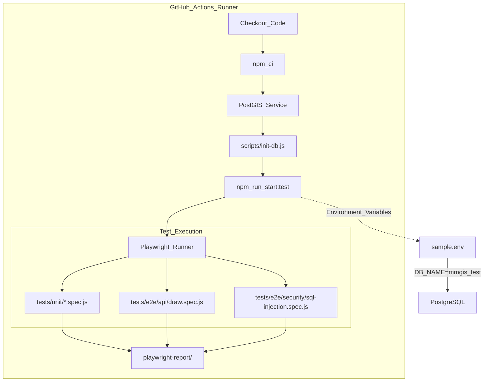
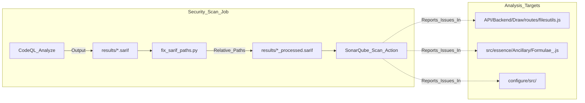

# Page: Testing & Security Scanning

# Testing & Security Scanning

Relevant source files

The following files were used as context for generating this wiki page:

- [.github/codeql/codeql-config.yml](.github/codeql/codeql-config.yml)
- [.github/scripts/fix_sarif_paths.py](.github/scripts/fix_sarif_paths.py)
- [.github/workflows/playwright-tests.yml](.github/workflows/playwright-tests.yml)
- [.github/workflows/secrets-detection.yaml](.github/workflows/secrets-detection.yaml)
- [.github/workflows/security-scan.yml](.github/workflows/security-scan.yml)
- [.secrets.baseline](.secrets.baseline)
- [API/Backend/Draw/routes/filesutils.js](API/Backend/Draw/routes/filesutils.js)
- [playwright.config.js](playwright.config.js)
- [sonar-project.properties](sonar-project.properties)
- [tests/README.md](tests/README.md)
- [tests/e2e/accessibility/basic-a11y.spec.js](tests/e2e/accessibility/basic-a11y.spec.js)
- [tests/e2e/accessibility/keyboard-navigation.spec.js](tests/e2e/accessibility/keyboard-navigation.spec.js)
- [tests/e2e/api/accounts.spec.js](tests/e2e/api/accounts.spec.js)
- [tests/e2e/api/adjacent-servers.spec.js](tests/e2e/api/adjacent-servers.spec.js)
- [tests/e2e/api/config.spec.js](tests/e2e/api/config.spec.js)
- [tests/e2e/api/draw-crud.spec.js](tests/e2e/api/draw-crud.spec.js)
- [tests/e2e/api/draw.spec.js](tests/e2e/api/draw.spec.js)
- [tests/e2e/api/users.spec.js](tests/e2e/api/users.spec.js)
- [tests/e2e/api/utils.spec.js](tests/e2e/api/utils.spec.js)
- [tests/e2e/reference-mission.spec.js](tests/e2e/reference-mission.spec.js)
- [tests/e2e/security/sql-injection.spec.js](tests/e2e/security/sql-injection.spec.js)
- [tests/e2e/smoke.spec.js](tests/e2e/smoke.spec.js)
- [tests/e2e/tools/chemistry.spec.js](tests/e2e/tools/chemistry.spec.js)

MMGIS employs a multi-layered testing and security strategy to ensure the reliability of its geospatial calculations and the safety of its web-based mission operations. This includes automated unit testing for core mathematical libraries, end-to-end (E2E) smoke tests for UI stability, and a robust security scanning pipeline integrating CodeQL, SonarQube, and secret detection.

## Playwright Test Suite

The MMGIS testing framework is built on **Playwright**, providing a unified runner for both headless unit tests and browser-based integration tests [playwright.config.js:7-12]().

### Unit Testing (Formulae_ & Utils)
Unit tests focus on the logic-heavy components of the system that do not require a full browser DOM or database connection. A primary target is the `Formulae_` library, which handles critical planetary calculations like Haversine distances, bearings, and unit conversions. Additionally, unit tests validate complex URL transformation logic, such as converting `stac-collection:` URI schemes into TiTiler-PgSTAC endpoints.

### E2E & API Integration Tests
End-to-end tests verify the full application stack. The suite includes:
1.  **Smoke Tests**: Verifies the application loads successfully, main containers are present, and stylesheets load without error [tests/e2e/smoke.spec.js:10-70]().
2.  **Draw API CRUD**: Exercises the full lifecycle of a vector feature, including `POST /api/files/make`, `POST /api/draw/add`, `POST /api/draw/edit`, and `POST /api/draw/remove` [tests/e2e/api/draw-crud.spec.js:28-174]().
3.  **SQL Injection Protection**: Specifically targets endpoints like `/api/files/getfile` and `/api/geodatasets/search` with malicious payloads to ensure the backend sanitizes input [tests/e2e/security/sql-injection.spec.js:9-145]().
4.  **Temporal & Property Filtering**: Exercises the `timeProp` and `filters` parameters in the Draw API to ensure complex query logic does not trigger server crashes or SQL errors [tests/e2e/api/draw.spec.js:36-193]().

### Reference Mission Integration
The suite runs against the **Reference-Mission** blueprint to validate real-world configurations. It checks for the presence of configured tools and verifies that basemap layers are correctly initialized in the `L_.layers.data` state. Tests ensure that the application can handle missions with varied layer types including COGs and 3D models.

### Test Environment Lifecycle
MMGIS uses GitHub Actions to orchestrate the test lifecycle. The server is started in `test` mode, which mirrors standard API behavior but utilizes a dedicated test database [playwright.config.js:66-70]().

**CI Pipeline to Code Entity Space**

Sources: [.github/workflows/playwright-tests.yml:9-67](), [playwright.config.js:7-70](), [tests/e2e/smoke.spec.js:8-71]()

---

## Security Scanning Pipeline

MMGIS integrates static analysis security testing (SAST) into its development workflow to detect vulnerabilities like SQL injection, Cross-Site Scripting (XSS), and Server-Side Request Forgery (SSRF).

### SQL Injection Mitigation
The backend implements safe lookup maps to break taint analysis chains for operations and SQL operators [API/Backend/Draw/routes/filesutils.js:13-14](). It also enforces strict numeric validation on file IDs to prevent string-based injections [API/Backend/Draw/routes/filesutils.js:108-135]().

### CodeQL Integration
GitHub's CodeQL engine performs deep semantic analysis using the `security-extended` query suite [.github/codeql/codeql-config.yml:7-9](). Specific paths like `node_modules/` and `Missions/` are ignored to reduce noise [.github/codeql/codeql-config.yml:12-32]().

### SonarQube & SonarCloud
SonarQube is used for code quality and security hotspot tracking. The project is configured via `sonar-project.properties` [sonar-project.properties:1-4]().

**Key Configuration Parameters:**
| Property | Value / Purpose |
| :--- | :--- |
| `sonar.sources` | `src, API, scripts, views, configure` [sonar-project.properties:19]() |
| `sonar.exclusions` | Excludes `public/` and `auxiliary/` to optimize LOC limits [sonar-project.properties:24-53]() |
| `sonar.javascript.file.suffixes` | `.js, .jsx` [sonar-project.properties:91]() |
| `sonar.leak.period` | 30 days (defines "New Code") [sonar-project.properties:102]() |

### SARIF Path-Fixing Script
To map absolute file paths from the GitHub runner to relative paths in SonarQube, MMGIS uses a custom Python utility `fix_sarif_paths.py`. This script iterates through `artifactLocation` and `physicalLocation` entries in SARIF files, stripping the workspace path to allow SonarQube to correctly attribute issues to source files [.github/scripts/fix_sarif_paths.py:11-55]().

**Security Scanning Data Flow**

Sources: [.github/workflows/security-scan.yml:26-71](), [API/Backend/Draw/routes/filesutils.js:12-14](), [sonar-project.properties:107-157](), [.github/scripts/fix_sarif_paths.py:1-77]()

### Secret Detection
MMGIS uses `detect-secrets` to prevent sensitive information from being committed.
*   **Baseline**: A `.secrets.baseline` file stores known/ignored hashes [.secrets.baseline:1-209]().
*   **Workflow**: The `Secret Detection Workflow` runs on every push/PR to `development` [.github/workflows/secrets-detection.yaml:1-8]().
*   **Comparison**: The workflow uses `jq` to compare new secrets against the baseline by extracting keys and hashed secrets [.github/workflows/secrets-detection.yaml:54](). If any difference is found, the build is blocked with instructions for local remediation [.github/workflows/secrets-detection.yaml:57-69]().

Sources:
* `API/Backend/Draw/routes/filesutils.js`
* `.github/workflows/security-scan.yml`
* `.github/workflows/secrets-detection.yaml`
* `.github/codeql/codeql-config.yml`
* `sonar-project.properties`
* `.secrets.baseline`
* `playwright.config.js`
* `tests/e2e/api/draw.spec.js`
* `tests/e2e/security/sql-injection.spec.js`
* `.github/scripts/fix_sarif_paths.py`
* `tests/e2e/smoke.spec.js`
* `tests/e2e/api/draw-crud.spec.js`
