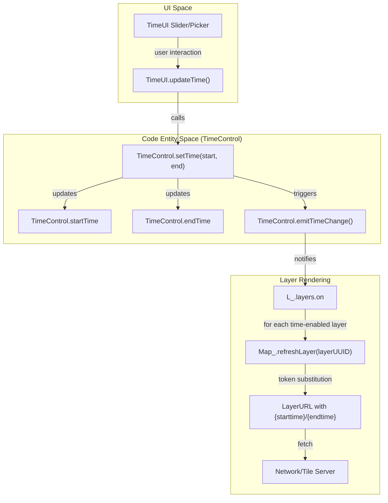
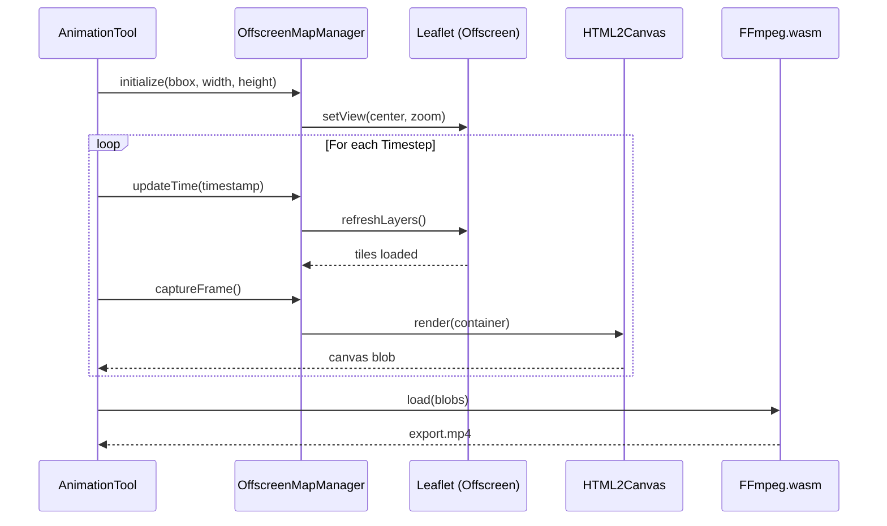

# Page: Time Control System

# Time Control System

Relevant source files

The following files were used as context for generating this wiki page:

- [docs/pages/Configure/Formats/Layer_URLs/Layer_URLs.md](docs/pages/Configure/Formats/Layer_URLs/Layer_URLs.md)
- [docs/pages/Configure/Projections/planetcantile.md](docs/pages/Configure/Projections/planetcantile.md)
- [docs/pages/DataProcessing/Raster/Rasters.md](docs/pages/DataProcessing/Raster/Rasters.md)
- [docs/pages/Tools/Animation/Animation.md](docs/pages/Tools/Animation/Animation.md)
- [public/ffmpeg/ffmpeg-core.js](public/ffmpeg/ffmpeg-core.js)
- [public/ffmpeg/ffmpeg-core.wasm](public/ffmpeg/ffmpeg-core.wasm)
- [src/essence/Basics/Layers_/LayerUtils.js](src/essence/Basics/Layers_/LayerUtils.js)
- [src/essence/Basics/TimeControl_/TimeUI.js](src/essence/Basics/TimeControl_/TimeUI.js)
- [src/essence/Tools/Animation/AnimationTool.css](src/essence/Tools/Animation/AnimationTool.css)
- [src/essence/Tools/Animation/AnimationTool.js](src/essence/Tools/Animation/AnimationTool.js)
- [src/essence/Tools/Animation/OffscreenMapManager.js](src/essence/Tools/Animation/OffscreenMapManager.js)
- [src/essence/Tools/Animation/config.json](src/essence/Tools/Animation/config.json)

The MMGIS Time Control System provides a global temporal context for the application, allowing users to filter and visualize time-enabled datasets across 2D maps and 3D globes. It consists of a centralized state manager (`TimeControl`), a synchronized UI slider (`TimeUI`), and a set of conventions for dynamic URL substitution and server-side directory structures.

## System Architecture

The time system follows a publisher-subscriber pattern where the `TimeControl` module maintains the global start and end timestamps. When these timestamps change, it notifies all active time-enabled layers to refresh their data using the new temporal parameters.

### Component Overview

| Component | File Path | Role |
| :--- | :--- | :--- |
| **TimeControl** | [src/essence/Basics/TimeControl_/TimeControl.js]() | Core logic, state management, and event dispatching. |
| **TimeUI** | [src/essence/Basics/TimeControl_/TimeUI.js]() | The visual slider and date-picker interface at the bottom of the UI. |
| **AnimationTool** | [src/essence/Tools/Animation/AnimationTool.js]() | High-level tool for generating time-lapse sequences and managing export formats. |
| **OffscreenMapManager** | [src/essence/Tools/Animation/OffscreenMapManager.js]() | Manages a hidden Leaflet instance for non-blocking animation exports. |
| **LayerUtils** | [src/essence/Basics/Layers_/LayerUtils.js]() | Handles STAC URL transformations and TiTiler parameter building. |

### Data Flow Diagram

The following diagram illustrates how a time change in the UI propagates through the system to update map layers.

**Time Update Propagation**

Sources: [src/essence/Basics/TimeControl_/TimeUI.js:90-91](), [src/essence/Basics/TimeControl_/TimeUI.js:47-48](), [src/essence/Basics/TimeControl_/TimeControl.js]()

---

## TimeUI and Slider

The `TimeUI` is a specialized component located at the bottom of the MMGIS interface. It provides two modes of operation: **Range** (selecting a start and end window) and **Point** (selecting a single instant) [src/essence/Basics/TimeControl_/TimeUI.js:82-83]().

### Key Features
*   **Tempus Dominus Integration**: Uses `TempusDominus` for precise calendar and clock selection [src/essence/Basics/TimeControl_/TimeUI.js:17-18]().
*   **Timeline Slider**: A visual representation of the current window within the total available temporal extent [src/essence/Basics/TimeControl_/TimeUI.js:140-148]().
*   **Follow Feature**: Synchronizes the time window to the properties of a specific selected feature (e.g., a rover's position at a specific time) [src/essence/Basics/TimeControl_/TimeUI.js:87-88]().
*   **Present Mode**: A "Live" mode that keeps the end time pinned to `now`, updating at a configurable interval [src/essence/Basics/TimeControl_/TimeUI.js:177-180]().
*   **Interval Values**: Supports various playback speeds and step intervals ranging from 0.1 seconds to 20 seconds for the UI refresh rate [src/essence/Basics/TimeControl_/TimeUI.js:66-80]().

Sources: [src/essence/Basics/TimeControl_/TimeUI.js:35-88](), [src/essence/Basics/TimeControl_/TimeUI.js:105-121]()

---

## Time-Enabled Layers & Token Substitution

Layers become "time-enabled" when the `time.enabled` property is set to `true` in the layer configuration. MMGIS automatically performs string substitution on the layer's URL before fetching data.

### URL Tokens
| Token | Description |
| :--- | :--- |
| `{starttime}` | Replaced with the global start time, formatted according to the layer's `timeFormat`. |
| `{endtime}` | Replaced with the global end time. |
| `{t}` | Specifically used for **Time Tiles**; refers to a directory named after the timestamp. |

### Implementation & STAC Integration
The `LayerUtils` module provides the logic for building time-aware URLs for modern cloud-native formats:
*   **STAC Integration**: The `transformStacUrl` utility builds TiTiler-compatible `datetime` parameters for layers using the `stac-collection:` prefix [src/essence/Basics/Layers_/LayerUtils.js:84-170]().
*   **External STAC**: Supports referencing external MMGIS STAC collections by parsing the full URL after the `stac-collection:` prefix. The external base URL must end with `/titilerpgstac` [src/essence/Basics/Layers_/LayerUtils.js:19-62]().
*   **Bands and Resampling**: Automatically appends `bidx` for COG bands and `resampling` parameters to STAC/TiTiler URLs [src/essence/Basics/Layers_/LayerUtils.js:121-139]().
*   **Planetcantile Support**: Integration with `planetcantile` allows time-enabled layers to function correctly across different planetary bodies (Mars, Moon, etc.) by specifying a `TileMatrixSet` [docs/pages/Configure/Projections/planetcantile.md:61-80]().

Sources: [src/essence/Basics/Layers_/LayerUtils.js:84-170](), [docs/pages/Configure/Formats/Layer_URLs/Layer_URLs.md:44-62](), [docs/pages/Configure/Projections/planetcantile.md:11-33]()

---

## Animation Tool & Offscreen Rendering

The Animation Tool allows users to export time-lapse sequences as GIF, MP4, or PNG sequences [src/essence/Tools/Animation/config.json:14-45](). To prevent the export process from locking the UI or being affected by user panning/zooming, MMGIS utilizes an `OffscreenMapManager`.

### OffscreenMapManager Implementation
This class manages a "Shadow" Leaflet instance that exists only in memory or is positioned far off-screen [src/essence/Tools/Animation/OffscreenMapManager.js:8-14]().

**Key Functions:**
*   `_createContainer(width, height)`: Creates a DOM element at `left: -10000px` to host the hidden map [src/essence/Tools/Animation/OffscreenMapManager.js:128-157]().
*   `_initializeLeafletMap()`: Clones the main map's CRS and projection settings to ensure visual consistency. It disables all interactions (dragging, zooming, etc.) to optimize for rendering [src/essence/Tools/Animation/OffscreenMapManager.js:179-200]().
*   **Shadow Registry**: Maintains an independent `layers` object (data, on, opacity, filters, etc.) to avoid side effects on the global `L_` state [src/essence/Tools/Animation/OffscreenMapManager.js:59-71]().

### Animation Export Pipeline
The `AnimationTool` uses `html2canvas` for frame capture, `gifshot` for GIF creation, and `ffmpeg.wasm` for MP4 encoding [src/essence/Tools/Animation/AnimationTool.js:12-16]().

**Animation Frame Generation**

### Technical Details
*   **MP4 Encoding**: Uses H.264 codec with `yuv420p` pixel format and `faststart` flag for web optimization [docs/pages/Tools/Animation/Animation.md:112-118]().
*   **Layer Refresh Rate**: Configurable delay (0.1s - 60s) to wait for tiles/data to load before capturing each frame [docs/pages/Tools/Animation/Animation.md:18-20]().
*   **Text Overlays**: Supports custom title and timestamp overlays rendered directly onto the captured frames with stroke/fill for readability [docs/pages/Tools/Animation/Animation.md:127-132]().

Sources: [src/essence/Tools/Animation/AnimationTool.js:12-16](), [src/essence/Tools/Animation/OffscreenMapManager.js:33-71](), [src/essence/Tools/Animation/OffscreenMapManager.js:149-157](), [docs/pages/Tools/Animation/Animation.md:112-118](), [src/essence/Tools/Animation/config.json:1-46]()

---

## Time Tile Conventions

For tile layers served directly from the `/Missions` directory, MMGIS supports a specific directory convention for temporal data.

### Directory Structure
The `{t}` parameter is replaced by a timestamp where colons are replaced by underscores.

**Path Pattern:** `.../layer_name/{t}/{z}/{x}/{y}.png`

**TiTiler Data Endpoints:**
For STAC collections, `LayerUtils` generates endpoints based on the `demparser` type:
*   **Terrarium**: `.../tiles/{z}/{x}/{y}.png?algorithm=terrarium` [src/essence/Basics/Layers_/LayerUtils.js:150-151]().
*   **TerrainRGB**: `.../tiles/{z}/{x}/{y}.png?algorithm=terrainrgb` [src/essence/Basics/Layers_/LayerUtils.js:152-153]().
*   **Default (NPY)**: `.../tiles/{z}/{x}/{y}.npy` for raw float32 data [src/essence/Basics/Layers_/LayerUtils.js:155-157]().

Sources: [src/essence/Basics/Layers_/LayerUtils.js:141-157](), [docs/pages/Configure/Formats/Layer_URLs/Layer_URLs.md:56-62]()
