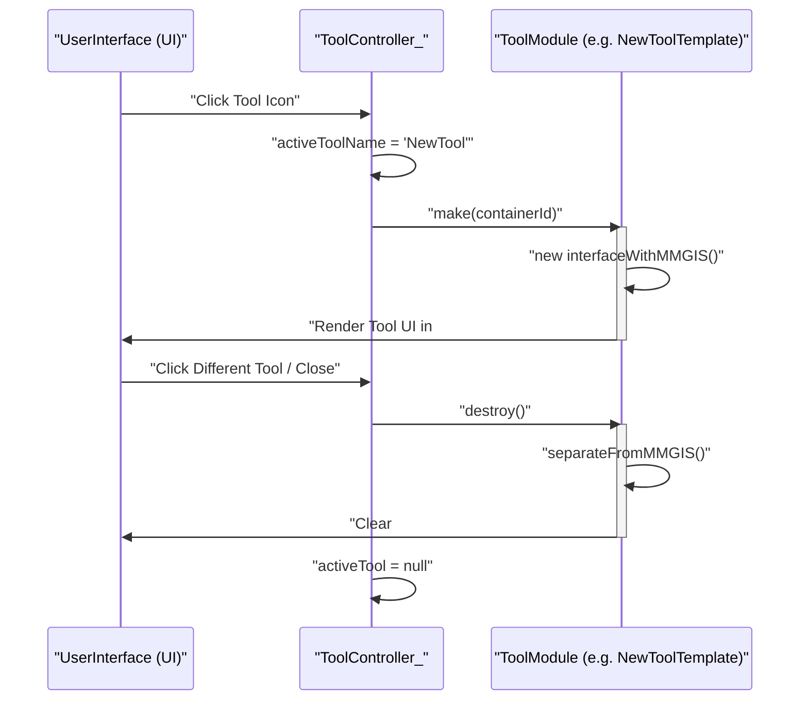
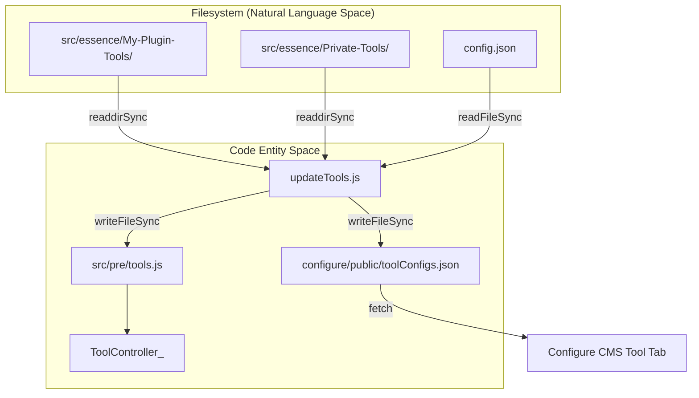

# Page: Tool Lifecycle & Plugin System

# Tool Lifecycle & Plugin System

<details>
<summary>Relevant source files</summary>

The following files were used as context for generating this wiki page:

- [API/updateTools.js](API/updateTools.js)
- [ATTRIBUTIONS.md](ATTRIBUTIONS.md)
- [CODE_OF_CONDUCT.md](CODE_OF_CONDUCT.md)
- [docs/pages/APIs/JavaScript/Main/Main.md](docs/pages/APIs/JavaScript/Main/Main.md)
- [docs/pages/Contributing/Development/Development.md](docs/pages/Contributing/Development/Development.md)
- [src/essence/Basics/ToolController_/ToolController_.js](src/essence/Basics/ToolController_/ToolController_.js)
- [src/essence/Components/OperationsClock/OperationsClock.css](src/essence/Components/OperationsClock/OperationsClock.css)
- [src/essence/Components/OperationsClock/OperationsClock.js](src/essence/Components/OperationsClock/OperationsClock.js)
- [src/essence/Components/OperationsClock/README.md](src/essence/Components/OperationsClock/README.md)
- [src/essence/Components/OperationsClock/config.json](src/essence/Components/OperationsClock/config.json)
- [src/essence/Tools/Analysis/AnalysisTool.css](src/essence/Tools/Analysis/AnalysisTool.css)
- [src/essence/Tools/Analysis/AnalysisTool.js](src/essence/Tools/Analysis/AnalysisTool.js)
- [src/essence/Tools/Analysis/AnalysisTool.md](src/essence/Tools/Analysis/AnalysisTool.md)
- [src/essence/Tools/Analysis/config.json](src/essence/Tools/Analysis/config.json)
- [src/essence/Tools/New Tool Template.js](src/essence/Tools/New Tool Template.js)
- [src/essence/mmgisAPI/mmgisAPI.js](src/essence/mmgisAPI/mmgisAPI.js)

</details>


The MMGIS tool framework provides a standardized lifecycle for interactive features, allowing them to be initialized, configured, and destroyed dynamically. The system supports a flexible plugin architecture that enables developers to add custom functionality via specific directory patterns without modifying the core codebase.

## Tool Lifecycle

Tools in MMGIS are managed by the `ToolController_` singleton, which handles the transition between tool states and manages the UI containers for both standard and "separated" tools.

### 1. Registration and Loading
Tools are registered in `src/pre/tools.js` (generated during build) which imports tool modules and their respective `config.json` files [src/essence/Basics/ToolController_/ToolController_.js:4-5](). The `ToolController_` initializes these tools based on the mission configuration passed to its `init` function [src/essence/Basics/ToolController_/ToolController_.js:26-27]().

### 2. Initialization via `make()`
When a user selects a tool from the toolbar, the `ToolController_` calls the tool module's `make()` function [src/essence/Basics/ToolController_/ToolController_.js:146-148]().
*   **Standard Tools**: Rendered inside the `#toolPanel` container [src/essence/Tools/New Tool Template.js:36-43]().
*   **Separated Tools**: Rendered in independent floating containers (left, center, or right) defined in the tool's configuration variables [src/essence/Basics/ToolController_/ToolController_.js:83-117]().

### 3. Active State
While active, tools can interact with the core engine through singletons like `L_` (Layers), `Map_` (Leaflet), and `F_` (Formulae) [src/essence/Tools/New Tool Template.js:3-5](). Tools can also use the `mmgisAPI` to add or remove layers dynamically or query map state [src/essence/mmgisAPI/mmgisAPI.js:30-138]().

### 4. Destruction via `destroy()`
When a tool is deselected or another tool is opened, the `ToolController_` calls `destroy()` [src/essence/Basics/ToolController_/ToolController_.js:156](). The tool is responsible for cleaning up event listeners, clearing its UI container, and resetting any temporary map overlays [src/essence/Tools/New Tool Template.js:22-24, 49]().

### Tool Execution Flow
The following diagram illustrates the interaction between the `ToolController_` and an individual tool module.

**Tool State Transition**

Sources: [src/essence/Basics/ToolController_/ToolController_.js:136-169](), [src/essence/Tools/New Tool Template.js:15-50]()

---

## Plugin System

MMGIS utilizes a directory-naming convention to automatically discover and integrate plugins during the build process via `updateTools.js`. This allows for "Private" (mission-specific) and "Plugin" (community) extensions.

### Plugin Discovery Logic
The build-time script `API/updateTools.js` scans the `src/essence` directory for folders matching specific patterns [API/updateTools.js:61-80]():
*   `*Private-Tools*`
*   `*Plugin-Tools*`

It also scans `src/essence/Components` for background services or widgets like the `OperationsClock` [API/updateTools.js:219-231]().

### Plugin Types & Locations

| Plugin Type | Directory Pattern | Description |
| :--- | :--- | :--- |
| **Standard Tools** | `src/essence/Tools/` | Core tools included with every MMGIS installation [API/updateTools.js:12](). |
| **Tool Plugins** | `src/essence/*Private-Tools*` or `*Plugin-Tools*` | Custom interactive tools that extend the sidebar or floating UI [API/updateTools.js:76-80](). |
| **Component Plugins** | `src/essence/Components/` | Modular UI components (e.g., `OperationsClock`) with specific mission logic [src/essence/Components/OperationsClock/config.json:1-3](). |

### Tool Plugin Structure
A tool plugin must follow a specific internal structure to be recognized:
1.  **`config.json`**: Defines metadata, icons, and configuration schema for the Configure CMS [API/updateTools.js:43-46]().
2.  **`[ToolName].js`**: The main entry point implementing `make()` and `destroy()` [src/essence/Tools/New Tool Template.js:15-28]().
3.  **`[ToolName].css`**: Optional styling (e.g., `AnalysisTool.css`) [src/essence/Tools/Analysis/AnalysisTool.js:11]().

**Plugin Discovery to UI Mapping**

Sources: [API/updateTools.js:6-132](), [src/essence/Basics/ToolController_/ToolController_.js:4-5]()

---

## Configuration Schema (`config.json`)

Every tool requires a `config.json` file. This file provides metadata to the `ToolController_` and defines the form structure used in the **Configure CMS** for mission administrators.

### Key Schema Properties
*   **`name`**: The unique identifier for the tool [API/updateTools.js:47]().
*   **`defaultIcon`**: Default MDI icon name (e.g., `chart-line` for Analysis) [src/essence/Tools/Analysis/config.json:2]().
*   **`toolbarPriority`**: Determines sort order in the sidebar; lower numbers appear first [API/updateTools.js:134-140]().
*   **`hasVars`**: Boolean indicating if the tool accepts custom configuration variables [src/essence/Components/OperationsClock/config.json:16]().
*   **`paths`**: Mapping of class names to their file paths relative to `src` [API/updateTools.js:167-173]().
*   **`config`**: Defines UI components (number, dropdown, switch, text) used in the CMS to populate `variables` [src/essence/Components/OperationsClock/config.json:20-100]().

### Example: Analysis Tool
The `AnalysisTool` config defines an `apiBaseUrl` variable required for its data visualization features [src/essence/Tools/Analysis/config.json:19-35]().

```json
{
    "name": "Analysis",
    "toolbarPriority": 4,
    "hasVars": true,
    "paths": {
        "AnalysisTool": "essence/Tools/Analysis/AnalysisTool"
    },
    "config": {
        "rows": [
            {
                "components": [
                    {
                        "field": "variables.apiBaseUrl",
                        "name": "API Base URL",
                        "type": "text"
                    }
                ]
            }
        ]
    }
}
```
Sources: [src/essence/Tools/Analysis/config.json:1-36]()

---

## Separated Tools

Separated tools (e.g., **Legend**, **Layers**, **Info**) are unique because they can be active simultaneously with other tools and occupy their own screen real estate [src/essence/Basics/ToolController_/ToolController_.js:15]().

### Implementation Details
*   **Containers**: `ToolController_` creates three containers for floating tools: `separatedDivLeft`, `separatedDiv` (center), and `separatedDivRight` [src/essence/Basics/ToolController_/ToolController_.js:46-80]().
*   **Justification**: Controlled via `variables.justification`. If set to `right`, the tool is placed near the zoom controls [src/essence/Basics/ToolController_/ToolController_.js:67-72, 88-93]().
*   **Toggle Logic**: Clicking a separated tool button checks the `made` status. If `false`, it calls `make()`; if `true`, it calls `destroy()` [src/essence/Basics/ToolController_/ToolController_.js:145-156]().
*   **Event Dispatching**: Toggling a separated tool dispatches a `toggleSeparatedTool` CustomEvent [src/essence/Basics/ToolController_/ToolController_.js:171-177]().

Sources: [src/essence/Basics/ToolController_/ToolController_.js:46-177]()

---

## Development Workflow

### New Tool Template
Developers can use the `New Tool Template.js` as a boilerplate. It establishes the `interfaceWithMMGIS` pattern, ensuring the tool correctly attaches to the `#toolPanel` and implements a cleanup `separateFromMMGIS` function [src/essence/Tools/New Tool Template.js:15-50]().

### Spec-Kit & AGENTS.md
MMGIS follows strict conventions for AI-assisted development and documentation:
*   **spec-kit**: A workflow for generating and maintaining technical specifications.
*   **AGENTS.md**: Defines the conventions for LLM agents interacting with the codebase, including mandatory citation requirements and file path usage.

Sources: [src/essence/Tools/New Tool Template.js:1-55](), [CODE_OF_CONDUCT.md:1-20]()
