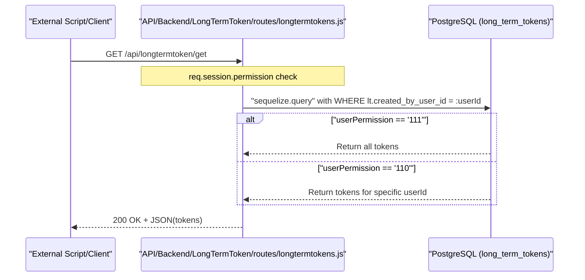
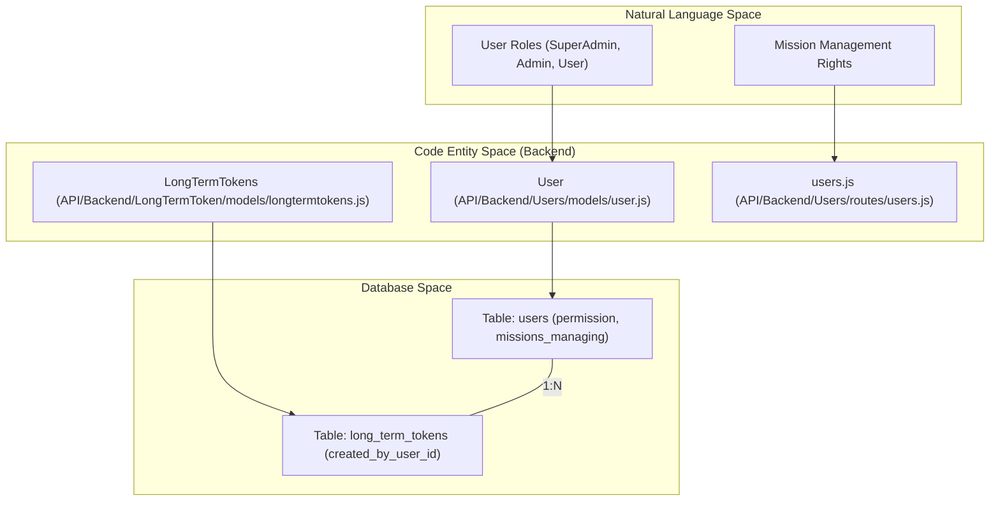

# Page: User & Access Management

# User & Access Management

<details>
<summary>Relevant source files</summary>

The following files were used as context for generating this wiki page:

- [API/Backend/Accounts/routes/accounts.js](API/Backend/Accounts/routes/accounts.js)
- [API/Backend/Draw/models/userfiles.js](API/Backend/Draw/models/userfiles.js)
- [API/Backend/LongTermToken/models/longtermtokens.js](API/Backend/LongTermToken/models/longtermtokens.js)
- [API/Backend/LongTermToken/routes/longtermtokens.js](API/Backend/LongTermToken/routes/longtermtokens.js)
- [API/Backend/LongTermToken/setup.js](API/Backend/LongTermToken/setup.js)
- [API/Backend/Users/models/user.js](API/Backend/Users/models/user.js)
- [API/Backend/Users/routes/users.js](API/Backend/Users/routes/users.js)
- [API/Backend/Users/setup.js](API/Backend/Users/setup.js)
- [configure/public/contours.png](configure/public/contours.png)
- [configure/src/pages/APITokens/APITokens.js](configure/src/pages/APITokens/APITokens.js)
- [configure/src/pages/Users/Modals/UpdateUserModal/UpdateUserModal.js](configure/src/pages/Users/Modals/UpdateUserModal/UpdateUserModal.js)
- [configure/src/pages/Users/Users.js](configure/src/pages/Users/Users.js)
- [docs/mmgis-openapi.json](docs/mmgis-openapi.json)
- [public/images/contours.png](public/images/contours.png)
- [public/images/logos/local_login_brand.png](public/images/logos/local_login_brand.png)
- [public/jquery.min.js](public/jquery.min.js)
- [public/login.css](public/login.css)
- [public/login.js](public/login.js)
- [public/resetPassword.css](public/resetPassword.css)
- [scripts/middleware.js](scripts/middleware.js)
- [src/essence/Ancillary/CursorInfo.js](src/essence/Ancillary/CursorInfo.js)
- [src/essence/Ancillary/Login/Login.css](src/essence/Ancillary/Login/Login.css)
- [src/essence/Ancillary/Login/Login.js](src/essence/Ancillary/Login/Login.js)
- [src/essence/Ancillary/Modal.css](src/essence/Ancillary/Modal.css)
- [src/essence/Ancillary/Modal.js](src/essence/Ancillary/Modal.js)
- [src/essence/Ancillary/Search.css](src/essence/Ancillary/Search.css)
- [src/essence/Tools/Chemistry/chemistryplot.js](src/essence/Tools/Chemistry/chemistryplot.js)
- [src/essence/Tools/Draw/DrawTool_FileModal.css](src/essence/Tools/Draw/DrawTool_FileModal.css)
- [src/normalize.js](src/normalize.js)
- [views/login.pug](views/login.pug)

</details>


MMGIS provides a robust authentication and authorization framework designed to support NASA planetary mission operations. It supports multiple authentication modes, role-based access control (RBAC), and per-mission permissions to ensure secure data handling and collaborative workflows.

## Authentication Modes

MMGIS behavior is primarily governed by the `AUTH` environment variable. The system supports four distinct modes to accommodate different deployment environments, from local development to secure enterprise SSO integrations.

| Mode | Description |
| :--- | :--- |
| `local` | Uses a built-in PostgreSQL-backed user database with `bcryptjs` password hashing [API/Backend/Users/routes/users.js:8](). |
| `csso` | Header-based Single Sign-On (SSO). Relies on an upstream proxy (e.g., Apache/NGINX with LDAP) to provide user information via headers [src/essence/Ancillary/Login/Login.js:69-72](). |
| `none` | No authentication is required for general use, but some administrative actions may still be restricted [src/essence/Ancillary/Login/Login.js:70](). |
| `off` | Authentication is completely disabled. All users have full access [src/essence/Ancillary/Login/Login.js:67](). |

The authentication mode is configured in the `.env` file and handled in the core server logic.

Sources: `[API/Backend/Users/routes/users.js:77-83]()`, `[src/essence/Ancillary/Login/Login.js:67-79]()`, `[views/login.pug:9]()`

---

## User Model & Permissions

The user model is defined via Sequelize and stored in the `users` table. Access is controlled through a 3-character permission string representing binary flags for different roles.

### Permission Levels
MMGIS uses a "binary combination" string (e.g., "111") to define user capabilities:
*   **SuperAdmin (`111`)**: Full system access. Can manage all missions, all users, and all API tokens. The first user created in a `local` installation is automatically elevated to this level [API/Backend/Users/routes/users.js:41-52]().
*   **Admin (`110`)**: Can manage specific missions assigned to them and create long-term tokens for their own use.
*   **User (`001`)**: Standard access. Can view missions they are authorized for and use collaborative tools like the Draw Tool [API/Backend/Users/routes/users.js:112-118]().

### Database Schema
The `users` table, defined in `API/Backend/Users/models/user.js`, includes fields for credential management and mission-specific authorization.

```javascript
// From API/Backend/Users/models/user.js:10-53
var User = sequelize.define("users", {
    username: { type: Sequelize.STRING, unique: true, allowNull: false },
    email: { type: Sequelize.STRING, unique: true, allowNull: true, validate: { isEmail: true } },
    password: { type: Sequelize.STRING, allowNull: false },
    permission: {
      type: Sequelize.ENUM,
      values: ["000", "001", "010", "011", "100", "101", "110", "111"],
      allowNull: false,
      defaultValue: "000",
    },
    token: { type: Sequelize.DataTypes.STRING(2048), allowNull: true },
    missions_managing: { type: Sequelize.ARRAY(Sequelize.STRING), allowNull: true, defaultValue: null },
});
```

Sources: `[API/Backend/Users/models/user.js:10-53]()`, `[API/Backend/Users/routes/users.js:41-52]()`, `[API/Backend/Users/routes/users.js:112-118]()`

---

## Login & Signup Flow

### Local Authentication Flow
In `local` mode, MMGIS manages the entire lifecycle of a user session.

1.  **First Signup**: If no users exist, the first user to sign up via `POST /api/users/first_signup` is granted `111` permissions [API/Backend/Users/routes/users.js:41-52]().
2.  **Signup**: Users register via `POST /api/users/signup`. If `AUTH_LOCAL_ALLOW_SIGNUP` is true, users can self-register with default `001` permissions [API/Backend/Users/routes/users.js:75-118]().
3.  **Password Validation**: The `isStrongPassword` function enforces a minimum of 8 characters, including uppercase, lowercase, numbers, and symbols [API/Backend/Users/routes/users.js:15-29]().
4.  **Session Creation**: Upon successful verification in `POST /api/users/login`, a session token is generated using `crypto.randomBytes(128)` and stored in the user's record [API/Backend/Users/routes/users.js:149-166]().

### CSSO (Header-based SSO)
When `AUTH=csso` is enabled, MMGIS expects an upstream proxy to provide user identity. The frontend checks `window.mmgisglobal.user` to establish the session [src/essence/Ancillary/Login/Login.js:68-79]().

Sources: `[API/Backend/Users/routes/users.js:15-29]()`, `[API/Backend/Users/routes/users.js:41-52]()`, `[API/Backend/Users/routes/users.js:149-166]()`, `[src/essence/Ancillary/Login/Login.js:68-79]()`, `[views/login.pug:8-35]()`

---

## Long-Term API Tokens

For programmatic access (e.g., CI/CD pipelines or external scripts), MMGIS provides Long-Term Tokens. These tokens bypass standard session expiration.

### Implementation Details
*   **Generation**: Tokens are generated via `POST /api/longtermtoken/generate` using `crypto.randomBytes(16)` [API/Backend/LongTermToken/routes/longtermtokens.js:70-82]().
*   **Permissions**: Tokens inherit the permissions of the `created_by_user_id` [API/Backend/LongTermToken/routes/longtermtokens.js:79]().
*   **Access Control**: SuperAdmins (`111`) can view all tokens. Regular Admins (`110`) are restricted to viewing tokens they created [API/Backend/LongTermToken/routes/longtermtokens.js:23-28]().

**Diagram: Long-Term Token Authorization Flow**


Sources: `[API/Backend/LongTermToken/routes/longtermtokens.js:23-46]()`, `[API/Backend/LongTermToken/routes/longtermtokens.js:70-82]()`, `[API/Backend/LongTermToken/models/longtermtokens.js:12-30]()`

---

## Access Management Architecture

MMGIS enforces access control through middleware and specific database fields like `missions_managing`.

### Key Components
*   **`missions_managing`**: A PostgreSQL `TEXT[]` array in the `users` table that stores the names of missions an Admin is authorized to configure [API/Backend/Users/models/user.js:40-44]().
*   **`Login.js`**: Frontend logic that handles UI state based on `window.mmgisglobal.AUTH` and `window.mmgisglobal.permission` [src/essence/Ancillary/Login/Login.js:66-79]().
*   **`isPathInsideRoot`**: A security utility in the missions middleware that prevents path traversal attacks when accessing mission-specific assets [scripts/middleware.js:147-178]().

**Diagram: User and Permission Entity Map**


Sources: `[API/Backend/Users/models/user.js:10-53]()`, `[API/Backend/LongTermToken/models/longtermtokens.js:10-33]()`, `[API/Backend/Users/routes/users.js:41-73]()`, `[scripts/middleware.js:147-178]()`

---

## REST Endpoints

### User & Account Management
| Endpoint | Method | Description | Permission |
| :--- | :--- | :--- | :--- |
| `/api/users/login` | POST | Authenticates a user and starts a session [API/Backend/Users/routes/users.js:230](). | Public |
| `/api/users/signup` | POST | Creates a new user account [API/Backend/Users/routes/users.js:75](). | Admin/LocalAllow |
| `/api/users/first_signup` | POST | Creates the initial SuperAdmin account [API/Backend/Users/routes/users.js:41](). | Public (if count=0) |
| `/api/accounts/get_users` | GET | List all users in the system [API/Backend/Accounts/routes/accounts.js](). | SuperAdmin |

### Token Management
| Endpoint | Method | Description | Permission |
| :--- | :--- | :--- | :--- |
| `/api/longtermtoken/get` | GET | List available tokens [API/Backend/LongTermToken/routes/longtermtokens.js:14](). | Admin |
| `/api/longtermtoken/generate` | POST | Create a new long-term token [API/Backend/LongTermToken/routes/longtermtokens.js:70](). | Admin |
| `/api/longtermtoken/clear` | POST | Delete a specific token [API/Backend/LongTermToken/routes/longtermtokens.js:100](). | Admin (Owner) |

Sources: `[API/Backend/Users/routes/users.js:41-73]()`, `[API/Backend/Users/routes/users.js:75-118]()`, `[API/Backend/LongTermToken/routes/longtermtokens.js:14-67]()`, `[API/Backend/LongTermToken/routes/longtermtokens.js:70-98]()`, `[API/Backend/LongTermToken/routes/longtermtokens.js:100-146]()`
