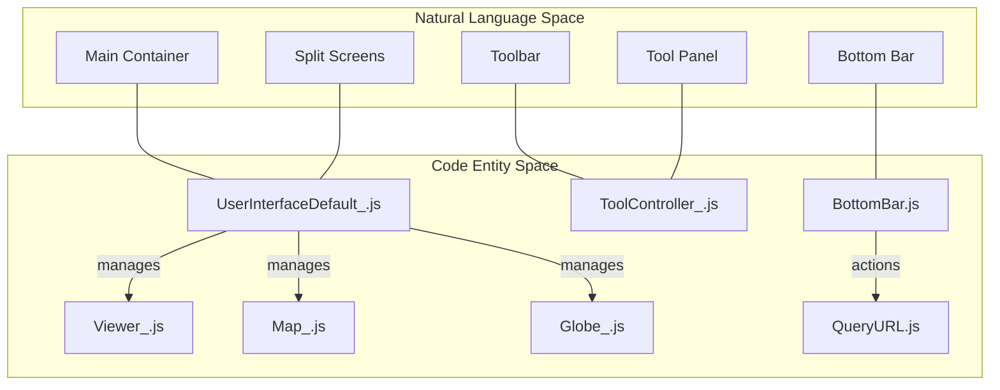
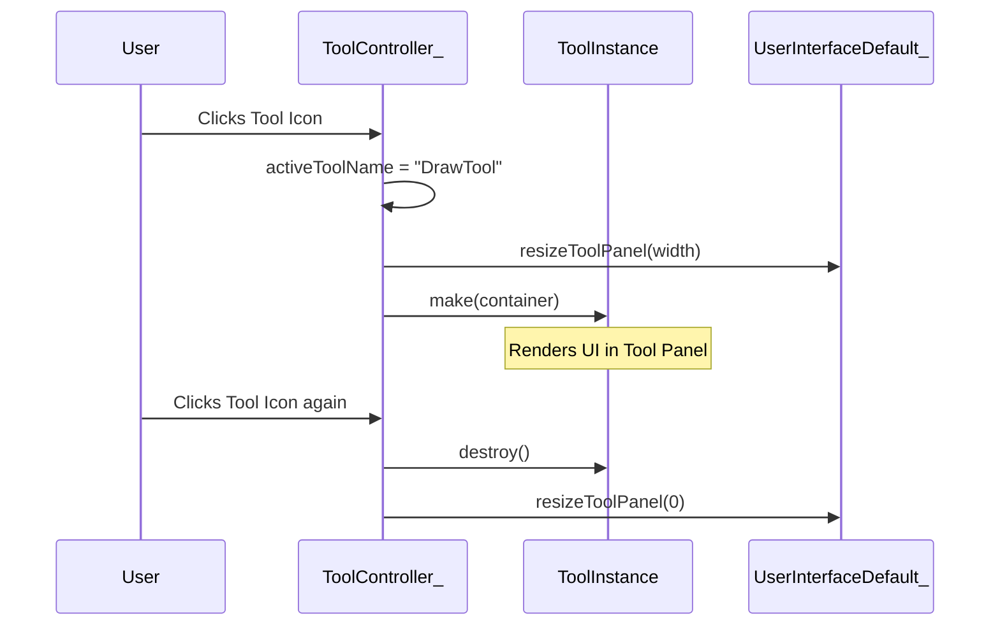

# Page: User Interface & Tools Framework

# User Interface & Tools Framework

Relevant source files

The following files were used as context for generating this wiki page:

- [configure/src/core/Maker.js](configure/src/core/Maker.js)
- [configure/src/metaconfigs/tab-ui-config.json](configure/src/metaconfigs/tab-ui-config.json)
- [docs/pages/APIs/JavaScript/Main/Main.md](docs/pages/APIs/JavaScript/Main/Main.md)
- [src/essence/Basics/ToolController_/ToolController_.js](src/essence/Basics/ToolController_/ToolController_.js)
- [src/essence/Basics/UserInterface_/UserInterfaceDefault_.js](src/essence/Basics/UserInterface_/UserInterfaceDefault_.js)
- [src/essence/Basics/UserInterface_/UserInterfaceMobile_.css](src/essence/Basics/UserInterface_/UserInterfaceMobile_.css)
- [src/essence/Basics/UserInterface_/UserInterfaceMobile_.js](src/essence/Basics/UserInterface_/UserInterfaceMobile_.js)
- [src/essence/Basics/Viewer_/PDFViewer.js](src/essence/Basics/Viewer_/PDFViewer.js)
- [src/essence/Basics/Viewer_/Viewer_.js](src/essence/Basics/Viewer_/Viewer_.js)
- [src/essence/mmgisAPI/mmgisAPI.js](src/essence/mmgisAPI/mmgisAPI.js)

The MMGIS User Interface (UI) is a modular, responsive framework designed to handle complex geospatial workflows across desktop and mobile environments. It manages the layout of the 2D Map, 3D Globe, and Viewer panels, while providing a standardized lifecycle for interactive tools and ancillary components like coordinate displays and time controls.

## UI Architecture

The UI is governed by a controller-based architecture that dynamically loads components based on the user's device and the mission configuration.

### UserInterface System
The system uses a factory pattern to switch between desktop and mobile interfaces at runtime [src/essence/Basics/UserInterface_/UserInterface_.js:4-18]().
*   **`UserInterfaceDefault_`**: The primary desktop interface. It manages a multi-pane layout using splitters (`.splitterV`), allowing users to resize the Map, Globe, and Viewer panels [src/essence/Basics/UserInterface_/UserInterfaceDefault_.js:198-210](). It handles the initialization of the `#main-container`, `#topBar`, and `#barBottom` [src/essence/Basics/UserInterface_/UserInterfaceDefault_.js:63-117]().
*   **`UserInterfaceMobile_`**: A simplified, touch-friendly interface. It moves navigation elements into a hamburger menu (`#topBarMenu`) [src/essence/Basics/UserInterface_/UserInterfaceMobile_.js:91-104]() and prioritizes a single-panel view to maximize screen real estate. It overwrites specific tool CSS to fit the mobile form factor, such as the `MeasureTool` and `TimeUI` [src/essence/Basics/UserInterface_/UserInterfaceMobile_.css:151-183]().

### ToolController_
The `ToolController_` is the central registry for all MMGIS tools. It manages:
*   **Tool Registration**: Tools are imported from the `pre/tools` manifest [src/essence/Basics/ToolController_/ToolController_.js:4]().
*   **Toolbars**: It populates the `#toolbarTools` container and handles the rendering of tool buttons [src/essence/Basics/ToolController_/ToolController_.js:29-32]().
*   **Separated Tools**: Tools can be "separated" from the main panel and placed as floating widgets (`#toolcontroller_sepdiv_left`, `#toolcontroller_sepdiv_right`) on the map [src/essence/Basics/ToolController_/ToolController_.js:46-80](). These tools can be justified left or right based on their configuration [src/essence/Basics/ToolController_/ToolController_.js:88-93]().

### Layout Component Interaction
UI Layout to Code Entity Mapping:

Sources: [src/essence/Basics/UserInterface_/UserInterfaceDefault_.js:16-55](), [src/essence/Basics/ToolController_/ToolController_.js:8-25](), [src/essence/Basics/UserInterface_/BottomBar.js:14-48]()

---

## Tool Lifecycle & Plugin System

MMGIS tools follow a strict lifecycle of `make()` and `destroy()`. This allows the system to efficiently manage memory and state as users switch between different functionalities.

*   **`make(container)`**: Called when a tool is activated. It receives a DOM element (ID) where the tool should render its UI [src/essence/Basics/ToolController_/ToolController_.js:146-148]().
*   **`destroy()`**: Called when the tool is deactivated or the mission is changed, ensuring all event listeners and DOM elements are cleaned up [src/essence/Basics/ToolController_/ToolController_.js:156-163]().
*   **Plugins**: Custom tools can be added via the `Plugin-Tools` or `Private-Tools` directories without modifying the core codebase.

For details, see [Tool Lifecycle & Plugin System](#3.1).

---

## Viewer Panel

The **Viewer** is a dedicated panel for non-map spatial data and high-resolution media. It supports a variety of formats through specialized sub-viewers initialized in `Viewer_.js` [src/essence/Basics/Viewer_/Viewer_.js:52-184]():

| Sub-Viewer | Technology | Use Case |
| :--- | :--- | :--- |
| **Imagery** | OpenSeadragon | High-resolution Deep Zoom Images (DZI) [src/essence/Basics/Viewer_/Viewer_.js:191-210]() |
| **3D Models** | `ModelViewer` (THREE.js) | glTF/OBJ models of features or terrain [src/essence/Basics/Viewer_/Viewer_.js:75-83]() |
| **PDFs** | `PDFViewer` (react-pdf) | Technical documents and mission reports [src/essence/Basics/Viewer_/Viewer_.js:85-93](), [src/essence/Basics/Viewer_/PDFViewer.js:12-57]() |
| **Photospheres** | `Photosphere` (WebGL) | 360° panoramic mission imagery [src/essence/Basics/Viewer_/Viewer_.js:65-73]() |
| **Video/GIF** | HTML5 Video | Animated mission data or recordings [src/essence/Basics/Viewer_/Viewer_.js:118-163]() |

For details, see [Viewer Panel (Images, 3D Models, PDFs, Photospheres)](#3.2).

---

## Layers Tool & Filtering

The **Layers Tool** is the primary interface for managing data visibility and layer properties. It allows users to reorder layers, adjust opacity, and apply complex filters to vector data.

### Filtering Subsystem
MMGIS supports two types of filtering:
1.  **LocalFilterer**: Processes GeoJSON data directly in the browser for small-to-medium datasets.
2.  **ESFilterer**: Offloads complex queries to an ElasticSearch backend for massive datasets.

For details, see [Layers Tool & Filtering](#3.3).

---

## UI Styling & Theming

MMGIS uses a CSS variable-based theming system. This allows for rapid rebranding and consistent UI element styling across different tools. Configurations for UI branding (logos, page names) are managed via the `tab-ui-config.json` metaconfig [configure/src/metaconfigs/tab-ui-config.json:4-49]().

*   **Core Colors**: Defined in `:root`, including `--color-mmgis` (brand blue) and various grayscale shades (`--color-a` to `--color-a7`).
*   **Standard Components**: Reusable classes ensure a uniform look for all tool interfaces.
*   **ToolController Styles**: Manages tool-specific colors such as `activeColor` and `activeBG` [src/essence/Basics/ToolController_/ToolController_.js:21-24]().

### UI State and Coordination Diagram

Sources: [src/essence/Basics/ToolController_/ToolController_.js:136-168](), [src/essence/Basics/UserInterface_/UserInterfaceDefault_.js:175-184]()

### Ancillary UI Components
The framework includes several "ancillary" components that provide context without being full tools:
*   **Coordinates**: Displays cursor position in multiple formats (ll, en, cproj, rxy, site). It supports coordinate offsets and custom projections defined in the mission configuration.
*   **BottomBar**: Provides global actions like "Copy Link" (deep-linking) and "Screenshot" [src/essence/Basics/UserInterface_/BottomBar.js:22-158]().
*   **mmgisAPI**: A public interface allowing external control of the UI, such as adding layers [src/essence/mmgisAPI/mmgisAPI.js:30-121]() or setting time [src/essence/mmgisAPI/mmgisAPI.js:272-280]().

**Sources:**
*   `src/essence/Basics/UserInterface_/UserInterface_.js`
*   `src/essence/Basics/UserInterface_/UserInterfaceDefault_.js`
*   `src/essence/Basics/UserInterface_/UserInterfaceMobile_.js`
*   `src/essence/Basics/UserInterface_/UserInterfaceMobile_.css`
*   `src/essence/Basics/ToolController_/ToolController_.js`
*   `src/essence/Basics/Viewer_/Viewer_.js`
*   `src/essence/Basics/Viewer_/PDFViewer.js`
*   `src/essence/Basics/UserInterface_/BottomBar.js`
*   `src/essence/mmgisAPI/mmgisAPI.js`
*   `configure/src/metaconfigs/tab-ui-config.json`
