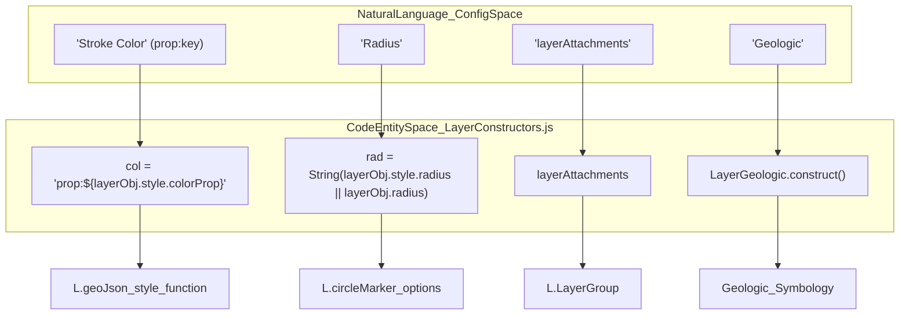
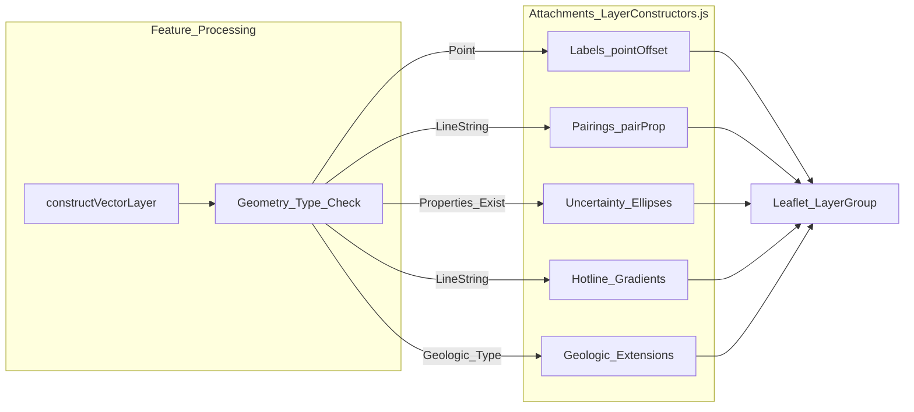

# Page: Vector Layer Construction & Symbology

# Vector Layer Construction & Symbology

Relevant source files

The following files were used as context for generating this wiki page:

- [blueprints/Missions/Reference-Mission/Layers/Vectors/hotline-gradient-3d.geojson](blueprints/Missions/Reference-Mission/Layers/Vectors/hotline-gradient-3d.geojson)
- [blueprints/Missions/Reference-Mission/config.reference-mission.json](blueprints/Missions/Reference-Mission/config.reference-mission.json)
- [src/essence/Ancillary/DataShaders.js](src/essence/Ancillary/DataShaders.js)
- [src/essence/Basics/Globe_/GlobeRenderer.js](src/essence/Basics/Globe_/GlobeRenderer.js)
- [src/essence/Basics/Layers_/LayerConstructors.js](src/essence/Basics/Layers_/LayerConstructors.js)
- [src/essence/Basics/Layers_/gradientUtils.js](src/essence/Basics/Layers_/gradientUtils.js)
- [src/essence/Tools/Draw/DrawTool.test.js](src/essence/Tools/Draw/DrawTool.test.js)
- [src/external/Dropy/dropy.css](src/external/Dropy/dropy.css)
- [src/external/Dropy/dropy.js](src/external/Dropy/dropy.js)
- [src/external/Leaflet/leaflet.tilelayer.gl.js](src/external/Leaflet/leaflet.tilelayer.gl.js)
- [tests/unit/gradientPolyline.spec.js](tests/unit/gradientPolyline.spec.js)

This page documents the technical implementation of vector layer processing in MMGIS, specifically focusing on how GeoJSON data is transformed into interactive Leaflet layers with complex symbology, attachments, and geologic extensions.

## Layer Construction Pipeline

The core of vector layer initialization is the `constructVectorLayer` function. This function acts as middleware between raw GeoJSON data and the Leaflet rendering engine, applying styles, point offsets, and complex attachments defined in the mission configuration [src/essence/Basics/Layers_/LayerConstructors.js:43-48]().

### Data Flow & Transformation
1.  **Property Resolution**: The constructor resolves style attributes (color, opacity, weight, radius). It checks if a property-mapping string (e.g., `prop:temperature`) is used instead of a static value [src/essence/Basics/Layers_/LayerConstructors.js:49-79]().
2.  **Style Snapshotting**: To prevent mutations from one feature bleeding into the next during rendering, the original layer style is snapshotted before feature-level overrides are applied [src/essence/Basics/Layers_/LayerConstructors.js:81-87]().
3.  **Leaflet Object Creation**: A `L.geoJson` object is instantiated with custom `style`, `pointToLayer`, and `onEachFeature` handlers [src/essence/Basics/Layers_/LayerConstructors.js:445-455]().
4.  **Extended GeoJSON Parsing**: Coordinates are processed for "Extended GeoJSON" features via `parseExtendedGeoJSON`, which extracts per-vertex properties (like elevation or speed) often used for gradients [src/essence/Basics/Layers_/LayerConstructors.js:9]().
5.  **Attachment Injection**: Labels, pairings, and uncertainty ellipses are appended as sub-layers or decorators based on the layer configuration [src/essence/Basics/Layers_/LayerConstructors.js:525-540]().

### System Entity Mapping: Constructor Logic
The following diagram maps the configuration parameters to the internal code logic within `LayerConstructors.js`.

Title: "Vector Construction Entity Map"

Sources: [src/essence/Basics/Layers_/LayerConstructors.js:49-79](), [src/essence/Basics/Layers_/LayerConstructors.js:81-87](), [src/essence/Basics/Layers_/LayerConstructors.js:8]()

---

## Symbology Priority Pipeline

MMGIS follows a strict hierarchy when determining the visual style of a feature. If a higher-priority style is found, lower ones are ignored.

| Priority | Level | Description | Implementation |
| :--- | :--- | :--- | :--- |
| 1 | **Feature-Level** | Styles defined directly in `feature.properties.style`. | [src/essence/Basics/Layers_/LayerConstructors.js:387-410]() |
| 2 | **Legend Matching** | Matching `feature.properties` against a legend object. | [src/essence/Basics/Layers_/LayerConstructors.js:113-131]() |
| 3 | **Continuous Interpolation** | Gradient interpolation for numeric property values. | [src/essence/Basics/Layers_/LayerConstructors.js:156-180]() |
| 4 | **Property Mapping** | Using the `prop:key` syntax in layer configuration. | [src/essence/Basics/Layers_/LayerConstructors.js:49-79]() |
| 5 | **Layer Defaults** | Static values defined in the layer's `style` config. | [src/essence/Basics/Layers_/LayerConstructors.js:49-79]() |

### Color Interpolation
For continuous data or property-mapped colors, MMGIS uses internal interpolation utilities. The `interpolateMultipleColors` function handles normalized values between color stops [src/essence/Basics/Layers_/gradientUtils.js:27-32](). It supports hex, RGB, and CSS named colors. To resolve CSS names (e.g., "crimson"), it uses a temporary DOM element and `window.getComputedStyle` to extract RGB values, with a `_parseCSSColorCache` to minimize DOM mutations [src/essence/Basics/Layers_/gradientUtils.js:118-150]().

Sources: [src/essence/Basics/Layers_/LayerConstructors.js:113-180](), [src/essence/Basics/Layers_/gradientUtils.js:27-74](), [src/essence/Basics/Layers_/gradientUtils.js:118-150]()

---

## Layer Attachments & Extensions

Attachments are secondary visual elements linked to the primary vector geometry.

### Key Attachment Types
*   **Labels**: Dynamic text anchors. For point features, a custom `_setPosition` override in `L.Tooltip` allows for a `pointOffset` to prevent overlap with markers [src/essence/Basics/Layers_/LayerConstructors.js:25-37]().
*   **Hotline Gradients**: For `LineString` geometries, rendering a color gradient along the path based on per-vertex values (e.g., speed, elevation) [src/essence/Basics/Layers_/LayerConstructors.js:480-500]().
*   **Uncertainty Ellipses**: Rendered based on error margins (e.g., `sigma_x`, `sigma_y`) in feature properties.
*   **Geologic Layer Extensions**: The `LayerGeologic` module extends standard vector layers to support planetary geologic mapping, interpreting structural symbols (folds, faults, contacts) [src/essence/Basics/Layers_/LayerConstructors.js:8]().

### 3D Globe Symbology
In the `GlobeRenderer`, vector layers are synchronized with the 3D view. For gradient-based lines (hotlines), the system calculates the closest point on a segment to provide hover tooltips with interpolated values [src/essence/Basics/Globe_/GlobeRenderer.js:189](). This utilizes `closestPointOnSegment` to find the parametric position `t` along a segment [src/essence/Basics/Layers_/gradientUtils.js:191-203]().

Title: "Attachment Logic Flow"

Sources: [src/essence/Basics/Layers_/LayerConstructors.js:25-37](), [src/essence/Basics/Layers_/gradientUtils.js:191-203](), [src/essence/Basics/Globe_/GlobeRenderer.js:189]()

---

## Data Shaders & Raster Symbology

While primarily for vector data, MMGIS uses `DataShaders.js` to apply symbology to raster data (like COGs) using WebGL. The `colorize` shader allows for continuous or discrete color ramps [src/essence/Ancillary/DataShaders.js:103-126]().

*   **Continuous Mode**: Linearly interpolates between colors based on pixel value [src/essence/Ancillary/DataShaders.js:121]().
*   **Discrete Mode**: Maps ranges of values to specific colors [src/essence/Ancillary/DataShaders.js:123]().
*   **Dynamic Range**: Can automatically refit the min/max range based on the current viewport [src/essence/Ancillary/DataShaders.js:129-135]().

Sources: [src/essence/Ancillary/DataShaders.js:103-152](), [src/external/Leaflet/leaflet.tilelayer.gl.js:30-55]()
