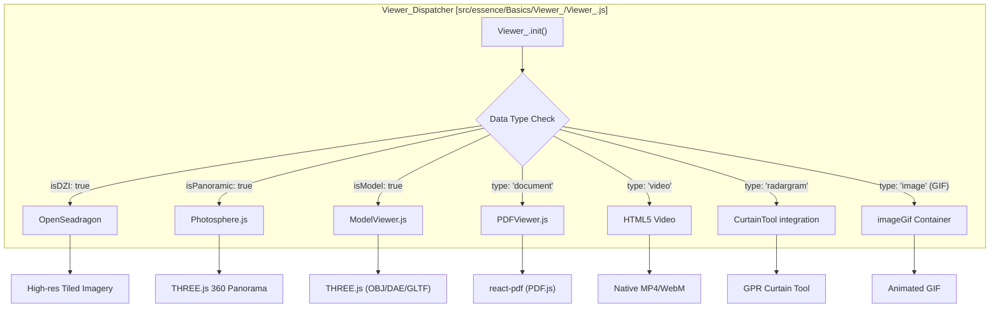
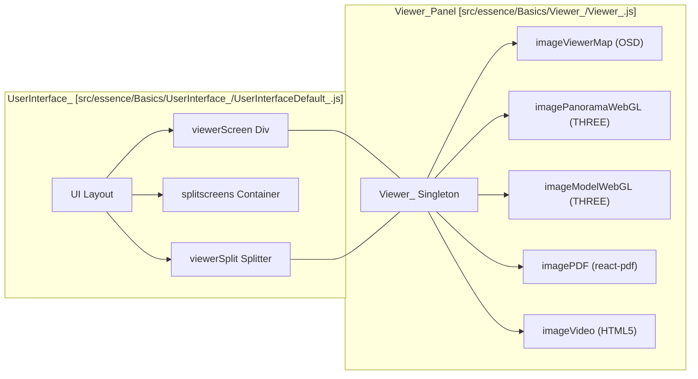

# Page: Viewer Panel (Images, 3D Models, PDFs, Photospheres)

# Viewer Panel (Images, 3D Models, PDFs, Photospheres)

Relevant source files

The following files were used as context for generating this wiki page:

- [configure/src/core/Maker.js](configure/src/core/Maker.js)
- [configure/src/metaconfigs/tab-ui-config.json](configure/src/metaconfigs/tab-ui-config.json)
- [docs/pages/Configure/Tabs/Panels/Panels_Tab.md](docs/pages/Configure/Tabs/Panels/Panels_Tab.md)
- [docs/pages/Tools/Curtain/Curtain.md](docs/pages/Tools/Curtain/Curtain.md)
- [public/workers/pdf.worker.min.js](public/workers/pdf.worker.min.js)
- [src/essence/Basics/UserInterface_/UserInterfaceDefault_.js](src/essence/Basics/UserInterface_/UserInterfaceDefault_.js)
- [src/essence/Basics/UserInterface_/UserInterfaceMobile_.css](src/essence/Basics/UserInterface_/UserInterfaceMobile_.css)
- [src/essence/Basics/UserInterface_/UserInterfaceMobile_.js](src/essence/Basics/UserInterface_/UserInterfaceMobile_.js)
- [src/essence/Basics/Viewer_/PDFViewer.js](src/essence/Basics/Viewer_/PDFViewer.js)
- [src/essence/Basics/Viewer_/Photosphere.js](src/essence/Basics/Viewer_/Photosphere.js)
- [src/essence/Basics/Viewer_/Viewer_.css](src/essence/Basics/Viewer_/Viewer_.css)
- [src/essence/Basics/Viewer_/Viewer_.js](src/essence/Basics/Viewer_/Viewer_.js)
- [src/essence/Tools/Curtain/CurtainTool.css](src/essence/Tools/Curtain/CurtainTool.css)
- [src/essence/Tools/Curtain/CurtainTool.js](src/essence/Tools/Curtain/CurtainTool.js)
- [src/essence/Tools/Curtain/config.json](src/essence/Tools/Curtain/config.json)

The Viewer Panel is a core UI component of MMGIS designed to display high-resolution imagery, 360° panoramas, 3D models, documents, and specialized geophysical data like radargrams. It is located to the left of the main map and can be expanded or collapsed via the UI splitter [docs/pages/Configure/Tabs/Panels/Panels_Tab.md:11-13]().

## System Architecture

The Viewer Panel is managed by the `Viewer_` singleton, which acts as a dispatcher for various sub-viewers based on the data type attached to a map feature.

### Code Entity Map: Viewer Dispatcher
This diagram shows how the `Viewer_` singleton maps feature properties to specific rendering classes.

**Sources:** [src/essence/Basics/Viewer_/Viewer_.js:17-51](), [src/essence/Basics/Viewer_/Viewer_.js:143-164](), [docs/pages/Configure/Tabs/Panels/Panels_Tab.md:15-83]()

## Subsystem Implementation

### 1. High-Resolution Imagery (OpenSeadragon)
For massive imagery that cannot be loaded as a single file, MMGIS uses **OpenSeadragon**. It supports Deep Zoom Images (DZI) by pointing to an `.xml` descriptor [docs/pages/Configure/Tabs/Panels/Panels_Tab.md:112-114]().
*   **Initialization:** Configured in `Viewer_.init` with custom navigation controls and a navigator window [src/essence/Basics/Viewer_/Viewer_.js:191-210]().
*   **Smoothing:** Disabled (`imageSmoothingEnabled: false`) to preserve pixel-perfect scientific data [src/essence/Basics/Viewer_/Viewer_.js:209]().

### 2. 360° Photospheres
The `Photosphere.js` module uses `THREE.js` to project cylindrical mosaics onto a 3D sphere [docs/pages/Configure/Tabs/Panels/Panels_Tab.md:116-118]().
*   **Projection:** It requires metadata including `azmin`, `azmax`, `elmin`, and `elmax` to correctly map pixels to spherical coordinates [docs/pages/Configure/Tabs/Panels/Panels_Tab.md:120-126]().
*   **Interaction:** Supports `OrbitControls` for mouse navigation and `DeviceOrientationControls` for VR/mobile movement [src/essence/Basics/Viewer_/Photosphere.js:80-91]().
*   **Advanced UI:** Includes Azimuth and Elevation rings/indicators rendered within the 3D scene [src/essence/Basics/Viewer_/Photosphere.js:114-165]().

### 3. 3D Model Viewer
`ModelViewer.js` provides a WebGL environment for viewing 3D assets attached to features [docs/pages/Configure/Tabs/Panels/Panels_Tab.md:108-110]().
*   **Supported Formats:** `.obj` (with textures), `.dae` (Collada), and `.gltf`/`.glb` [src/essence/Basics/Viewer_/ModelViewer.js:134-196]().
*   **Environment:** Includes a ground grid (`GridHelper`) and ambient lighting to provide spatial context [src/essence/Basics/Viewer_/ModelViewer.js:86-91]().

### 4. PDF & Document Viewer
Implemented via `PDFViewer.js` using the `react-pdf` library, which wraps `PDF.js`.
*   **Worker:** Uses a dedicated web worker for background rendering [src/essence/Basics/Viewer_/PDFViewer.js:10]().
*   **UI:** Provides custom page navigation, zoom levels (0.25x to 5x), and responsive resizing [src/essence/Basics/Viewer_/PDFViewer.js:14-23]().
*   **Implementation:** Uses `useResizeDetector` to handle layout changes and adjusts justification based on overflow [src/essence/Basics/Viewer_/PDFViewer.js:19-23](), [src/essence/Basics/Viewer_/PDFViewer.js:43-55]().

### 5. Radargram & Curtain Tool
Specialized for Ground Penetrating Radar (GPR) data. While the Viewer renders the raw image, the `CurtainTool` uses the `radargram` type to project data into the map/globe views [docs/pages/Configure/Tabs/Panels/Panels_Tab.md:99-107]().
*   **Metadata:** Requires `topElev` (top pixel elevation), `depth` (vertical meters), and `length` (horizontal meters) [docs/pages/Configure/Tabs/Panels/Panels_Tab.md:104-106]().
*   **Tool Integration:** The `CurtainTool.js` component manages the state of active radargrams, including vertical exaggeration and 3D offset [src/essence/Tools/Curtain/CurtainTool.js:17-35]().

## Configuration & Data Flow

The Viewer panel can be enabled or disabled globally in the **Configure CMS** under the Panels tab [configure/src/metaconfigs/tab-ui-config.json:137-148](). Its default width is also configurable [configure/src/metaconfigs/tab-ui-config.json:206-212]().

Features trigger the viewer through an `images` array in their GeoJSON properties.

| Property | Description | Example |
| :--- | :--- | :--- |
| `url` | Path to the asset | `Data/models/rock.obj` |
| `type` | Primary dispatcher key | `image`, `video`, `document`, `radargram` |
| `isModel` | Toggles THREE.js ModelViewer | `true` |
| `isPanoramic`| Toggles Photosphere | `true` |
| `isDZI` | Toggles OpenSeadragon | `true` |

**Sources:** [docs/pages/Configure/Tabs/Panels/Panels_Tab.md:15-83](), [src/essence/Basics/Viewer_/Viewer_.js:217-230](), [configure/src/metaconfigs/tab-ui-config.json:137-148]()

### Code Entity Map: Panel Layout & UI
This diagram illustrates how the `UserInterfaceDefault_` (and `UserInterfaceMobile_` for small screens) and `Viewer_` manage the physical space.

**Sources:** [src/essence/Basics/UserInterface_/UserInterfaceDefault_.js:32-34](), [src/essence/Basics/UserInterface_/UserInterfaceDefault_.js:198-210](), [src/essence/Basics/Viewer_/Viewer_.js:53-128](), [src/essence/Basics/UserInterface_/UserInterfaceMobile_.js:34-36]()

## Key Functions

| Class/Module | Function | Role |
| :--- | :--- | :--- |
| `Viewer_` | `init()` | Creates DOM elements for all sub-viewers and initializes OpenSeadragon [src/essence/Basics/Viewer_/Viewer_.js:52](). |
| `Viewer_` | `clearImage()` | Hides all viewer containers and resets the toolbar [src/essence/Basics/Viewer_/Viewer_.js:217](). |
| `Photosphere` | `changeImage()` | Loads a new panorama, creates a `SphereGeometry`, and maps the texture [src/essence/Basics/Viewer_/Photosphere.js:174](). |
| `ModelViewer` | `changeModel()` | Detects extension (OBJ/DAE/GLTF) and invokes the corresponding THREE.js loader [src/essence/Basics/Viewer_/ModelViewer.js:130](). |
| `ReactPDF` | `onDocumentLoadSuccess()` | Callback that sets total page count and enables navigation [src/essence/Basics/Viewer_/PDFViewer.js:29](). |
| `CurtainTool` | `changeImage()` | Updates the active radargram image and re-renders the curtain in 2D/3D [src/essence/Tools/Curtain/CurtainTool.js:117-121](). |

**Sources:** [src/essence/Basics/Viewer_/Viewer_.js](), [src/essence/Basics/Viewer_/Photosphere.js](), [src/essence/Basics/Viewer_/ModelViewer.js](), [src/essence/Basics/Viewer_/PDFViewer.js](), [src/essence/Tools/Curtain/CurtainTool.js]()
