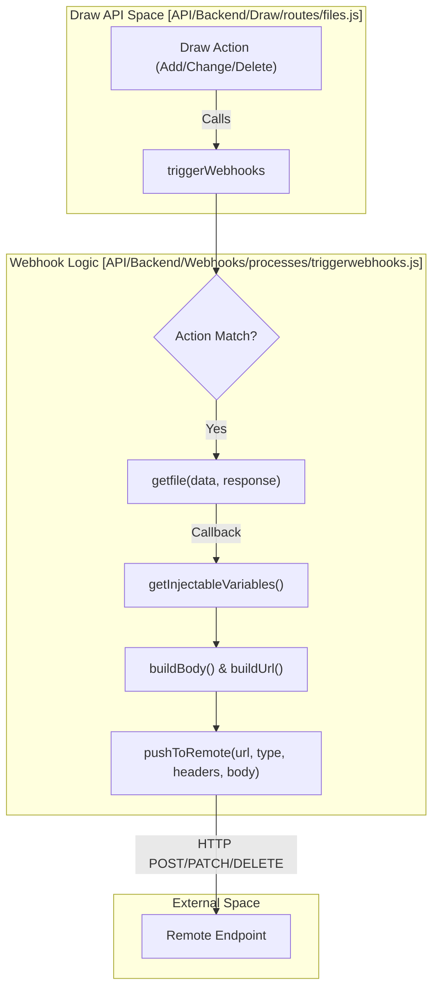
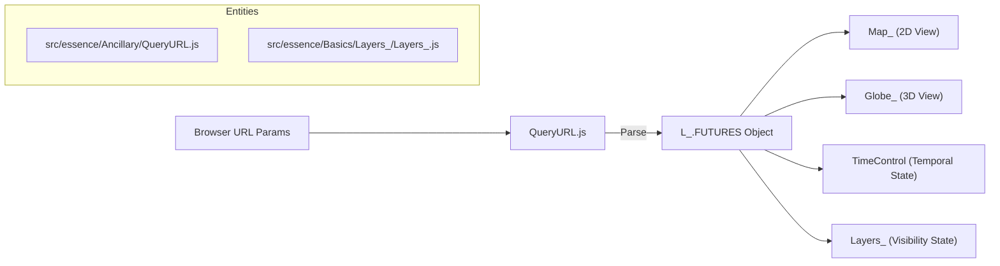

# Page: Webhooks & URL Shortener

# Webhooks & URL Shortener

Relevant source files

The following files were used as context for generating this wiki page:

- [API/Backend/Datasets/models/datasets.js](API/Backend/Datasets/models/datasets.js)
- [API/Backend/Datasets/routes/datasets.js](API/Backend/Datasets/routes/datasets.js)
- [API/Backend/Draw/routes/draw.js](API/Backend/Draw/routes/draw.js)
- [API/Backend/Draw/routes/files.js](API/Backend/Draw/routes/files.js)
- [API/Backend/Shortener/routes/shortener.js](API/Backend/Shortener/routes/shortener.js)
- [API/Backend/Webhooks/models/webhooks.js](API/Backend/Webhooks/models/webhooks.js)
- [API/Backend/Webhooks/processes/triggerwebhooks.js](API/Backend/Webhooks/processes/triggerwebhooks.js)
- [API/Backend/Webhooks/routes/testwebhooks.js](API/Backend/Webhooks/routes/testwebhooks.js)
- [API/Backend/Webhooks/routes/webhooks.js](API/Backend/Webhooks/routes/webhooks.js)
- [API/Backend/Webhooks/routes/webhookutils.js](API/Backend/Webhooks/routes/webhookutils.js)
- [API/Backend/Webhooks/setup.js](API/Backend/Webhooks/setup.js)
- [API/testEnv.js](API/testEnv.js)
- [API/utils.js](API/utils.js)
- [configuration/webpack.config.js](configuration/webpack.config.js)
- [docs/pages/Configure/Layers/Tile/Tile.md](docs/pages/Configure/Layers/Tile/Tile.md)
- [docs/pages/Configure/Layers/Vector/Vector.md](docs/pages/Configure/Layers/Vector/Vector.md)
- [src/essence/Ancillary/QueryURL.js](src/essence/Ancillary/QueryURL.js)
- [src/essence/Basics/Layers_/leaflet-tilelayer-middleware.js](src/essence/Basics/Layers_/leaflet-tilelayer-middleware.js)

This section documents the MMGIS backend systems for external notifications (Webhooks) and link management (URL Shortener), as well as the client-side mechanism for generating and parsing deep-linked state via the URL.

## Webhooks System

The Webhooks system allows MMGIS to notify external services when specific events occur within the drawing and file management subsystems. This is primarily used for synchronizing data with external databases or triggering automated processing pipelines.

### Webhook Architecture and Data Flow

The system is centered around `triggerwebhooks.js`, which acts as a dispatcher for events originating from the Draw API. Webhook configurations are stored in the database as JSON objects within the `webhooks` table [API/Backend/Webhooks/models/webhooks.js:8-20]().

#### Webhook Dispatch Flow
The following diagram illustrates how an action in the Draw API triggers an external request.

Title: Webhook Event Dispatch Flow

**Sources:** [API/Backend/Webhooks/processes/triggerwebhooks.js:37-67](), [API/Backend/Webhooks/processes/triggerwebhooks.js:69-102](), [API/Backend/Draw/routes/files.js:24-24](), [API/Backend/Draw/routes/draw.js:23-23]()

### Key Functions
*   **`triggerWebhooks(action, payload)`**: The entry point for the system. It iterates through the loaded `webhooksConfig` and matches the incoming action (e.g., `drawFileChange`, `drawFileAdd`, `drawFileDelete`) against configured webhook triggers [API/Backend/Webhooks/processes/triggerwebhooks.js:37-67]().
*   **`getInjectableVariables(type, file, res)`**: Extracts metadata from the GeoJSON file and its properties to make them available for template substitution. Supported variables include `file_name`, `file_description`, `tags`, `folders`, and the full `geojson` object [API/Backend/Webhooks/processes/triggerwebhooks.js:139-204](). It also parses specialized tags like `~#tag`, `~@folder`, and `~\^efolder` from the description [API/Backend/Webhooks/processes/triggerwebhooks.js:171-197]().
*   **`buildBody` / `buildUrl`**: Uses a regex `{(.*?)}` to find placeholders in the webhook configuration and replaces them with actual data from the injectable variables [API/Backend/Webhooks/processes/triggerwebhooks.js:10-10](), [API/Backend/Webhooks/processes/triggerwebhooks.js:206-240]().

### Webhook Models and Routes
Webhooks are managed via the `/api/webhooks` endpoint.
*   **Model**: The `webhooks` table (managed via Sequelize) stores a single `config` JSON field containing an array of webhook definitions [API/Backend/Webhooks/models/webhooks.js:8-20]().
*   **Test Endpoints**: When `NODE_ENV` is set to `development`, the system exposes `/api/testwebhooks` which includes routes like `test_webhook_post` and `test_webhook_del` to log incoming payloads for debugging [API/Backend/Webhooks/setup.js:14-21](), [API/Backend/Webhooks/routes/testwebhooks.js:15-40]().
*   **Initialization**: The `setup.js` file handles the registration of these routes and ensures `ensureAdmin()` and `checkHeadersCodeInjection` middlewares are applied [API/Backend/Webhooks/setup.js:7-22]().

**Sources:** [API/Backend/Webhooks/setup.js:7-22](), [API/Backend/Webhooks/models/webhooks.js:8-20](), [API/Backend/Webhooks/routes/testwebhooks.js:15-40](), [API/Backend/Webhooks/processes/triggerwebhooks.js:10-10]()

---

## URL Shortener

The URL Shortener provides a mechanism to convert long MMGIS deep-links (which can exceed character limits for certain browsers or platforms) into short identifiers.

### Shortener API
The shortener is controlled by the `DISABLE_LINK_SHORTENER` environment variable [API/Backend/Shortener/routes/shortener.js:19-26]().

| Endpoint | Method | Description |
| :--- | :--- | :--- |
| `/shorten` | POST | Takes a `url`, generates a random base-36 string (5+ characters), and saves the mapping in the `url_shortener` table [API/Backend/Shortener/routes/shortener.js:18-71](). |
| `/expand` | POST | Takes a `short` code and returns the original `full` URL [API/Backend/Shortener/routes/shortener.js:73-110](). |

### Implementation Details
The `shorten` function uses a recursive loop (up to 20 attempts) to handle potential collisions in the random string generation. If a collision occurs (detected via a Sequelize uniqueness constraint error), it increments the string length and tries again [API/Backend/Shortener/routes/shortener.js:28-70](). The URL is stored using `encodeURIComponent` to ensure safety in the database [API/Backend/Shortener/routes/shortener.js:38-38]().

**Sources:** [API/Backend/Shortener/routes/shortener.js:5-112]()

---

## QueryURL & Deep-Linking

The `QueryURL` module is the client-side logic responsible for parsing the browser's URL parameters and initializing the MMGIS state (camera position, active layers, time, etc.).

### URL Parameter Mapping
The `queryURL` function extracts variables from the window location to populate the `L_.FUTURES` object, which is then consumed by the map and globe engines during initialization.

| Parameter | Code Entity | Description |
| :--- | :--- | :--- |
| `mapLat`, `mapLon`, `mapZoom` | `L_.FUTURES.mapView` | Initial 2D Leaflet view [src/essence/Ancillary/QueryURL.js:48-55](). |
| `globeLat`, `globeLon`, `globeZoom` | `L_.FUTURES.globeView` | Initial 3D Globe view [src/essence/Ancillary/QueryURL.js:57-71](). |
| `globeCamera` | `L_.FUTURES.globeCamera` | Camera position and target for 3D view [src/essence/Ancillary/QueryURL.js:73-84](). |
| `startTime`, `endTime` | `L_.FUTURES.startTime/endTime` | Initial TimeControl bounds, supporting Unix timestamps or ISO strings [src/essence/Ancillary/QueryURL.js:162-183](). |
| `on` | `L_.FUTURES.customOn` | List of layers to enable on boot [src/essence/Ancillary/QueryURL.js:195-198](). |
| `selected` | `L_.FUTURES.activePoint` | A specific feature to highlight, supporting lat/lon or key/value lookups [src/essence/Ancillary/QueryURL.js:108-129](). |

### Coordinate Deep-Linking
The system supports a specific mechanism for linking to spatial features via the `rmcxyzoom` parameter. This triggers a call to the `spatial_published` API via `calls.api` to resolve coordinates to specific mission features [src/essence/Ancillary/QueryURL.js:141-160]().

Title: QueryURL Initialization Flow

**Sources:** [src/essence/Ancillary/QueryURL.js:10-200]()
