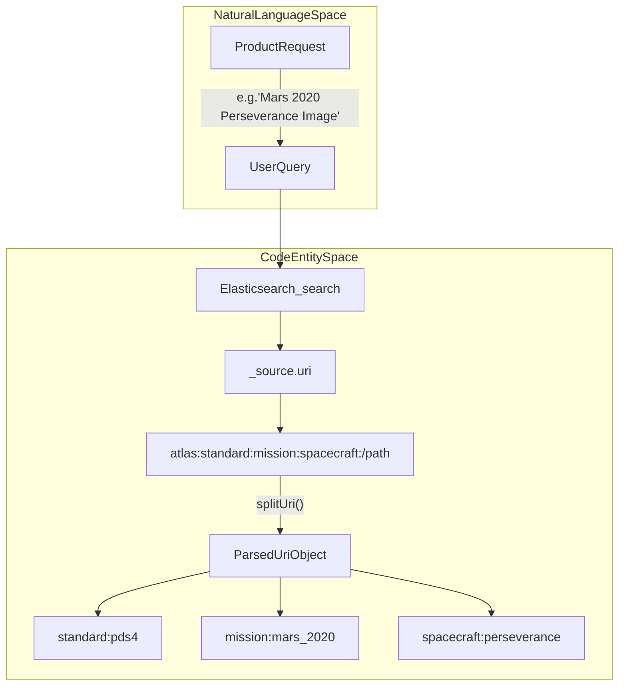
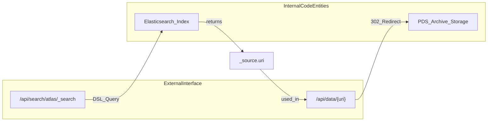

# Page: API and External Documentation

# API and External Documentation

Relevant source files

The following files were used as context for generating this wiki page:

- [.gitignore](.gitignore)
- [Documenation/.gitignore](Documenation/.gitignore)
- [Documenation/README.md](Documenation/README.md)
- [Documenation/babel.config.js](Documenation/babel.config.js)
- [Documenation/build-to-build.js](Documenation/build-to-build.js)
- [Documenation/docs/api/_category_.json](Documenation/docs/api/_category_.json)
- [Documenation/docs/api/archive.md](Documenation/docs/api/archive.md)
- [Documenation/docs/api/data-access.md](Documenation/docs/api/data-access.md)
- [Documenation/docs/api/search.md](Documenation/docs/api/search.md)
- [Documenation/docs/api/uri.md](Documenation/docs/api/uri.md)
- [Documenation/docusaurus.config.js](Documenation/docusaurus.config.js)
- [Documenation/package-lock.json](Documenation/package-lock.json)
- [Documenation/package.json](Documenation/package.json)
- [config/paths.js](config/paths.js)
- [config/webpackDevServer.config.js](config/webpackDevServer.config.js)
- [scripts/start-dev.js](scripts/start-dev.js)

This section provides an overview of the Atlas public-facing API and the integrated Docusaurus-based documentation site. While the Atlas web application provides a graphical interface for data discovery, the underlying API allows for programmatic access to the Elasticsearch-backed search engine, the archive file system, and data transformation services.

## External Documentation Site

Atlas includes a dedicated documentation sub-project built with **Docusaurus 3** [Documenation/package.json:17-18](). This site serves as the primary reference for external developers and is hosted at the `/documentation/` base path [Documenation/docusaurus.config.js:20]().

### Development and Build Pipeline
The documentation is managed as a separate workspace within the repository. During the main application build process, the documentation is compiled and moved into the primary build directory to be served alongside the React application [Documenation/build-to-build.js:1-3]().

- **Local Development**: Run `npm run build-docs` to prepare the static files [config/webpackDevServer.config.js:68]().
- **Dev Server Integration**: The Atlas `webpack-dev-server` is configured to serve the built documentation from `build/documentation` at the `/documentation` endpoint [config/webpackDevServer.config.js:63-66]().
- **Static Generation**: The `docusaurus build` command generates the final site into the distribution folder [Documenation/package.json:8]().

### Documentation Content Structure
The site is organized into categories, with the **API** section being the most prominent [Documenation/docusaurus.config.js:64-71](). It covers:
- **URI Schema**: The internal addressing system for PDS3 and PDS4 products [Documenation/docs/api/uri.md:5-12]().
- **Search API**: DSL-based querying of the Elasticsearch index [Documenation/docs/api/search.md:7-15]().
- **Data Access**: Methods for retrieving files and generating dynamic image previews.
- **Archive**: Hierarchical navigation of the PDS holdings via parent-child URI relationships [Documenation/docs/api/archive.md:7-27]().

**Sources:** [Documenation/package.json:1-24](), [Documenation/docusaurus.config.js:10-109](), [config/webpackDevServer.config.js:61-70](), [config/paths.js:77-77]()

---

## Atlas URI Schema

The core of the Atlas API is the **Atlas URI**, a unique internal identifier that provides a unified addressing scheme across both PDS3 and PDS4 standards [Documenation/docs/api/uri.md:7-12](). Unlike a standard PDS4 `lidvid`, the Atlas URI incorporates mission and spacecraft context directly into the string, allowing the system to resolve paths across heterogeneous data archives.

For a complete breakdown of the URI segments (scheme, standard, mission, spacecraft, bundle, and release ID) and how they are parsed by the `splitUri()` utility, see **[Atlas URI Schema](#9.1)**.

### System Mapping: URI Resolution
The following diagram illustrates how a Natural Language request for a product is mapped to a specific Code Entity (the `uri` field in Elasticsearch) via the API.

**URI Entity Relationship**

**Sources:** [Documenation/docs/api/uri.md:13-55](), [Documenation/docs/api/search.md:39-47]()

---

## Public-Facing APIs

Atlas exposes several RESTful endpoints that allow external tools to interact with the PDS-IMG archive. These APIs are backed by an Elasticsearch cluster and a custom data-routing layer.

### Search API
The Search API allows for complex filtering using the Elasticsearch Query DSL [Documenation/docs/api/search.md:14-14](). It supports:
- **Metadata Search**: Querying against `pds4_label` or `pds3_label` fields.
- **LIDVID Resolution**: Retrieving full record metadata based on a PDS4 logical identifier [Documenation/docs/api/search.md:9-14]().
- **Pagination**: Using PIT (Point In Time) and scroll contexts for large result sets.

### Data Access and Archive APIs
These APIs handle the retrieval of actual file bytes and metadata:
- **Archive API**: Navigates the directory structure of the PDS volumes by matching `archive.parent_uri` [Documenation/docs/api/archive.md:25-27]().
- **Data Access API**: Maps `uri`s to physical file locations and returns HTTP redirects. It supports dynamic image resizing (e.g., `:xs`, `:sm`, `:md`, `:lg`) for generating web-ready previews.

For details on endpoint URLs, query construction, and response formats, see **[Search and Data Access APIs](#9.2)**.

### API Integration Flow
This diagram shows how the API bridges the gap between a high-level search and the underlying data storage.

**API Data Flow**

**Sources:** [Documenation/docs/api/search.md:13-15](), [Documenation/docs/api/search.md:39-47](), [Documenation/docs/api/uri.md:7-12]()
