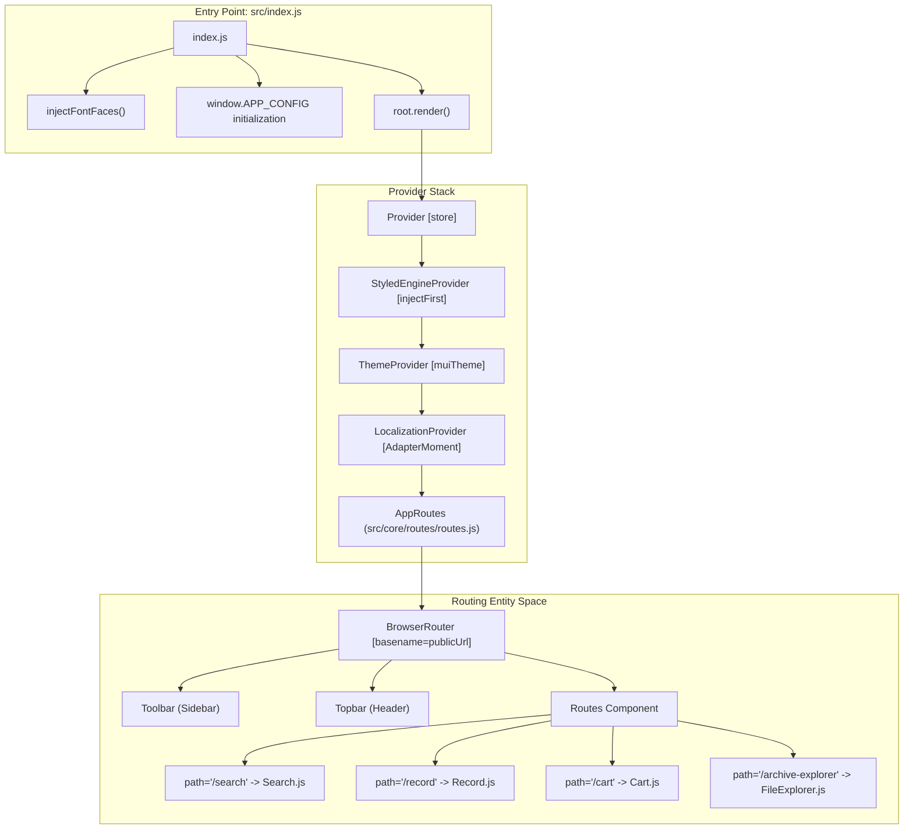
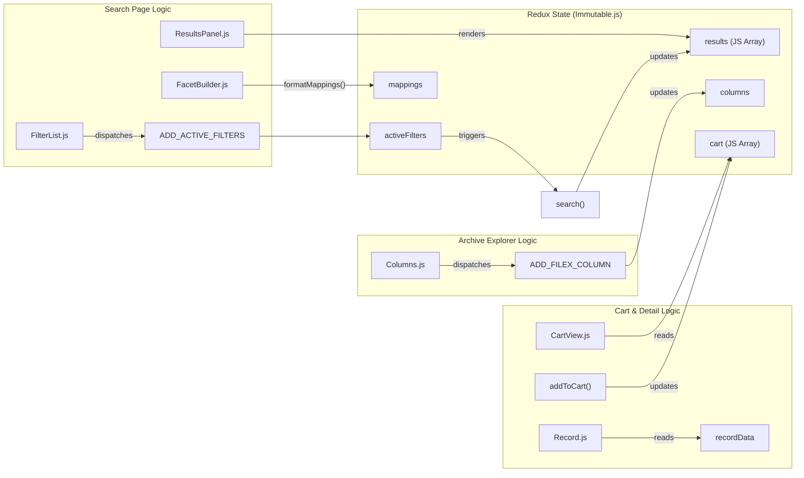

# Page: Application Architecture

# Application Architecture

Relevant source files

The following files were used as context for generating this wiki page:

- [Dockerfile](Dockerfile)
- [public/index.html](public/index.html)
- [scripts/start-prod.js](scripts/start-prod.js)
- [src/core/redux/reducers/reducers.js](src/core/redux/reducers/reducers.js)
- [src/core/redux/store/initial.js](src/core/redux/store/initial.js)
- [src/core/routes/routes.js](src/core/routes/routes.js)
- [src/core/runtimeConfig.js](src/core/runtimeConfig.js)
- [src/facets/FacetBuilder.js](src/facets/FacetBuilder.js)
- [src/index.css](src/index.css)
- [src/index.js](src/index.js)
- [src/themes/index.js](src/themes/index.js)
- [src/themes/light.js](src/themes/light.js)

This page provides a technical overview of the Atlas React/Redux application structure. It covers the system's entry point, routing mechanisms, global state management, the theme system, and the architectural wiring of the four primary functional pages.

## Entry Point and Bootstrapping

The application entry point is `src/index.js`. It initializes the React root and wraps the application in several essential providers that establish the execution context [src/index.js:76-89]().

Key initialization steps include:
1.  **Runtime Configuration Injection**: The system checks for `window.APP_CONFIG`. In production, this object is injected by the Express server [scripts/start-prod.js:172-179]() to provide environment-specific API endpoints (like `API_URL` or `ES_URL`) without rebuilding the container [src/index.js:56-69]().
2.  **Dynamic Font Injection**: To ensure fonts are served correctly regardless of the deployment's `PUBLIC_URL`, `injectFontFaces` dynamically creates CSS `@font-face` rules at runtime by prepending the runtime public URL to webpack-processed asset paths [src/index.js:24-52]().
3.  **Provider Hierarchy**:
    *   `Provider`: Connects the Redux `store` [src/index.js:80]().
    *   `StyledEngineProvider` & `ThemeProvider`: Injects Material UI (MUI) styles and the custom Atlas theme [src/index.js:81-82]().
    *   `LocalizationProvider`: Provides `moment` adapters for date-based filtering [src/index.js:83-85]().

### Application Bootstrapping Diagram
This diagram traces the flow from the entry file to the rendering of the primary route components, bridging the natural language bootstrap process to specific code entities.

**Sources:** [src/index.js:24-89](), [src/core/routes/routes.js:22-55](), [scripts/start-prod.js:158-179]()

## Routing and Layout

The `AppRoutes` component defines the high-level layout and navigation [src/core/routes/routes.js:22-55](). It uses `react-router-dom` for client-side navigation.

*   **Global Layout**: The `Toolbar` (side navigation) and `Topbar` (header) are rendered outside the `Routes` switch, making them persistent across all pages [src/core/routes/routes.js:37-39]().
*   **Initial Data Fetching**: On the first load of the `AppRoutes` component, it dispatches `loadMappings('atlas')` to fetch Elasticsearch index mappings. This metadata is required by `FacetBuilder` to generate dynamic filters [src/core/routes/routes.js:27-29]().
*   **Server-Side Routing**: In production, the Express server handles route requests by rendering an `index.pug` template, which includes the runtime configuration and the React bundle [scripts/start-prod.js:172-179]().

**Sources:** [src/core/routes/routes.js:22-55](), [scripts/start-prod.js:167-179]()

## Global State Shape

Atlas uses Redux with `Immutable.js` for its global state to prevent accidental mutations and optimize performance.

### State Model (INITIAL)
The state is partitioned into functional domains defined in `src/core/redux/store/initial.js`. Notably, the `results` array is kept as a standard JavaScript array (not Immutable) to avoid performance hits when handling large result sets [src/core/redux/store/initial.js:77-78]().

| Domain | Key State Entities | Description |
| :--- | :--- | :--- |
| **Workspace** | `workspace.main` | Controls visibility and sizes of panels (Filters, Secondary/Map, Results) [src/core/redux/store/initial.js:31-40](). |
| **Search** | `activeFilters`, `results`, `resultsPaging` | Holds the current query parameters, result set, and pagination state [src/core/redux/store/initial.js:65-99](). |
| **Mappings** | `mappings.atlas` | Stores the ES field types used by `FacetBuilder` to generate UI controls [src/core/redux/store/initial.js:55-58](). |
| **Archive** | `columns`, `filexPreview` | Manages the multi-column state of the Archive Explorer [src/core/redux/store/initial.js:135-139](). |
| **Cart** | `cart` | An array of items initialized from and persisted to `localStorage` [src/core/redux/store/initial.js:12-20](), [src/core/redux/store/initial.js:142](). |

### Data Flow: Action to Reducer
The application uses a lookup table `reducerFuncs` to map action types to specific transformation functions [src/core/redux/reducers/reducers.js:7-62](). The main `reducers` function intercepts actions and routes them to the appropriate handler [src/core/redux/reducers/reducers.js:64-67]().

**Sources:** [src/core/redux/store/initial.js:27-154](), [src/core/redux/reducers/reducers.js:7-67]()

## Theme System

Atlas utilizes a custom MUI v5 theme defined in `src/themes/light.js`. 

*   **Palette**: Defines custom color swatches (e.g., `swatches.grey`, `swatches.blue`) and functional colors like `accent` and `active` [src/themes/light.js:3-88]().
*   **Head Heights**: A custom array `headHeights: [56, 40, 40, 32, 24]` is used throughout the app to calculate layout offsets for headers and toolbars [src/themes/light.js:94]().
*   **Component Overrides**: Global styles for MUI components like `MuiButton`, `MuiTooltip`, and `MuiSwitch` ensure a consistent NASA/JPL aesthetic. For example, `MuiButton` is customized with specific font sizes and border radii [src/themes/light.js:112-128](). `MuiCheckbox` is styled to use the `active.main` color when checked [src/themes/light.js:191-193]().

**Sources:** [src/themes/light.js:1-245]()

## Main Page Wiring

The application is composed of four main page components, each handling a specific domain of the PDS archive.

### 1. Search Page (`Search.js`)
The Search page is a multi-panel workspace. 
*   **Data Flow**: `FacetBuilder.js` transforms ES mappings (fetched during bootstrap) into a nested UI structure [src/facets/FacetBuilder.js:3-150]().
*   **Filter Logic**: Filters are categorized by type (keyword, text, integer, date) and mapped to specific components like `list`, `slider_range`, or `date_range` [src/facets/FacetBuilder.js:61-137]().

### 2. Archive Explorer (`FileExplorer.js`)
A Miller Columns-style browser for navigating the PDS filesystem hierarchy.
*   **State**: Managed via `columns` in Redux [src/core/redux/store/initial.js:135]().
*   **Actions**: The reducer handles `ADD_FILEX_COLUMN`, `UPDATE_FILEX_COLUMN`, and `REMOVE_FILEX_COLUMN` to maintain the navigation trail [src/core/redux/reducers/reducers.js:45-47]().

### 3. Record Page (`Record.js`)
The product detail view. It fetches specific metadata and labels based on the Atlas URI.
*   **Views**: Managed via the `recordViewTab` state (defaulting to 'overview') [src/core/redux/store/initial.js:132]().
*   **Data**: Product metadata is stored in `recordData` and `labelData` [src/core/redux/store/initial.js:129-130]().

### 4. Cart Page (`Cart.js`)
Manages selected items and facilitates bulk downloads.
*   **Persistence**: Cart state is initialized from `localStorage` [src/core/redux/store/initial.js:12-20]().
*   **Management**: Items are added or removed via `ADD_TO_CART` and `REMOVE_FROM_CART` actions [src/core/redux/reducers/reducers.js:55-57]().

### Page Wiring Entity Diagram
This diagram shows how major UI components interact with the Redux state and actions.

**Sources:** [src/core/redux/store/initial.js:27-154](), [src/core/redux/reducers/reducers.js:7-62](), [src/facets/FacetBuilder.js:3-150]()
