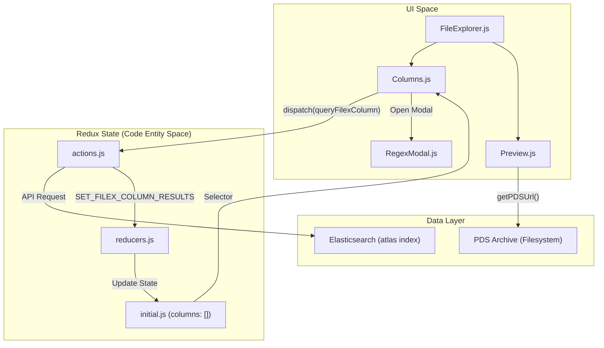
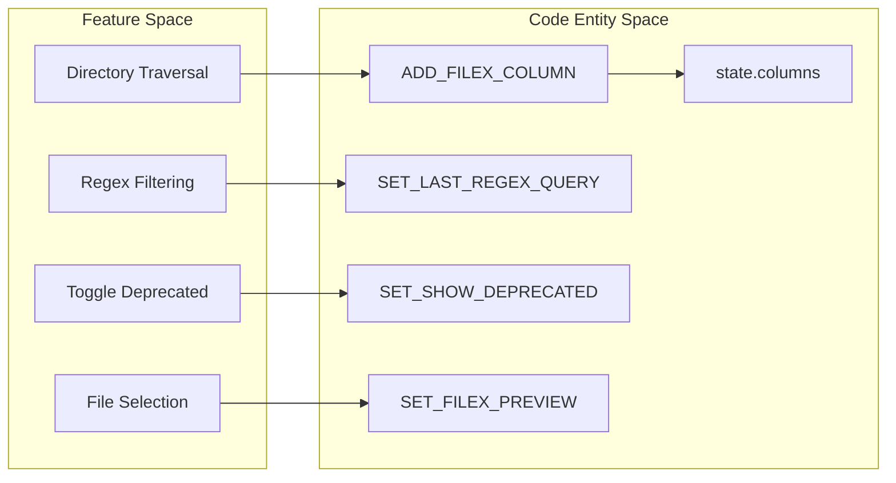

# Page: Archive Explorer (FileExplorer)

# Archive Explorer (FileExplorer)

Relevant source files

The following files were used as context for generating this wiki page:

- [src/core/redux/actions/actions.js](src/core/redux/actions/actions.js)
- [src/pages/Cart/Cart.js](src/pages/Cart/Cart.js)
- [src/pages/FileExplorer/Columns/Columns.js](src/pages/FileExplorer/Columns/Columns.js)
- [src/pages/FileExplorer/FileExplorer.js](src/pages/FileExplorer/FileExplorer.js)
- [src/pages/Record/Content/Views/MLClassification/MLClassification.js](src/pages/Record/Content/Views/MLClassification/MLClassification.js)
- [src/pages/Record/Content/Views/MLClassification/subcomponents/MLLayers/MLLayers.js](src/pages/Record/Content/Views/MLClassification/subcomponents/MLLayers/MLLayers.js)
- [src/pages/Record/Record.js](src/pages/Record/Record.js)
- [src/pages/Search/Search.js](src/pages/Search/Search.js)

The **Archive Explorer** (internally referred to as `FileExplorer`) provides a hierarchical, column-based interface for navigating PDS (Planetary Data System) archives. It allows users to traverse bundles, collections, and directories in a manner similar to the macOS Finder "Columns" view, while providing deep integration with the Atlas search index for filtering and metadata inspection.

### Overview

The Archive Explorer is composed of three primary areas: a header for global controls, a multi-column navigation area for directory traversal, and a preview pane for inspecting individual files. It handles both **PDS3** (volume/folder based) and **PDS4** (bundle/collection based) data structures seamlessly by abstracting them into a unified URI-based navigation tree.

### Core Architecture

The `FileExplorer` component serves as the layout wrapper, managing the responsive split between the navigation columns and the preview pane. It utilizes Material UI for styling and `react-draggable` for adjustable pane widths [src/pages/FileExplorer/FileExplorer.js:20-22]().

| Component | File Path | Responsibility |
| :--- | :--- | :--- |
| `FileExplorer` | [src/pages/FileExplorer/FileExplorer.js:93-240]() | Main layout container; handles responsive breakpoints, split-pane resizing, and rendering `RegexModal`. |
| `Heading` | [src/pages/FileExplorer/Heading/Heading.js]() | Global toolbar for the explorer, including sorting options and navigation controls. |
| `Columns` | [src/pages/FileExplorer/Columns/Columns.js:71-221]() | The primary navigation engine; renders a horizontal list of directory columns using `ViewSlider`. |
| `Preview` | [src/pages/FileExplorer/Preview/Preview.js]() | Displays metadata, browse images, and actions (like "Add to Cart") for the currently selected file. |

#### System Interaction Diagram
This diagram illustrates how the `FileExplorer` interacts with the Redux state and the underlying PDS data structures.

Sources: [src/pages/FileExplorer/FileExplorer.js:176-212](), [src/core/redux/actions/actions.js:70-79](), [src/pages/FileExplorer/Columns/Columns.js:20-30]()

### Navigation and Data Handling

The explorer uses a "linked-list" approach to columns managed in the Redux store. Selecting an item in column $N$ triggers a query that populates column $N+1$.

*   **URI-Based Navigation**: Every node in the explorer is identified by an Atlas URI. The `splitUri` utility is used to parse these identifiers to determine the current mission, bundle, or path [src/core/utils.js:11-12]().
*   **PDS3 vs PDS4**: The system abstracts PDS4 LIDVIDs and PDS3 volume paths. It uses the `parent_uri` field in Elasticsearch to find children of a selected directory [src/pages/FileExplorer/Columns/Columns.js:24]().
*   **Filtering and Sorting**: Users can sort by Folders, Files, A-Z, or Z-A [src/pages/FileExplorer/FileExplorer.js:202-208](). Advanced filtering is supported via regex patterns applied to specific directory levels.
*   **Deprecated Data**: A global toggle allows users to show or hide deprecated products, which are visually distinguished by a specific color code (`#834325`) [src/pages/FileExplorer/Columns/Columns.js:69-79]().

#### Component and Action Mapping
This diagram maps high-level Archive Explorer features to specific Redux actions and state keys.

Sources: [src/core/redux/actions/actions.js:70-79](), [src/pages/FileExplorer/Columns/Columns.js:20-30]()

### Subsystems

The Archive Explorer's functionality is detailed across the following child pages:

#### [Column Navigation](#4.1)
Covers the implementation of the `Columns.js` component, including the logic for `queryFilexColumn` [src/pages/FileExplorer/Columns/Columns.js:24](). It details how the application constructs Elasticsearch queries using `parent_uri`, handles infinite scrolling within a single directory column, and manages the horizontal scroll behavior when new columns are added.
For details, see [Column Navigation](#4.1).

#### [File Preview and Regex Modal](#4.2)
Focuses on the `Preview.js` pane and the `RegexModal.js` [src/pages/FileExplorer/FileExplorer.js:7-9](). This includes how the application fetches detailed metadata for a selected item, renders browse images using `getPDSUrl`, and provides the interface for advanced URI-pattern filtering within a directory level.
For details, see [File Preview and Regex Modal](#4.2).

### Archive Explorer State Shape
The state for this page is initialized in the Redux store and managed via specific FileX actions [src/core/redux/actions/actions.js:70-79]().

| State Key | Type | Purpose |
| :--- | :--- | :--- |
| `columns` | `Array` | List of active column objects, including results, query parameters, and scroll position. |
| `filexPreview` | `Object` | Metadata for the currently selected file used by the Preview pane. |
| `showDeprecated` | `Boolean` | Flag to include or exclude deprecated PDS products from directory listings. |
| `lastRegexQuery` | `String` | The most recent pattern used in the Regex Modal for persistent filtering. |

Sources: [src/core/redux/actions/actions.js:70-79](), [src/pages/FileExplorer/Columns/Columns.js:20-30]()
