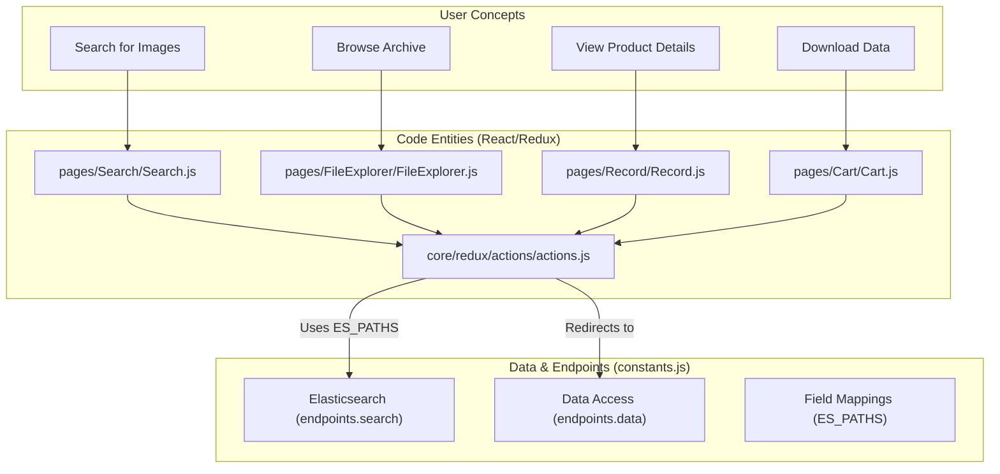
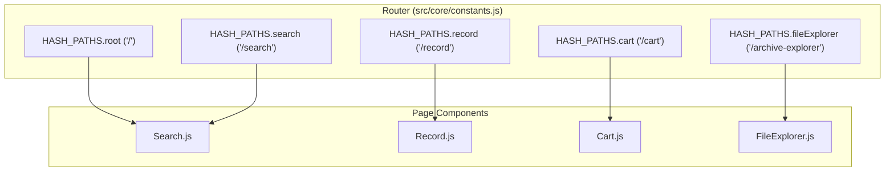

# Page: Atlas Overview

# Atlas Overview

Relevant source files

The following files were used as context for generating this wiki page:

- [.env](.env)
- [README.md](README.md)
- [docs/images/atlas_archiveexplorer.png](docs/images/atlas_archiveexplorer.png)
- [docs/images/atlas_search.png](docs/images/atlas_search.png)
- [src/core/constants.js](src/core/constants.js)
- [src/pages/Cart/Cart.js](src/pages/Cart/Cart.js)
- [src/pages/FileExplorer/FileExplorer.js](src/pages/FileExplorer/FileExplorer.js)
- [src/pages/Record/Content/Views/MLClassification/MLClassification.js](src/pages/Record/Content/Views/MLClassification/MLClassification.js)
- [src/pages/Record/Content/Views/MLClassification/subcomponents/MLLayers/MLLayers.js](src/pages/Record/Content/Views/MLClassification/subcomponents/MLLayers/MLLayers.js)
- [src/pages/Record/Record.js](src/pages/Record/Record.js)
- [src/pages/Search/Search.js](src/pages/Search/Search.js)

Atlas IV is the primary imagery search and data access application for the **PDS Cartography and Imaging Sciences Node (PDSIMG)**. It provides a web-based interface for scientists and the public to discover, visualize, and download planetary data from NASA's Planetary Data System (PDS).

The application serves as a bridge between high-level scientific queries (spatial, temporal, and metadata-based) and the underlying PDS archive, which is indexed in an Elasticsearch backend [src/core/constants.js:23-25]().

## System Capabilities

*   **Full Imagery Search**: Comprehensive filtering across missions (e.g., Cassini, Mars 2020), instruments, and planetary bodies [src/core/constants.js:149-219]().
*   **Spatial Search**: Interactive map-based bounding box and coordinate queries [README.md:19]().
*   **Archive Exploration**: Column-based navigation of the PDS bundle and collection hierarchy [src/pages/FileExplorer/FileExplorer.js:6,178]().
*   **Data Visualization**: Integrated image viewers via `OpenSeadragonViewer` and 3D model viewers for `.obj` and `.dae` files [src/pages/Record/Content/Views/MLClassification/MLClassification.js:15](), [src/core/constants.js:147]().
*   **Machine Learning Integration**: Visualization of ML classification overlays on planetary imagery with confidence filtering [src/pages/Record/Content/Views/MLClassification/MLClassification.js:68-70,163-165]().
*   **Cart & Bulk Download**: Systems for staging products and generating platform-specific download scripts (CURL/WGET) or ZIP streams [src/core/constants.js:12,43]().

## High-Level Architecture

Atlas is a single-page application (SPA) built with **React** and **Redux**, styled using **Material UI (MUI)** [src/pages/Search/Search.js:4-6,42](). It relies on a centralized Redux store that uses **Immutable.js** for state management [src/pages/Record/Record.js:43-45]().

### Natural Language to Code Entity Mapping

The following diagram illustrates how user-facing concepts map to specific architectural entities and configuration paths within the codebase.

**System Concept Mapping**

Sources: [src/pages/Search/Search.js:8-10](), [src/pages/FileExplorer/FileExplorer.js:93-100](), [src/pages/Record/Record.js:12-13](), [src/core/constants.js:21-30,45-105]()

## Major Subsystems

The application is divided into four primary functional areas, managed by routes defined in the application constants [src/core/constants.js:34-41]().

### 1. Search and Filtering
The Search page is the entry point for most users. It features a three-panel layout: `FiltersPanel`, `SecondaryPanel` (Map), and `ResultsPanel` [src/pages/Search/Search.js:8-10,77-81]().
*   **Details**: See [Search Page](#3) and [Filters Panel](#3.1).

### 2. Archive Explorer
Known internally as `FileExplorer`, this subsystem provides a "Finder-like" column interface to navigate the physical PDS archive structure, utilizing the `archive` field mappings in Elasticsearch [src/pages/FileExplorer/FileExplorer.js:178](), [src/core/constants.js:89-101]().
*   **Details**: See [Archive Explorer (FileExplorer)](#4).

### 3. Product Records
The `Record` page provides deep inspection of a single PDS product. It fetches data via `searchRecordByURI` and supports multiple views including `MLClassification` for overlaying machine learning features [src/pages/Record/Record.js:12,47-48](), [src/pages/Record/Content/Views/MLClassification/MLClassification.js:153-190]().
*   **Details**: See [Record (Product Detail) Page](#5).

### 4. Cart and Download
The Cart manages a collection of selected items (files, directories, or entire queries). It uses `localStorage` identified by `ATLAS_CART` for persistence [src/pages/Cart/Cart.js:29-32](), [src/core/constants.js:43]().
*   **Details**: See [Cart and Download System](#6).

## Navigation and Routing

Atlas uses `react-router-dom` to manage navigation. The application root defines the primary routes based on `HASH_PATHS` [src/core/constants.js:34-41]().

**Application Route Structure**

Sources: [src/core/constants.js:34-41](), [src/pages/Search/Search.js:35](), [src/pages/Record/Record.js:28](), [src/pages/Cart/Cart.js:18](), [src/pages/FileExplorer/FileExplorer.js:93]()

## Child Pages

For detailed technical documentation on specific areas of the Atlas application, refer to the following sections:

*   **[Getting Started](#1.1)**: Developer onboarding, including Node.js requirements (v20.13.1+), environment setup via `.env`, and build commands (`npm run build`, `npm run start`) [README.md:31-53](), [.env:1-14]().
*   **[Application Architecture](#1.2)**: Overview of the React/Redux structure, global state management using Immutable.js, and the `window.APP_CONFIG` runtime configuration pattern for dynamic endpoint resolution [src/core/constants.js:16-19](), [src/pages/Record/Record.js:43-45]().

---
**Sources:**
*   [src/core/constants.js:1-219]()
*   [README.md:1-88]()
*   [.env:1-19]()
*   [src/pages/Search/Search.js:1-95]()
*   [src/pages/Record/Record.js:1-146]()
*   [src/pages/FileExplorer/FileExplorer.js:1-194]()
*   [src/pages/Cart/Cart.js:1-39]()
*   [src/pages/Record/Content/Views/MLClassification/MLClassification.js:1-198]()
*   [src/pages/Record/Content/Views/MLClassification/subcomponents/MLLayers/MLLayers.js:1-112]()
