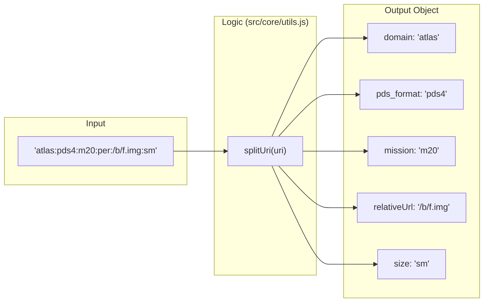

# Page: Atlas URI Schema

# Atlas URI Schema

<details>
<summary>Relevant source files</summary>

The following files were used as context for generating this wiki page:

- [.env](.env)
- [Documenation/.gitignore](Documenation/.gitignore)
- [Documenation/README.md](Documenation/README.md)
- [Documenation/babel.config.js](Documenation/babel.config.js)
- [Documenation/build-to-build.js](Documenation/build-to-build.js)
- [Documenation/docs/api/_category_.json](Documenation/docs/api/_category_.json)
- [Documenation/docs/api/archive.md](Documenation/docs/api/archive.md)
- [Documenation/docs/api/data-access.md](Documenation/docs/api/data-access.md)
- [Documenation/docs/api/search.md](Documenation/docs/api/search.md)
- [Documenation/docs/api/uri.md](Documenation/docs/api/uri.md)
- [src/components/Filter/subcomponents/ListFilter/ListFilter.js](src/components/Filter/subcomponents/ListFilter/ListFilter.js)
- [src/core/constants.js](src/core/constants.js)
- [src/core/utils.js](src/core/utils.js)

</details>


Atlas 4 utilizes a custom internal Uniform Resource Identifier (URI) schema to act as a unique identifier (UUID) for all data holdings. Unlike the standardized PDS4 Logical Identifier (LID), the Atlas URI is designed to be a bridge between PDS3 and PDS4 standards, providing a consistent addressing format for products, labels, ancillary files, and directories across different missions [Documenation/docs/api/uri.md:7-12]().

## 1. URI Structure

The Atlas URI follows a specific hierarchical breakdown, separated by colons and slashes.

### Scheme Breakdown
```text
atlas:{standard}:{mission}:{spacecraft}:/{bundleName?}{restOfPath?}{::release_id?}{:size?}
```

| Component | Description | Values / Examples |
| :--- | :--- | :--- |
| `atlas` | The fixed scheme prefix for all Atlas 4 URIs [Documenation/docs/api/uri.md:19-21](). | `atlas` |
| `{standard}` | The PDS standard the data adheres to [Documenation/docs/api/uri.md:23-28](). | `pds3`, `pds4` |
| `{mission}` | The name of the mission [Documenation/docs/api/uri.md:30-34](). | `mars_2020`, `cassini`, `mro` |
| `{spacecraft}` | The name of the spacecraft [Documenation/docs/api/uri.md:36-40](). | `perseverance`, `cassini_orbiter` |
| `{bundleName}` | The volume name (PDS3) or bundle name (PDS4) [Documenation/docs/api/uri.md:42-44](). | `mars2020_helicam` |
| `{restOfPath}` | The relative path to the file or directory. Directories do not end with a trailing slash [Documenation/docs/api/uri.md:46-48](). | `/data/sol/00649/image.img` |
| `{::release_id}` | **Optional.** Internal PDSIMG delivery version [Documenation/docs/api/uri.md:50-52](). | `::9`, `::10` |
| `{:size}` | **Optional.** Used for on-the-fly image resizing via the Data API [Documenation/docs/api/data-access.md:21-26](). | `:xs`, `:sm`, `:md`, `:lg` |

### Code Entity Mapping: URI Components to Constants
The following diagram bridges the conceptual URI components to the `ES_PATHS` configuration used throughout the Redux store and Elasticsearch queries.

**URI Metadata Mapping**
```mermaid
graph TD
    subgraph "Natural Language Space"
        URI["Atlas URI String"]
        MISSION["Mission Name"]
        SC["Spacecraft"]
        REL["Release ID"]
    end

    subgraph "Code Entity Space (src/core/constants.js)"
        ES_PATHS["ES_PATHS Object"]
        URI_PATH["ES_PATHS.uri"]
        MISSION_PATH["ES_PATHS.mission"]
        SC_PATH["ES_PATHS.spacecraft"]
        REL_PATH["ES_PATHS.release_id"]
    end

    URI --> URI_PATH
    MISSION --> MISSION_PATH
    SC --> SC_PATH
    REL --> REL_PATH
    
    URI_PATH ---|["'uri'"]| ES_PATHS
    MISSION_PATH ---|["'gather', 'common', 'mission'"]| ES_PATHS
    SC_PATH ---|["'gather', 'common', 'spacecraft'"]| ES_PATHS
    REL_PATH ---|["'release_id_num'"]| ES_PATHS
```
Sources: [src/core/constants.js:45-70](), [Documenation/docs/api/uri.md:15-17]()

---

## 2. Parsing URIs with `splitUri()`

The `splitUri` function in `src/core/utils.js` is the primary utility for deconstructing an Atlas URI into a JavaScript object for programmatic use.

### Implementation Detail
The function splits the URI string by the `:` delimiter and maps the resulting array to specific keys [src/core/utils.js:76-89]().

```javascript
export const splitUri = (uri, get) => {
    if (uri == null) return get == null ? {} : ''

    const split = uri.split(':')

    const s = {
        domain: split[0],      // "atlas"
        pds_format: split[1],  // "pds3" or "pds4"
        mission: split[2],     // e.g., "mars_2020"
        spacecraft: split[3],  // e.g., "perseverance"
        relativeUrl: split[4], // "/bundle/path/to/file.img"
        bundle: split[4] && split[4].length > 0 ? split[4].split('/')[1] : null,
        size: split[5],        // e.g., "md"
    }
    if (get) {
        if (get == 'spacecraft') return `${s.domain}:${s.pds_format}:${s.mission}:${s.spacecraft}:`
        if (get == 'spacecraft/')
            return `${s.domain}:${s.pds_format}:${s.mission}:${s.spacecraft}:/`
    }
    return s
}
```

### Data Flow: URI Parsing

Sources: [src/core/utils.js:76-96]()

---

## 3. URI Resolution and Data Access

The Atlas application resolves these internal URIs to publicly accessible URLs via the `getPDSUrl` utility. This is essential for rendering images or providing download links.

### `getPDSUrl` Function
This function constructs a full URL by combining the API domain, the data endpoint, and the URI components [src/core/utils.js:50-57]().

1.  **Base URL**: Prepends `domain` and `endpoints.data` (e.g., `https://pds-imaging.jpl.nasa.gov/api/data`) [src/core/constants.js:19-22]().
2.  **Release ID**: If a `release_id` is provided, it appends `::${release_id}` [src/core/utils.js:54-55]().
3.  **Resizing**: If a size (`xs`, `sm`, `md`, `lg`) is requested and valid per `AVAILABLE_URI_SIZES`, it appends `:${size}` [src/core/utils.js:52-53](), [src/core/constants.js:130]().

### Example Resolution
| Input URI | Release ID | Size | Resolved API URL |
| :--- | :--- | :--- | :--- |
| `atlas:pds4:m20:per:/path/img.png` | `null` | `null` | `.../api/data/atlas:pds4:m20:per:/path/img.png` |
| `atlas:pds4:m20:per:/path/img.png` | `10` | `md` | `.../api/data/atlas:pds4:m20:per:/path/img.png::10:md` |

Sources: [src/core/utils.js:50-57](), [Documenation/docs/api/data-access.md:27-32](), [src/core/constants.js:130]()

---

## 4. URI Application in Search and Records

URIs serve as the primary key for retrieving metadata and establishing relationships between documents in Elasticsearch.

### Search and Archive Hierarchy
In the `atlas` index, every document contains a `uri`. The hierarchy in the Archive Explorer is managed via the `archive.parent_uri` field [Documenation/docs/api/archive.md:9-25]().

- **Parent Linking**: To find children of a directory, the system queries for documents where `archive.parent_uri` matches the directory's `uri` [Documenation/docs/api/archive.md:30-36]().

### Related Products Mapping
The `gather.pds_archive.related` object uses URIs to link primary products to their labels and browse images [src/core/constants.js:65-67]():
- **Label URI**: `ES_PATHS.label` maps to `['gather', 'pds_archive', 'related', 'label', 'uri']`.
- **Browse URI**: `ES_PATHS.browse` maps to `['gather', 'pds_archive', 'related', 'browse', 'uri']`.

### Filename Extraction
The utility `getFilename(url)` is used to extract the name from a URI or URL, stripping the path and any `::release_id` suffix [src/core/utils.js:98-105]().

Sources: [Documenation/docs/api/search.md:41-48](), [Documenation/docs/api/archive.md:76-86](), [src/core/utils.js:98-105](), [src/core/constants.js:45-105]()
