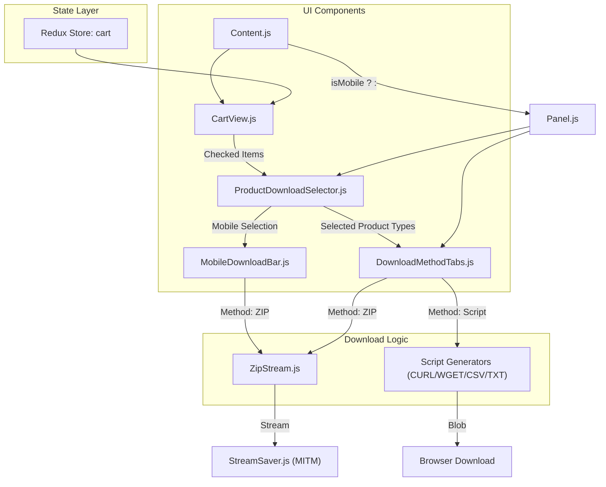
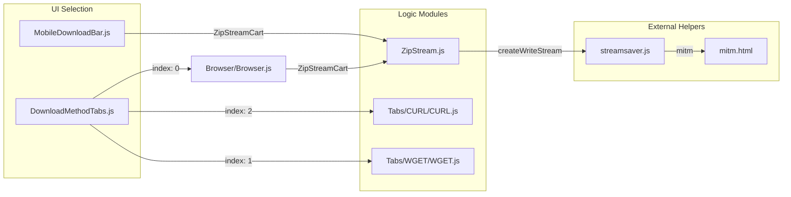

# Page: Cart and Download System

# Cart and Download System

Relevant source files

The following files were used as context for generating this wiki page:

- [src/components/ProductDownloadSelector/ProductDownloadSelector.js](src/components/ProductDownloadSelector/ProductDownloadSelector.js)
- [src/core/downloaders/ZipStream.js](src/core/downloaders/ZipStream.js)
- [src/pages/Cart/Content/CartView/CartView.js](src/pages/Cart/Content/CartView/CartView.js)
- [src/pages/Cart/Content/Content.js](src/pages/Cart/Content/Content.js)
- [src/pages/Cart/Content/MobileDownloadBar/MobileDownloadBar.js](src/pages/Cart/Content/MobileDownloadBar/MobileDownloadBar.js)
- [src/pages/Cart/Content/Panel/DownloadMethodTabs.js](src/pages/Cart/Content/Panel/DownloadMethodTabs.js)
- [src/pages/Cart/Content/Panel/Panel.js](src/pages/Cart/Content/Panel/Panel.js)

The Cart and Download system is the final stage of the Atlas data acquisition pipeline. It allows users to aggregate diverse data entities—ranging from individual files and images to complex search queries and directory structures—into a unified "Cart" for bulk processing and retrieval. The system supports multiple download methodologies, including client-side ZIP streaming and the generation of platform-specific shell scripts (CURL/WGET).

## System Architecture

The cart is managed as a global Redux state slice that persists to the browser's `localStorage`. The download pipeline is split between the **Cart View** (item management) and the **Download Panel** (method selection and execution).

### Cart to Download Flow
The following diagram illustrates how items in the `cart` state are transformed into download streams or scripts via the `ProductDownloadSelector` and various downloader modules.

**Diagram: Cart Processing Pipeline**

Sources: [src/pages/Cart/Content/Content.js:26-27](), [src/pages/Cart/Content/CartView/CartView.js:231-233](), [src/components/ProductDownloadSelector/ProductDownloadSelector.js:100-103](), [src/pages/Cart/Content/Panel/DownloadMethodTabs.js:92-118](), [src/core/downloaders/ZipStream.js:17-41](), [src/pages/Cart/Content/MobileDownloadBar/MobileDownloadBar.js:102-105]()

## Cart Item Types

The Cart supports five distinct item types, each handled differently during the download resolution process. These types are visualized in the `CartView` grid with specific icons and metadata overlays.

| Type | Source Component | Resolution Strategy |
| :--- | :--- | :--- |
| `image` | Search Results / Record Page | Direct URI mapping to PDS/Atlas assets. |
| `file` | Archive Explorer | Direct URI mapping to PDS/Atlas assets. |
| `query` | Search Results (Bulk Add) | Recursive Elasticsearch scroll to resolve all matching URIs. |
| `directory` | Archive Explorer (Bulk Add) | Recursive resolution of all child files within the PDS path. |
| `regex` | Archive Explorer (Regex Modal) | Filtered resolution of directory contents based on pattern matching. |

Sources: [src/pages/Cart/Content/CartView/CartView.js:100-122](), [src/core/downloaders/ZipStream.js:94-111]()

## Download Panel Components

The `Panel.js` component [src/pages/Cart/Content/Panel/Panel.js:70]() houses the configuration interface for initiating downloads. It coordinates between selecting which product components to download (e.g., just the data, or data + labels) and the technical method used to retrieve them.

### Product Download Selector
The `ProductDownloadSelector` [src/components/ProductDownloadSelector/ProductDownloadSelector.js:93]() allows users to filter the specific facets of a product they wish to download. It categorizes assets into:
*   **Source Products**: The primary data files (`src`) [src/components/ProductDownloadSelector/ProductDownloadSelector.js:108]().
*   **Metadata Products**: PDS Labels (`label`) [src/components/ProductDownloadSelector/ProductDownloadSelector.js:117]().
*   **Browse Products**: Various image sizes (`browse`, `full`, `lg`, `md`, `sm`, `xs`, `tile`) [src/components/ProductDownloadSelector/ProductDownloadSelector.js:125-144]().

It dynamically calculates the total size and item count by iterating over the `checkedCart` items [src/components/ProductDownloadSelector/ProductDownloadSelector.js:157-191]().

### Download Method Tabs
The `DownloadMethodTabs` [src/pages/Cart/Content/Panel/DownloadMethodTabs.js:84]() component provides the interface for selecting the delivery mechanism:
1.  **ZIP**: Client-side bundling using `ZipStream.js` [src/pages/Cart/Content/Panel/DownloadMethodTabs.js:95]().
2.  **WGET/CURL**: Generation of command-line scripts [src/pages/Cart/Content/Panel/DownloadMethodTabs.js:100-105]().
3.  **CSV/TXT**: Manifest files containing direct URLs [src/pages/Cart/Content/Panel/DownloadMethodTabs.js:110-115]().

Sources: [src/pages/Cart/Content/Panel/Panel.js:118-129](), [src/components/ProductDownloadSelector/ProductDownloadSelector.js:106-146]()

## Download Implementation

### ZIP Streaming
The `ZipStream.js` module implements a high-performance, memory-efficient download mechanism using `streamsaver` and a Man-In-The-Middle (MITM) service [src/core/downloaders/ZipStream.js:8-12](). Instead of buffering the entire ZIP in memory, it "pulls" data from the source and streams it directly to the filesystem. It handles `query` and `directory` items by performing asynchronous Elasticsearch scrolls to resolve URIs into downloadable URLs [src/core/downloaders/ZipStream.js:94-111]().

### Script and Manifest Generation
For non-ZIP methods, the system generates text-based files. For large datasets (e.g., > 500k rows), the system automatically segments the output into multiple files to prevent browser crashes and ensure compatibility with command-line tool limits.

For details on item management and the masonry grid, see [Cart View and Item Management](#6.1).
For details on script-based downloads (CURL/WGET), see [Download Formats: CURL, WGET, CSV, TXT](#6.2).
For details on the streaming ZIP architecture, see [ZIP Stream Download](#6.3).

**Code Entity Map: Download Execution**

Sources: [src/pages/Cart/Content/Panel/DownloadMethodTabs.js:171-195](), [src/core/downloaders/ZipStream.js:11-12](), [src/pages/Cart/Content/MobileDownloadBar/MobileDownloadBar.js:15-16]()
