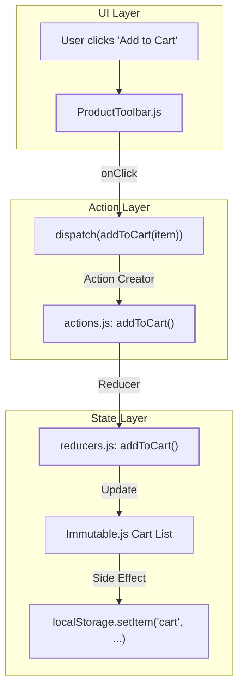
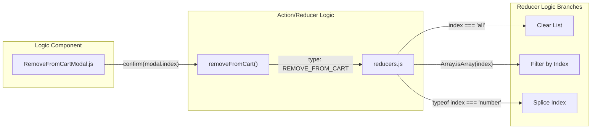

# Page: Cart View and Item Management

# Cart View and Item Management

Relevant source files

The following files were used as context for generating this wiki page:

- [src/components/MenuButton/MenuButton.js](src/components/MenuButton/MenuButton.js)
- [src/components/ProductToolbar/ProductToolbar.js](src/components/ProductToolbar/ProductToolbar.js)
- [src/core/downloaders/ZipStream.js](src/core/downloaders/ZipStream.js)
- [src/pages/Cart/Content/CartView/CartView.js](src/pages/Cart/Content/CartView/CartView.js)
- [src/pages/Cart/Modals/RemoveFromCartModal/RemoveFromCartModal.js](src/pages/Cart/Modals/RemoveFromCartModal/RemoveFromCartModal.js)
- [src/pages/Cart/Title/Title.js](src/pages/Cart/Title/Title.js)
- [src/pages/Search/Modals/AddFilterModal/AddFilterModal.js](src/pages/Search/Modals/AddFilterModal/AddFilterModal.js)
- [src/pages/Search/Panels/ResultsPanel/subcomponents/ResultsStatus/ResultsStatus.js](src/pages/Search/Panels/ResultsPanel/subcomponents/ResultsStatus/ResultsStatus.js)

The Cart system in Atlas provides a staging area for users to collect diverse data products—ranging from individual files to entire search queries—before initiating a download. The `CartView` utilizes a masonry grid to display these items, supporting multiple item types and persistent state across browser sessions.

## Cart Item Types

The cart is polymorphic, handling five distinct types of data references. Each type is rendered with specific iconography and metadata in the `CartView` [src/pages/Cart/Content/CartView/CartView.js:100-164]().

| Type | Description | Source Code Entity |
| :--- | :--- | :--- |
| **Query** | A saved Elasticsearch search query. Includes a result count badge [src/pages/Cart/Content/CartView/CartView.js:179-193](). | `currentItem.type === 'query'` |
| **Directory** | A PDS directory URI from the File Explorer. | `currentItem.type === 'directory'` |
| **Regex** | A URI pattern defined via the Regex Modal in File Explorer. | `currentItem.type === 'regex'` |
| **Image** | A single browseable product, usually with a thumbnail. | `currentItem.type === 'image'` |
| **File** | A single non-image file product. | `currentItem.type === 'file'` |

**Sources:** [src/pages/Cart/Content/CartView/CartView.js:30-34](), [src/pages/Cart/Content/CartView/CartView.js:100-164]().

## Cart State and Persistence

Cart state is managed via Redux using an Immutable.js list [src/pages/Cart/Content/CartView/CartView.js:231-233](). To ensure user data is not lost between sessions, the cart is synchronized with `localStorage`.

*   **Initialization**: On application load, the state is initialized from `localStorage`. Any items marked as `checked` are reset to `false` to prevent accidental bulk actions on startup.
*   **Storage**: The `addToCart` and `removeFromCart` reducers update the Redux state, which is subsequently persisted to `localStorage`.

### Data Flow: Adding to Cart

The following diagram illustrates the flow from a UI interaction (like clicking a button in `ProductToolbar`) to the Redux state update.

**Natural Language to Code Entity: Cart Addition Flow**

**Sources:** [src/components/ProductToolbar/ProductToolbar.js:235-245](), [src/core/redux/actions/actions.js:17-24]().

## CartView Implementation

The `CartView` component uses `masonic` for a high-performance virtualized masonry grid [src/pages/Cart/Content/CartView/CartView.js:15-21](). This is necessary to handle large carts without degrading UI responsiveness.

### Key Components
1.  **Masonry Grid**: Uses `usePositioner` to calculate item placement based on a fixed `gridItemHeight` of 170px [src/pages/Cart/Content/CartView/CartView.js:49-244]().
2.  **ProductToolbar**: Every item in the grid is wrapped with a `ProductToolbar`, providing actions for selection, removal, and individual file download [src/components/ProductToolbar/ProductToolbar.js:149-183]().
3.  **Empty State**: If the cart is empty, a message is displayed with navigation buttons to the Search or File Explorer pages [src/pages/Cart/Content/CartView/CartView.js:194-224]().
4.  **Cart Title**: The `Title` component provides bulk actions like "Remove Selected Items" and "Empty Cart", which trigger the `RemoveFromCartModal` [src/pages/Cart/Title/Title.js:105-126]().

### Item Management Actions
Actions are dispatched via `src/core/redux/actions/actions.js`.

*   **`addToCart(item)`**: Adds a new item object. If the item is a query, it includes the DSL; if a file, it includes the URI.
*   **`removeFromCart(index)`**: Removes an item by its index in the list. This can target a single index, an array of indices, or "all" [src/pages/Cart/Modals/RemoveFromCartModal/RemoveFromCartModal.js:140]().
*   **`checkItemInCart(index)`**: Toggles the `checked` property of a cart item, used for bulk download operations [src/components/ProductToolbar/ProductToolbar.js:207-210]().

**Natural Language to Code Entity: Item Removal Logic**

**Sources:** [src/pages/Cart/Modals/RemoveFromCartModal/RemoveFromCartModal.js:134-145](), [src/pages/Cart/Modals/RemoveFromCartModal/RemoveFromCartModal.js:100-114](), [src/pages/Cart/Title/Title.js:105-126]().

## ProductToolbar Integration

The `ProductToolbar` is a shared component used in Search Results, File Explorer, and the Cart [src/components/ProductToolbar/ProductToolbar.js:149-150](). It adapts its behavior based on the `isCart` prop:

*   **In Search/FileX**: It checks if the product URI already exists in the cart to toggle the `AddShoppingCartIcon` or `RemoveShoppingCartIcon` [src/components/ProductToolbar/ProductToolbar.js:165-173]().
*   **In Cart**: It provides a checkbox for selecting items for bulk actions and a button to trigger the `RemoveFromCartModal` [src/components/ProductToolbar/ProductToolbar.js:200-211]().

## ZipStream Integration

For browser-based ZIP downloads, the system uses `ZipStreamCart` to iterate through the `checkedCart` and stream files directly to the user [src/core/downloaders/ZipStream.js:17-41]().

*   **Filtering**: Only items with `checked === true` are processed for download [src/core/downloaders/ZipStream.js:29]().
*   **Polymorphic Fetching**: The downloader handles queries, directories, and regex items by performing Elasticsearch scrolls via `getQuery`, while individual images/files are fetched via `getImage` [src/core/downloaders/ZipStream.js:91-111]().
*   **Collision Avoidance**: Files are organized within the ZIP using a `${currentItemIdx}_${currentItem.type}/` directory structure to prevent name collisions [src/core/downloaders/ZipStream.js:151]().

**Sources:**
* `src/pages/Cart/Content/CartView/CartView.js` [1-245]()
* `src/components/ProductToolbar/ProductToolbar.js` [149-280]()
* `src/core/redux/actions/actions.js` [17-24]()
* `src/pages/Cart/Modals/RemoveFromCartModal/RemoveFromCartModal.js` [79-167]()
* `src/pages/Cart/Title/Title.js` [82-130]()
* `src/core/downloaders/ZipStream.js` [17-194]()
