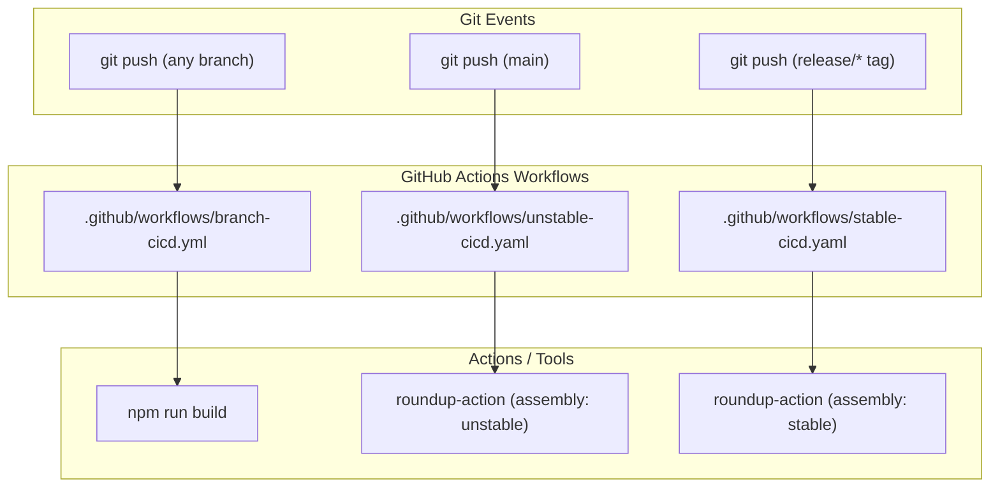
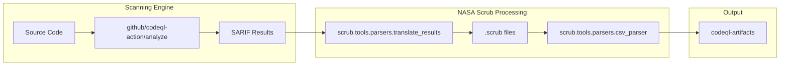
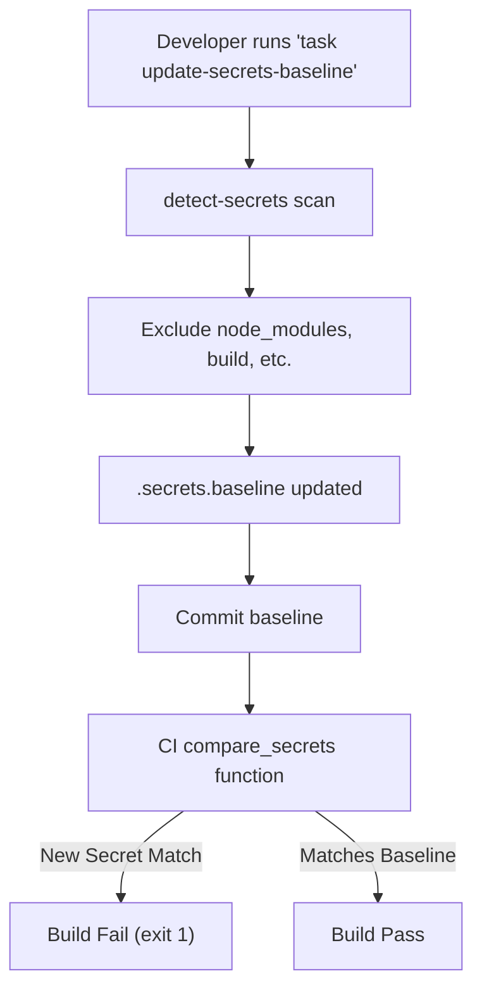

# Page: CI/CD and Repository Governance

# CI/CD and Repository Governance

Relevant source files

The following files were used as context for generating this wiki page:

- [.github/CODEOWNERS](.github/CODEOWNERS)
- [.github/ISSUE_TEMPLATE/-bug_report.yml](.github/ISSUE_TEMPLATE/-bug_report.yml)
- [.github/ISSUE_TEMPLATE/-feature_request.yml](.github/ISSUE_TEMPLATE/-feature_request.yml)
- [.github/ISSUE_TEMPLATE/-vulnerability-issue.yml](.github/ISSUE_TEMPLATE/-vulnerability-issue.yml)
- [.github/ISSUE_TEMPLATE/config.yml](.github/ISSUE_TEMPLATE/config.yml)
- [.github/ISSUE_TEMPLATE/task.yml](.github/ISSUE_TEMPLATE/task.yml)
- [.github/dependabot.yml](.github/dependabot.yml)
- [.github/pull_request_template.md](.github/pull_request_template.md)
- [.github/workflows/branch-cicd.yml](.github/workflows/branch-cicd.yml)
- [.github/workflows/codeql.yml](.github/workflows/codeql.yml)
- [.github/workflows/secrets-detection.yaml](.github/workflows/secrets-detection.yaml)
- [.github/workflows/stable-cicd.yaml](.github/workflows/stable-cicd.yaml)
- [.github/workflows/unstable-cicd.yaml](.github/workflows/unstable-cicd.yaml)
- [.secrets.baseline](.secrets.baseline)
- [NOTICE.txt](NOTICE.txt)
- [Taskfile.yml](Taskfile.yml)

This page details the automation, security, and governance structures that manage the Atlas codebase. It covers the lifecycle of a code change from local development tasks and secret detection to automated builds, security scanning via CodeQL and `nasa-scrub`, and final delivery through stable and unstable release pipelines.

## CI/CD Pipeline Architecture

Atlas utilizes GitHub Actions to manage three distinct delivery tiers: Branch Validation, Unstable Assembly (Main), and Stable Assembly (Releases).

### 1. Branch Validation
Every push to any branch triggers the `Node.js Compatibility Workflow` [.github/workflows/branch-cicd.yml:4-9](). This workflow ensures that the code remains compatible with the project's defined Node.js environment.

*   **Node Versioning**: The workflow dynamically reads the required version from the `.nvmrc` file [.github/workflows/branch-cicd.yml:19-25]().
*   **Build Verification**: It executes `npm ci` for clean dependency installation and `npm run build` to verify that the Webpack bundling process completes without errors [.github/workflows/branch-cicd.yml:28-32]().

### 2. Unstable and Stable Delivery
Atlas uses the `NASA-PDS/roundup-action` to automate the assembly and distribution of the application.

*   **Unstable Assembly**: Triggered by any push to the `main` branch [.github/workflows/unstable-cicd.yaml:31-37](). It performs an "unstable" roundup, typically used for internal testing and development snapshots [.github/workflows/unstable-cicd.yaml:64-66]().
*   **Stable Assembly**: Triggered when a tag matching the `release/*` pattern is pushed [.github/workflows/stable-cicd.yaml:31-34](). This workflow requires specific secrets: `ADMIN_GITHUB_TOKEN` for repository access and `NPMJS_COM_TOKEN` for package distribution [.github/workflows/stable-cicd.yaml:59-62]().

### Data Flow: Code to Delivery

The following diagram illustrates how code moves through the different GitHub Action workflows based on git events.

**Atlas CI/CD Event Mapping**

Sources: [.github/workflows/branch-cicd.yml:4-32](), [.github/workflows/unstable-cicd.yaml:24-66](), [.github/workflows/stable-cicd.yaml:24-62]().

---

## Security and Compliance

Security is enforced through multi-layered scanning involving static analysis, secret detection, and automated dependency management.

### CodeQL and NASA-Scrub
The security pipeline runs on a weekly schedule or manual dispatch [.github/workflows/codeql.yml:15-17]().
1.  **CodeQL Analysis**: Scans the `javascript-typescript` codebase for vulnerabilities [.github/workflows/codeql.yml:37-41]().
2.  **NASA-Scrub Integration**: After CodeQL completes, the workflow installs `nasa-scrub` [.github/workflows/codeql.yml:81](). It iterates through the resulting SARIF files, translates them into `.scrub` format using `scrub.tools.parsers.translate_results`, and generates a consolidated CSV report via `scrub.tools.parsers.csv_parser` [.github/workflows/codeql.yml:86-93]().
3.  **Artifact Upload**: The final results are uploaded as `codeql-artifacts` for review [.github/workflows/codeql.yml:98-103]().

### Secret Detection
The `Secret Detection Workflow` prevents the accidental commitment of sensitive information [.github/workflows/secrets-detection.yaml:1-8]().
*   **Tooling**: Uses `slim-detect-secrets` (a NASA-AMMOS fork) [.github/workflows/secrets-detection.yaml:20]().
*   **Baseline Management**: The system compares new scans against `.secrets.baseline` [.github/workflows/secrets-detection.yaml:44-47]().
*   **Verification**: It uses `jq` to compare the hashes of detected secrets via the `compare_secrets()` bash function [.github/workflows/secrets-detection.yaml:58-61](). If any new, non-baselined secrets are found, the build fails with an `exit 1` [.github/workflows/secrets-detection.yaml:61-73]().

### Dependency Management
Dependabot is configured for daily updates of `npm` packages and weekly updates for `github-actions`, `docker`, and `terraform` [.github/dependabot.yml:1-37](). All Dependabot PRs are automatically labeled with `pdsen-ignore` and `dependencies` to assist in triage [.github/dependabot.yml:11-14]().

**Security Pipeline Data Flow**

Sources: [.github/workflows/codeql.yml:48-103](), [.github/workflows/secrets-detection.yaml:40-74](), [.github/dependabot.yml:1-35]().

---

## Repository Governance

The repository implements strict ownership and contribution guidelines through GitHub configuration files.

### CODEOWNERS
The `* @nasa-pds/img-atlas-pmc` team is designated as the default owner for all files in the repository [.github/CODEOWNERS:43](). This ensures that any Pull Request requires review from the primary management committee before merging.

### Issue and PR Templates
Atlas provides structured templates for different types of contributions:
*   **Bug Reports**: Requires environment info, reproduction steps, and expected behavior [.github/ISSUE_TEMPLATE/-bug_report.yml:7-59]().
*   **Vulnerability Issues**: Specifically assigned to `jordanpadams` for security triage [.github/ISSUE_TEMPLATE/-vulnerability-issue.yml:1-7]().
*   **Internal Tasks**: Used for granular progress tracking that does not constitute a full requirement or bug [.github/ISSUE_TEMPLATE/task.yml:1-34]().
*   **Pull Requests**: Includes a `Summary`, `Test Data and/or Report`, and `Related Issues` section to ensure traceability [.github/pull_request_template.md:8-25]().

---

## Local Development Tasks

The `Taskfile.yml` provides a standardized interface for developers to run maintenance tasks locally, mirroring the CI environment.

| Task | Command | Description |
| :--- | :--- | :--- |
| `audit-secrets` | `detect-secrets audit .secrets.baseline` | Interactively audit the current secrets baseline [.Taskfile.yml:6-10](). |
| `update-secrets-baseline` | `detect-secrets scan ... > .secrets.baseline` | Re-scans the repo and updates the baseline file, excluding `node_modules` and `build` directories [.Taskfile.yml:11-22](). |
| `test-workflow-branch-cicd` | `act -W .github/workflows/branch-cicd.yml` | Uses `act` to run the branch CI workflow locally [.Taskfile.yml:23-27](). |
| `test-workflow-secrets-detection` | `act -W .github/workflows/secrets-detection.yaml` | Uses `act` to test the secret detection pipeline locally [.Taskfile.yml:28-32](). |

### Local Secret Management Flow
The `detect-secrets` configuration includes specific exclusions for external libraries (e.g., `react-filter-box-mod`) and build artifacts to prevent false positives in the `.secrets.baseline` file [.secrets.baseline:126-136]().

**Secret Management Logic**

Sources: [Taskfile.yml:5-32](), [.github/workflows/secrets-detection.yaml:58-73](), [.secrets.baseline:126-136]().
