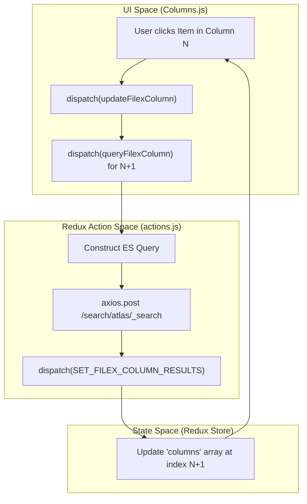
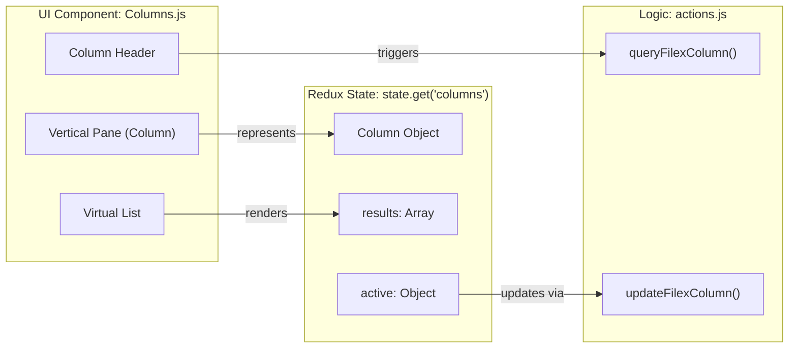

# Page: Column Navigation

# Column Navigation

Relevant source files

The following files were used as context for generating this wiki page:

- [src/core/redux/actions/actions.js](src/core/redux/actions/actions.js)
- [src/pages/FileExplorer/Columns/Columns.js](src/pages/FileExplorer/Columns/Columns.js)
- [src/pages/FileExplorer/Heading/Heading.js](src/pages/FileExplorer/Heading/Heading.js)
- [src/pages/FileExplorer/Modals/RegexModal/RegexModal.js](src/pages/FileExplorer/Modals/RegexModal/RegexModal.js)

The Archive Explorer (FileExplorer) uses a multi-column interface to navigate the PDS (Planetary Data System) hierarchy. This system allows users to drill down from broad categories (missions, instruments) into specific bundles, volumes, and directories until reaching individual files.

## Overview

The column system is built on a linked-list state model managed by Redux. Each column represents a level in the data hierarchy or a filtered view of the PDS archive. As users make selections in one column, subsequent columns are dynamically added or updated to reflect the children of that selection.

### Key Components and Data Flow

| Component / Entity | Role |
| :--- | :--- |
| `Columns.js` | The primary React component that renders the horizontal list of columns and handles user interactions like scrolling and resizing [src/pages/FileExplorer/Columns/Columns.js:72-117](). |
| `addFilexColumn` | Redux action to append a new column to the navigation chain [src/core/redux/actions/actions.js:71](). |
| `updateFilexColumn` | Redux action to modify an existing column's state (e.g., selection or width) [src/core/redux/actions/actions.js:73](). |
| `queryFilexColumn` | Async thunk that performs Elasticsearch queries to populate a column's list items [src/core/redux/actions/actions.js:74](). |
| `Heading.js` | Synchronizes the current column state with the browser URL for deep-linking [src/pages/FileExplorer/Heading/Heading.js:89-141](). |
| `RegexModal.js` | Provides an interface for filtering column results using regular expressions against file/directory names [src/pages/FileExplorer/Modals/RegexModal/RegexModal.js:52-61](). |

Sources: [src/pages/FileExplorer/Columns/Columns.js:72-117](), [src/core/redux/actions/actions.js:71-74](), [src/pages/FileExplorer/Heading/Heading.js:89-141](), [src/pages/FileExplorer/Modals/RegexModal/RegexModal.js:52-61]()

## Column State and Linked-List Logic

The `columns` state in Redux is an array of objects where each object represents a vertical pane in the FileExplorer.

### Column Object Structure
Each column object contains:
- `type`: The nature of the data (`filter`, `volume`, or `directory`) [src/pages/FileExplorer/Heading/Heading.js:97-101]().
- `value`: The field or URI being explored.
- `active`: The currently selected item within that column [src/pages/FileExplorer/Heading/Heading.js:100]().
- `results`: The array of items (files/folders) to display.
- `params`: Query parameters used to fetch the data, including `parent_uri` for directory navigation.

### State Transition Diagram
This diagram illustrates how user interactions trigger Redux actions to update the column chain.

"FileExplorer Column Navigation Flow"

Sources: [src/pages/FileExplorer/Columns/Columns.js:20-30](), [src/core/redux/actions/actions.js:71-74](), [src/pages/FileExplorer/Heading/Heading.js:97-101]()

## Query Construction and Data Fetching

Columns are populated using the `queryFilexColumn` action. The system constructs Elasticsearch queries based on the column's position and the `parent_uri` of the selected item in the preceding column.

### Parent URI and Directory Navigation
For directory columns, the query specifically filters results where the `ES_PATHS.parent_uri` matches the URI of the folder selected in the previous column.

1.  **Initial Query**: When the FileExplorer loads, it fetches root-level bundles or volumes.
2.  **Recursive Drill-down**: When a directory is clicked, `queryFilexColumn` is called with the new `parent_uri`.
3.  **PDS3 vs PDS4**: The system handles both PDS standards. PDS3 typically uses "volumes" while PDS4 uses "bundles" and "collections". `Heading.js` distinguishes these by setting the `pds` parameter to `3` or `4` [src/pages/FileExplorer/Heading/Heading.js:101-108]().

### Infinite Scroll
Columns implement infinite scrolling to handle large directories.
- The `body` of a column monitors the `onScroll` event [src/pages/FileExplorer/Columns/Columns.js:206-212]().
- When the user reaches the bottom, `queryFilexColumn` is triggered with an incremented page/offset.
- New results are appended to the existing `results` array in the specific column index within the Redux state.

Sources: [src/core/redux/actions/actions.js:74](), [src/pages/FileExplorer/Columns/Columns.js:206-220](), [src/pages/FileExplorer/Heading/Heading.js:96-109]()

## The Columns.js Component

`Columns.js` is responsible for the visual representation and layout of the navigation system.

### Layout and Resizing
- **Horizontal Scroll**: Columns are rendered in an `inline-flex` container [src/pages/FileExplorer/Columns/Columns.js:72-76]().
- **Draggable Resizing**: The component uses `react-draggable` to allow users to adjust column widths [src/pages/FileExplorer/Columns/Columns.js:62]().
- **ViewSlider**: On mobile devices, the `react-view-slider` component is used to transition between columns as if they were separate pages [src/pages/FileExplorer/Columns/Columns.js:7]().

### Column Header Tools
Each column header provides contextual tools:
- **Regex Filter**: Opens the `RegexModal` to filter the current column's contents using regular expressions [src/pages/FileExplorer/Columns/Columns.js:26]().
- **Sorting**: Allows sorting column contents by filename or date via the `SortIcon` [src/pages/FileExplorer/Columns/Columns.js:48]().
- **Cart Integration**: Users can add entire directories or individual files to the cart directly from the column using `addToCart` [src/pages/FileExplorer/Columns/Columns.js:27]().

### Code Entity Mapping
This diagram bridges the visual UI components to the underlying code functions and state.

"Column UI to Code Mapping"

Sources: [src/pages/FileExplorer/Columns/Columns.js:108-148](), [src/core/redux/actions/actions.js:71-75](), [src/pages/FileExplorer/Heading/Heading.js:89-92]()

## URL Synchronization

The `Heading.js` component monitors the `columns` state and updates the browser's URL hash. This ensures that the specific navigation state (which columns are open and what is selected) is preserved in the URL for sharing or bookmarking.

- **Parameter Mapping**: It maps column selections to URL parameters like `bundle`, `pds`, and `uri` [src/pages/FileExplorer/Heading/Heading.js:94-113]().
- **Path Construction**: It builds a "breadcrumb" style path for display in the UI based on the active selections, using `splitUri` to extract the relative path [src/pages/FileExplorer/Heading/Heading.js:115-132]().
- **Navigation**: If the generated URL differs from the current browser location, it triggers `navigate` with the new path [src/pages/FileExplorer/Heading/Heading.js:133-141]().

Sources: [src/pages/FileExplorer/Heading/Heading.js:89-141](), [src/core/utils.js:11-12]()
