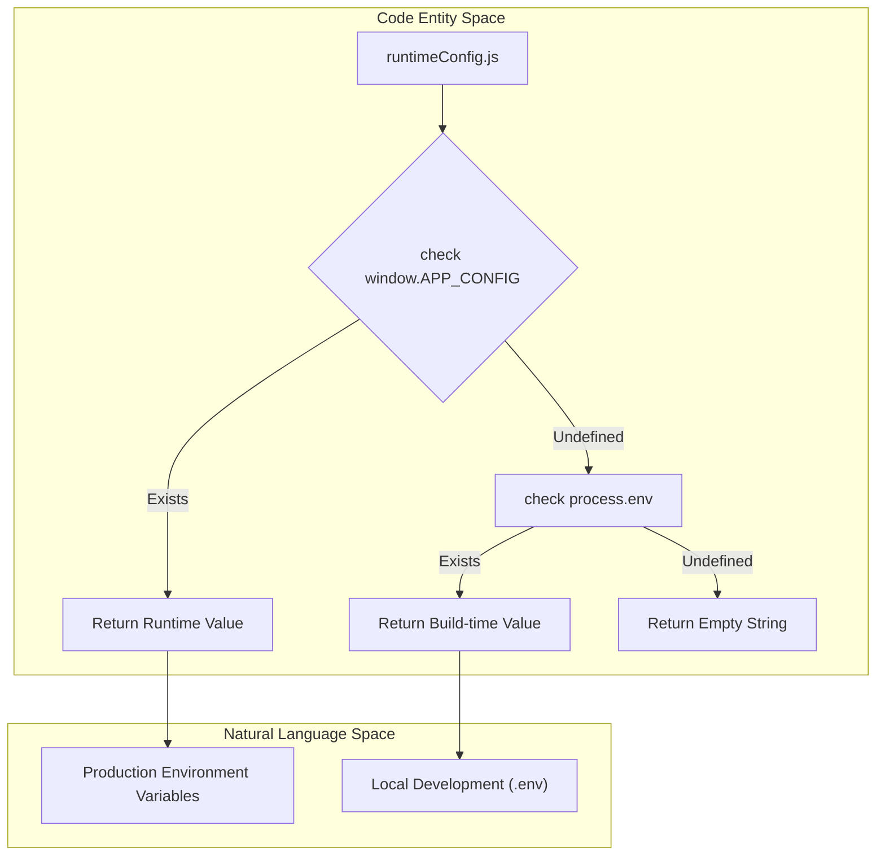
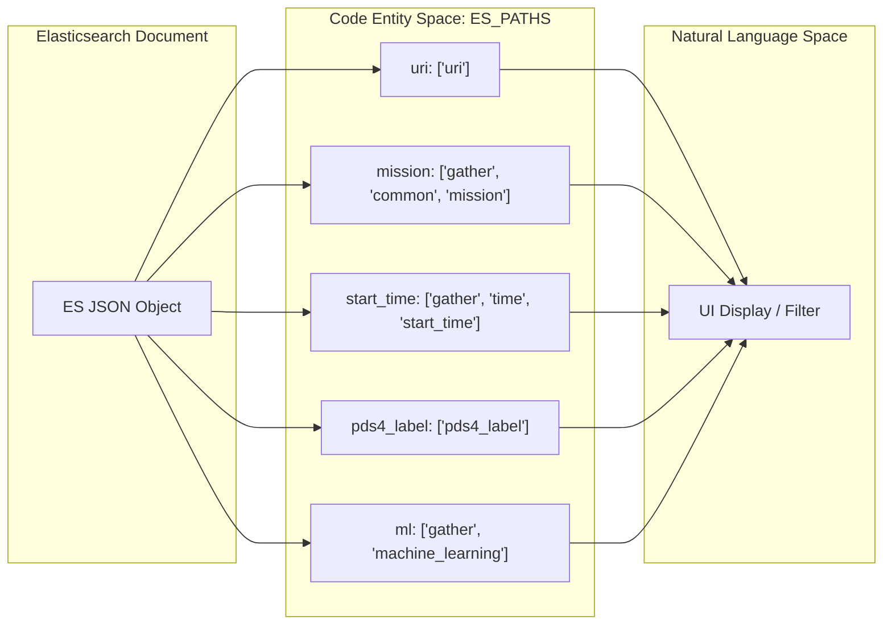

# Page: Constants and Configuration

# Constants and Configuration

Relevant source files

The following files were used as context for generating this wiki page:

- [.env](.env)
- [Dockerfile](Dockerfile)
- [config/env.js](config/env.js)
- [public/index.html](public/index.html)
- [src/core/constants.js](src/core/constants.js)
- [src/core/runtimeConfig.js](src/core/runtimeConfig.js)
- [src/index.css](src/index.css)

The Atlas application utilizes a centralized configuration and constant management system to ensure consistency across its various subsystems, including the Search Page, Archive Explorer, and Product Detail pages. This system handles everything from API endpoint resolution and Elasticsearch field mapping to mission-to-planetary-body relationships.

## Runtime Configuration Injection

Atlas employs a "build once, deploy anywhere" strategy using a runtime configuration injection pattern. This allows the application to resolve environment-specific variables (like API base URLs) without requiring a re-build of the React assets.

The `runtimeConfig.js` module serves as the accessor for these values. It prioritizes values found in `window.APP_CONFIG` (injected by the server at runtime) and falls back to `process.env` (injected by Webpack at build time) [src/core/runtimeConfig.js:1-9](). This pattern is critical for Docker-based deployments where the same image may be deployed to different environments (e.g., staging vs. production) with different backend URLs [Dockerfile:46-64]().

### Configuration Resolution Flow

Title: Runtime Configuration Resolution Logic

Sources: [src/core/runtimeConfig.js:15-114](), [src/core/constants.js:1-10](), [Dockerfile:46-64]()

## API Endpoints and Routing

Application-wide endpoints are aggregated in the `endpoints` constant. These values typically combine the resolved domain with specific path suffixes defined in environment variables.

### Endpoint Mapping
| Constant | Source / Value | Purpose |
| :--- | :--- | :--- |
| `endpoints.data` | `REACT_APP_DATA_ENDPOINT` | Retrieval of raw product data and files [src/core/constants.js:22-22]() |
| `endpoints.search` | `REACT_APP_SEARCH_ENDPOINT` | Primary Elasticsearch search interface [src/core/constants.js:23-23]() |
| `endpoints.pit` | `REACT_APP_PIT_ENDPOINT` | Point-In-Time API for consistent pagination [src/core/constants.js:24-24]() |
| `endpoints.scroll` | `REACT_APP_SCROLL_ENDPOINT` | ES Scroll API for bulk exports [src/core/constants.js:25-25]() |
| `endpoints.archive` | `REACT_APP_ARCHIVE_ENDPOINT` | Backend for the Archive Explorer [src/core/constants.js:26-26]() |
| `endpoints.mitm` | `${publicUrl}/streamsaver/mitm.html` | Man-in-the-middle for ZipStream downloads [src/core/constants.js:27-27]() |
| `endpoints.pdsFieldSearch` | `https://pds.nasa.gov/...` | External PDS attribute definition search [src/core/constants.js:28-30]() |

### Application Routing (`HASH_PATHS`)
Atlas uses relative paths for internal routing, allowing `BrowserRouter` to handle the `PUBLIC_URL` prefix automatically [src/core/constants.js:32-33]().

| Route Key | Path | Component / Page |
| :--- | :--- | :--- |
| `root` | `/` | Landing / Redirect [src/core/constants.js:35-35]() |
| `search` | `/search` | Search Page [src/core/constants.js:36-36]() |
| `record` | `/record` | Product Detail (Record) Page [src/core/constants.js:37-37]() |
| `cart` | `/cart` | Download Cart [src/core/constants.js:38-38]() |
| `fileExplorer` | `/archive-explorer` | Archive Explorer [src/core/constants.js:39-39]() |
| `apiDocumentation` | `/documentation/` | Docusaurus API Docs [src/core/constants.js:40-40]() |

Sources: [src/core/constants.js:21-41](), [.env:9-14](), [config/env.js:65-93]()

## Elasticsearch Field Mappings (`ES_PATHS`)

The `ES_PATHS` constant is a critical mapping layer that decouples the UI components from the specific structure of the Elasticsearch documents. Instead of hardcoding JSON paths like `gather.common.mission` in components, developers use `ES_PATHS.mission`.

Title: Data Mapping from ES Document to UI

### Key Field Groupings
*   **Common Metadata**: `mission`, `instrument`, `spacecraft`, `target`, `product_type` [src/core/constants.js:68-74]().
*   **PDS Archive**: `bundle_id`, `volume_id`, `pds_standard`, `product_id` [src/core/constants.js:75-86]().
*   **Related Assets**: `browse` (thumbnails), `label` (metadata files), `ml` (machine learning overlays) [src/core/constants.js:51-67]().
*   **Archive Explorer**: Fields within the `archive` sub-object (e.g., `parent_uri`, `fs_type`, `size`) specifically for column-based navigation [src/core/constants.js:89-101]().
*   **Time and Location**: `start_time` and `geo_location` for spatial/temporal queries [src/core/constants.js:71-72]().

Sources: [src/core/constants.js:45-105]()

## Domain-Specific Constants

### Mission to Body Mappings
The `MISSIONS_TO_BODIES` constant defines the relationship between space missions and the celestial bodies they observe. This is used by the `Map Panel` to determine which planetary projections and basemaps to load.

| Mission | Main Body | Planets | Moons (Sample) |
| :--- | :--- | :--- | :--- |
| `cassini` | Saturn | `saturn` | `titan`, `enceladus`, `dione`, `mimas` [src/core/constants.js:150-208]() |
| `mars_2020` | Mars | `mars` | `deimos`, `phobos` [src/core/constants.js:209-213]() |
| `mro` | Mars | `mars` | `deimos`, `phobos` [src/core/constants.js:214-219]() |

### Asset and Media Types
*   **IMAGE_EXTENSIONS**: List of valid extensions for the image viewer including `img`, `png`, `vic`, `tif`, `svg`, and `webp` [src/core/constants.js:132-146]().
*   **MODEL_EXTENSIONS**: Supported 3D formats: `obj` and `dae` [src/core/constants.js:147-147]().
*   **AVAILABLE_URI_SIZES**: Standardized image derivatives: `xs`, `sm`, `md`, `lg` [src/core/constants.js:130-130]().
*   **RELATED_MAPPINGS**: Human-readable labels for related product files, such as mapping `tile` to "DZI Tileset" and `ml_classifier_features` to "ML Classifier Features" [src/core/constants.js:107-119]().

### Operational Constants
*   **MAX_BULK_DOWNLOAD_COUNT**: Limits the number of items allowed in a single bulk download request, defaulting to 25,000 [src/core/constants.js:12-12]().
*   **EMAIL_CONTACT**: Default support email for the application [src/core/constants.js:14-14]().
*   **localStorageCart**: The key used to persist cart state in the browser (`ATLAS_CART`) [src/core/constants.js:43-43]().
*   **resultsStatuses**: Enum for search state management (`WAITING`, `SEARCHING`, `LOADING`, `SUCCESSFUL`, `ERROR`) [src/core/constants.js:121-128]().

Sources: [src/core/constants.js:12-221](), [.env:1-19]()
