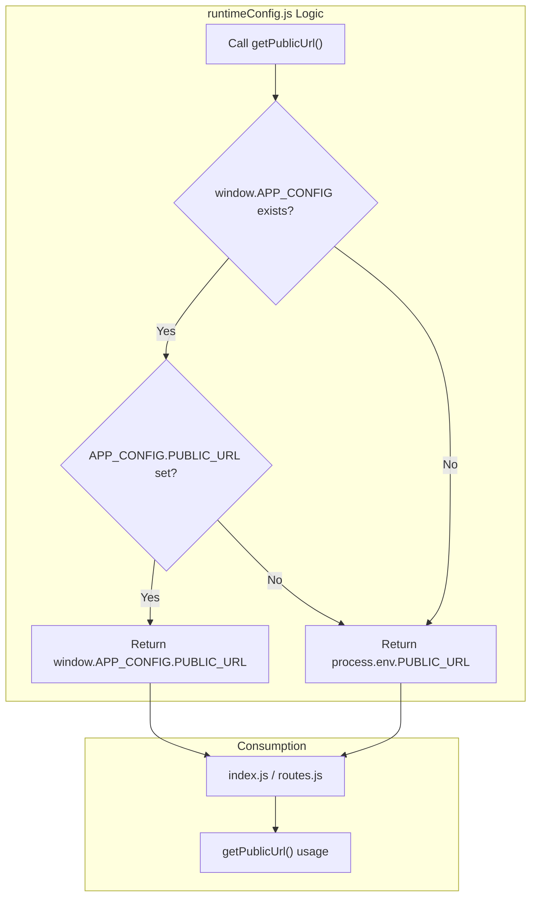
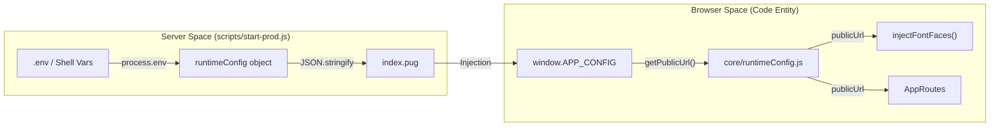

# Page: Docker and Runtime Configuration

# Docker and Runtime Configuration

Relevant source files

The following files were used as context for generating this wiki page:

- [Dockerfile](Dockerfile)
- [Documenation/.nvmrc](Documenation/.nvmrc)
- [Documenation/package-lock.json](Documenation/package-lock.json)
- [Documenation/package.json](Documenation/package.json)
- [public/index.html](public/index.html)
- [scripts/start-prod.js](scripts/start-prod.js)
- [src/core/routes/routes.js](src/core/routes/routes.js)
- [src/core/runtimeConfig.js](src/core/runtimeConfig.js)
- [src/index.css](src/index.css)
- [src/index.js](src/index.js)

The Atlas application utilizes a multi-stage Docker build process and a dynamic runtime configuration pattern. This architecture allows the application to be built once and deployed across multiple environments (e.g., development, staging, production) without requiring a re-build of the static assets to update service URLs or public paths.

## Multi-Stage Docker Build

The Atlas `Dockerfile` is structured into three distinct stages: **Builder**, **Documentation Build**, and **Runner**. This separation ensures that the final production image contains only the necessary runtime dependencies and built artifacts, minimizing the image size and security surface area [Dockerfile:1-65]().

### Build Pipeline Flow

1.  **Builder Stage**: Uses `node:lts-jod` as the base. It bundles the entire application source [Dockerfile:15](), installs production dependencies using `npm ci NODE_ENV=production` [Dockerfile:20](), and executes `npm run build` to generate the React production bundle [Dockerfile:23]().
2.  **Documentation Sub-project**: The build process switches context to the `Documentation` directory [Dockerfile:30](). It independently installs dependencies [Dockerfile:35]() and builds the Docusaurus-based documentation site using `npm run build` [Dockerfile:37]().
3.  **Runner Stage**: A fresh `node:lts-jod` image is used [Dockerfile:46](). It copies only the necessary server-side scripts (`scripts/start-prod.js`), configuration (`config/paths.js`), and the compiled `build` folder from the Builder stage [Dockerfile:54-61]().

The container exposes port `8500` [Dockerfile:63]() and executes `npm run start:prod` to serve the application [Dockerfile:64]().

### Docker Build Stages Entity Map

| Stage | Code Entity / Command | Purpose |
| :--- | :--- | :--- |
| **Builder** | `npm run build` | Compiles React source into static assets [Dockerfile:23](). |
| **Doc Builder** | `WORKDIR /usr/src/app/Documentation` | Context for building the Docusaurus sub-project [Dockerfile:30-37](). |
| **Runner** | `scripts/start-prod.js` | Node.js entry point for serving the production build [Dockerfile:55](). |
| **Runner** | `package.json` | Defines `start:prod` script used by `CMD` [Dockerfile:52, 64](). |

**Sources:** [Dockerfile:1-65](), [Documenation/package.json:8]()

## Runtime Configuration Injection

Atlas implements a "Build Once, Run Anywhere" strategy using the `window.APP_CONFIG` pattern. Instead of hardcoding environment variables into the Webpack bundle at build time, the application resolves configuration from a global object injected into the browser environment at runtime by the Express server.

### The `window.APP_CONFIG` Pattern

The `src/core/runtimeConfig.js` module acts as the single source of truth for all service URLs and environmental settings. Each configuration getter follows a specific resolution hierarchy:
1.  Check if `window.APP_CONFIG` exists and contains the required key [src/core/runtimeConfig.js:16-17]().
2.  Fall back to `process.env` (Webpack build-time injection) if the runtime config is missing [src/core/runtimeConfig.js:19]().

In production, the `scripts/start-prod.js` server reads environment variables and injects them into the `index.pug` template as a JSON string assigned to `window.APP_CONFIG` [scripts/start-prod.js:23-32, 172-179]().

### Configuration Resolution Logic

**Sources:** [src/core/runtimeConfig.js:15-20](), [scripts/start-prod.js:176](), [src/index.js:56-69]()

## Service URL Resolution

The application manages several external service endpoints through `src/core/runtimeConfig.js`. These functions ensure that components use the correct base URLs regardless of the deployment environment.

### Key Configuration Functions

| Function | Runtime Key (`window.APP_CONFIG`) | Build-time Fallback (`.env`) |
| :--- | :--- | :--- |
| `getPublicUrl` | `PUBLIC_URL` | `process.env.PUBLIC_URL` [src/core/runtimeConfig.js:15-20]() |
| `getDomain` | `DOMAIN` | `process.env.REACT_APP_DOMAIN` [src/core/runtimeConfig.js:26-31]() |
| `getApiUrl` | `API_URL` | `process.env.REACT_APP_API_URL` [src/core/runtimeConfig.js:37-42]() |
| `getEsUrl` | `ES_URL` | `process.env.REACT_APP_ES_URL` [src/core/runtimeConfig.js:48-53]() |
| `getFootprintUrl`| `FOOTPRINT_URL` | `process.env.REACT_APP_FOOTPRINT_URL` [src/core/runtimeConfig.js:59-64]() |

These values are aggregated by `getRuntimeConfig()` to provide a complete configuration snapshot [src/core/runtimeConfig.js:103-114]().

**Sources:** [src/core/runtimeConfig.js:15-114](), [scripts/start-prod.js:23-32]()

## Production Server and Resource Handling

The production server, defined in `scripts/start-prod.js`, is responsible for serving static assets and handling the initial request for the single-page application (SPA).

### Dynamic Font Injection
To avoid baking the `PUBLIC_URL` into CSS files at build time, fonts are dynamically injected in `src/index.js` using the `injectFontFaces` function [src/index.js:24-52](). This function uses `getPublicUrl()` to construct the correct path for `Inter` and `PublicSans` fonts [src/index.js:36-37]().

### StreamSaver and MITM
The server specifically handles the StreamSaver `mitm.html` and `ping.html` files, injecting a Content Security Policy (CSP) nonce into the script tags before serving them to the client [scripts/start-prod.js:129-152]().

### Data Flow: Environment to Runtime

**Sources:** [scripts/start-prod.js:23-32, 172-179](), [src/index.js:24-69](), [src/core/routes/routes.js:24-34]()

## Documentation Sub-project
The `Documentation` folder contains a standalone Docusaurus project [Documenation/package.json:1-44](). It is built as part of the Docker multi-stage process [Dockerfile:30-37](). It uses React 18 and Docusaurus 3.9.2 to generate a static documentation site [Documenation/package.json:17-23]().

**Sources:** [Documenation/package.json:1-44](), [Dockerfile:30-37]()
