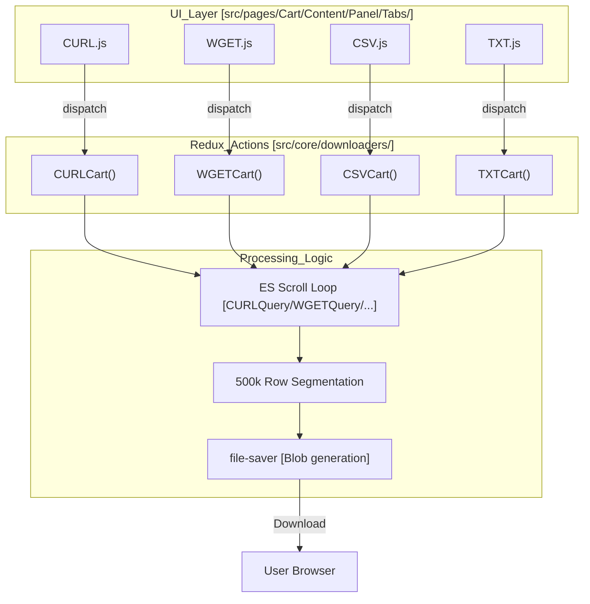

# Page: Download Formats: CURL, WGET, CSV, TXT

# Download Formats: CURL, WGET, CSV, TXT

<details>
<summary>Relevant source files</summary>

The following files were used as context for generating this wiki page:

- [public/streamsaver/mitm.html](public/streamsaver/mitm.html)
- [src/components/DownloadingCard/DownloadingCard.js](src/components/DownloadingCard/DownloadingCard.js)
- [src/components/ProductDownloadSelector/ProductDownloadSelector.js](src/components/ProductDownloadSelector/ProductDownloadSelector.js)
- [src/core/downloaders/CSV.js](src/core/downloaders/CSV.js)
- [src/core/downloaders/CURL.js](src/core/downloaders/CURL.js)
- [src/core/downloaders/TXT.js](src/core/downloaders/TXT.js)
- [src/core/downloaders/WGET.js](src/core/downloaders/WGET.js)
- [src/pages/Cart/Content/Panel/DownloadMethodTabs.js](src/pages/Cart/Content/Panel/DownloadMethodTabs.js)
- [src/pages/Cart/Content/Panel/Panel.js](src/pages/Cart/Content/Panel/Panel.js)
- [src/pages/Cart/Content/Panel/Tabs/Browser/Browser.js](src/pages/Cart/Content/Panel/Tabs/Browser/Browser.js)
- [src/pages/Cart/Content/Panel/Tabs/CSV/CSV.js](src/pages/Cart/Content/Panel/Tabs/CSV/CSV.js)
- [src/pages/Cart/Content/Panel/Tabs/CURL/CURL.js](src/pages/Cart/Content/Panel/Tabs/CURL/CURL.js)
- [src/pages/Cart/Content/Panel/Tabs/TXT/TXT.js](src/pages/Cart/Content/Panel/Tabs/TXT/TXT.js)
- [src/pages/Cart/Content/Panel/Tabs/WGET/WGET.js](src/pages/Cart/Content/Panel/Tabs/WGET/WGET.js)

</details>


This page documents the implementation of the non-ZIP download formats in the Atlas Cart system. These formats allow users to export their cart contents as executable scripts (CURL/WGET) or structured data lists (CSV/TXT) for external processing.

## System Overview

The download system for CURL, WGET, CSV, and TXT follows a common pattern: it resolves abstract cart items (like queries or directories) into a flat list of physical file URLs by interacting with the Elasticsearch scroll API. Unlike the Browser ZIP format which streams binary data, these formats generate text-based manifest files using `file-saver`.

### Data Flow Architecture

The process is initiated from the Cart UI tabs and executed via Redux thunk actions that manage asynchronous "tasks" for each cart item. The `ProductDownloadSelector` component allows users to specify which file types (Source, Label, Browse, etc.) are included in the generated output [src/components/ProductDownloadSelector/ProductDownloadSelector.js:106-146]().



**Sources:** [src/pages/Cart/Content/Panel/Tabs/CURL/CURL.js:124-153](), [src/core/downloaders/CURL.js:14-52](), [src/core/downloaders/WGET.js:14-52](), [src/core/downloaders/CSV.js:14-52](), [src/core/downloaders/TXT.js:14-52](), [src/components/ProductDownloadSelector/ProductDownloadSelector.js:106-146]()

---

## Implementation Details

### Elasticsearch Scroll Resolution
For cart items of type `query`, `directory`, or `regex`, the system must discover every individual file matching the criteria. This is handled by the `Query` functions (e.g., `CURLQuery`, `WGETQuery`).

1.  **Initial Request**: A POST request is sent to `${domain}${endpoints.search}?scroll=1m` (or `10m` for WGET) with a DSL query containing the filters and a page size of 5000 [src/core/downloaders/CURL.js:67-105](), [src/core/downloaders/WGET.js:105]().
2.  **Scroll Loop**: The `scroll` function recursively calls the Elasticsearch `_scroll` endpoint using the `_scroll_id` until all hits are retrieved [src/core/downloaders/CURL.js:115-193](), [src/core/downloaders/WGET.js:115-194]().
3.  **Path Resolution**: For each hit, the system extracts the `uri` and uses `getPDSUrl` to generate the public download link [src/core/downloaders/CURL.js:140-169](), [src/core/downloaders/WGET.js:140-170]().
4.  **Directory Filtering**: The system explicitly skips items where `fs_type` is `directory` to avoid generating broken download links for folders [src/core/downloaders/CURL.js:148-152](), [src/core/downloaders/WGET.js:149-153]().

### Platform-Specific Script Generation
The system generates command-line strings tailored to the specific tool's syntax. If "Keep Folder Structure" is enabled (default for directory items), it prepends local path segments [src/core/downloaders/CURL.js:158-163]().

| Format | Command Pattern | Features |
| :--- | :--- | :--- |
| **CURL** | `curl -sSL# --create-dirs --output-dir ...` | Preserves folder structure using `--output-dir` [src/core/downloaders/CURL.js:168-169](). |
| **WGET** | `mkdir -p ... && wget -q --show-progress -nc -O ...` | Uses `mkdir -p` and `-nc` (no-clobber) for safe downloading [src/core/downloaders/WGET.js:169-170](). |
| **CSV** | `filename,size,uri,download_url` | Structured metadata export with headers [src/core/downloaders/CSV.js:25](). |
| **TXT** | `https://...` | Simple newline-separated list of URLs [src/core/downloaders/TXT.js:166](). |

### 500k-Row Segmentation
To prevent browser memory crashes and handle extremely large datasets, the system enforces a maximum row limit per file.

*   **Constants**: `CURL_FILE_MAX_ROWS`, `WGET_FILE_MAX_ROWS`, `CSV_FILE_MAX_ROWS`, and `TXT_FILE_MAX_ROWS` are all set to `500,000` [src/core/downloaders/CURL.js:10](), [src/core/downloaders/WGET.js:10](), [src/core/downloaders/CSV.js:10](), [src/core/downloaders/TXT.js:10]().
*   **Trigger**: During the scroll loop, if the internal array (e.g., `CURLRows`) exceeds this limit, the respective `createFile` function (e.g., `createCURLFile`) is called immediately to flush the current buffer to a file via `file-saver`, and the array is cleared for the next segment [src/core/downloaders/CURL.js:173](), [src/core/downloaders/WGET.js:174]().

**Sources:** [src/core/downloaders/CURL.js:168-173](), [src/core/downloaders/WGET.js:169-174](), [src/core/downloaders/CSV.js:172](), [src/core/downloaders/TXT.js:170]()

---

## UI Components and Progress Tracking

### DownloadingCard
The `DownloadingCard` component provides visual feedback for all download types. It calculates elapsed time and estimated time remaining.

*   **Progress Calculation**: Percentages are calculated as `(totalReceived / item.total) * 100` [src/core/downloaders/CURL.js:90]().
*   **Time Estimation**: Calculated using the formula `((Date.now() - startTime) * item.total) / totalReceived - (Date.now() - startTime)` [src/core/downloaders/CURL.js:96]().
*   **States**: Supports `running`, `paused`, `stopped`, and `done` modes [src/components/DownloadingCard/DownloadingCard.js:120-125]().
*   **Status Toggle**: Users can hover over the percentage to see the raw item count `current / total` [src/components/DownloadingCard/DownloadingCard.js:224-228]().

### Code Entity Mapping

The following diagram bridges the UI components to the underlying downloader logic.

```mermaid
classDiagram
    class CURLTab {
        +setIsDownloading(bool)
        +setStatus(object)
        +onClick()
    }
    class CURLCart {
        <<Thunk Action Creator>>
        +dispatch(CURLQuery)
        +dispatch(CURLImage)
    }
    class DownloadingCard {
        +props.status
        +props.onStop
        +abbreviateNumber()
    }
    class CURLQuery {
        +axios.post(_search)
        +scroll(res)
        +CURLRows.push()
    }
    class ProductDownloadSelector {
        +getSelected()
        +getSummary()
    }

    CURLTab ..> CURLCart : dispatches via src/pages/Cart/Content/Panel/Tabs/CURL/CURL.js:144
    CURLCart ..> CURLQuery : executes via src/core/downloaders/CURL.js:30
    CURLTab --> DownloadingCard : renders status via src/pages/Cart/Content/Panel/Tabs/CURL/CURL.js:203
    CURLQuery ..> DownloadingCard : updates via statusCallback src/core/downloaders/CURL.js:125
    CURLTab --> ProductDownloadSelector : gets file keys via src/pages/Cart/Content/Panel/Panel.js:118
```

**Sources:** [src/pages/Cart/Content/Panel/Tabs/CURL/CURL.js:144-151](), [src/components/DownloadingCard/DownloadingCard.js:116-176](), [src/core/downloaders/CURL.js:55-64](), [src/pages/Cart/Content/Panel/Panel.js:118-129]()

---

## StreamSaver and MITM

While primarily used for the Browser ZIP format (see section 6.3), the Atlas infrastructure includes a "Man-In-The-Middle" (MITM) setup to facilitate client-side streaming downloads for modern browsers.

*   **mitm.html**: Acts as a bridge between the main application window and the Service Worker. It signals the opener's `messageChannel` to the service worker [public/streamsaver/mitm.html:2-13]().
*   **Service Worker Registration**: The MITM page ensures `sw.js` is registered and active before allowing stream transfers [public/streamsaver/mitm.html:39-66]().
*   **MessageChannel**: It uses `MessageChannel` ports to transfer `ReadableStream` objects safely across origins, which is essential for the Browser ZIP implementation [public/streamsaver/mitm.html:150-162]().

**Sources:** [public/streamsaver/mitm.html:1-181](), [src/pages/Cart/Content/Panel/Tabs/Browser/Browser.js:123-133]()
