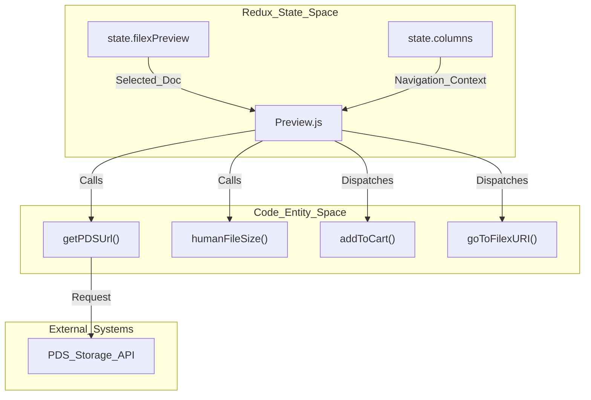
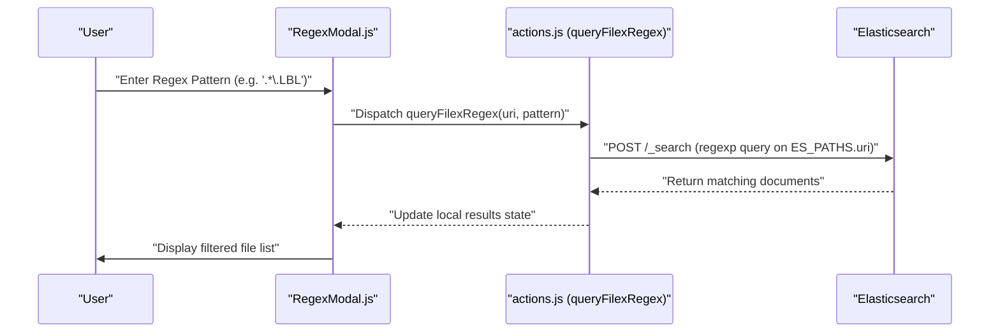

# Page: File Preview and Regex Modal

# File Preview and Regex Modal

Relevant source files

The following files were used as context for generating this wiki page:

- [src/pages/FileExplorer/Heading/Heading.js](src/pages/FileExplorer/Heading/Heading.js)
- [src/pages/FileExplorer/Modals/RegexModal/RegexModal.js](src/pages/FileExplorer/Modals/RegexModal/RegexModal.js)
- [src/pages/FileExplorer/Preview/Preview.js](src/pages/FileExplorer/Preview/Preview.js)

The File Preview pane and Regex Modal are the primary interfaces for inspecting individual data products and performing advanced filtering within the Archive Explorer. While the column-based navigation allows for hierarchical traversal, these components provide deep inspection of metadata, visual previews, and pattern-based selection of directory contents.

## File Preview Pane

The `Preview` component is a multi-functional side panel that appears when a user selects a file or directory in the `FileExplorer` [src/pages/FileExplorer/Preview/Preview.js:55-66](). It serves as a bridge between the file system view and the detailed product record page.

### Data Flow and State
The preview pane consumes the `filexPreview` object from the Redux store [src/pages/FileExplorer/Heading/Heading.js:83-86](). This object contains the Elasticsearch document for the selected item, including its URI, file size, and metadata fields [src/pages/FileExplorer/Heading/Heading.js:111-113]().

### Key Features
*   **Visual Preview:** For supported image types (defined in `IMAGE_EXTENSIONS`), the component attempts to render a browse image using the `mui-image` library [src/pages/FileExplorer/Preview/Preview.js:48-50]().
*   **Metadata Display:** It renders a list of properties extracted from the Elasticsearch source, such as `file_size`, `modification_time`, and `pds_model` [src/pages/FileExplorer/Preview/Preview.js:208-239]().
*   **Navigation Actions:**
    *   **Open Record:** Navigates to the full Product Detail page using the item's URI via `goToFilexURI` [src/pages/FileExplorer/Preview/Preview.js:21-24]().
    *   **Direct Download:** Initiates a client-side stream download for individual files using `streamDownloadFile` [src/pages/FileExplorer/Preview/Preview.js:26-26]().
    *   **Add to Cart:** Adds the selected item (file or directory) to the global cart [src/pages/FileExplorer/Preview/Preview.js:22-22]().

### Preview Pane Architecture
The following diagram illustrates how the `Preview` component interacts with the Redux state and external utilities.

**Preview Pane Architecture**

Sources: [src/pages/FileExplorer/Preview/Preview.js:1-40](), [src/pages/FileExplorer/Heading/Heading.js:83-92]()

---

## Regex Modal

The `RegexModal` provides a specialized interface for filtering the contents of a directory using regular expressions [src/pages/FileExplorer/Modals/RegexModal/RegexModal.js:51-60](). This is particularly useful for selecting specific subsets of files (e.g., only `.IMG` files or files matching a specific timestamp pattern) within large PDS volumes.

### Implementation Details
*   **Search Execution:** When a user enters a pattern, the modal dispatches the `queryFilexRegex` action [src/pages/FileExplorer/Modals/RegexModal/RegexModal.js:6-6](). This triggers an Elasticsearch query that filters the `parent_uri` children by the provided regex pattern.
*   **Pagination:** Results are paginated within the modal using the MUI `Pagination` component to handle large result sets efficiently [src/pages/FileExplorer/Modals/RegexModal/RegexModal.js:37-37]().
*   **Bulk Actions:** Users can add the entire filtered result set to the cart as a "Regex Item" [src/pages/FileExplorer/Modals/RegexModal/RegexModal.js:8-8](). This stores the regex pattern itself in the cart rather than individual file URIs, allowing for dynamic resolution during the download phase.

### Regex Filtering Logic
The modal utilizes `ES_PATHS` constants to target the correct fields in the Elasticsearch index, primarily filtering against the file name or relative path [src/pages/FileExplorer/Modals/RegexModal/RegexModal.js:44-44]().

**Regex Query Flow**

Sources: [src/pages/FileExplorer/Modals/RegexModal/RegexModal.js:1-10](), [src/pages/FileExplorer/Modals/RegexModal/RegexModal.js:228-243]()

---

## URL Synchronization (Heading.js)

The `Heading` component in the File Explorer is responsible for synchronizing the UI state (selected columns and previewed file) with the browser's URL [src/pages/FileExplorer/Heading/Heading.js:133-141](). This ensures that the Archive Explorer's state is deep-linkable.

### Logic Flow
1.  **Column Parsing:** It iterates through the `columns` state, extracting active filters and volume selections [src/pages/FileExplorer/Heading/Heading.js:96-109]().
2.  **URI Encoding:** If a file is being previewed, its URI is appended to the URL parameters [src/pages/FileExplorer/Heading/Heading.js:111-113](). If the `fs_type` is `file`, a hyphen suffix is temporarily added to the path logic to handle state differentiation [src/pages/FileExplorer/Heading/Heading.js:112-112]().
3.  **Path Formatting:** The component generates a "breadcrumb" style path for display in the UI by splitting the URI via `splitUri` and formatting it for readability [src/pages/FileExplorer/Heading/Heading.js:126-132]().
4.  **Navigation:** If the calculated URL differs from the current browser URL, the `useNavigate` hook is called with `{ replace: true }` to update the address bar without adding redundant entries to the history stack [src/pages/FileExplorer/Heading/Heading.js:138-139]().

### URL Parameter Mapping
| Parameter | Source | Description |
| :--- | :--- | :--- |
| `bundle` | `column.type === 'volume'` | The PDS bundle or volume ID [src/pages/FileExplorer/Heading/Heading.js:103-103]() |
| `pds` | `column.active.type` | Distinguishes between PDS3 (value '3') and PDS4 (value '4') [src/pages/FileExplorer/Heading/Heading.js:105-106]() |
| `uri` | `preview.uri` | The full Atlas URI of the currently selected file [src/pages/FileExplorer/Heading/Heading.js:113-113]() |
| `key` | `column.type === 'filter'` | Dynamic keys derived from filter values (e.g., instrument, host) [src/pages/FileExplorer/Heading/Heading.js:97-100]() |

Sources: [src/pages/FileExplorer/Heading/Heading.js:76-141](), [src/core/utils.js:18-18]()
