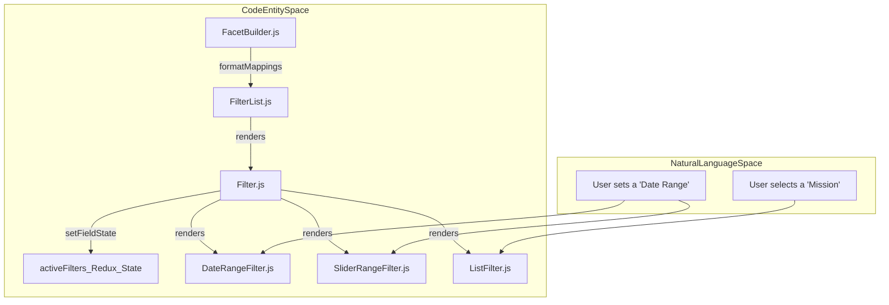
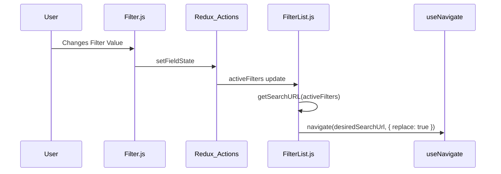

# Page: Filters Panel

# Filters Panel

Relevant source files

The following files were used as context for generating this wiki page:

- [src/CartoCosmos/components/presentational/ConsoleSpecialLayers.jsx](src/CartoCosmos/components/presentational/ConsoleSpecialLayers.jsx)
- [src/components/Filter/Filter.js](src/components/Filter/Filter.js)
- [src/components/Filter/subcomponents/DateRangeFilter/DateRangeFilter.js](src/components/Filter/subcomponents/DateRangeFilter/DateRangeFilter.js)
- [src/components/Filter/subcomponents/InputFilter/InputFilter.js](src/components/Filter/subcomponents/InputFilter/InputFilter.js)
- [src/components/Filter/subcomponents/InputRangeFilter/InputRangeFilter.js](src/components/Filter/subcomponents/InputRangeFilter/InputRangeFilter.js)
- [src/components/Filter/subcomponents/SliderRangeFilter/SliderRangeFilter.js](src/components/Filter/subcomponents/SliderRangeFilter/SliderRangeFilter.js)
- [src/components/FilterHelp/FilterHelp.js](src/components/FilterHelp/FilterHelp.js)
- [src/external/react-filter-box-REPO/react-filter-box-mod/lib/react-filter-box.js](src/external/react-filter-box-REPO/react-filter-box-mod/lib/react-filter-box.js)
- [src/external/react-filter-box-REPO/react-filter-box-mod/src/FilterInput.tsx](src/external/react-filter-box-REPO/react-filter-box-mod/src/FilterInput.tsx)
- [src/facets/FacetBuilder.js](src/facets/FacetBuilder.js)
- [src/pages/Search/Modals/AdvancedFilterModal/AdvancedFilterModal.js](src/pages/Search/Modals/AdvancedFilterModal/AdvancedFilterModal.js)
- [src/pages/Search/Modals/AdvancedFilterReturnModal/AdvancedFilterReturnModal.js](src/pages/Search/Modals/AdvancedFilterReturnModal/AdvancedFilterReturnModal.js)
- [src/pages/Search/Modals/EditColumnsModal/EditColumnsModal.js](src/pages/Search/Modals/EditColumnsModal/EditColumnsModal.js)
- [src/pages/Search/Panels/FiltersPanel/FiltersPanel.js](src/pages/Search/Panels/FiltersPanel/FiltersPanel.js)
- [src/pages/Search/Panels/FiltersPanel/subcomponents/AdvancedFilter/AdvancedFilter.js](src/pages/Search/Panels/FiltersPanel/subcomponents/AdvancedFilter/AdvancedFilter.js)
- [src/pages/Search/Panels/FiltersPanel/subcomponents/AdvancedFilter/AutocompleteMapping.js](src/pages/Search/Panels/FiltersPanel/subcomponents/AdvancedFilter/AutocompleteMapping.js)
- [src/pages/Search/Panels/FiltersPanel/subcomponents/AdvancedFilter/react-filter-box-customized/react-filter-box.js](src/pages/Search/Panels/FiltersPanel/subcomponents/AdvancedFilter/react-filter-box-customized/react-filter-box.js)
- [src/pages/Search/Panels/FiltersPanel/subcomponents/FilterList/FilterList.js](src/pages/Search/Panels/FiltersPanel/subcomponents/FilterList/FilterList.js)
- [src/themes/light.js](src/themes/light.js)

The **Filters Panel** is the primary interface for narrowing search results in Atlas. It operates in two distinct modes: **Basic** (faceted browsing) and **Advanced** (query-string based) [src/pages/Search/Panels/FiltersPanel/FiltersPanel.js:87-90](). The panel is responsible for transforming the Elasticsearch (ES) schema into a user-friendly hierarchy, managing filter state in Redux, and synchronizing that state with the application URL for shareability.

## 1. Architecture and Data Flow

The panel's behavior is driven by the `filterType` state in Redux [src/pages/Search/Panels/FiltersPanel/FiltersPanel.js:102-104](). It switches between the `FilterList` (Basic) and `AdvancedFilter` components based on this state [src/pages/Search/Panels/FiltersPanel/FiltersPanel.js:19-20]().

### Filter Transformation Pipeline
Atlas dynamically builds its filter hierarchy from the ES mapping using the `FacetBuilder` utility. This utility performs a depth-first traversal of the schema to create a nested group structure used by both the filter selection modals and the search facets.

| Stage | Entity | Description |
| :--- | :--- | :--- |
| **Input** | `schema.mappings` | Raw Elasticsearch mapping properties [src/facets/FacetBuilder.js:3-7](). |
| **Transformation** | `formatMappings` | Recursively processes properties, splitting `pds4_label` into logical directories based on namespaces [src/facets/FacetBuilder.js:11-26](). |
| **Classification** | `mappingDepthTraversal` | Maps ES types (`keyword`, `text`, `integer`, `date`) to Atlas UI components (`list`, `text`, `slider_range`, `date_range`) [src/facets/FacetBuilder.js:61-137](). |
| **Output** | `facets` object | A structured object with `groups`, `display_names`, and `facets` definitions [src/facets/FacetBuilder.js:146-149](). |

**Filter System Entity Mapping**

Sources: [src/facets/FacetBuilder.js:3-149](), [src/pages/Search/Panels/FiltersPanel/FiltersPanel.js:87-90](), [src/components/Filter/Filter.js:34-38]()

## 2. Basic vs. Advanced Modes

Users toggle between modes via the `MenuButton` in the panel heading [src/pages/Search/Panels/FiltersPanel/FiltersPanel.js:161-177]().

### Basic Mode (`FilterList`)
In Basic mode, filters are displayed as a vertical list of accordions (`Filter.js`). Each accordion represents a metadata field and contains a specific input component based on the data type:
*   **List (`ListFilter`)**: For `keyword` fields. Displays top aggregation values with checkboxes and hit counts.
*   **Slider Range (`SliderRangeFilter`)**: For numeric fields (`integer`, `float`, `long`). Uses a dual-thumb slider and includes a `MiniHistogram` to show data distribution [src/components/Filter/subcomponents/SliderRangeFilter/SliderRangeFilter.js:166-173]().
*   **Date Range (`DateRangeFilter`)**: For `date` fields. Provides MUI `DateTimePicker` inputs with support for multiple formats (e.g., `YYYY-MM-DD` and `YYYY-MM-DD HH:mm`) [src/components/Filter/subcomponents/DateRangeFilter/DateRangeFilter.js:180-196]().
*   **Text (`InputFilter`)**: For free-text search within specific fields, typically mapping to ES `query_string` [src/facets/FacetBuilder.js:92-93]().

### Advanced Mode (`AdvancedFilter`)
Advanced mode replaces the faceted list with a specialized query input. It utilizes a customized version of `react-filter-box` to provide autocomplete suggestions based on the `AutocompleteMapping.js` configuration [src/pages/Search/Panels/FiltersPanel/subcomponents/AdvancedFilter/AdvancedFilter.js:27-31]().
*   **Autocomplete**: Suggests field names via `getAtlasMappingOptions` [src/pages/Search/Panels/FiltersPanel/subcomponents/AdvancedFilter/AutocompleteMapping.js:6-24]() and values via `getAutocompleteValues` which executes ES aggregations [src/pages/Search/Panels/FiltersPanel/subcomponents/AdvancedFilter/AutocompleteMapping.js:27-76]().
*   **URL Sync**: Advanced queries are encoded into the URL via the `_adv` parameter [src/pages/Search/Panels/FiltersPanel/subcomponents/AdvancedFilter/AdvancedFilter.js:224]().
*   **Return Logic**: When switching back to Basic mode, the `AdvancedFilterReturnModal` warns the user that complex queries containing parameters unsupported by the basic UI will be lost [src/pages/Search/Modals/AdvancedFilterReturnModal/AdvancedFilterReturnModal.js:203-209]().

Sources: [src/pages/Search/Panels/FiltersPanel/FiltersPanel.js:106-130](), [src/components/Filter/Filter.js:34-38](), [src/pages/Search/Modals/AdvancedFilterReturnModal/AdvancedFilterReturnModal.js:145-149](), [src/components/Filter/subcomponents/SliderRangeFilter/SliderRangeFilter.js:13-16](), [src/pages/Search/Panels/FiltersPanel/subcomponents/AdvancedFilter/AutocompleteMapping.js:27-76]()

## 3. Filter Management and URL Sync

### URL Synchronization
The `FilterList` component maintains a `useEffect` hook that synchronizes the Redux `activeFilters` state with the browser URL [src/pages/Search/Panels/FiltersPanel/subcomponents/FilterList/FilterList.js:124-130](). The `getSearchURL` helper transforms the active filter states (keywords, ranges, dates) into a query string format [src/pages/Search/Panels/FiltersPanel/subcomponents/FilterList/FilterList.js:58-113]().

### Edit Columns Modal
The `EditColumnsModal` manages the visibility and order of columns in the Results Panel, allowing users to select fields from the ES mapping [src/pages/Search/Modals/EditColumnsModal/EditColumnsModal.js:119-125]().
*   **LabelsTree**: Renders a hierarchical tree of available labels for column selection [src/pages/Search/Modals/EditColumnsModal/EditColumnsModal.js:152]().
*   **Commit**: On submit, it dispatches `setResultsTableColumns`, clears existing results, and triggers a new search [src/pages/Search/Modals/EditColumnsModal/EditColumnsModal.js:119-123]().

**Search Execution Flow**

Sources: [src/pages/Search/Panels/FiltersPanel/subcomponents/FilterList/FilterList.js:58-130](), [src/components/Filter/Filter.js:12-13](), [src/pages/Search/Modals/EditColumnsModal/EditColumnsModal.js:119-125]()

## 4. Implementation Details

### Sticky Headers
The `FiltersPanel` implements a scroll listener to handle "sticky" behavior for filter group headers. As the user scrolls through the `FilterList`, the group headers (defined in `GROUP_DISPLAY_NAMES` such as 'Common', 'Archive', 'Time') remain pinned to the top of the viewport [src/pages/Search/Panels/FiltersPanel/FiltersPanel.js:182-200](), [src/pages/Search/Panels/FiltersPanel/subcomponents/FilterList/FilterList.js:36-45]().

### UI Components and Styling
*   **Accordions**: Customized MUI Accordions feature a colored left border (`darkgoldenrod`) when expanded to indicate the active focus [src/components/Filter/Filter.js:79-83](), [src/themes/light.js:71]().
*   **Badges**: The number of active selections within a facet is displayed using a `Badge` component styled with `theme.palette.swatches.red.red500` [src/components/Filter/Filter.js:188-195]().
*   **Date Range Logic**: Supports multiple formats including `YYYY-MM-DD` and `YYYY-MM-DD HH:mm`. It uses `moment.utc` to handle time-zone-agnostic date selection [src/components/Filter/subcomponents/DateRangeFilter/DateRangeFilter.js:180-208]().

Sources: [src/pages/Search/Panels/FiltersPanel/FiltersPanel.js:182-200](), [src/components/Filter/Filter.js:59-81](), [src/themes/light.js:71](), [src/pages/Search/Panels/FiltersPanel/subcomponents/FilterList/FilterList.js:36-45](), [src/components/Filter/subcomponents/DateRangeFilter/DateRangeFilter.js:180-208]()
