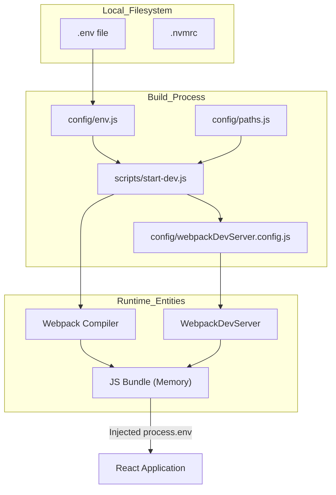
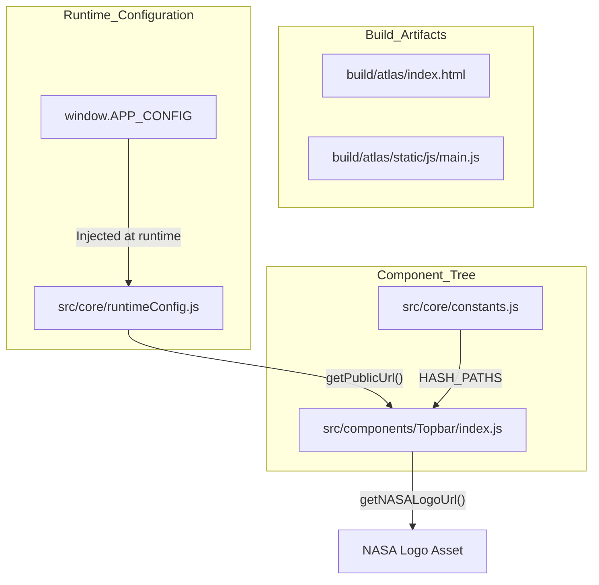

# Page: Getting Started

# Getting Started

<details>
<summary>Relevant source files</summary>

The following files were used as context for generating this wiki page:

- [.cursorignore](.cursorignore)
- [.cursorrules](.cursorrules)
- [.env.example](.env.example)
- [.gitignore](.gitignore)
- [.nvmrc](.nvmrc)
- [Documenation/docusaurus.config.js](Documenation/docusaurus.config.js)
- [config/paths.js](config/paths.js)
- [config/webpackDevServer.config.js](config/webpackDevServer.config.js)
- [scripts/start-dev.js](scripts/start-dev.js)
- [src/components/Topbar/index.js](src/components/Topbar/index.js)

</details>


This page provides the necessary information for developers to set up their local environment, run the Atlas development server, and build the application for production.

## Prerequisites

To contribute to Atlas, ensure your local environment meets the following requirements:

*   **Node.js**: Version defined in `.nvmrc` is `lts/jod` [[.nvmrc:1-1]()].
*   **Package Manager**: Uses `npm`. 
*   **Environment Variables**: A `.env` file must be created in the root directory. You can use `.env.example` as a template [[config/paths.js:74-74]()].

## Environment Setup

1.  **Clone the repository**:
    ```bash
    git clone https://github.com/JPL-Devin/atlas.git
    cd atlas
    ```
2.  **Install dependencies**:
    From the root directory:
    ```bash
    npm install
    ```
3.  **Configure Environment**:
    Copy `.env.example` to `.env` and update the values to match your local or development backend services [[.env.example:1-14]()].

### Key Environment Variables

Atlas uses environment variables to define API endpoints and application metadata. Variables prefixed with `REACT_APP_` are typically processed during the build pipeline [[.env.example:1-12]()].

| Variable | Description | Default / Example |
| :--- | :--- | :--- |
| `PUBLIC_URL` | The base path where the app is served. | `/atlas` [[.env.example:5-5]()] |
| `REACT_APP_DOMAIN` | The base URL for the Atlas API. | `https://pds-imaging.jpl.nasa.gov/api` [[.env.example:7-7]()] |
| `REACT_APP_SEARCH_ENDPOINT` | The primary Elasticsearch search endpoint. | `/search/atlas/_search` [[.env.example:9-9]()] |
| `REACT_APP_DATA_ENDPOINT` | Endpoint for retrieving product data/files. | `/data` [[.env.example:8-8]()] |
| `PORT` | Port for the development server. | `8500` [[config/webpackDevServer.config.js:17-17]()] |

Sources: [[.env.example:1-14]()], [[config/webpackDevServer.config.js:11-17]()], [[config/paths.js:74-74]()]

---

## Development Workflow

### Running the Dev Server
To start the development environment, run:
```bash
npm run start
```
The script `scripts/start-dev.js` initializes a `WebpackDevServer` using the configuration in `config/webpackDevServer.config.js` [[scripts/start-dev.js:20-32]()].

**Dev Server Behavior:**
*   **Port Logic**: Defaults to `8500`. If the port is busy, it attempts to find the next available port via `choosePort()` [[scripts/start-dev.js:43-68]()].
*   **Documentation**: The dev server checks for the existence of `paths.docBuild` (`build/documentation`). If found, it serves the Docusaurus site at `/documentation` [[config/webpackDevServer.config.js:63-66](), [config/paths.js:77-77]()].
*   **Hot Reloading**: Enabled by default via `hot: true` [[config/webpackDevServer.config.js:28-28]()].
*   **Proxy Support**: Loads proxy configurations from `package.json` to handle API requests [[scripts/start-dev.js:98-101]()].

### Data Flow: Development Startup
The following diagram illustrates how the development environment initializes and handles configuration.

Title: Development Environment Initialization

Sources: [[scripts/start-dev.js:15-32]()], [[config/webpackDevServer.config.js:19-51]()], [[config/paths.js:74-80]()]

---

## Production Build and Deployment

### Building for Production
To create a production-ready build, run:
```bash
npm run build
```
The build artifacts are output to the directory defined by `paths.appBuild`, which is `build/atlas` [[config/paths.js:76-76]()].

### Production Execution
Once built, the application can be served. In production mode, `getServedPath` always returns `/` to support deployment-agnostic builds that rely on runtime configuration injection rather than build-time hardcoding [[config/paths.js:34-38]()].

### Data Flow: Production Configuration and Routing
The application uses a specific path resolution strategy for production. Components like the `Topbar` utilize `getPublicUrl()` from `runtimeConfig.js` to construct asset URLs dynamically, such as the NASA logo, ensuring they work regardless of the deployment subpath [[src/components/Topbar/index.js:20-29]()].

Title: Production Asset and Route Resolution

Sources: [[config/paths.js:34-43]()], [[src/components/Topbar/index.js:19-29]()], [[src/core/runtimeConfig.js:20-20]()]

---

## Documentation Sub-project
Atlas includes a Docusaurus-based technical documentation site located in the `/Documentation` directory.

*   **Config**: Defined in `Documenation/docusaurus.config.js` [[Documenation/docusaurus.config.js:10-10]()].
*   **Base URL**: The documentation is served under the `/documentation/` subpath. This is dynamically calculated based on the `PUBLIC_URL` environment variable [[Documenation/docusaurus.config.js:20-20]()].
*   **Build Output**: The compiled documentation is placed in `build/documentation` [[config/paths.js:77-77]()].
*   **Integration**: During development, `webpackDevServer.config.js` uses `express.static` to serve this folder if it exists [[config/webpackDevServer.config.js:62-66]()].

Sources: [[Documenation/docusaurus.config.js:1-112]()], [[config/paths.js:77-77]()], [[config/webpackDevServer.config.js:61-69]()]
