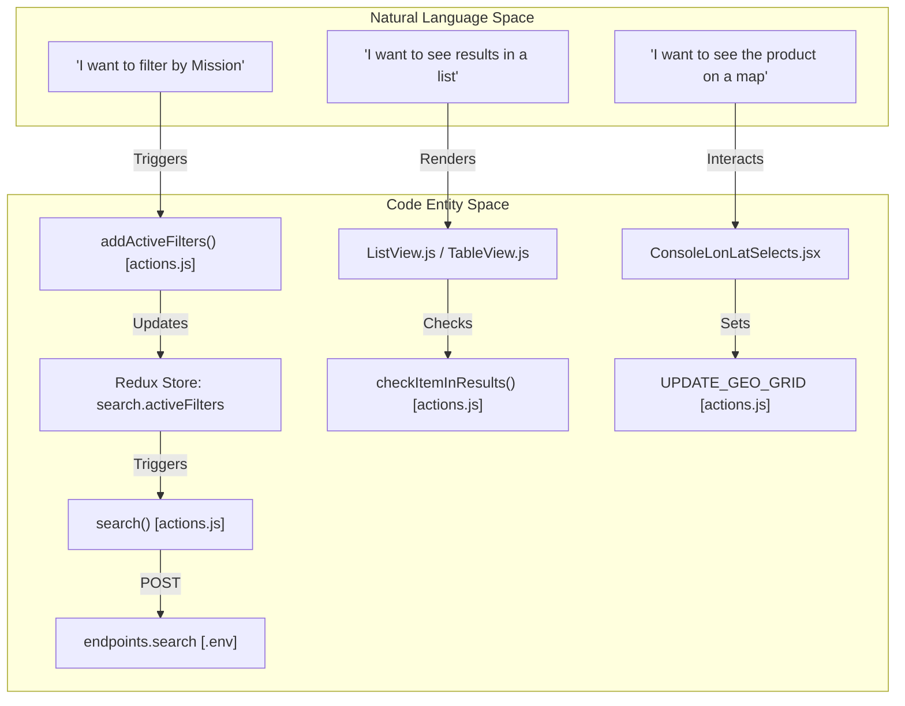
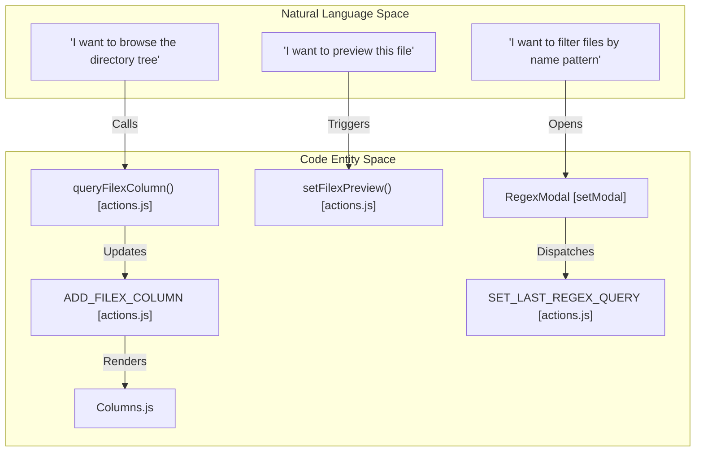
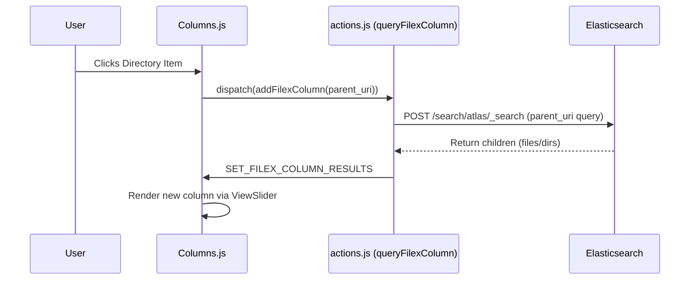

# Page: Glossary

# Glossary

Relevant source files

The following files were used as context for generating this wiki page:

- [.env](.env)
- [config/webpack.config.js](config/webpack.config.js)
- [eslint.config.mjs](eslint.config.mjs)
- [package-lock.json](package-lock.json)
- [package.json](package.json)
- [public/streamsaver/mitm.html](public/streamsaver/mitm.html)
- [src/CartoCosmos/components/presentational/ConsoleLonLatSelects.jsx](src/CartoCosmos/components/presentational/ConsoleLonLatSelects.jsx)
- [src/CartoCosmos/components/presentational/ConsoleProjectionButtons.jsx](src/CartoCosmos/components/presentational/ConsoleProjectionButtons.jsx)
- [src/CartoCosmos/components/presentational/CreditsDisplay.jsx](src/CartoCosmos/components/presentational/CreditsDisplay.jsx)
- [src/CartoCosmos/components/presentational/WellKnownTextInput.jsx](src/CartoCosmos/components/presentational/WellKnownTextInput.jsx)
- [src/core/constants.js](src/core/constants.js)
- [src/core/downloaders/CSV.js](src/core/downloaders/CSV.js)
- [src/core/downloaders/CURL.js](src/core/downloaders/CURL.js)
- [src/core/downloaders/TXT.js](src/core/downloaders/TXT.js)
- [src/core/downloaders/WGET.js](src/core/downloaders/WGET.js)
- [src/core/redux/actions/actions.js](src/core/redux/actions/actions.js)
- [src/pages/FileExplorer/Columns/Columns.js](src/pages/FileExplorer/Columns/Columns.js)
- [src/pages/Search/Panels/ResultsPanel/subcomponents/GridView/GridView.js](src/pages/Search/Panels/ResultsPanel/subcomponents/GridView/GridView.js)
- [src/pages/Search/Panels/ResultsPanel/subcomponents/ListView/ListView.js](src/pages/Search/Panels/ResultsPanel/subcomponents/ListView/ListView.js)
- [src/pages/Search/Panels/ResultsPanel/subcomponents/TableView/TableView.js](src/pages/Search/Panels/ResultsPanel/subcomponents/TableView/TableView.js)

This page provides definitions for codebase-specific terms, acronyms, and domain concepts used throughout the Atlas application. It serves as a technical reference for onboarding engineers to understand the mapping between scientific PDS (Planetary Data System) concepts and their implementation in the Atlas React/Redux architecture.

## Core Domain Concepts

### PDS (Planetary Data System)
The standard for archiving planetary data. Atlas supports both **PDS3** (legacy, folder/volume based) and **PDS4** (modern, bundle/collection based) standards [src/core/constants.js:76-88](). Metadata is extracted into a normalized format in Elasticsearch.

### Atlas URI
A unique internal identifier used to reference any product, directory, or bundle across the system. It follows a specific schema: `atlas://[mission]/[spacecraft]/[bundle]/[path]`.
*   **Implementation**: Parsed using `splitUri()` in `src/core/utils.js` [src/core/utils.js:11-15]().
*   **Usage**: Primary key for Redux state in `record` and `cart` modules [src/core/redux/actions/actions.js:66-85]().

### Facets and Mappings
Atlas uses Elasticsearch (ES) index mappings to dynamically generate the UI for filters.
*   **Mappings**: The raw ES schema fetched via `loadMappings` [src/core/redux/actions/actions.js:127-152]().
*   **FacetBuilder**: A utility that transforms ES mappings into a hierarchical structure for the UI [src/core/redux/actions/actions.js:17-18]().

### DSL (Domain Specific Language)
Refers to the JSON query body sent to Elasticsearch.
*   **Implementation**: Constructed dynamically based on `activeFilters` in the Redux state [src/core/redux/actions/actions.js:20-21]().

**Sources**: [src/core/constants.js:76-88](), [src/core/utils.js:11-15](), [src/core/redux/actions/actions.js:17-152]().

---

## Technical Component Mapping

The following diagrams bridge the gap between natural language concepts and the specific code entities that implement them.

### Search and Filtering Data Flow
"Natural Language Space" describes user intent, while "Code Entity Space" identifies the corresponding logic and configuration.

**Sources**: [src/core/redux/actions/actions.js:247-254](), [src/core/constants.js:21-30](), [.env:11-14](), [src/pages/Search/Panels/ResultsPanel/subcomponents/ListView/ListView.js:30-31](), [src/CartoCosmos/components/presentational/ConsoleLonLatSelects.jsx:123-144]().

### Archive Explorer Navigation
Mapping the directory browsing experience to the column-based state management.

**Sources**: [src/pages/FileExplorer/Columns/Columns.js:21-30](), [src/core/redux/actions/actions.js:71-77]().

---

## Codebase Glossary Table

| Term | Definition | Code Pointer |
| :--- | :--- | :--- |
| `ES_PATHS` | Constant mapping human-readable keys to deep paths in the Elasticsearch document source. | [src/core/constants.js:45-105]() |
| `Release ID` | An integer representing the PDS data release version; used to resolve file URLs via `getPDSUrl`. | [src/core/constants.js:48](), [src/core/utils.js:10]() |
| `Gather` | An internal metadata object in the ES document containing Atlas-specific augmentations like ML classifications. | [src/core/constants.js:49-62]() |
| `PIT` | Point-In-Time; an Elasticsearch mechanism for consistent deep pagination. | [src/core/constants.js:24]() |
| `FileX` | Shorthand for "Archive Explorer" or "File Explorer" system. | [src/pages/FileExplorer/Columns/Columns.js:21-30]() |
| `Related` | Metadata field containing URIs for browse images, labels, and documentation. | [src/core/constants.js:107-119]() |
| `MITM` | Man-In-The-Middle; specifically the `mitm.html` helper for `StreamSaver` downloads. | [src/core/constants.js:27]() |
| `resultsStatuses` | Enum for tracking search state: `WAITING`, `SEARCHING`, `LOADING`, `SUCCESSFUL`, `ERROR`. | [src/core/constants.js:121-128]() |

**Sources**: [src/core/constants.js:24-128](), [src/pages/FileExplorer/Columns/Columns.js:21-30]().

---

## Archive Explorer (FileX) Architecture
The Archive Explorer uses a linked-list style column navigation system. Each column represents a directory level in the PDS archive.

**Sources**: [src/pages/FileExplorer/Columns/Columns.js:21-30](), [src/core/redux/actions/actions.js:71-75]().

---

## Download Pipeline Terms

### Scroll Pagination
For large downloads (CURL/WGET/ZIP), Atlas uses the ES `_scroll` API to fetch records without timing out.
*   **Implementation**: `CURLQuery` and `WGETQuery` functions recursively call the scroll endpoint until `totalReceived >= item.total` [src/core/downloaders/CURL.js:115-193](), [src/core/downloaders/WGET.js:115-194]().
*   **Segmenting**: Files are segmented every 500,000 rows to ensure script usability [src/core/downloaders/CURL.js:10](), [src/core/downloaders/WGET.js:10]().

### StreamSaver / ZipStream
A client-side ZIP generation strategy that avoids memory overflows by streaming data directly to the user's disk.
*   **Implementation**: Uses `WritableStream` and a service worker (`mitm.html`) to trigger a browser download [src/core/constants.js:27]().

### Product Keys
Keywords like `src`, `label`, `browse`, `lg`, `md`, `sm` used to determine which specific file types associated with a product should be downloaded [src/core/constants.js:107-119](), [src/core/downloaders/CURL.js:141-145]().

**Sources**: [src/core/downloaders/CURL.js:10-193](), [src/core/downloaders/WGET.js:10-194](), [src/core/constants.js:21-119]().

---

## Build & Infrastructure Acronyms

*   **Runtime Config**: The pattern of injecting environment variables into `window.APP_CONFIG` at container startup so the same Docker image can run in different environments. Resolved via `runtimeConfig.js` [src/core/constants.js:1-10]().
*   **ModuleScopePlugin**: A Webpack plugin used in the build pipeline to ensure the React app only imports files from `src/` or `node_modules/` [config/webpack.config.js:16]().
*   **TerserPlugin**: Used for minifying JavaScript bundles in production builds [config/webpack.config.js:11]().
*   **HTML2Pug**: A plugin that converts HTML templates to Pug during the build process [config/webpack.config.js:23]().

**Sources**: [config/webpack.config.js:11-23](), [src/core/constants.js:1-10](), [.env:1-14]().