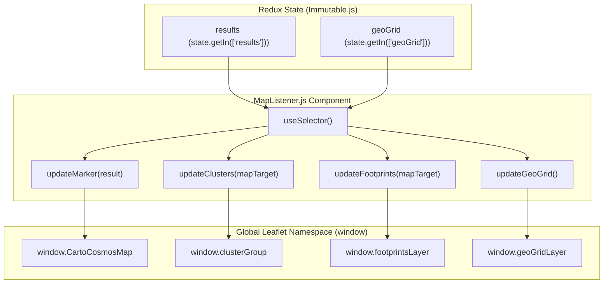
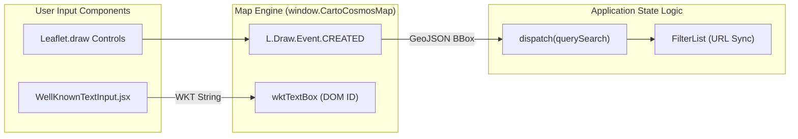

# Page: Map Panel (CartoCosmos)

# Map Panel (CartoCosmos)

Relevant source files

The following files were used as context for generating this wiki page:

- [src/CartoCosmos/components/container/App.jsx](src/CartoCosmos/components/container/App.jsx)
- [src/CartoCosmos/components/container/ConsoleContainer.jsx](src/CartoCosmos/components/container/ConsoleContainer.jsx)
- [src/CartoCosmos/components/presentational/ConsoleAppBar.jsx](src/CartoCosmos/components/presentational/ConsoleAppBar.jsx)
- [src/CartoCosmos/components/presentational/ConsoleCoordinates.jsx](src/CartoCosmos/components/presentational/ConsoleCoordinates.jsx)
- [src/CartoCosmos/components/presentational/ConsoleLonLatSelects.jsx](src/CartoCosmos/components/presentational/ConsoleLonLatSelects.jsx)
- [src/CartoCosmos/components/presentational/ConsoleProjectionButtons.jsx](src/CartoCosmos/components/presentational/ConsoleProjectionButtons.jsx)
- [src/CartoCosmos/components/presentational/ConsoleSpecialLayers.jsx](src/CartoCosmos/components/presentational/ConsoleSpecialLayers.jsx)
- [src/CartoCosmos/components/presentational/ConsoleTargetInfo.jsx](src/CartoCosmos/components/presentational/ConsoleTargetInfo.jsx)
- [src/CartoCosmos/components/presentational/CreditsDisplay.jsx](src/CartoCosmos/components/presentational/CreditsDisplay.jsx)
- [src/CartoCosmos/components/presentational/StyledTooltip.jsx](src/CartoCosmos/components/presentational/StyledTooltip.jsx)
- [src/CartoCosmos/components/presentational/WellKnownTextInput.jsx](src/CartoCosmos/components/presentational/WellKnownTextInput.jsx)
- [src/CartoCosmos/styles.css](src/CartoCosmos/styles.css)
- [src/components/FilterHelp/FilterHelp.js](src/components/FilterHelp/FilterHelp.js)
- [src/pages/Search/Panels/SecondaryPanel/subcomponents/MapListener/MapListener.js](src/pages/Search/Panels/SecondaryPanel/subcomponents/MapListener/MapListener.js)

The Map Panel provides an interactive planetary GIS interface within the Atlas Search page. It is built upon the **CartoCosmos** framework, integrating Leaflet-based mapping with planetary coordinate systems, projection switching, and spatial search capabilities.

## Architecture and Integration

The map is hosted within the `SecondaryPanel` of the Search page. It uses a lazy-loading strategy where the map engine is only initialized once the panel is first opened by the user.

### Component Hierarchy

The mapping system is divided into the core map engine and a suite of "Console" UI components for controlling the viewport and coordinate reporting.

| Component | Role | File |
| :--- | :--- | :--- |
| `ConsoleAppBar` | Layout container for map controls (target info, coordinate selects). | [src/CartoCosmos/components/presentational/ConsoleAppBar.jsx:41-79]() |
| `MapListener` | Redux-to-Leaflet bridge; updates markers and footprints based on search results. | [src/pages/Search/Panels/SecondaryPanel/subcomponents/MapListener/MapListener.js:26-98]() |
| `ConsoleLonLatSelects` | Toggles for East/West longitude and Centric/Graphic coordinates. | [src/CartoCosmos/components/presentational/ConsoleLonLatSelects.jsx:123-145]() |
| `ConsoleProjectionButtons` | UI for switching between Cylindrical, North, and South projections. | [src/CartoCosmos/components/presentational/ConsoleProjectionButtons.jsx:116-210]() |
| `WellKnownTextInput` | Interface for manual WKT polygon entry. | [src/CartoCosmos/components/presentational/WellKnownTextInput.jsx:65-104]() |
| `ConsoleSpecialButtons` | Toggles for Result Clusters, Footprints, and Geo-Grid Heatmaps. | [src/CartoCosmos/components/presentational/ConsoleSpecialLayers.jsx:68-157]() |
| `TargetDropdown` | Selector for switching the active planetary body (e.g., Mars, Moon). | [src/CartoCosmos/components/container/App.jsx:114-226]() |

### System Data Flow

The following diagram illustrates how the map interacts with the global Redux state and the Leaflet instance via the `MapListener` component.

**Map Interaction Bridge**

Sources: [src/pages/Search/Panels/SecondaryPanel/subcomponents/MapListener/MapListener.js:31-38](), [src/pages/Search/Panels/SecondaryPanel/subcomponents/MapListener/MapListener.js:40-65](), [src/pages/Search/Panels/SecondaryPanel/subcomponents/MapListener/MapListener.js:66-98](), [src/pages/Search/Panels/SecondaryPanel/subcomponents/MapListener/MapListener.js:163-180]()

## Coordinate System Controls

The `ConsoleLonLatSelects` component provides fine-grained control over how coordinates are interpreted and displayed.

*   **Longitude Direction**: Toggle between `PositiveEast` and `PositiveWest` [src/CartoCosmos/components/presentational/ConsoleLonLatSelects.jsx:124]().
*   **Coordinate System**: Switch between `Planetocentric` (spherical) and `Planetographic` (ellipsoidal) systems [src/CartoCosmos/components/presentational/ConsoleLonLatSelects.jsx:125]().
*   **Longitude Range**: Toggle between `-180° to 180°` and `0° to 360°` [src/CartoCosmos/components/presentational/ConsoleLonLatSelects.jsx:126]().

Real-time coordinate reporting is handled by `ConsoleCoordinates`, which updates the `lonCoordinateDisplay` and `latCoordinateDisplay` DOM elements as the user moves the cursor across the map [src/CartoCosmos/components/presentational/ConsoleCoordinates.jsx:99-108]().

Sources: [src/CartoCosmos/components/presentational/ConsoleLonLatSelects.jsx:173-227](), [src/CartoCosmos/components/presentational/ConsoleCoordinates.jsx:75-113]()

## Projections and Layers

The map supports switching between different planetary projections for the selected target body.

### Projection Switching
The `ConsoleProjectionButtons` component manages the active projection state [src/CartoCosmos/components/presentational/ConsoleProjectionButtons.jsx:119]().
*   **Cylindrical**: Standard equirectangular view [src/CartoCosmos/components/presentational/ConsoleProjectionButtons.jsx:194-206]().
*   **North/South Polar**: Stereographic projections for polar regions. These buttons are dynamically disabled if the specific target body does not have polar tiles available [src/CartoCosmos/components/presentational/ConsoleProjectionButtons.jsx:69-108]().

### Data Layers
The `ConsoleSpecialButtons` component allows users to toggle three primary data overlays [src/CartoCosmos/components/presentational/ConsoleSpecialLayers.jsx:72-74]():
1.  **Markers/Clusters**: Individual product center points, grouped using `L.markerClusterGroup` with a `maxClusterRadius` of 40 [src/pages/Search/Panels/SecondaryPanel/subcomponents/MapListener/MapListener.js:70](). Icons are styled as 12px circular pins with a black border and yellow fill [src/pages/Search/Panels/SecondaryPanel/subcomponents/MapListener/MapListener.js:71-76]().
2.  **Footprints**: Geometric polygons representing the spatial extent of a product, rendered via `L.geoJson` with hover effects [src/pages/Search/Panels/SecondaryPanel/subcomponents/MapListener/MapListener.js:156-160]().
3.  **Geo-Grid**: A heatmap-like grid used for large-scale result density visualization based on `doc_count` [src/pages/Search/Panels/SecondaryPanel/subcomponents/MapListener/MapListener.js:163-180]().

Sources: [src/CartoCosmos/components/presentational/ConsoleProjectionButtons.jsx:138-210](), [src/CartoCosmos/components/presentational/ConsoleSpecialLayers.jsx:92-132](), [src/pages/Search/Panels/SecondaryPanel/subcomponents/MapListener/MapListener.js:66-161]()

## Spatial Search Integration

The map serves as a primary input for spatial filtering in the Search page.

### WKT Input
Users can manually define a search area using the `WellKnownTextInput` component [src/CartoCosmos/components/presentational/WellKnownTextInput.jsx:65](). This component accepts a WKT string (e.g., `POLYGON((...))`) and provides a "Draw on Map" button to visualize the input before executing a search [src/CartoCosmos/components/presentational/WellKnownTextInput.jsx:85-99]().

### Drawing Tools
Integrated Leaflet.draw tools allow users to draw bounding boxes or polygons directly on the map. The CSS for these tools is customized to match the Atlas dark theme, specifically targeting `leaflet-draw-draw-polygon` and `leaflet-draw-draw-rectangle` [src/CartoCosmos/styles.css:95-104]().

**Spatial Search Data Flow**

Sources: [src/CartoCosmos/components/presentational/WellKnownTextInput.jsx:85-99](), [src/CartoCosmos/styles.css:70-81](), [src/pages/Search/Panels/SecondaryPanel/subcomponents/MapListener/MapListener.js:152]()

## Styling and UI
The map panel uses a specialized CSS configuration to integrate Leaflet into the React/Material-UI environment.
*   **Leaflet Integration**: Custom styles for `leaflet-control-zoom`, `leaflet-control-layers`, and `leaflet-bar` ensure consistency with the Atlas color palette [src/CartoCosmos/styles.css:36-62]().
*   **Console Styling**: The UI controls use `makeStyles` with semi-transparent backgrounds (`alpha("#1971c2", 0.7)`) to overlay the map without obscuring data [src/CartoCosmos/components/presentational/ConsoleLonLatSelects.jsx:52-106]().
*   **Credits**: The `CreditsDisplay` component provides links to CartoCosmos documentation, user manuals, and the source repository [src/CartoCosmos/components/presentational/CreditsDisplay.jsx:40-124]().
*   **Target Selection**: The `TargetDropdown` organizes planetary bodies into categories like "Planets" and "Other Bodies" [src/CartoCosmos/components/container/App.jsx:118-183](), filtering options based on `bodyLimits` [src/CartoCosmos/components/container/App.jsx:207-222]().

Sources: [src/CartoCosmos/styles.css:1-55](), [src/CartoCosmos/components/presentational/CreditsDisplay.jsx:40-127](), [src/CartoCosmos/components/container/App.jsx:114-226]()
