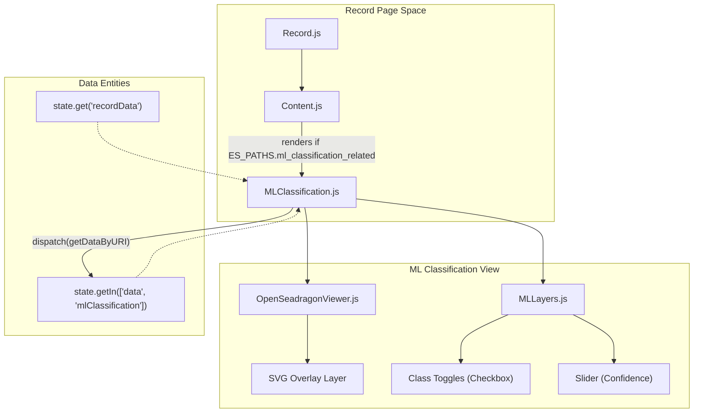
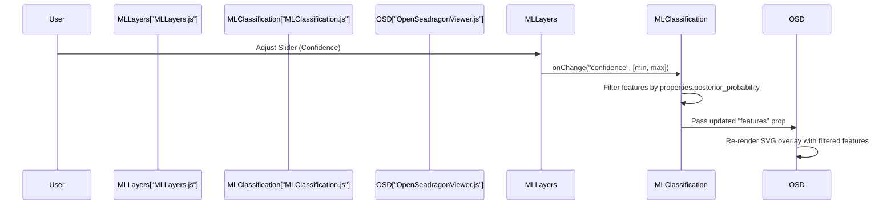

# Page: ML Classification View

# ML Classification View

Relevant source files

The following files were used as context for generating this wiki page:

- [src/components/OpenSeadragonViewer/OpenSeadragonViewer.js](src/components/OpenSeadragonViewer/OpenSeadragonViewer.js)
- [src/components/ProductIcons/ProductIcons.js](src/components/ProductIcons/ProductIcons.js)
- [src/pages/Cart/Cart.js](src/pages/Cart/Cart.js)
- [src/pages/FileExplorer/FileExplorer.js](src/pages/FileExplorer/FileExplorer.js)
- [src/pages/Record/Content/Content.js](src/pages/Record/Content/Content.js)
- [src/pages/Record/Content/Views/MLClassification/MLClassification.js](src/pages/Record/Content/Views/MLClassification/MLClassification.js)
- [src/pages/Record/Content/Views/MLClassification/subcomponents/MLLayers/MLLayers.js](src/pages/Record/Content/Views/MLClassification/subcomponents/MLLayers/MLLayers.js)
- [src/pages/Record/Record.js](src/pages/Record/Record.js)
- [src/pages/Search/Search.js](src/pages/Search/Search.js)

The **ML Classification View** is a specialized tab within the Product Detail (Record) page. It provides an interactive interface for visualizing machine learning-generated feature detections (e.g., craters, dunes, or specific geological features) overlaid on high-resolution browse images. The view supports dynamic filtering by confidence scores and toggling visibility of specific feature classes.

## Overview and Architecture

The ML Classification view is conditionally rendered within the `Content` component of the Record page only when the product metadata contains related ML classification data [src/pages/Record/Content/Content.js:23-27]().

### Data Flow and Initialization
1.  **Detection**: The `Content` component checks `ES_PATHS.ml_classification_related` to determine if the tab should be enabled [src/pages/Record/Content/Content.js:26]().
2.  **Fetching**: Upon mounting, `MLClassification.js` identifies the ML overlay JSON URI from the `recordData` using the path `gather.machine_learning.classification.related.overlay.uri` [src/pages/Record/Content/Views/MLClassification/MLClassification.js:90-93]().
3.  **Redux Integration**: It dispatches `getDataByURI` to fetch the GeoJSON-formatted ML features and stores them in the Redux state under the `mlClassification` tag [src/pages/Record/Content/Views/MLClassification/MLClassification.js:97]().
4.  **Coordinate Mapping**: Feature coordinates (stored as pixel offsets in `properties.pixel_coordinates`) are mapped to the OpenSeadragon coordinate system for accurate SVG overlay rendering [src/pages/Record/Content/Views/MLClassification/MLClassification.js:130-134]().

### Component Relationship Diagram

The following diagram illustrates the relationship between the Record page, the ML view, and its subcomponents.

**ML View Hierarchy**

Sources: [src/pages/Record/Content/Content.js:17-29](), [src/pages/Record/Content/Views/MLClassification/MLClassification.js:15-16](), [src/pages/Record/Content/Views/MLClassification/MLClassification.js:84-86](), [src/pages/Record/Record.js:43-45]()

---

## Implementation Details

### Feature Processing and Coordinate Mapping
The ML data is typically returned as a collection of features. The `MLClassification` component performs several transformations before rendering:

*   **Pixel Mapping**: It iterates through features and ensures `pixel_coordinates` from the feature properties are assigned to the geometry coordinates used by the viewer [src/pages/Record/Content/Views/MLClassification/MLClassification.js:130-134]().
*   **Color Assignment**: Each unique `predicted_class` is assigned a color from a predefined palette (`layerColors`) [src/pages/Record/Content/Views/MLClassification/MLClassification.js:72-81]().
*   **Filtering**: Features are filtered in real-time based on the `confidence` range and the `checkedClasses` state [src/pages/Record/Content/Views/MLClassification/MLClassification.js:137-150]().

### OpenSeadragon Integration
The view utilizes the `OpenSeadragonViewer` component which includes a built-in SVG overlay capability via the `svg-overlay` plugin [src/components/OpenSeadragonViewer/OpenSeadragonViewer.js:3]().

| Functionality | Implementation |
| :--- | :--- |
| **Image Source** | Resolved via `getPDSUrl` using the browse URI from `ES_PATHS.browse` [src/pages/Record/Content/Views/MLClassification/MLClassification.js:123-125](). |
| **Viewer Initialization** | `OpenSeadragon` is initialized with standard controls (zoom, home, fullpage, rotate) [src/components/OpenSeadragonViewer/OpenSeadragonViewer.js:194-220](). |
| **Layers Toggle** | A UI button in the OSD viewer triggers `onLayers`, which toggles the visibility of the `MLLayers` sidebar [src/pages/Record/Content/Views/MLClassification/MLClassification.js:161-163](). |
| **Feature Overlay** | The `features` prop is passed to `OpenSeadragonViewer` for rendering on the SVG layer [src/pages/Record/Content/Views/MLClassification/MLClassification.js:164](). |

Sources: [src/pages/Record/Content/Views/MLClassification/MLClassification.js:156-166](), [src/components/OpenSeadragonViewer/OpenSeadragonViewer.js:181-220]()

---

## MLLayers Subcomponent

The `MLLayers` component provides the control interface for the ML overlay, located in a sidebar that can be toggled open or closed [src/pages/Record/Content/Views/MLClassification/MLClassification.js:168-173]().

### Key Controls
1.  **Class Toggles**: A list of checkboxes allowing users to show/hide specific ML classes (e.g., "Craters"). The background of each list item is styled to match the feature color on the map [src/pages/Record/Content/Views/MLClassification/subcomponents/MLLayers/MLLayers.js:168-187]().
2.  **Confidence Slider**: A range slider (defaulting to 0.9 to 1.0) that filters features based on their `posterior_probability` [src/pages/Record/Content/Views/MLClassification/subcomponents/MLLayers/MLLayers.js:122-132]().
3.  **Data Export**: A "Copy ML Features JSON" button allows users to copy the raw feature data to their clipboard using `copyToClipboard` [src/pages/Record/Content/Views/MLClassification/subcomponents/MLLayers/MLLayers.js:151-164]().

### Component Interaction Logic

**ML Filter Logic**

Sources: [src/pages/Record/Content/Views/MLClassification/MLClassification.js:176-187](), [src/pages/Record/Content/Views/MLClassification/subcomponents/MLLayers/MLLayers.js:129-132](), [src/pages/Record/Content/Views/MLClassification/MLClassification.js:137-150]()

## Technical Reference

### Relevant ES Paths
The component relies on specific metadata fields defined in `ES_PATHS`:
*   `ml_classification_related`: Used to detect if ML data exists [src/pages/Record/Content/Content.js:26]().
*   `browse`: The URI of the image to be used as the base layer [src/pages/Record/Content/Views/MLClassification/MLClassification.js:123]().
*   `release_id`: Required to construct the full PDS URL for the JSON and Image files [src/pages/Record/Content/Views/MLClassification/MLClassification.js:87]().

### State Management
*   **Local State**: `checkedClasses` (visibility and color mapping) and `confidence` (range array) [src/pages/Record/Content/Views/MLClassification/MLClassification.js:69-70]().
*   **Redux State**: `state.getIn(['data', 'mlClassification'])` contains the GeoJSON feature collection [src/pages/Record/Content/Views/MLClassification/MLClassification.js:84-86]().
*   **Cleanup**: On unmount, the ML classification data in Redux is cleared via `dispatch(setData(DATA_TAG, {}))` [src/pages/Record/Content/Views/MLClassification/MLClassification.js:102-104]().

Sources: [src/pages/Record/Content/Views/MLClassification/MLClassification.js:83-105](), [src/core/constants.js:13]()
