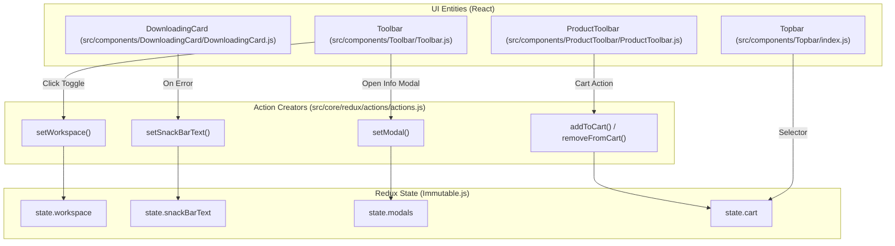
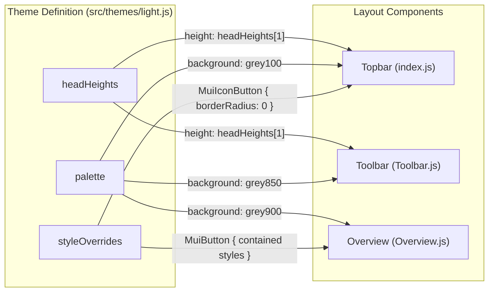

# Page: Navigation and Layout Components

# Navigation and Layout Components

Relevant source files

The following files were used as context for generating this wiki page:

- [.env.example](.env.example)
- [src/components/DownloadingCard/DownloadingCard.js](src/components/DownloadingCard/DownloadingCard.js)
- [src/components/MenuButton/MenuButton.js](src/components/MenuButton/MenuButton.js)
- [src/components/ProductToolbar/ProductToolbar.js](src/components/ProductToolbar/ProductToolbar.js)
- [src/components/SnackBar/SnackBar.js](src/components/SnackBar/SnackBar.js)
- [src/components/Toolbar/Toolbar.js](src/components/Toolbar/Toolbar.js)
- [src/components/Topbar/index.js](src/components/Topbar/index.js)
- [src/facets/FacetBuilder.js](src/facets/FacetBuilder.js)
- [src/pages/Cart/Content/Panel/Tabs/Browser/Browser.js](src/pages/Cart/Content/Panel/Tabs/Browser/Browser.js)
- [src/pages/Cart/Modals/RemoveFromCartModal/RemoveFromCartModal.js](src/pages/Cart/Modals/RemoveFromCartModal/RemoveFromCartModal.js)
- [src/pages/Record/Content/ViewTabs/ViewTabs.js](src/pages/Record/Content/ViewTabs/ViewTabs.js)
- [src/pages/Record/Content/Views/Overview/Overview.js](src/pages/Record/Content/Views/Overview/Overview.js)
- [src/pages/Record/Footer/Footer.js](src/pages/Record/Footer/Footer.js)
- [src/pages/Search/Modals/InformationModal/InformationModal.js](src/pages/Search/Modals/InformationModal/InformationModal.js)
- [src/themes/index.js](src/themes/index.js)
- [src/themes/light.js](src/themes/light.js)

This section details the global UI framework of the Atlas application, including the top-level navigation bars, persistent layout elements, the notification system, and the Material UI (MUI) theme configuration that ensures visual consistency across all pages.

## MUI Theme System

Atlas utilizes a custom MUI theme defined in `src/themes/light.js`. This theme controls the application's color palette, typography, and global component overrides to match PDS branding requirements.

### Palette and Swatches
The theme defines a comprehensive `palette` and a `swatches` object for fine-grained color control.
*   **Primary/Secondary**: Primary is white (`#FFFFFF`), while secondary is a dark grey/black (`#17171B`) [src/themes/light.js:3-11]().
*   **Accent**: Blue tones (`#1C67E3`, `#0B3D91`, `#288BFF`) are used for active elements and highlights [src/themes/light.js:12-16]().
*   **Swatches**: Specific color ramps for `grey`, `blue`, `red`, and `yellow` are used throughout the application for status indicators and borders [src/themes/light.js:27-88]().

### Layout Constants: headHeights
A unique feature of the Atlas theme is the `headHeights` array. This provides standardized heights for different levels of navigation and headers [src/themes/light.js:94]():
*   `headHeights[0]`: Footer/Bottom Toolbars (56px).
*   `headHeights[1]`: Primary Topbar and Vertical Toolbar (40px) [src/components/Topbar/index.js:33](), [src/components/Toolbar/Toolbar.js:57]().
*   `headHeights[2]`: View Tab bars (40px) [src/pages/Search/Modals/InformationModal/InformationModal.js:48]().
*   `headHeights[3]`: List items and sub-headers (32px).
*   `headHeights[4]`: Small utility headers (24px).

### Component Overrides
The theme applies global `styleOverrides` to MUI components to achieve a "flat" and professional look:
*   **MuiButton**: Contained buttons are forced to a small font size (11.375px) with a 2px border radius [src/themes/light.js:112-123]().
*   **MuiIconButton**: Border radius is set to `0px` for a square, technical appearance [src/themes/light.js:105-111]().
*   **MuiTooltip**: Styled with a dark grey background (`grey800`) and standardized font size [src/themes/light.js:147-159]().
*   **MuiTabs/MuiTab**: Minimum heights are locked to 40px to match `headHeights[2]` [src/themes/light.js:167-186]().
*   **MuiDialogActions**: Standardized with a grey background (`grey150`) and space-between justification [src/themes/light.js:234-242]().

Sources: [src/themes/light.js:1-243](), [src/pages/Search/Modals/InformationModal/InformationModal.js:30-55]()

---

## Topbar Component

The `Topbar` is the primary global navigation element located at the very top of the viewport. It displays the NASA/PDS branding and the current application page name.

### Implementation Details
*   **Branding**: Dynamically resolves the NASA logo URL using `getNASALogoUrl`, which accounts for the application's runtime public path by checking `window.APP_CONFIG` via `getPublicUrl` [src/components/Topbar/index.js:25-29]().
*   **Page Title**: Uses `useLocation` from `react-router-dom` to determine the current path and maps it to a human-readable name (e.g., "Image Search", "Archive Explorer", "Cart") [src/components/Topbar/index.js:181-194]().
*   **Cart Integration**: Selects the `cart` state from Redux to display a count badge over the shopping cart icon [src/components/Topbar/index.js:175-178](). The badge is styled with a red background (`red500`) and white text [src/components/Topbar/index.js:151-162]().

### Layout Structure
| Element | Description | Code Reference |
| :--- | :--- | :--- |
| **Left Section** | NASA Logo + PDS Node Links (Imaging Sciences) | [src/components/Topbar/index.js:198-216]() |
| **Center Section** | App Name ("ATLAS") + Page Name | [src/components/Topbar/index.js:218-226]() |
| **Right Section** | Quick nav icons (Search, FileX, Cart) | [src/components/Topbar/index.js:133-162]() |

Sources: [src/components/Topbar/index.js:1-230](), [src/core/constants.js:19-20](), [src/core/runtimeConfig.js:20-21]()

---

## Toolbar Component

The `Toolbar` is a vertical navigation drawer (usually on the left) that provides access to page-specific tools and global settings.

### Drawer and Transitions
The toolbar supports a "shifted" state when a sub-menu or drawer is open. It uses MUI's `Drawer` component with a fixed `drawerWidth` of 230px [src/components/Toolbar/Toolbar.js:46-98](). The `mainShift1` and `mainShift2` classes handle the CSS transitions for opening and closing the side drawer [src/components/Toolbar/Toolbar.js:68-81]().

### Key Interactions
*   **Navigation**: Contains links to the main application routes defined in `HASH_PATHS` [src/components/Toolbar/Toolbar.js:43]().
*   **Workspace Toggling**: Allows users to toggle between different layout modes (e.g., Map view vs. Results view) via the `setWorkspace` action [src/components/Toolbar/Toolbar.js:37]().
*   **Settings Switch**: Includes a `Switch` component within the drawer for toggling UI options [src/components/Toolbar/Toolbar.js:192-206]().
*   **Action Dispatches**: Provides buttons for resetting filters (`resetFilters`), clearing FileExplorer previews (`setFilexPreview`), and opening modals (`setModal`) [src/components/Toolbar/Toolbar.js:35-41]().

Sources: [src/components/Toolbar/Toolbar.js:1-211]()

---

## Shared Interactive Widgets

### SnackBar
A global notification component that listens to the `snackBarText` Redux state.
*   **Auto-Hide**: Automatically closes after 4000ms.
*   **Persistence**: Implements an `afterImage` pattern to prevent the text from disappearing instantly during the fade-out animation.
*   **Severities**: Supports `success`, `warning`, and `error` types via `MuiAlert`.

### DownloadingCard
A specialized progress widget for active file streams, primarily used by the `ZipStream` downloader [src/pages/Cart/Content/Panel/Tabs/Browser/Browser.js:145-151]().
*   **Modes**: Manages internal states: `running`, `paused`, `stopped`, and `done` [src/components/DownloadingCard/DownloadingCard.js:120-126]().
*   **Controller Integration**: Directly calls `controller.pause()`, `controller.resume()`, or `controller.closeWithMetadata()` depending on the `controllerType` (e.g., 'zip') [src/components/DownloadingCard/DownloadingCard.js:140-176]().
*   **Visual Feedback**: Uses `DownloadingLinearProgress` (a styled `LinearProgress`) that changes color based on status: Green for `done`, Red for `stopped` [src/components/DownloadingCard/DownloadingCard.js:18-32](), [src/components/DownloadingCard/DownloadingCard.js:101-110]().
*   **Data Formatting**: Uses `abbreviateNumber` to show progress counts (e.g., "1.2k / 5k") [src/components/DownloadingCard/DownloadingCard.js:225-227]().

### MenuButton and SplitButton
Generic components for providing dropdown options:
*   **MenuButton**: A wrapper around MUI `Popper` and `MenuList` that supports checkboxes and active state tracking [src/components/MenuButton/MenuButton.js:122-186](). It is used for context menus where multiple selections or single-option toggles are required.
*   **ProductToolbar**: A specialized toolbar for search results and cart items. It provides quick actions for adding/removing items from the cart (`addToCart`, `removeFromCart`) and starting direct file downloads via `streamDownloadFile` [src/components/ProductToolbar/ProductToolbar.js:17-28]().

Sources: [src/components/DownloadingCard/DownloadingCard.js:1-230](), [src/components/MenuButton/MenuButton.js:1-186](), [src/components/ProductToolbar/ProductToolbar.js:1-147]()

---

## Data Flow: Layout to State

The following diagrams illustrate how navigation and layout components interact with the global Redux store and the MUI theme system.

### Component to Redux Association
This diagram shows how specific UI entities trigger state changes in the Redux store.

Sources: [src/components/Toolbar/Toolbar.js:35-41](), [src/components/Topbar/index.js:175-180](), [src/components/ProductToolbar/ProductToolbar.js:17-24](), [src/components/DownloadingCard/DownloadingCard.js:175-176]()

### Theme and Layout Flow
This diagram maps the relationship between the `light.js` theme definition and the visual layout of the components.

Sources: [src/themes/light.js:91-186](), [src/components/Topbar/index.js:31-39](), [src/components/Toolbar/Toolbar.js:48-67](), [src/pages/Record/Content/Views/Overview/Overview.js:19-52]()
