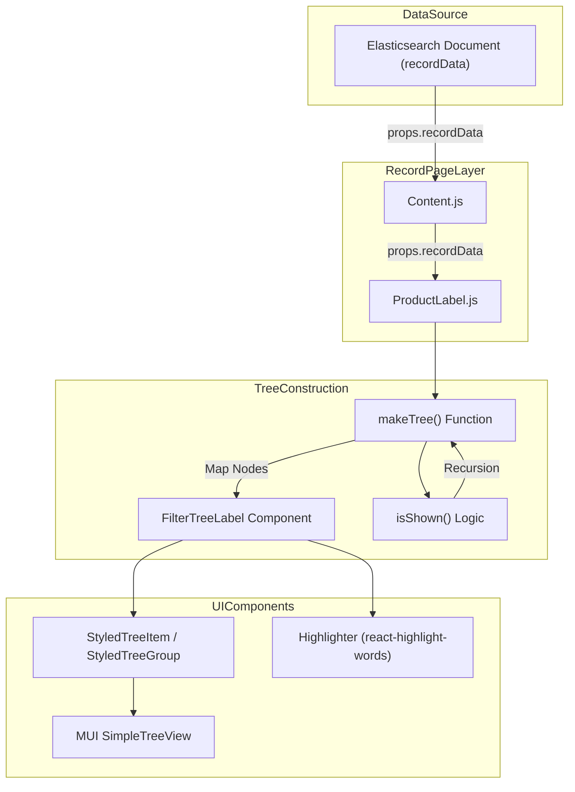
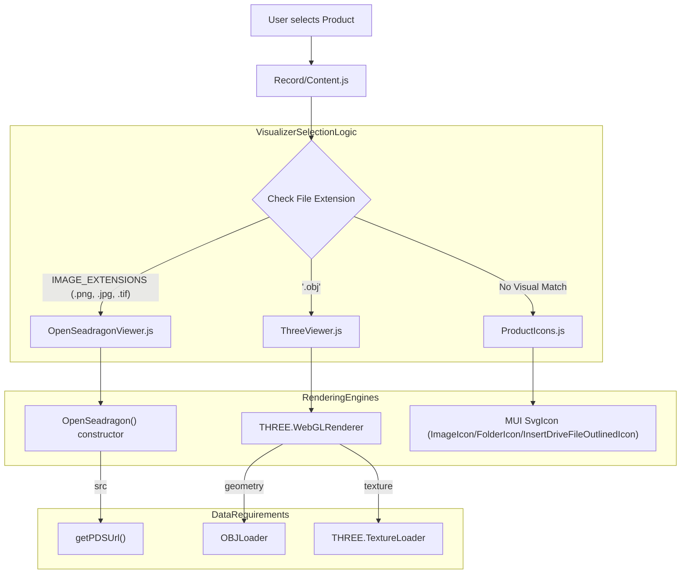

# Page: Overview and Product Label Views

# Overview and Product Label Views

Relevant source files

The following files were used as context for generating this wiki page:

- [src/components/OpenSeadragonViewer/OpenSeadragonViewer.js](src/components/OpenSeadragonViewer/OpenSeadragonViewer.js)
- [src/components/ProductIcons/ProductIcons.js](src/components/ProductIcons/ProductIcons.js)
- [src/components/ThreeViewer/ThreeViewer.js](src/components/ThreeViewer/ThreeViewer.js)
- [src/components/Toolbar/Toolbar.js](src/components/Toolbar/Toolbar.js)
- [src/pages/Record/Content/Content.js](src/pages/Record/Content/Content.js)
- [src/pages/Record/Content/Views/Help/Help.js](src/pages/Record/Content/Views/Help/Help.js)
- [src/pages/Record/Content/Views/Overview/Overview.js](src/pages/Record/Content/Views/Overview/Overview.js)
- [src/pages/Record/Content/Views/ProductLabel/ProductLabel.js](src/pages/Record/Content/Views/ProductLabel/ProductLabel.js)
- [src/pages/Search/Modals/AddFilterModal/subcomponents/FilterTree/FilterTree.js](src/pages/Search/Modals/AddFilterModal/subcomponents/FilterTree/FilterTree.js)
- [src/pages/Search/Modals/EditColumnsModal/subcomponents/LabelsTree/LabelsTree.js](src/pages/Search/Modals/EditColumnsModal/subcomponents/LabelsTree/LabelsTree.js)
- [src/pages/Search/Modals/InformationModal/InformationModal.js](src/pages/Search/Modals/InformationModal/InformationModal.js)

The **Record Page** provides a detailed inspection interface for individual PDS (Planetary Data System) products. This page is divided into several specialized views managed by the `ViewTabs` component [src/pages/Record/Content/Content.js:77-82](). The **Overview** and **Product Label** tabs serve as the primary entry points for visual inspection and metadata analysis.

## 1. Overview Tab

The Overview tab is the default view when a user navigates to a product record [src/pages/Record/Content/Content.js:59](). It is designed to provide an immediate visual representation of the data and a summary of critical metadata fields.

### Visual Rendering Engine
The Overview tab dynamically selects a rendering component based on the file extension of the product, determined via `getExtension` [src/pages/Record/Content/Views/Overview/Overview.js:173-178]():

*   **OpenSeadragonViewer**: The default viewer for standard image formats and tiled data. It provides deep-zoom capabilities, high-resolution tiling, and a navigator [src/components/OpenSeadragonViewer/OpenSeadragonViewer.js:194-220]().
*   **ThreeViewer**: Used for 3D data products, specifically `.obj` files. It utilizes `THREE.WebGLRenderer` to render models with support for `OrbitControls`, `TextureLoader` for supplemental image textures, and `OBJLoader` for geometry [src/components/ThreeViewer/ThreeViewer.js:77-150]().
*   **ProductIcons**: If no visualizer is applicable, a generic icon is displayed based on the product type (e.g., `volume`, `directory`, `file`) or extension (e.g., `obj`) [src/components/ProductIcons/ProductIcons.js:115-166]().

### Metadata Summary
The Overview tab extracts and displays a curated list of fields defined in the `fields` constant [src/pages/Record/Content/Views/Overview/Overview.js:133-155](). These include:
*   **PDS Archive Details**: `bundle_id`, `collection_id`, `volume_id`.
*   **Acquisition Geometry**: `latitude`, `longitude`.
*   **Time Constraints**: `start_time`, `stop_time`, `product_creation_time`.
*   **PDS4 Specifics**: Includes a version selector if multiple versions of a PDS4 product exist [src/pages/Record/Content/Views/Overview/Overview.js:214-218]().

**Sources:**
* [src/pages/Record/Content/Content.js:20-22]()
* [src/pages/Record/Content/Views/Overview/Overview.js:133-195]()
* [src/components/OpenSeadragonViewer/OpenSeadragonViewer.js:181-220]()
* [src/components/ThreeViewer/ThreeViewer.js:61-177]()
* [src/components/ProductIcons/ProductIcons.js:107-166]()

---

## 2. Product Label Tab

The **Product Label** view provides a hierarchical, searchable interface for exploring the complete PDS3 or PDS4 metadata associated with a product.

### Implementation and Data Flow
The component consumes `recordData` passed from the parent `Content` component [src/pages/Record/Content/Content.js:84-89](). It transforms the nested JSON metadata into a recursive tree structure using the `SimpleTreeView` and `TreeItem` components from `@mui/x-tree-view` [src/pages/Record/Content/Views/ProductLabel/ProductLabel.js:20-21]().

### Key Functions and Components
| Entity | Description |
| :--- | :--- |
| `makeTree` | A recursive function that traverses the metadata object. It handles lowercase search filtering and generates `StyledTreeGroup` for objects and `StyledTreeItem` for leaf nodes [src/pages/Record/Content/Views/ProductLabel/ProductLabel.js:210-250](). |
| `isShown` | A filtering helper used within `makeTree` to support visibility where a parent might not match a search string, but a child does [src/pages/Record/Content/Views/ProductLabel/ProductLabel.js:216-240](). |
| `FilterTreeLabel` | Renders the Key-Value pair. It uses `Highlighter` for search matches and implements a `more/less` toggle for values exceeding `MAX_LENGTH` (256 characters) [src/pages/Record/Content/Views/ProductLabel/ProductLabel.js:163-208](). |
| `TransitionComponent` | Uses `react-spring` to provide animated transitions (opacity and 3D translation) for expanding/collapsing tree nodes [src/pages/Record/Content/Views/ProductLabel/ProductLabel.js:38-49](). |

### Label Normalization
The view utilizes `flat` to process complex PDS labels [src/pages/Record/Content/Views/ProductLabel/ProductLabel.js:36](). It relies on `getPDSUrl` to resolve product URIs to physical file locations based on the `release_id` [src/pages/Record/Content/Views/ProductLabel/ProductLabel.js:8-12]().

**Sources:**
* [src/pages/Record/Content/Views/ProductLabel/ProductLabel.js:1-250]()
* [src/core/utils.js:7-12]()

---

## 3. System Architecture Diagrams

### Metadata Rendering Flow
This diagram traces how raw Elasticsearch data is transformed into the interactive Tree View in the Product Label tab.

"Metadata Transformation Flow"

**Sources:**
* [src/pages/Record/Content/Content.js:44-92]()
* [src/pages/Record/Content/Views/ProductLabel/ProductLabel.js:210-250]()
* [src/pages/Record/Content/Views/ProductLabel/ProductLabel.js:172-180]()

### Visualizer Selection Logic
This diagram maps file attributes to the specific code entities responsible for rendering the product overview.

"Natural Language to Code Entity: Viewer Selection"

**Sources:**
* [src/pages/Record/Content/Views/Overview/Overview.js:173-195]()
* [src/components/OpenSeadragonViewer/OpenSeadragonViewer.js:197-218]()
* [src/components/ThreeViewer/ThreeViewer.js:117-150]()
* [src/components/ProductIcons/ProductIcons.js:115-166]()

---

## 4. UI Components and Styling

The views utilize a shared styling pattern to maintain consistency across the Record page:

*   **StyledTreeGroup**: Extends the MUI `TreeItem` to apply the Atlas theme's `headHeights` (specifically index 3) and palette, using `theme.palette.swatches.grey.grey0` for item backgrounds and `theme.palette.accent.main` for icons [src/pages/Record/Content/Views/ProductLabel/ProductLabel.js:58-97]().
*   **Search Integration**: The `ProductLabel` view includes a search input with an `InputAdornment` for the `SearchIcon`. This updates the `filterString` state, triggering a re-render of the `makeTree` function [src/pages/Record/Content/Views/ProductLabel/ProductLabel.js:18-26]().
*   **Responsive Layout**: Both the Overview and Product Label views use `useMediaQuery` to switch from horizontal (flex-row) to vertical (flex-column) layouts on mobile devices (`md` breakpoint) [src/pages/Record/Content/Views/Overview/Overview.js:26-29](), [src/pages/Record/Content/Views/ProductLabel/ProductLabel.js:31]().

**Sources:**
* [src/pages/Record/Content/Views/ProductLabel/ProductLabel.js:58-112]()
* [src/pages/Record/Content/Views/Overview/Overview.js:20-52]()
* [src/pages/Search/Modals/AddFilterModal/subcomponents/FilterTree/FilterTree.js:74-112]()
