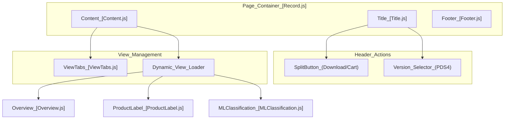
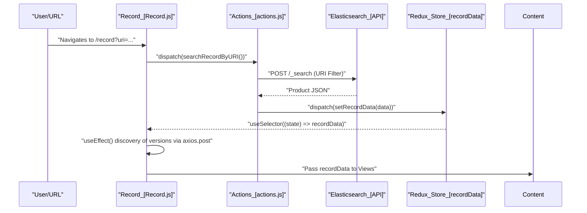

# Page: Record (Product Detail) Page

# Record (Product Detail) Page

Relevant source files

The following files were used as context for generating this wiki page:

- [src/components/OpenSeadragonViewer/OpenSeadragonViewer.js](src/components/OpenSeadragonViewer/OpenSeadragonViewer.js)
- [src/components/ProductIcons/ProductIcons.js](src/components/ProductIcons/ProductIcons.js)
- [src/components/SnackBar/SnackBar.js](src/components/SnackBar/SnackBar.js)
- [src/pages/Cart/Cart.js](src/pages/Cart/Cart.js)
- [src/pages/FileExplorer/FileExplorer.js](src/pages/FileExplorer/FileExplorer.js)
- [src/pages/Record/Content/Content.js](src/pages/Record/Content/Content.js)
- [src/pages/Record/Content/ViewTabs/ViewTabs.js](src/pages/Record/Content/ViewTabs/ViewTabs.js)
- [src/pages/Record/Content/Views/MLClassification/MLClassification.js](src/pages/Record/Content/Views/MLClassification/MLClassification.js)
- [src/pages/Record/Content/Views/MLClassification/subcomponents/MLLayers/MLLayers.js](src/pages/Record/Content/Views/MLClassification/subcomponents/MLLayers/MLLayers.js)
- [src/pages/Record/Footer/Footer.js](src/pages/Record/Footer/Footer.js)
- [src/pages/Record/Record.js](src/pages/Record/Record.js)
- [src/pages/Record/Title/Title.js](src/pages/Record/Title/Title.js)
- [src/pages/Search/Search.js](src/pages/Search/Search.js)

The **Record Page** is the dedicated detail view for a single PDS (Planetary Data System) product. It provides a deep dive into a product's metadata, high-resolution imagery, 3D visualizations, and associated Machine Learning (ML) classifications. The page is dynamically driven by the product's unique URI and adapts its interface based on the PDS standard (PDS3 vs PDS4) and available data facets.

## Page Lifecycle and Data Fetching

When a user navigates to a record, the application uses the URL to identify the target product. The `Record` component manages the high-level state, including fetching the primary product metadata and identifying alternative versions of the same product.

*   **URI-Based Fetching**: On mount or URL change, the component dispatches `searchRecordByURI()` to populate the Redux `recordData` state [src/pages/Record/Record.js:43-57]().
*   **Version Discovery**: For PDS4 products, the page automatically queries Elasticsearch for other versions of the same Logical Identifier (LID) by performing a regex search on the `lidvid` field [src/pages/Record/Record.js:63-122]().
*   **Navigation**: Users can return to the search results or previous pages via the `Title` component, which also supports a "Ctrl-Z" keyboard shortcut for quick navigation back to search [src/pages/Record/Title/Title.js:137-145]().

### Record Page Component Hierarchy

The following diagram maps the high-level UI components to their respective code entities.

**Sources:** [src/pages/Record/Record.js:134-141](), [src/pages/Record/Content/Content.js:12-29](), [src/pages/Record/Title/Title.js:212-219]()

## ViewTabs System

The Record page uses a tabbed navigation system defined in `ViewTabs.js` to switch between different perspectives of the data. The available tabs are determined by the data present in the `recordData` object via a `condition` check [src/pages/Record/Content/Content.js:20-29]().

| Tab Name | Component | Condition | Purpose |
| :--- | :--- | :--- | :--- |
| **Overview** | `Overview.js` | None | High-level metadata and primary image/3D viewer. |
| **Product Label** | `ProductLabel.js` | None | Full PDS label inspection with recursive tree navigation. |
| **ML Classification** | `MLClassification.js` | `ES_PATHS.ml_classification_related` | Visualization of machine learning overlays and feature classes. |

**Sources:** [src/pages/Record/Content/Content.js:20-29](), [src/pages/Record/Content/ViewTabs/ViewTabs.js:56-80]()

## Data Flow: From URI to Render

The following diagram illustrates how a URI is transformed into a rendered Record page, bridging the "Natural Language Space" (User Request) to the "Code Entity Space" (Redux/API).

**Sources:** [src/pages/Record/Record.js:43-57](), [src/pages/Record/Record.js:89-122](), [src/core/redux/actions/actions.js]()

## Feature Sections

### Overview and Product Label Views
The **Overview** tab serves as the landing page for a record. It displays high-resolution browse imagery or 3D models using specialized viewers like `OpenSeadragonViewer` or `ThreeViewer`. The **Product Label** tab provides a deep-dive into the raw PDS metadata, parsing the product label into a searchable, hierarchical tree structure.

For details, see [Overview and Product Label Views](#5.1).

### ML Classification View
The **ML Classification** tab integrates machine learning results directly onto the product imagery [src/pages/Record/Content/Views/MLClassification/MLClassification.js:153-167](). It fetches GeoJSON-formatted feature overlays and provides a `MLLayers` subcomponent for filtering features by class (e.g., "crater", "dune") and confidence score [src/pages/Record/Content/Views/MLClassification/subcomponents/MLLayers/MLLayers.js:166-215]().

For details, see [ML Classification View](#5.2).

### Action Toolbar
The `Title` component provides global actions for the record:
*   **Download**: Uses `SplitButton` to allow direct download of the source file or associated products (labels, browse images, ML features) [src/pages/Record/Title/Title.js:187-197]().
*   **Cart**: Add the current product to the global cart using `addToCart` [src/pages/Record/Title/Title.js:18-19]().
*   **Share**: Copy a direct link to the record to the clipboard using `copyToClipboard` [src/pages/Record/Title/Title.js:9-15]().

**Sources:** [src/pages/Record/Title/Title.js:33-125](), [src/pages/Record/Content/Content.js:77-82]()
