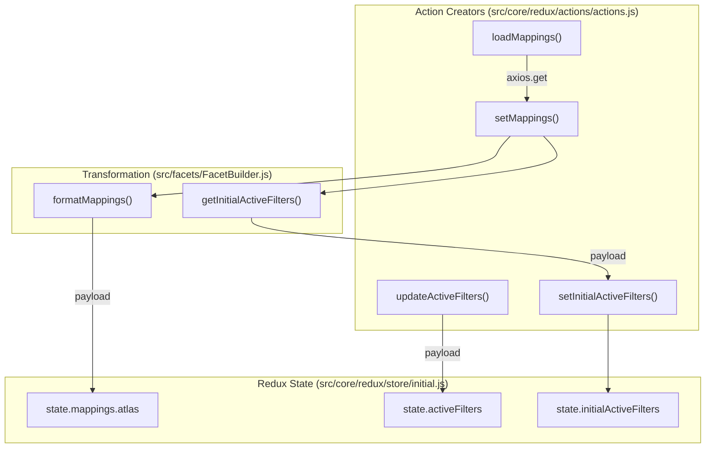
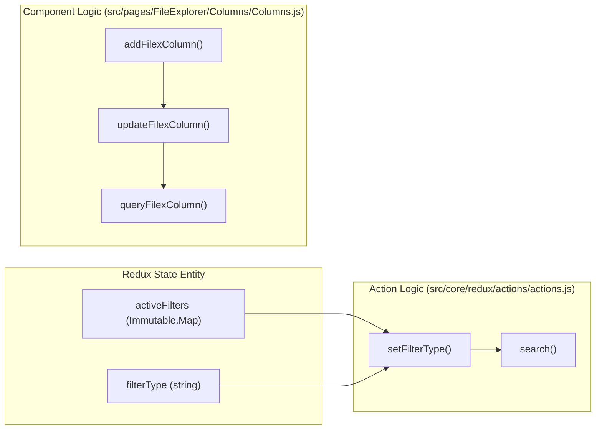

# Page: Redux State Management

# Redux State Management

Relevant source files

The following files were used as context for generating this wiki page:

- [src/core/redux/actions/actions.js](src/core/redux/actions/actions.js)
- [src/core/redux/reducers/reducers.js](src/core/redux/reducers/reducers.js)
- [src/core/redux/store/initial.js](src/core/redux/store/initial.js)
- [src/pages/FileExplorer/Columns/Columns.js](src/pages/FileExplorer/Columns/Columns.js)

The Atlas application utilizes Redux for global state management, employing `Immutable.js` to ensure state predictability and optimize performance through structural sharing. The store serves as the single source of truth for search filters, results, the Archive Explorer column hierarchy, and the user's shopping cart.

## Store Architecture and Initial State

The store is initialized using the `INITIAL` state defined in `src/core/redux/store/initial.js` [src/core/redux/store/initial.js:27-154](). Most state branches are wrapped in `Immutable.fromJS()`, with the notable exception of the `results` array and the `cart`, which remain plain JavaScript arrays to avoid the performance overhead of converting large datasets or to simplify persistence logic [src/core/redux/store/initial.js:77-78](), [src/core/redux/store/initial.js:142]().

### State Shape Overview

| Branch | Data Type | Description |
| :--- | :--- | :--- |
| `workspace` | `Immutable.Map` | Controls visibility and dimensions of panels (Filters, Secondary, Results) for both `main` and `mobile` views [src/core/redux/store/initial.js:31-42](). |
| `activeFilters` | `Immutable.Map` | Stores currently applied search filters indexed by their field ID [src/core/redux/store/initial.js:65](). |
| `results` | `Array` | Plain JS array of search result documents [src/core/redux/store/initial.js:78](). |
| `columns` | `Immutable.List` | Tracks the state of the Archive Explorer's column-based navigation [src/core/redux/store/initial.js:135](). |
| `cart` | `Array` | Persisted list of items (queries, files, directories) added for download, initialized from `localStorage` [src/core/redux/store/initial.js:142](), [src/core/redux/store/initial.js:12-20](). |
| `mappings` | `Immutable.Map` | Cached Elasticsearch index mappings used to build dynamic filters [src/core/redux/store/initial.js:55-58](). |
| `modals` | `Immutable.Map` | Boolean flags or content objects for UI modals like `addFilter`, `regex`, or `editColumns` [src/core/redux/store/initial.js:44-54](). |

**Sources:** [src/core/redux/store/initial.js:12-154](), [src/core/redux/reducers/reducers.js:1-5]()

## Data Flow: From Mappings to Filters

Atlas dynamically generates its filtering UI by fetching Elasticsearch mappings. This process transforms raw ES metadata into a structured facet model.

1.  **Mapping Retrieval**: `loadMappings('atlas')` is dispatched. If the mapping is not already in state, it performs an `axios.get` to the `_mapping` endpoint [src/core/redux/actions/actions.js:127-152]().
2.  **Transformation**: The `setMappings` action creator uses `formatMappings` from `FacetBuilder.js` to organize PDS4 labels and determine UI components (e.g., `slider_range` for integers, `date_range` for dates) [src/core/redux/actions/actions.js:162-182]().
3.  **Initial Active Filters**: If the index is `atlas`, the system automatically dispatches `setInitialActiveFilters` and `addActiveFilters` based on the formatted mapping [src/core/redux/actions/actions.js:166-172]().
4.  **State Update**: The reducer stores both the raw mapping and the formatted facets in `state.mappings` [src/core/redux/reducers/reducers.js:92-94]().

### Filter Logic Diagram
This diagram illustrates the relationship between the Redux Action creators and the state entities they manipulate during the filter initialization and update process.

**Sources:** [src/core/redux/actions/actions.js:127-182](), [src/core/redux/store/initial.js:55-65](), [src/core/redux/reducers/reducers.js:134-183]()

## Key Reducer Modules

Reducers in Atlas are centralized in `src/core/redux/reducers/reducers.js`. They utilize the `reducerFuncs` lookup table to map action types to specific state transition functions [src/core/redux/reducers/reducers.js:7-62]().

### Search and Results
The search state manages pagination through `resultsPaging` and sorting through `resultSorting` [src/core/redux/store/initial.js:85-104](). The `ADD_RESULTS` reducer function appends new data to the existing `results` array while updating the `activePages` and `total` count [src/core/redux/reducers/reducers.js:29-31]().

### Archive Explorer (FileX)
The Archive Explorer utilizes a column system. Actions like `ADD_FILEX_COLUMN`, `REMOVE_FILEX_COLUMN`, and `UPDATE_FILEX_COLUMN` manage an array of column objects in the `columns` state branch [src/core/redux/reducers/reducers.js:45-47](). Each column tracks its own results, filter settings, and UI state. Components like `Columns.js` dispatch these actions to navigate the PDS hierarchy [src/pages/FileExplorer/Columns/Columns.js:20-30]().

### Cart Management
The cart is initialized from `localStorage` [src/core/redux/store/initial.js:12-20](). When `ADD_TO_CART` is dispatched, the reducer adds the item to the `cart` array [src/core/redux/reducers/reducers.js:55]().

**Sources:** [src/core/redux/reducers/reducers.js:7-62](), [src/core/redux/store/initial.js:85-142](), [src/core/redux/actions/actions.js:33-92]()

## URL Synchronization

Atlas implements a "State-to-URL" pattern for search filters. Components monitor the `activeFilters` branch of the Redux store. When it changes, the application generates a query string and updates the browser's HASH path.

### Search Navigation Data Flow
This diagram shows how Redux state entities are used by components to drive navigation and URL state.

**Sources:** [src/core/redux/actions/actions.js:207-223](), [src/pages/FileExplorer/Columns/Columns.js:20-30](), [src/core/redux/reducers/reducers.js:120-124]()

## Action Creator Reference

| Function | File | Description |
| :--- | :--- | :--- |
| `setFilterType` | `actions.js` | Toggles between `basic` and `advanced` search modes; clears results and triggers a new search if switching to basic [src/core/redux/actions/actions.js:207-223](). |
| `addFilexColumn` | `actions.js` | Dispatched to add a new directory level to the Archive Explorer column stack [src/core/redux/actions/actions.js:71](). |
| `queryFilexColumn` | `actions.js` | Performs the Elasticsearch query for a specific Archive Explorer column based on its URI [src/pages/FileExplorer/Columns/Columns.js:24](). |
| `setModal` | `actions.js` | Toggles UI modals by name (e.g., `regex`, `addFilter`) and optionally passes content [src/core/redux/actions/actions.js:191-199](). |
| `setSnackBarText` | `actions.js` | Triggers the global notification snackbar with a message and severity level [src/core/redux/actions/actions.js:87](). |

**Sources:** [src/core/redux/actions/actions.js:33-103](), [src/core/redux/reducers/reducers.js:105-110](), [src/pages/FileExplorer/Columns/Columns.js:20-30]()
