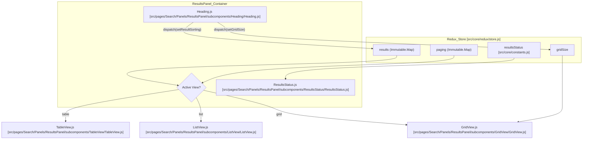
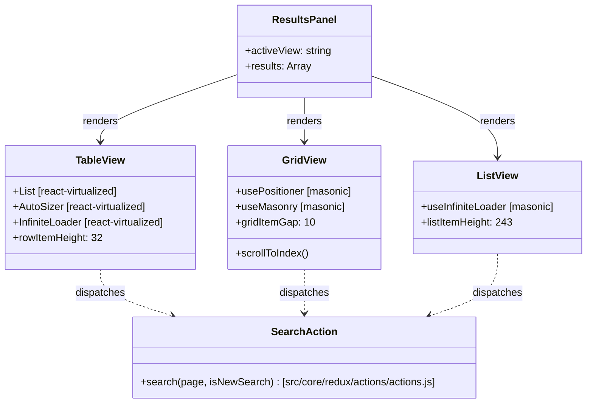

# Page: Results Panel

# Results Panel

Relevant source files

The following files were used as context for generating this wiki page:

- [src/components/MenuButton/MenuButton.js](src/components/MenuButton/MenuButton.js)
- [src/components/ProductToolbar/ProductToolbar.js](src/components/ProductToolbar/ProductToolbar.js)
- [src/components/ResultsSorter/ResultsSorter.js](src/components/ResultsSorter/ResultsSorter.js)
- [src/components/SplitButton/SplitButton.js](src/components/SplitButton/SplitButton.js)
- [src/pages/Cart/Modals/RemoveFromCartModal/RemoveFromCartModal.js](src/pages/Cart/Modals/RemoveFromCartModal/RemoveFromCartModal.js)
- [src/pages/Cart/Title/Title.js](src/pages/Cart/Title/Title.js)
- [src/pages/Search/Modals/AddFilterModal/AddFilterModal.js](src/pages/Search/Modals/AddFilterModal/AddFilterModal.js)
- [src/pages/Search/Panels/ResultsPanel/subcomponents/ChippedFilters/ChippedFilters.js](src/pages/Search/Panels/ResultsPanel/subcomponents/ChippedFilters/ChippedFilters.js)
- [src/pages/Search/Panels/ResultsPanel/subcomponents/GridView/GridView.js](src/pages/Search/Panels/ResultsPanel/subcomponents/GridView/GridView.js)
- [src/pages/Search/Panels/ResultsPanel/subcomponents/Heading/Heading.js](src/pages/Search/Panels/ResultsPanel/subcomponents/Heading/Heading.js)
- [src/pages/Search/Panels/ResultsPanel/subcomponents/ListView/ListView.js](src/pages/Search/Panels/ResultsPanel/subcomponents/ListView/ListView.js)
- [src/pages/Search/Panels/ResultsPanel/subcomponents/ResultsStatus/ResultsStatus.js](src/pages/Search/Panels/ResultsPanel/subcomponents/ResultsStatus/ResultsStatus.js)
- [src/pages/Search/Panels/ResultsPanel/subcomponents/TableView/TableView.js](src/pages/Search/Panels/ResultsPanel/subcomponents/TableView/TableView.js)

The **Results Panel** is the primary interface for exploring and interacting with PDS products identified by search queries. It supports three distinct visualization modes—Table, List, and Grid—optimized for different metadata density and visual inspection needs. The panel utilizes virtualization to maintain performance when handling thousands of results and implements infinite scrolling for seamless data fetching.

## Architecture and View Management

The Results Panel acts as a container that switches between three subcomponents based on the `activeView` state. It also includes a `Heading` for global result controls and a `ResultsStatus` overlay for state feedback (e.g., searching, no results, or errors).

### View Switching and Synchronization
The application tracks the user's scroll position across view changes. When a user scrolls in one view (e.g., Grid) and switches to another (e.g., Table), the `getResultViewIndex` and `setResultViewIndex` actions ensure the new view initializes at the same relative product index [src/pages/Search/Panels/ResultsPanel/subcomponents/GridView/GridView.js:205-209](), [src/pages/Search/Panels/ResultsPanel/subcomponents/TableView/TableView.js:24-25](), [src/pages/Search/Panels/ResultsPanel/subcomponents/ListView/ListView.js:28-29]().

### Data Flow Diagram
This diagram shows how search results flow from the Redux store into the specific view components and how global controls interact with them.

**Sources:** [src/pages/Search/Panels/ResultsPanel/subcomponents/Heading/Heading.js:123-138](), [src/pages/Search/Panels/ResultsPanel/subcomponents/ResultsStatus/ResultsStatus.js:154-156]()

## Visualization Components

### 1. TableView
The `TableView` provides a high-density spreadsheet-like interface using `react-virtualized`. It is the most metadata-heavy view, allowing users to compare specific fields across many products.

*   **Virtualization:** Uses `react-virtualized` `List`, `AutoSizer`, and `InfiniteLoader` to render only the visible rows [src/pages/Search/Panels/ResultsPanel/subcomponents/TableView/TableView.js:12]().
*   **Column Resizing:** Implemented using `react-draggable`. Users can drag the handle in the `cellHeader` to update column widths dynamically [src/pages/Search/Panels/ResultsPanel/subcomponents/TableView/TableView.js:13](), [src/pages/Search/Panels/ResultsPanel/subcomponents/TableView/TableView.js:175-188]().
*   **Sorting:** Clicking a column header triggers `setResultSorting`, which updates the Elasticsearch query parameters and refreshes the results [src/pages/Search/Panels/ResultsPanel/subcomponents/TableView/TableView.js:27]().
*   **Thumbnail Hover:** Hovering over a thumbnail in a row displays an enlarged `BrowseImage` preview via an absolute-positioned overlay [src/pages/Search/Panels/ResultsPanel/subcomponents/TableView/TableView.js:39](), [src/pages/Search/Panels/ResultsPanel/subcomponents/TableView/TableView.js:115-126]().

### 2. ListView
The `ListView` balances visual preview and metadata. Each item occupies a full-width row with a large thumbnail on the left and a scrollable property list on the right [src/pages/Search/Panels/ResultsPanel/subcomponents/ListView/ListView.js:80-90]().

*   **Implementation:** Uses the `masonic` library for virtualization and `usePositioner` to calculate layout [src/pages/Search/Panels/ResultsPanel/subcomponents/ListView/ListView.js:14-20]().
*   **Infinite Scroll:** Leverages `useInfiniteLoader` to trigger the `search` action when the user nears the end of the loaded list [src/pages/Search/Panels/ResultsPanel/subcomponents/ListView/ListView.js:18-20]().

### 3. GridView
The `GridView` is optimized for visual browsing. It displays products as a masonry grid of images.

*   **Dynamic Sizing:** Users can toggle between small, medium, and large grid sizes via the `Heading` component [src/pages/Search/Panels/ResultsPanel/subcomponents/Heading/Heading.js:165-191](). This updates the `gridSize` in Redux, which `GridView` uses to recalculate the masonry columns [src/pages/Search/Panels/ResultsPanel/subcomponents/GridView/GridView.js:158-182]().
*   **Metadata Overlays:** Displays file extensions (`fileExt`) and ML classification indicators (`hasML`) as small badges on the image [src/pages/Search/Panels/ResultsPanel/subcomponents/GridView/GridView.js:115-144]().
*   **Performance:** On unmount, the component cancels in-flight thumbnail image requests by clearing `img.src` attributes to free up browser connection slots [src/pages/Search/Panels/ResultsPanel/subcomponents/GridView/GridView.js:195-200]().

**Sources:** [src/pages/Search/Panels/ResultsPanel/subcomponents/TableView/TableView.js:41-100](), [src/pages/Search/Panels/ResultsPanel/subcomponents/ListView/ListView.js:38-40](), [src/pages/Search/Panels/ResultsPanel/subcomponents/GridView/GridView.js:37-70]()

## Product Interaction

### ProductToolbar
Every result item (regardless of view) includes a `ProductToolbar`. This component provides quick actions for individual products:
*   **Selection:** A `Checkbox` that dispatches `checkItemInResults` (or `checkItemInCart` if in the cart view) to track selected items for bulk operations [src/components/ProductToolbar/ProductToolbar.js:200-211]().
*   **Cart Management:** Add or remove the item from the global cart using `addToCart` and `removeFromCart` [src/components/ProductToolbar/ProductToolbar.js:20-21](), [src/components/ProductToolbar/ProductToolbar.js:235-250]().
*   **Quick Download:** Direct file download via `streamDownloadFile` from the `ZipStream` utility [src/components/ProductToolbar/ProductToolbar.js:28-29](), [src/components/ProductToolbar/ProductToolbar.js:212-234]().

In `GridView` and `ListView`, the toolbar is hidden by default and appears on hover via CSS transitions [src/pages/Search/Panels/ResultsPanel/subcomponents/GridView/GridView.js:74-82](), [src/pages/Search/Panels/ResultsPanel/subcomponents/ListView/ListView.js:70-78]().

### Sorting Logic
The `ResultsSorter` component (located in the `Heading`) allows users to sort by any active filter field or table column.

| Function | Role | Source |
| :--- | :--- | :--- |
| `ResultsSorter` | UI for selecting sort field and direction | [src/components/ResultsSorter/ResultsSorter.js:37]() |
| `setResultSorting` | Redux action to update `resultSorting` state | [src/components/ResultsSorter/ResultsSorter.js:109-115]() |
| `SplitButton` | Reusable UI widget used by the sorter | [src/components/SplitButton/SplitButton.js:86]() |

**Sources:** [src/components/ResultsSorter/ResultsSorter.js:51-77](), [src/pages/Search/Panels/ResultsPanel/subcomponents/Heading/Heading.js:164]()

## Virtualization and Infinite Scroll Strategy

Atlas uses a "page-aware" virtualization strategy to handle large Elasticsearch result sets.

1.  **Page Tracking:** The `paging` object in Redux tracks `activePages` and `resultsPerPage` [src/pages/Search/Panels/ResultsPanel/subcomponents/ListView/ListView.js:167-172]().
2.  **Scroll Detection:** Components like `ListView` and `GridView` monitor `scrollTop`. When the user scrolls past a threshold, the component checks if the next page of data is already in the store [src/pages/Search/Panels/ResultsPanel/subcomponents/GridView/GridView.js:184-220]().
3.  **Data Fetching:** If data is missing, the `search` action is dispatched with the next page index [src/pages/Search/Panels/ResultsPanel/subcomponents/ListView/ListView.js:27]() [src/pages/Search/Panels/ResultsPanel/subcomponents/GridView/GridView.js:27]().
4.  **Guard Rails:** Logic such as `allowPageCheck` and `nextRenderAllowPageCheck` prevents redundant API calls while a page is currently loading [src/pages/Search/Panels/ResultsPanel/subcomponents/ListView/ListView.js:161-165](), [src/pages/Search/Panels/ResultsPanel/subcomponents/GridView/GridView.js:149-151]().

### Code Entity Mapping: Virtualization Components

**Sources:** [src/pages/Search/Panels/ResultsPanel/subcomponents/TableView/TableView.js:12-28](), [src/pages/Search/Panels/ResultsPanel/subcomponents/GridView/GridView.js:14-30](), [src/pages/Search/Panels/ResultsPanel/subcomponents/ListView/ListView.js:14-31]()

## Status Handling

The `ResultsStatus` component manages the overlay states that inform the user of the search progress. It switches content based on the `resultsStatus.status` value from the Redux store [src/pages/Search/Panels/ResultsPanel/subcomponents/ResultsStatus/ResultsStatus.js:154-162]().

*   **WAITING:** Initial state; prompts the user to select filters using an `ArrowBackIcon` [src/pages/Search/Panels/ResultsPanel/subcomponents/ResultsStatus/ResultsStatus.js:163-175]().
*   **SEARCHING:** Displays a `CircularProgress` spinner during the initial API request [src/pages/Search/Panels/ResultsPanel/subcomponents/ResultsStatus/ResultsStatus.js:176-185]().
*   **LOADING:** Displays a `LinearProgress` bar at the top of the panel during infinite scroll pagination [src/pages/Search/Panels/ResultsPanel/subcomponents/ResultsStatus/ResultsStatus.js:186-194]().
*   **NONE:** Shown when the query returns zero results; suggests broadening filters via a `ReportProblemOutlinedIcon` [src/pages/Search/Panels/ResultsPanel/subcomponents/ResultsStatus/ResultsStatus.js:195-208]().
*   **ERROR:** Displays an error message and `ErrorOutlineOutlinedIcon` if the Elasticsearch query fails [src/pages/Search/Panels/ResultsPanel/subcomponents/ResultsStatus/ResultsStatus.js:212-220]().

**Sources:** [src/pages/Search/Panels/ResultsPanel/subcomponents/ResultsStatus/ResultsStatus.js:10-20](), [src/pages/Search/Panels/ResultsPanel/subcomponents/ResultsStatus/ResultsStatus.js:150-220]()
