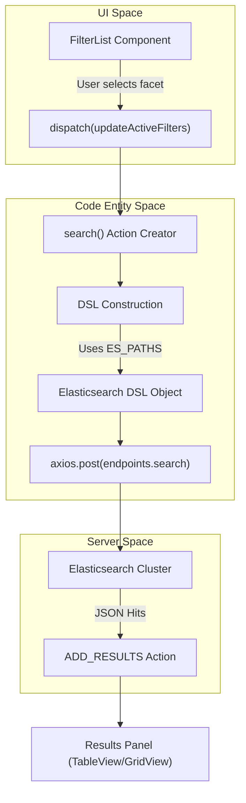
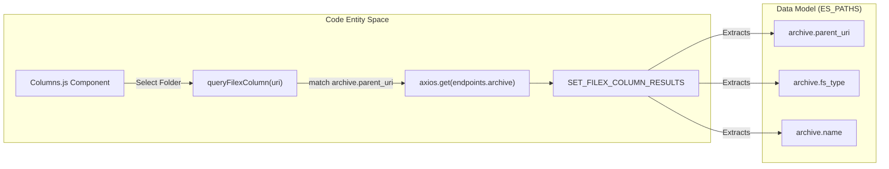

# Page: Search and Data Access APIs

# Search and Data Access APIs

<details>
<summary>Relevant source files</summary>

The following files were used as context for generating this wiki page:

- [.env](.env)
- [Documenation/.gitignore](Documenation/.gitignore)
- [Documenation/README.md](Documenation/README.md)
- [Documenation/babel.config.js](Documenation/babel.config.js)
- [Documenation/build-to-build.js](Documenation/build-to-build.js)
- [Documenation/docs/api/_category_.json](Documenation/docs/api/_category_.json)
- [Documenation/docs/api/archive.md](Documenation/docs/api/archive.md)
- [Documenation/docs/api/data-access.md](Documenation/docs/api/data-access.md)
- [Documenation/docs/api/search.md](Documenation/docs/api/search.md)
- [Documenation/docs/api/uri.md](Documenation/docs/api/uri.md)
- [Documenation/docs/standards/missions-and-spacecraft.md](Documenation/docs/standards/missions-and-spacecraft.md)
- [src/core/constants.js](src/core/constants.js)
- [src/core/redux/actions/actions.js](src/core/redux/actions/actions.js)
- [src/pages/FileExplorer/Columns/Columns.js](src/pages/FileExplorer/Columns/Columns.js)

</details>


The Atlas platform provides a robust set of APIs for searching planetary data, accessing raw files, and exploring the PDS archive structure. These APIs are primarily backed by Elasticsearch for metadata discovery and a specialized Data Access layer for file retrieval and transformation.

## 1. Search API (Elasticsearch)

The Search API is the core engine for product discovery. It uses Elasticsearch (ES) to query indexed PDS3 and PDS4 metadata. The system constructs complex DSL (Domain Specific Language) queries based on UI filters or user-defined advanced expressions.

### DSL Construction and Execution
Search requests are dispatched via the `search` action creator in `src/core/redux/actions/actions.js`. This function aggregates state from `activeFilters`, `activeMissions`, and `resultSorting` to build a JSON payload for the `_search` endpoint [src/core/redux/actions/actions.js:1001-1050]().

**Key Search Parameters:**
*   **Endpoints:** Defined in `endpoints.search` (typically `/search/atlas/_search`) [src/core/constants.js:21-23]().
*   **Field Mappings:** The `ES_PATHS` constant maps internal logical names (e.g., `start_time`) to the actual nested paths in the ES document (e.g., `gather.time.start_time`) [src/core/constants.js:45-73]().
*   **Sorting:** Sorting configurations are managed through the `SET_RESULT_SORTING` action [src/core/redux/actions/actions.js:59]().

### Pagination: PIT and Scroll
To handle large result sets and deep scrolling without performance degradation, Atlas utilizes Elasticsearch's Point-In-Time (PIT) and Scroll APIs.

1.  **PIT (Point-In-Time):** Targeted via `endpoints.pit`, this is used to maintain a stable view of the index during user pagination [src/core/constants.js:24]().
2.  **Scroll API:** Targeted via `endpoints.scroll`, this is used for bulk operations, such as generating CURL/WGET scripts or ZIP downloads, where the client needs to iterate over thousands of records [src/core/constants.js:25]().

### Example: Search by LIDVID
A common external query pattern involves retrieving a specific product record using its PDS4 Logical Identifier (LIDVID) stored in the `pds4_label.lidvid` field [Documenation/docs/api/search.md:42-43]().

```bash
curl -XPOST "https://pds-imaging.jpl.nasa.gov/api/search/atlas/_search" \
     -H "Content-Type: application/json" \
     -d '{
       "query": {
         "bool": {
           "must": [{"match": {"pds4_label.lidvid": "urn:nasa:pds:mars2020_helicam:..."}}]
         }
       },
       "size": 1
     }'
```
Sources: [Documenation/docs/api/search.md:14](), [src/core/constants.js:102-104]()

### Search Data Flow Diagram
This diagram illustrates how a user interaction in the `FilterList` triggers a code-level DSL construction and API call.

Title: Search Request Data Flow

Sources: [src/core/redux/actions/actions.js:55](), [src/core/redux/actions/actions.js:261-267](), [src/core/constants.js:45-73]()

---

## 2. Data Access API

The Data Access API is responsible for mapping Atlas URIs to physical file locations and providing on-the-fly image processing.

### URI-to-Redirect
The system uses an internal URI schema (e.g., `atlas:pds4:mission:spacecraft:/path/to/file`) [Documenation/docs/api/uri.md:16-17](). The Data Access API resolves these URIs to direct download links via an HTTP redirect [Documenation/docs/api/data-access.md:9]().

### Resize and Transformation Parameters
For image products (png, jpg, webp), the API supports resize parameters appended to the URI. These are utilized by components like `BrowseImage` and `OpenSeadragonViewer` [Documenation/docs/api/data-access.md:21-26]().

| Parameter | Suffix | Resolution |
| :--- | :--- | :--- |
| `xs` | `:xs` | 128x128 |
| `sm` | `:sm` | 256x256 |
| `md` | `:md` | 512x512 |
| `lg` | `:lg` | 1024x1024 |

Sources: [Documenation/docs/api/data-access.md:22-25](), [src/core/constants.js:130]()

### Code Interaction: URI Splitting
The utility function `splitUri` is the primary tool for parsing these identifiers before making API calls or determining file extensions [src/core/utils.js:11]().

```javascript
// Example usage in src/pages/FileExplorer/Columns/Columns.js
const { mission, spacecraft, path } = splitUri(uri)
```
Sources: [src/pages/FileExplorer/Columns/Columns.js:12](), [Documenation/docs/api/uri.md:15-17]()

---

## 3. Archive API

The Archive API provides a hierarchical view of the PDS repository, enabling the column-based navigation found in the Archive Explorer.

### URI-based Navigation
The Archive API is optimized for parent-child relationships using the `archive.parent_uri` field [Documenation/docs/api/archive.md:25](). The `queryFilexColumn` action fetches contents of a specific directory by matching this field [src/pages/FileExplorer/Columns/Columns.js:24]().

**Key Features:**
*   **Directory Listing:** Returns documents where `archive.fs_type` is `"file"` or `"directory"` [Documenation/docs/api/archive.md:24]().
*   **Regex Filtering:** The UI supports filtering column results via the `SET_LAST_REGEX_QUERY` action [src/core/redux/actions/actions.js:77]().
*   **Deprecation Handling:** Results can be toggled to show or hide deprecated products via `SET_SHOW_DEPRECATED` [src/pages/FileExplorer/Columns/Columns.js:29]().

### Archive Explorer Implementation
Title: Archive Navigation Logic

Sources: [src/pages/FileExplorer/Columns/Columns.js:21-30](), [src/core/constants.js:89-101](), [src/core/redux/actions/actions.js:71-74]()

---

## 4. API Configuration Reference

API behavior is governed by environment variables and the `runtimeConfig.js` injection pattern.

| Endpoint | Environment Variable | Default Value (Example) |
| :--- | :--- | :--- |
| **Data** | `REACT_APP_DATA_ENDPOINT` | `/data` |
| **Search** | `REACT_APP_SEARCH_ENDPOINT` | `/search/atlas/_search` |
| **PIT** | `REACT_APP_PIT_ENDPOINT` | `/search/atlas/_pit` |
| **Scroll** | `REACT_APP_SCROLL_ENDPOINT` | `/search/_search/scroll` |
| **Archive** | `REACT_APP_ARCHIVE_ENDPOINT` | `/search/atlas/_search` |

Sources: [.env:9-14](), [src/core/constants.js:21-26]()
