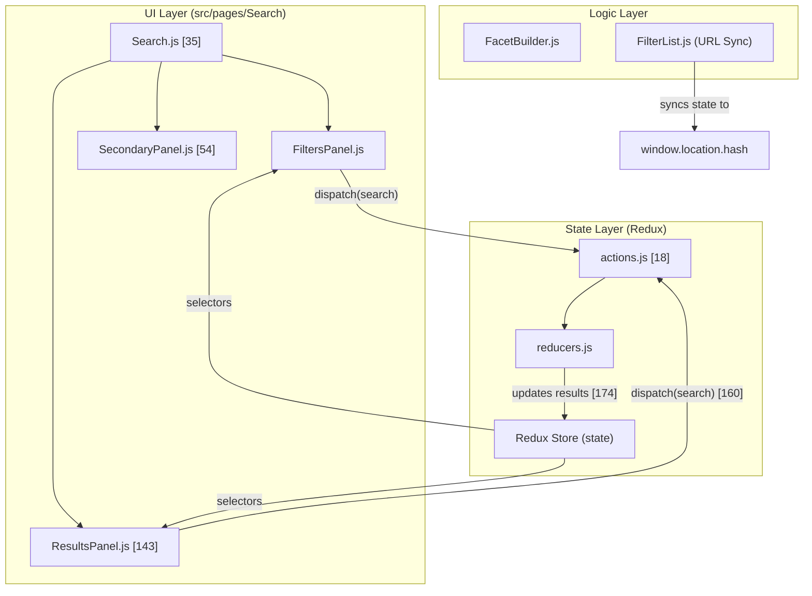
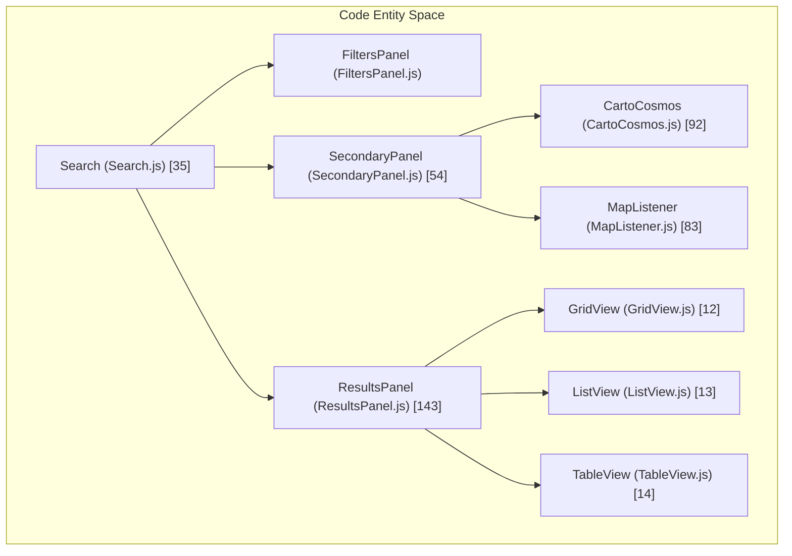

# Page: Search Page

# Search Page

Relevant source files

The following files were used as context for generating this wiki page:

- [src/pages/Cart/Cart.js](src/pages/Cart/Cart.js)
- [src/pages/FileExplorer/FileExplorer.js](src/pages/FileExplorer/FileExplorer.js)
- [src/pages/Record/Content/Views/MLClassification/MLClassification.js](src/pages/Record/Content/Views/MLClassification/MLClassification.js)
- [src/pages/Record/Content/Views/MLClassification/subcomponents/MLLayers/MLLayers.js](src/pages/Record/Content/Views/MLClassification/subcomponents/MLLayers/MLLayers.js)
- [src/pages/Record/Record.js](src/pages/Record/Record.js)
- [src/pages/Search/Panels/ResultsPanel/ResultsPanel.js](src/pages/Search/Panels/ResultsPanel/ResultsPanel.js)
- [src/pages/Search/Panels/SecondaryPanel/SecondaryPanel.js](src/pages/Search/Panels/SecondaryPanel/SecondaryPanel.js)
- [src/pages/Search/Search.js](src/pages/Search/Search.js)

The **Search Page** is the primary interface for discovering and filtering planetary data within Atlas. It features a responsive three-panel layout that synchronizes user inputs (filters and map interactions) with an Elasticsearch-backed results engine.

## Overview

The Search page is defined in `Search.js` [src/pages/Search/Search.js:35-90](). It dynamically adapts to the user's viewport, offering a multi-column "Workspace" on desktop and a tabbed/panel-switching view on mobile devices [src/pages/Search/Search.js:50-89]().

### Workspace Layout
The layout is governed by the `workspace` object in the Redux store [src/pages/Search/Search.js:42-44](). It consists of three main functional areas:

1.  **Filters Panel (Left):** Controls the query parameters via "Basic" or "Advanced" modes [src/pages/Search/Search.js:77]().
2.  **Secondary Panel (Middle/Top):** Contains the interactive map (CartoCosmos) and planetary projection controls [src/pages/Search/Search.js:79]().
3.  **Results Panel (Right/Bottom):** Displays the list, table, or grid of products matching the current criteria [src/pages/Search/Search.js:80]().

### System Architecture

The following diagram illustrates how the Search page components interact with the Redux state and the underlying data structures.

**Search Page Data Flow**

Sources: [src/pages/Search/Search.js:35-90](), [src/pages/Search/Panels/ResultsPanel/ResultsPanel.js:143-215](), [src/pages/Search/Panels/SecondaryPanel/SecondaryPanel.js:54-101]()

---

## Core Panels

### [Filters Panel](#3.1)
The Filters Panel handles the construction of the search query. It supports two distinct modes controlled by the `filterType` state [src/pages/Search/Panels/ResultsPanel/ResultsPanel.js:170-173]():
*   **Basic Mode:** Transforms Elasticsearch mappings into interactive UI components like sliders, date pickers, and checkboxes.
*   **Advanced Mode:** Provides a text-based editor for writing complex boolean logic queries directly.

For details on schema transformation and URL synchronization, see **[Filters Panel](#3.1)**.

### [Results Panel](#3.2)
The Results Panel renders the data returned from the search API [src/pages/Search/Panels/ResultsPanel/ResultsPanel.js:214-215](). It supports multiple view modes: `grid`, `list`, and `table` [src/pages/Search/Panels/ResultsPanel/ResultsPanel.js:150-151](). It manages infinite scrolling and result counts, displaying formatted strings using `abbreviateNumber` for the total hits [src/pages/Search/Panels/ResultsPanel/ResultsPanel.js:208-212]().

For details on virtualization and the `ProductToolbar`, see **[Results Panel](#3.2)**.

### [Map Panel (CartoCosmos)](#3.3)
The Secondary Panel primarily houses the **CartoCosmos** map [src/pages/Search/Panels/SecondaryPanel/SecondaryPanel.js:92](). This interactive component allows users to perform geospatial searches by drawing bounding boxes. It utilizes a `MapListener` to handle integration with the surrounding UI and ensures the map only initializes when the panel is visible (`firstOpen` logic) [src/pages/Search/Panels/SecondaryPanel/SecondaryPanel.js:77-83]().

For details on projections and coordinate systems, see **[Map Panel (CartoCosmos)](#3.3)**.

---

## Panel Interaction and State

The panels are tightly coupled through the Redux store. When a user interacts with one panel, it often triggers updates in the others:

| Interaction | Action | Effected Panel(s) |
| :--- | :--- | :--- |
| **Change Filter** | `search()` [src/pages/Search/Panels/ResultsPanel/ResultsPanel.js:18]() | Results (Refresh), Map (Update Heatmap) |
| **Draw on Map** | Geospatial Update | Filters (Add spatial constraint), Results (Refresh) |
| **Toggle View** | `setActiveView()` [src/pages/Search/Panels/ResultsPanel/ResultsPanel.js:151]() | Results (Switch Table/Grid/List) |

### Component Hierarchy

Sources: [src/pages/Search/Search.js:8-10](), [src/pages/Search/Panels/ResultsPanel/ResultsPanel.js:10-14](), [src/pages/Search/Panels/SecondaryPanel/SecondaryPanel.js:5-7]()

## Modals
The Search page hosts several functional modals defined at the top level of the `Search` component [src/pages/Search/Search.js:12-16]():
*   **AddFilterModal:** Allows users to add new facets to the Basic Filters list [src/pages/Search/Search.js:83]().
*   **EditColumnsModal:** Configures which metadata fields are visible in the Results TableView [src/pages/Search/Search.js:85]().
*   **AdvancedFilterModal:** A specialized editor for complex DSL queries [src/pages/Search/Search.js:86]().
*   **AdvancedFilterReturnModal:** Handles transitions back from advanced mode [src/pages/Search/Search.js:87]().
*   **FilterHelpModal:** Provides documentation on available search fields [src/pages/Search/Search.js:84]().

Sources: [src/pages/Search/Search.js:8-16](), [src/pages/Search/Search.js:83-88]()
