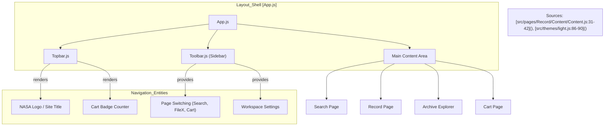

# Page: Shared UI Components

# Shared UI Components

<details>
<summary>Relevant source files</summary>

The following files were used as context for generating this wiki page:

- [src/components/BrowseImage/BrowseImage.js](src/components/BrowseImage/BrowseImage.js)
- [src/components/BrowseImage/BrowseImage.test.js](src/components/BrowseImage/BrowseImage.test.js)
- [src/components/OpenSeadragonViewer/OpenSeadragonViewer.js](src/components/OpenSeadragonViewer/OpenSeadragonViewer.js)
- [src/components/ProductIcons/ProductIcons.js](src/components/ProductIcons/ProductIcons.js)
- [src/pages/Record/Content/Content.js](src/pages/Record/Content/Content.js)

</details>


Atlas utilizes a centralized library of reusable React components to ensure visual consistency and functional reliability across its various pages (Search, Archive Explorer, Record, and Cart). These components range from high-level navigation bars to specialized scientific data viewers.

## Theme and Styling System

The application's visual identity is defined by a Material UI (MUI) theme, primarily configured in `light.js`. This system manages the color palette, responsive breakpoints, and global component overrides.

*   **Palette:** Defines standard colors for primary actions, secondary backgrounds, and mission-specific swatches [src/themes/light.js:3-84]().
*   **Layout Constants:** The `headHeights` array provides consistent vertical spacing for headers across the application. For instance, the `Content` component in the Record page calculates its height by subtracting `theme.headHeights[1]` [src/pages/Record/Content/Content.js:34-34]().
*   **Overrides:** Custom styles are applied to standard MUI components like `MuiButton`, `MuiTab`, and `MuiTooltip` to match the Atlas design language [src/themes/light.js:99-245]().

### UI Layout Hierarchy
The following diagram illustrates how core layout components wrap the application content.

**Atlas Layout Architecture**


## Navigation and Layout Components

These components provide the structural framework for the application and are detailed further in the child page.

*   **Topbar:** The global header containing the NASA logo, site title, and a persistent link to the Cart with a dynamic item counter.
*   **Toolbar:** A vertical sidebar that facilitates switching between major application states and toggling workspace settings like "Dark Mode" or "Advanced Filters".
*   **Snackbars & Cards:** Shared feedback components like `SnackBar` for notifications and `DownloadingCard` for tracking active background exports.

For details, see [Navigation and Layout Components](#7.2).

## Specialized UI Widgets

Atlas includes custom interactive widgets designed for planetary data exploration:

*   **ProductIcons:** A dynamic icon generator that renders specific SVGs based on product type (`filter`, `volume`, `directory`, `file`) or 3D CSS cubes for `.obj` model files [src/components/ProductIcons/ProductIcons.js:107-166]().
*   **MenuButton & SplitButton:** Enhanced buttons that support dropdown options and secondary actions, frequently used for download format selection and version switching.
*   **ViewTabs:** A specialized tab controller used in the Record page to toggle between `Overview`, `ProductLabel`, and `MLClassification` views [src/pages/Record/Content/Content.js:20-29]().

### Component Interaction Flow
This diagram maps UI interactions to the underlying logic and styles.

**UI to Logic Mapping**
```mermaid
sequenceDiagram
    participant User
    participant PI as "ProductIcons.js"
    participant BI as "BrowseImage.js"
    participant Utils as "utils.js"

    User->>PI: Hover over .modelIcon
    Note over PI: window.addEventListener('mousemove')
    PI->>PI: rotateX/rotateY based on cursor

    User->>BI: Load Thumbnail
    BI->>Utils: getFullImagePath(src)
    Note over BI: handleLoad() sets loading=false

    Sources["Sources: [src/components/ProductIcons/ProductIcons.js:96-105](), [src/components/BrowseImage/BrowseImage.js:5-28]()"]
```

## Visualization Components

These components handle the rendering of complex scientific data products.

*   **OpenSeadragonViewer:** Provides high-resolution, deep-zoom capabilities for 2D imaging products. It includes an `svg-overlay` for rendering machine learning classifications and custom UI overlays for zoom/rotation controls [src/components/OpenSeadragonViewer/OpenSeadragonViewer.js:181-220]().
*   **ThreeViewer:** A WebGL-based viewer for 3D models (OBJ/GLTF format), typically triggered when `ProductIcons` detects an `.obj` extension [src/components/ProductIcons/ProductIcons.js:148-161]().
*   **BrowseImage:** A resilient image wrapper that handles loading states, error fallbacks to a default `ImageIcon`, and dynamic S3 bucket URL concatenation using `REACT_APP_S3_BUCKET_LOCATION` [src/components/BrowseImage/BrowseImage.js:5-61]().

For details, see [Visualization Components](#7.1).

## Sources
* [src/themes/light.js:1-245]()
* [src/components/ProductIcons/ProductIcons.js:1-186]()
* [src/components/OpenSeadragonViewer/OpenSeadragonViewer.js:1-227]()
* [src/components/BrowseImage/BrowseImage.js:1-63]()
* [src/pages/Record/Content/Content.js:20-42]()
* [src/core/utils.js:8-10]() (referenced via `getIn`, `objectArrayIndexOfKeyWithValue`)
