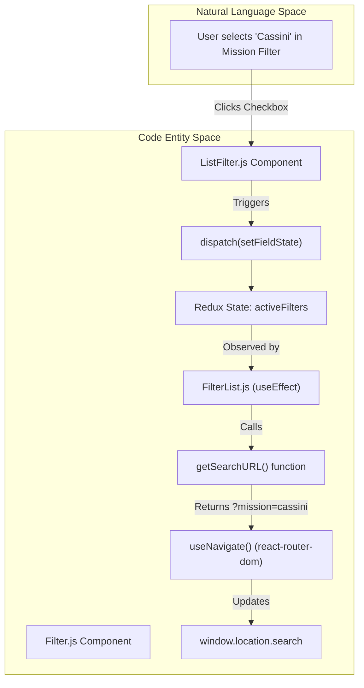
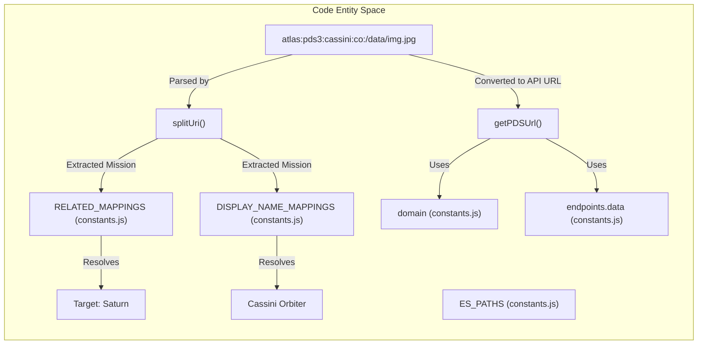

# Page: Utilities and URL Handling

# Utilities and URL Handling

Relevant source files

The following files were used as context for generating this wiki page:

- [src/components/Filter/Filter.js](src/components/Filter/Filter.js)
- [src/components/Filter/subcomponents/ListFilter/ListFilter.js](src/components/Filter/subcomponents/ListFilter/ListFilter.js)
- [src/core/utils.js](src/core/utils.js)
- [src/pages/Search/Panels/FiltersPanel/FiltersPanel.js](src/pages/Search/Panels/FiltersPanel/FiltersPanel.js)
- [src/pages/Search/Panels/FiltersPanel/subcomponents/FilterList/FilterList.js](src/pages/Search/Panels/FiltersPanel/subcomponents/FilterList/FilterList.js)

This section documents the foundational utility functions and URL synchronization mechanisms used throughout the Atlas application. These helpers manage data transformation, URI parsing, API request configuration, and the bidirectional synchronization between the application state and the browser URL.

## Core Utilities (`core/utils.js`)

The `src/core/utils.js` file contains pure functions used for data manipulation and PDS-specific logic.

### URI Parsing and URL Generation
Atlas uses a custom internal URI schema to identify products across different missions and instruments. The `splitUri` and `getPDSUrl` functions are the primary tools for interacting with these identifiers.

*   **`splitUri(uri, get)`**: Deconstructs an Atlas URI into its constituent parts: domain, format, mission, spacecraft, relative path, and size [src/core/utils.js:76-96]().
*   **`getPDSUrl(url, release_id, size)`**: Constructs a fully qualified URL for fetching data from the PDS API. It appends the `release_id` and requested image `size` (e.g., `xs`, `sm`, `md`, `lg`) as suffixes based on `AVAILABLE_URI_SIZES` [src/core/utils.js:50-57]().
*   **`getFilename(url)`**: Extracts the filename from a path or URI, specifically stripping PDS-specific suffixes like `::release_id` [src/core/utils.js:98-105]().
*   **`getRedirectedUrl(url)`**: Performs a fetch request to resolve a URI to its final destination URL by appending `?output=url` to the request [src/core/utils.js:58-74]().

### Data Transformation Helpers
These functions facilitate working with deeply nested objects, which is common when processing Elasticsearch (ES) responses.

*   **`getIn(obj, keyArray, notSetValue)`**: Safely retrieves a value from a nested object using an array of keys or a dot-separated string [src/core/utils.js:112-124]().
*   **`setIn(obj, keyArray, value)`**: Mutates a nested object at a specific path defined by an array of keys [src/core/utils.js:125-133]().
*   **`mergeFields(currentFields, returnedFields)`**: Merges existing filter facet fields with new data from an ES aggregation. It ensures that user-selected fields remain in the list even if their `doc_count` drops to zero in the latest search result, then sorts the result case-insensitively [src/core/utils.js:138-173]().

### Formatting and UI Utilities
*   **`humanFileSize(bytes, si)`**: Converts a raw byte count into a human-readable string (e.g., "1.5 GB") using either SI (1000) or binary (1024) units [src/core/utils.js:332-351]().
*   **`prettify(string)`**: Transforms snake_case or technical strings into capitalized, space-separated words for UI display [src/core/utils.js:314-325]().
*   **`getHeader(options)`**: Generates the standard Axios configuration object, including Authorization headers (using `window.token`), `Content-Type: application/json`, and upload progress trackers [src/core/utils.js:14-48]().

**Sources:**
* [src/core/utils.js:1-351]()

---

## URL Handling and Filter Synchronization

The `FilterList` component is responsible for synchronizing the Redux `activeFilters` state with the browser's URL query parameters. This allows users to share specific search results by copying the URL.

### Data Flow: State to URL
When a user interacts with a filter (e.g., selecting a mission or setting a date range), the `activeFilters` in the Redux store are updated. The `FilterList` component observes these changes and updates the browser's location.

| Filter Type | URL Representation | Example |
| :--- | :--- | :--- |
| `keyword` | Comma-separated values | `mission=cassini,mro` |
| `text` | Encoded string | `product_id=IMG_123` |
| `slider_range` | `min_to_max` | `release_id=1_to_10` |
| `date_range` | `start_to_end` | `start_time=2020-01-01_to_2021-01-01` |

### Implementation Details
The `getSearchURL` helper function iterates through the `activeFilters` object, serializing each facet based on its type (`query_string`, `text`, `keyword`, `input_range`, `slider_range`, `date_range`) into a query string [src/pages/Search/Panels/FiltersPanel/subcomponents/FilterList/FilterList.js:58-113](). The `FilterList` component uses a `useEffect` hook to trigger a `navigate` call whenever the serialized filter state changes [src/pages/Search/Panels/FiltersPanel/subcomponents/FilterList/FilterList.js:124-130]().

#### URL Synchronization Logic
The following diagram illustrates how user interactions in the UI propagate through the Redux state to the browser's URL bar.

**Filter State to URL Sync Flow**

**Sources:**
* [src/pages/Search/Panels/FiltersPanel/subcomponents/FilterList/FilterList.js:58-130]()
* [src/components/Filter/subcomponents/ListFilter/ListFilter.js:88-93]()
* [src/components/Filter/Filter.js:1-13]()

---

## URI Structure and Path Mapping

Atlas relies on a centralized mapping system to resolve internal URIs to actual API endpoints and to translate technical keys into display names.

### URI Component Mapping
The `splitUri` function parses strings into a structured object based on the following index positions:

| Index | Name | Description |
| :--- | :--- | :--- |
| 0 | `domain` | The URI scheme (usually `atlas`) |
| 1 | `pds_format` | PDS standard (e.g., `pds3`, `pds4`) |
| 2 | `mission` | Mission identifier (e.g., `cassini`) |
| 3 | `spacecraft` | Spacecraft identifier (e.g., `co`) |
| 4 | `relativeUrl` | Path to the file within the archive |
| 5 | `size` | Optional image size suffix |

### Key Entity Relationships
The relationship between missions and planetary bodies is defined in `constants.js` to facilitate contextual filtering. `FilterList` also groups filters into logical categories like `Common`, `Archive`, and `Time` using `GROUP_DISPLAY_NAMES` and `GROUP_ORDER` [src/pages/Search/Panels/FiltersPanel/subcomponents/FilterList/FilterList.js:36-56]().

**Entity Mapping Architecture**

**Sources:**
* [src/core/utils.js:76-96]()
* [src/core/utils.js:3-3]()
* [src/core/utils.js:50-57]()
* [src/pages/Search/Panels/FiltersPanel/subcomponents/FilterList/FilterList.js:36-56]()
* [src/components/Filter/subcomponents/ListFilter/ListFilter.js:11-12]()
