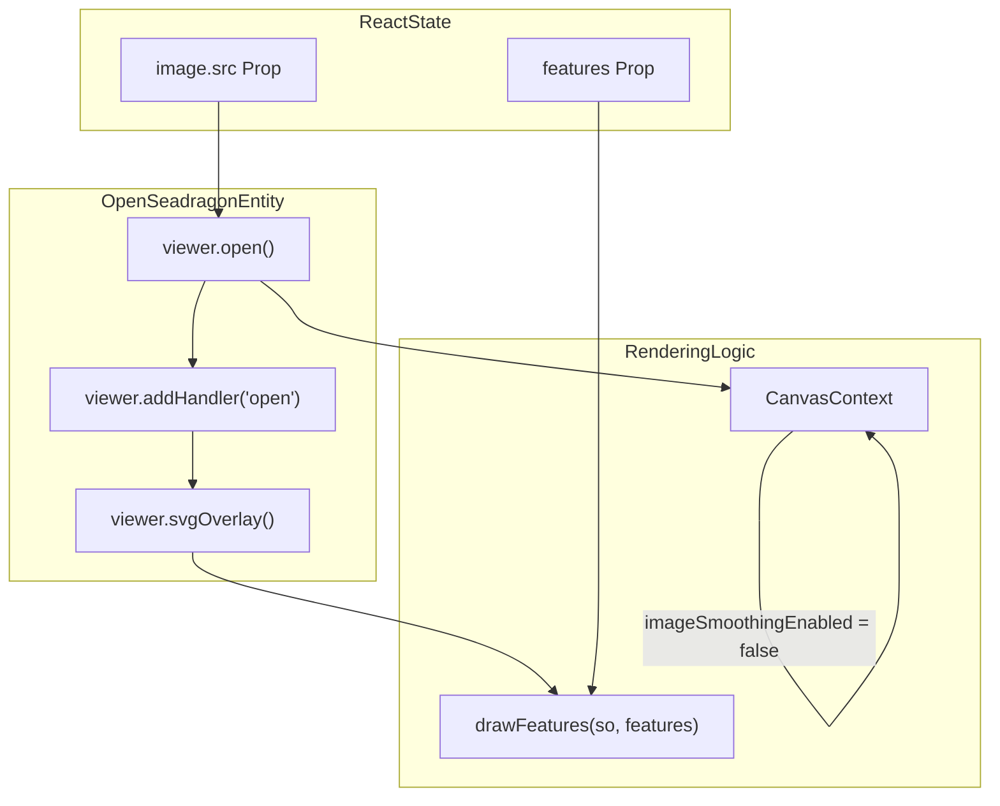
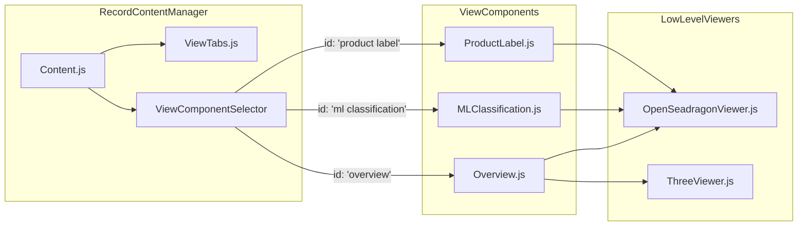

# Page: Visualization Components

# Visualization Components

Relevant source files

The following files were used as context for generating this wiki page:

- [src/components/BrowseImage/BrowseImage.js](src/components/BrowseImage/BrowseImage.js)
- [src/components/BrowseImage/BrowseImage.test.js](src/components/BrowseImage/BrowseImage.test.js)
- [src/components/MiniHistogram/MiniHistogram.js](src/components/MiniHistogram/MiniHistogram.js)
- [src/components/OpenSeadragonViewer/OpenSeadragonViewer.js](src/components/OpenSeadragonViewer/OpenSeadragonViewer.js)
- [src/components/ProductIcons/ProductIcons.js](src/components/ProductIcons/ProductIcons.js)
- [src/components/ThreeViewer/ThreeViewer.js](src/components/ThreeViewer/ThreeViewer.js)
- [src/pages/Record/Content/Content.js](src/pages/Record/Content/Content.js)

The Atlas codebase provides a suite of specialized visualization components designed to handle high-resolution planetary imagery, 3D models, and interactive data overlays. These components are primarily utilized within the Record (Product Detail) page to provide scientific context for PDS products.

## OpenSeadragonViewer

The `OpenSeadragonViewer` is a deep-zoom image viewer built on top of the OpenSeadragon library. It is the primary component for viewing high-resolution PDS images and supports SVG overlays for features like Machine Learning (ML) classifications.

### Implementation Details
The component initializes an `OpenSeadragon` instance within a `useEffect` hook [src/components/OpenSeadragonViewer/OpenSeadragonViewer.js:194-227](). It configures standard navigation controls (zoom, home, full-page, rotation) and maps them to custom Material UI `IconButton` elements [src/components/OpenSeadragonViewer/OpenSeadragonViewer.js:11-18]().

**Key Features:**
- **SVG Overlay:** Integrates the `svg-overlay` plugin to render vector graphics on top of the tiled image [src/components/OpenSeadragonViewer/OpenSeadragonViewer.js:3-3]().
- **Pixelated Rendering:** Specifically disables image smoothing on the canvas to preserve the raw pixel data of scientific images when zooming in [src/components/OpenSeadragonViewer/OpenSeadragonViewer.js:246-255]().
- **Feature Drawing:** The `drawFeatures` function (invoked via `useEffect`) handles the rendering of geometric shapes onto the SVG layer based on the `features` prop [src/components/OpenSeadragonViewer/OpenSeadragonViewer.js:181-185]().
- **Global Rotation:** Supports initial rotation settings via `window.atlasGlobal.imageRotation` [src/components/OpenSeadragonViewer/OpenSeadragonViewer.js:214-214]().

### Data Flow: Image Loading and Overlay
The following diagram illustrates how image data and feature overlays are processed by the viewer.

**OpenSeadragon Initialization and Rendering**

**Sources:** [src/components/OpenSeadragonViewer/OpenSeadragonViewer.js:181-227](), [src/components/OpenSeadragonViewer/OpenSeadragonViewer.js:246-255]()

---

## ThreeViewer

The `ThreeViewer` component provides WebGL-based 3D rendering for PDS products, specifically supporting `.obj` and `.gltf` models. It uses the `three.js` library along with `OrbitControls` for interactive manipulation.

### Technical Implementation
- **Scene Setup:** Creates a `THREE.Scene` with a `GridHelper` and `AmbientLight` [src/components/ThreeViewer/ThreeViewer.js:93-100]().
- **Texture Mapping:** It scans the `supplemental` files array for image extensions to use as a texture map for the 3D model [src/components/ThreeViewer/ThreeViewer.js:108-110]().
- **Model Loading:** Uses `OBJLoader` to fetch and parse the model file [src/components/ThreeViewer/ThreeViewer.js:140-148]().
- **Automatic Centering:** Calculates the bounding box of the loaded model and adjusts the position to center it at the world origin `(0,0,0)` [src/components/ThreeViewer/ThreeViewer.js:160-166]().
- **Camera Positioning:** Dynamically sets the camera distance based on the model's size to ensure the object is fully visible upon load [src/components/ThreeViewer/ThreeViewer.js:168-169]().

### ThreeViewer Logic
| Function/Variable | Description |
| :--- | :--- |
| `makeSceneWithModel` | Async function that initializes the renderer, scene, camera, and loaders [src/components/ThreeViewer/ThreeViewer.js:74-74](). |
| `OBJLoader` | Loads the geometry from the provided URL [src/components/ThreeViewer/ThreeViewer.js:148-148](). |
| `TextureLoader` | Loads the associated image file to be used as a `Mesh` material [src/components/ThreeViewer/ThreeViewer.js:117-118](). |
| `OrbitControls` | Enables rotation, panning, and zooming via mouse/touch [src/components/ThreeViewer/ThreeViewer.js:89-89](). |

**Sources:** [src/components/ThreeViewer/ThreeViewer.js:70-195]()

---

## BrowseImage

`BrowseImage` is a wrapper around the standard HTML `` tag, enhanced with environment-aware path resolution and error handling.

- **Base URL Injection:** Uses `process.env.REACT_APP_S3_BUCKET_LOCATION` to resolve relative paths to their full S3 bucket location if the `addBaseUrl` prop is true [src/components/BrowseImage/BrowseImage.js:7-23]().
- **Fallback UI:** If an image fails to load or the source is invalid, it renders a fallback `ImageIcon` styled with the theme's accent color [src/components/BrowseImage/BrowseImage.js:58-58]().
- **Loading State:** Tracks the loading status via internal state to allow for potential loading placeholders [src/components/BrowseImage/BrowseImage.js:31-41]().

**Sources:** [src/components/BrowseImage/BrowseImage.js:5-61]()

---

## ProductIcons

The `ProductIcons` component provides visual identification for different types of PDS products (directories, files, volumes, etc.) using a combination of Material UI icons and a custom CSS-based 3D cube for model files.

### Icon Selection Logic
The component determines which icon to display based on the `type` prop or the file extension via `getExtension` [src/components/ProductIcons/ProductIcons.js:115-166]().

| Type / Extension | Icon Displayed |
| :--- | :--- |
| `directory` | `FolderIcon` [src/components/ProductIcons/ProductIcons.js:138-138]() |
| `file` | `InsertDriveFileOutlinedIcon` [src/components/ProductIcons/ProductIcons.js:141-141]() |
| `volume` | Custom SVG hex-cube icon [src/components/ProductIcons/ProductIcons.js:129-135]() |
| `filter` | Custom SVG funnel icon [src/components/ProductIcons/ProductIcons.js:119-125]() |
| `.obj` | Interactive CSS 3D Cube (`modelIcon`) [src/components/ProductIcons/ProductIcons.js:152-160]() |
| `default` | `ImageIcon` [src/components/ProductIcons/ProductIcons.js:145-145]() |

### CSS 3D Cube
For 3D models, the component renders a `div` with six faces (`-front`, `-back`, `-left`, etc.) [src/components/ProductIcons/ProductIcons.js:152-160](). A global `mousemove` listener rotates all elements with the `modelIcon` class, creating a "holographic" effect as the user moves their cursor [src/components/ProductIcons/ProductIcons.js:96-105]().

**Sources:** [src/components/ProductIcons/ProductIcons.js:13-105](), [src/components/ProductIcons/ProductIcons.js:107-180]()

---

## MiniHistogram

The `MiniHistogram` component provides a compact visual representation of data distribution, typically used within search filters or metadata displays.

- **Scaling:** Uses `linearScale` to map document counts to bar heights [src/components/MiniHistogram/MiniHistogram.js:77-77]().
- **Outlier Handling:** Supports highlighting and distinct styling for potential outliers to help users identify data anomalies [src/components/MiniHistogram/MiniHistogram.js:85-92]().
- **Selection Integration:** Bars are highlighted if they fall within the `selectedRange` provided via props [src/components/MiniHistogram/MiniHistogram.js:86-91]().

**Sources:** [src/components/MiniHistogram/MiniHistogram.js:55-103]()

---

## Component Integration in Record Page

These visualization components are orchestrated by the `Content` component within the Record page. The `VIEW_TABS` configuration determines which viewer is rendered based on the product's metadata.

**Visualization Routing**

**Sources:** [src/pages/Record/Content/Content.js:20-29](), [src/pages/Record/Content/Content.js:63-90]()
